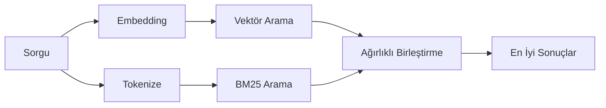

---
read_when:
    - memory_search aracının nasıl çalıştığını anlamak istiyorsunuz
    - Bir embedding sağlayıcısı seçmek istiyorsunuz
    - Arama kalitesini ayarlamak istiyorsunuz
summary: Bellek aramasının embedding'ler ve hibrit getirme kullanarak ilgili notları nasıl bulduğu
title: Bellek arama
x-i18n:
    generated_at: "2026-04-24T09:05:39Z"
    model: gpt-5.4
    provider: openai
    source_hash: 04db62e519a691316ce40825c082918094bcaa9c36042cc8101c6504453d238e
    source_path: concepts/memory-search.md
    workflow: 15
---

`memory_search`, ifadeler özgün metinden farklı olsa bile bellek dosyalarınızdaki ilgili notları bulur. Bunu, belleği küçük parçalara indeksleyip bu parçaları embedding'ler, anahtar sözcükler veya her ikisini kullanarak arayarak yapar.

## Hızlı başlangıç

Yapılandırılmış bir GitHub Copilot aboneliğiniz, OpenAI, Gemini, Voyage veya Mistral API anahtarınız varsa bellek araması otomatik olarak çalışır. Bir sağlayıcıyı açıkça ayarlamak için:

```json5
{
  agents: {
    defaults: {
      memorySearch: {
        provider: "openai", // veya "gemini", "local", "ollama" vb.
      },
    },
  },
}
```

API anahtarı olmadan yerel embedding'ler için `provider: "local"` kullanın (`node-llama-cpp` gerekir).

## Desteklenen sağlayıcılar

| Sağlayıcı      | Kimlik            | API anahtarı gerekir | Notlar                                               |
| -------------- | ----------------- | -------------------- | ---------------------------------------------------- |
| Bedrock        | `bedrock`         | Hayır                | AWS kimlik bilgisi zinciri çözüldüğünde otomatik algılanır |
| Gemini         | `gemini`          | Evet                 | Görüntü/ses indekslemeyi destekler                   |
| GitHub Copilot | `github-copilot`  | Hayır                | Otomatik algılanır, Copilot aboneliğini kullanır     |
| Local          | `local`           | Hayır                | GGUF model, ~0.6 GB indirme                          |
| Mistral        | `mistral`         | Evet                 | Otomatik algılanır                                   |
| Ollama         | `ollama`          | Hayır                | Yerel, açıkça ayarlanmalıdır                         |
| OpenAI         | `openai`          | Evet                 | Otomatik algılanır, hızlı                            |
| Voyage         | `voyage`          | Evet                 | Otomatik algılanır                                   |

## Arama nasıl çalışır

OpenClaw iki getirme yolunu paralel çalıştırır ve sonuçları birleştirir:



- **Vektör arama**, benzer anlam taşıyan notları bulur ("gateway host", "OpenClaw çalıştıran makine" ile eşleşir).
- **BM25 anahtar sözcük araması**, tam eşleşmeleri bulur (kimlikler, hata dizgeleri, yapılandırma anahtarları).

Yalnızca bir yol kullanılabiliyorsa (embedding yoksa veya FTS yoksa) diğeri tek başına çalışır.

Embedding'ler kullanılamadığında OpenClaw, yalnızca ham tam eşleşme sıralamasına geri dönmek yerine yine de FTS sonuçları üzerinde sözcüksel sıralama kullanır. Bu bozulmuş mod, daha güçlü sorgu terimi kapsamasına ve ilgili dosya yollarına sahip parçaları yükseltir; bu da `sqlite-vec` veya bir embedding sağlayıcısı olmadan bile geri çağırmayı yararlı tutar.

## Arama kalitesini iyileştirme

Büyük bir not geçmişiniz olduğunda iki isteğe bağlı özellik yardımcı olur:

### Zamansal azalma

Eski notlar sıralama ağırlığını kademeli olarak kaybeder; böylece yakın tarihli bilgiler önce görünür.
Varsayılan 30 günlük yarı ömürle, geçen aydan bir not özgün ağırlığının %50'siyle puanlanır. `MEMORY.md` gibi kalıcı dosyalar asla azaltılmaz.

<Tip>
Aracınızın aylarca günlük notu varsa ve eski bilgiler yakın tarihli bağlamın önüne geçiyorsa zamansal azalmayı etkinleştirin.
</Tip>

### MMR (çeşitlilik)

Yinelenen sonuçları azaltır. Beş not da aynı yönlendirici yapılandırmasından söz ediyorsa MMR, üst sonuçların tekrar etmek yerine farklı konuları kapsamasını sağlar.

<Tip>
`memory_search`, farklı günlük notlardan birbirine çok benzeyen parçaları döndürmeye devam ediyorsa MMR'yi etkinleştirin.
</Tip>

### Her ikisini de etkinleştirme

```json5
{
  agents: {
    defaults: {
      memorySearch: {
        query: {
          hybrid: {
            mmr: { enabled: true },
            temporalDecay: { enabled: true },
          },
        },
      },
    },
  },
}
```

## Çok modlu bellek

Gemini Embedding 2 ile görüntüleri ve ses dosyalarını Markdown ile birlikte indeksleyebilirsiniz. Arama sorguları yine metin olarak kalır, ancak görsel ve ses içeriğiyle eşleşir. Kurulum için [Bellek yapılandırma başvurusu](/tr/reference/memory-config) sayfasına bakın.

## Oturum belleği araması

`memory_search` aracının önceki konuşmaları geri çağırabilmesi için oturum transkriptlerini isteğe bağlı olarak indeksleyebilirsiniz. Bu, `memorySearch.experimental.sessionMemory` üzerinden katılımlıdır. Ayrıntılar için [yapılandırma başvurusu](/tr/reference/memory-config) sayfasına bakın.

## Sorun giderme

**Sonuç yok mu?** Dizini denetlemek için `openclaw memory status` çalıştırın. Boşsa `openclaw memory index --force` çalıştırın.

**Yalnızca anahtar sözcük eşleşmeleri mi var?** Embedding sağlayıcınız yapılandırılmamış olabilir. `openclaw memory status --deep` ile kontrol edin.

**CJK metni bulunamıyor mu?** FTS dizinini `openclaw memory index --force` ile yeniden oluşturun.

## Daha fazla okuma

- [Active Memory](/tr/concepts/active-memory) -- etkileşimli sohbet oturumları için alt aracı belleği
- [Bellek](/tr/concepts/memory) -- dosya düzeni, arka uçlar, araçlar
- [Bellek yapılandırma başvurusu](/tr/reference/memory-config) -- tüm yapılandırma ayarları

## İlgili

- [Belleğe genel bakış](/tr/concepts/memory)
- [Active Memory](/tr/concepts/active-memory)
- [Yerleşik bellek motoru](/tr/concepts/memory-builtin)
