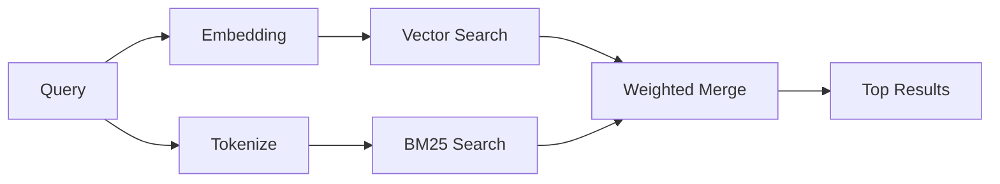

---
read_when:
    - '`memory_search` işleyişini anlamak istiyorsunuz'
    - Bir embedding sağlayıcısı seçmek istiyorsunuz
    - Arama kalitesini ayarlamak istiyorsunuz
summary: Bellek aramasının embedding'ler ve hibrit geri getirme kullanarak ilgili notları nasıl bulduğu
title: Memory Search
x-i18n:
    generated_at: "2026-04-05T13:50:47Z"
    model: gpt-5.4
    provider: openai
    source_hash: 87b1cb3469c7805f95bca5e77a02919d1e06d626ad3633bbc5465f6ab9db12a2
    source_path: concepts/memory-search.md
    workflow: 15
---

# Memory Search

`memory_search`, bellek dosyalarınızdaki ilgili notları, ifade biçimi özgün metinden farklı olsa bile bulur. Bunu, belleği küçük
parçalara indeksleyip bunları embedding'ler, anahtar sözcükler veya her ikisini birden kullanarak arayarak yapar.

## Hızlı başlangıç

Bir OpenAI, Gemini, Voyage veya Mistral API anahtarınız yapılandırılmışsa, bellek
araması otomatik olarak çalışır. Bir sağlayıcıyı açıkça ayarlamak için:

```json5
{
  agents: {
    defaults: {
      memorySearch: {
        provider: "openai", // veya "gemini", "local", "ollama" vb.
      },
    },
  },
}
```

API anahtarı olmadan yerel embedding'ler için `provider: "local"` kullanın (`node-llama-cpp` gerektirir).

## Desteklenen sağlayıcılar

| Sağlayıcı | Kimlik    | API anahtarı gerekir | Notlar                        |
| --------- | --------- | -------------------- | ----------------------------- |
| OpenAI    | `openai`  | Evet                 | Otomatik algılanır, hızlı     |
| Gemini    | `gemini`  | Evet                 | Görüntü/ses indekslemeyi destekler |
| Voyage    | `voyage`  | Evet                 | Otomatik algılanır            |
| Mistral   | `mistral` | Evet                 | Otomatik algılanır            |
| Ollama    | `ollama`  | Hayır                | Yerel, açıkça ayarlanmalıdır  |
| Local     | `local`   | Hayır                | GGUF model, ~0.6 GB indirme   |

## Arama nasıl çalışır

OpenClaw iki geri getirme yolunu paralel olarak çalıştırır ve sonuçları birleştirir:



- **Vektör araması**, benzer anlam taşıyan notları bulur ("gateway host",
  "OpenClaw çalıştıran makine" ile eşleşir).
- **BM25 anahtar sözcük araması**, tam eşleşmeleri bulur (kimlikler, hata dizgeleri, yapılandırma
  anahtarları).

Yalnızca bir yol kullanılabiliyorsa (embedding yoksa veya FTS yoksa), diğeri tek başına çalışır.

## Arama kalitesini iyileştirme

İki isteğe bağlı özellik, büyük bir not geçmişiniz olduğunda yardımcı olur:

### Zamansal azalma

Eski notlar sıralama ağırlığını kademeli olarak kaybeder, böylece son bilgiler önce görünür.
Varsayılan 30 günlük yarı ömürle, geçen aydan bir not özgün ağırlığının %50'siyle puanlanır.
`MEMORY.md` gibi kalıcı dosyalarda azalma uygulanmaz.

<Tip>
Ajanınızın aylara yayılan günlük notları varsa ve eski bilgiler
yakın tarihli bağlamın önüne geçmeye devam ediyorsa zamansal azalmayı etkinleştirin.
</Tip>

### MMR (çeşitlilik)

Yinelenen sonuçları azaltır. Beş notun hepsi aynı yönlendirici yapılandırmasından söz ediyorsa, MMR
en üst sonuçların tekrar etmek yerine farklı konuları kapsamasını sağlar.

<Tip>
`memory_search`, farklı günlük notlardan neredeyse aynı parçaları
geri döndürmeye devam ediyorsa MMR'yi etkinleştirin.
</Tip>

### Her ikisini de etkinleştirme

```json5
{
  agents: {
    defaults: {
      memorySearch: {
        query: {
          hybrid: {
            mmr: { enabled: true },
            temporalDecay: { enabled: true },
          },
        },
      },
    },
  },
}
```

## Çok modlu bellek

Gemini Embedding 2 ile, Markdown'un yanında görüntüleri ve ses dosyalarını da
indeksleyebilirsiniz. Arama sorguları metin olarak kalır, ancak görsel ve ses
içeriğiyle eşleşir. Kurulum için [Bellek yapılandırma başvurusu](/reference/memory-config) sayfasına bakın.

## Oturum bellek araması

İsteğe bağlı olarak oturum transkriptlerini indeksleyebilirsiniz; böylece `memory_search`
önceki konuşmaları geri çağırabilir. Bu, `memorySearch.experimental.sessionMemory`
aracılığıyla katılıma bağlıdır. Ayrıntılar için
[yapılandırma başvurusu](/reference/memory-config) sayfasına bakın.

## Sorun giderme

**Sonuç yok mu?** Dizini kontrol etmek için `openclaw memory status` çalıştırın. Boşsa
`openclaw memory index --force` çalıştırın.

**Yalnızca anahtar sözcük eşleşmeleri mi var?** Embedding sağlayıcınız yapılandırılmamış olabilir. Şunu denetleyin:
`openclaw memory status --deep`.

**CJK metni bulunamıyor mu?** FTS dizinini
`openclaw memory index --force` ile yeniden oluşturun.

## Daha fazla bilgi

- [Memory](/concepts/memory) -- dosya düzeni, arka uçlar, araçlar
- [Memory configuration reference](/reference/memory-config) -- tüm yapılandırma seçenekleri
