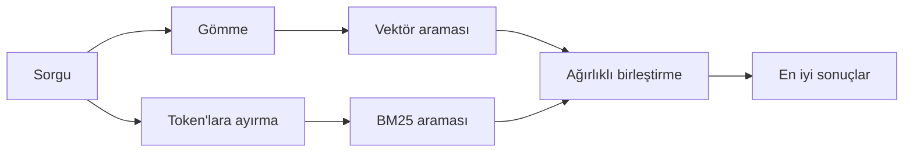

---
read_when:
    - memory_search'ün nasıl çalıştığını anlamak istiyorsunuz
    - Bir embedding sağlayıcısı seçmek istiyorsunuz
    - Arama kalitesini iyileştirmek istiyorsunuz
summary: Bellek araması, gömmeler ve hibrit getirme kullanarak ilgili notları nasıl bulur?
title: Bellek araması
x-i18n:
    generated_at: "2026-07-16T17:20:38Z"
    model: gpt-5.6
    postprocess_version: locale-links-v1
    prompt_version: 32
    provider: openai
    source_hash: 2ae0830843fba28c24159d85425240051fb8caf086cd0563d3091890045dcfad
    source_path: concepts/memory-search.md
    workflow: 16
---

`memory_search`, ifadeler özgün metinden farklı olsa bile bellek dosyalarınızdaki ilgili notları bulur. Belleği küçük parçalara böler ve bunlarda gömmeler, anahtar kelimeler veya her ikisiyle arama yapar.

## Hızlı başlangıç

OpenClaw varsayılan olarak OpenAI gömmelerini kullanır. Başka bir sağlayıcı kullanmak için bunu açıkça ayarlayın:

```json5
{
  agents: {
    defaults: {
      memorySearch: {
        provider: "openai", // veya "gemini", "voyage", "mistral", "bedrock", "local", "ollama", "lmstudio", "github-copilot", "openai-compatible"
      },
    },
  },
}
```

`provider`, özel bir `models.providers.<id>` girdisine de başvurabilir (örneğin `ollama-5080`); bunun için söz konusu girdinin `api` değerini `"ollama"` veya bellek gömme bağdaştırıcısına sahip başka bir sağlayıcı kimliği olarak ayarlaması gerekir.

API anahtarı olmadan yerel gömmeleri kullanmak için resmi llama.cpp sağlayıcı Plugin'ini yükleyin ve `provider: "local"` değerini ayarlayın:

```bash
openclaw plugins install @openclaw/llama-cpp-provider
```

Kaynak kod teslim almalarında yine de yerel derleme onayı gerekir: `pnpm approve-builds`, ardından `pnpm rebuild node-llama-cpp`.

Bazı OpenAI uyumlu gömme uç noktaları, aramalar için `"query"` ve dizine eklenen parçalar için `"document"`/`"passage"` gibi asimetrik `input_type` etiketleri gerektirir. Bunları `queryInputType` ve `documentInputType` ile ayarlayın; bkz. [Bellek yapılandırma referansı](/tr/reference/memory-config#provider-specific-config).

## Desteklenen sağlayıcılar

| Sağlayıcı         | Kimlik              | API anahtarı gerekir | Notlar                                      |
| ----------------- | ------------------- | -------------------- | ------------------------------------------- |
| Bedrock           | `bedrock`  | Hayır                | AWS kimlik bilgisi zincirini kullanır       |
| DeepInfra         | `deepinfra`  | Evet                  | Varsayılan model `BAAI/bge-m3`         |
| Gemini            | `gemini`  | Evet                  | Görüntü/ses dizinlemeyi destekler            |
| GitHub Copilot    | `github-copilot`  | Hayır                | Copilot aboneliğinizi kullanır               |
| Yerel             | `local`  | Hayır                | GGUF modeli, ~0.6 GB otomatik indirme        |
| LM Studio         | `lmstudio`  | Hayır                | Yerel/kendi barındırdığınız sunucu            |
| Mistral           | `mistral`  | Evet                  |                                             |
| Ollama            | `ollama`  | Hayır                | Yerel/kendi barındırdığınız sunucu            |
| OpenAI            | `openai`  | Evet                  | Varsayılan                                  |
| OpenAI uyumlu     | `openai-compatible`  | Genellikle            | Genel `/v1/embeddings` uç noktası         |
| Voyage            | `voyage`  | Evet                  |                                             |

## Arama nasıl çalışır?

OpenClaw iki getirme yolunu paralel olarak çalıştırır ve sonuçları birleştirir:



- **Vektör araması**, benzer anlamları eşleştirir ("gateway ana makinesi", "OpenClaw'u çalıştıran makine" ile eşleşir).
- **BM25 anahtar kelime araması**, tam terimleri (kimlikler, hata dizeleri, yapılandırma anahtarları) eşleştirir.
- **Dosya adı araması**, yolları not gövdelerinden ayrı olarak dizine ekler. Tam yollar, temel dosya adları ve dosya adı kökleri, kısmi yol eşleşmelerinden daha üst sıralarda yer alırken alıntılar ve gövde anahtar kelime puanları yine not içeriğinden gelir.

Yalnızca bir yol kullanılabiliyorsa diğeri tek başına çalışır.

**Yalnızca FTS modu.** Gömmeleri bilinçli olarak devre dışı bırakıp yalnızca anahtar kelimelerle arama yapmak için `provider: "none"` değerini ayarlayın. `provider` değerinin ayarlanmamış veya `"auto"` olarak ayarlanmış bırakılması da gömme kimlik doğrulaması yapılandırılmamışsa hata vermeden yalnızca anahtar kelime sıralamasına geri döner; `provider: "local"` (GGUF/llama.cpp sağlayıcısı) başarısız olduğunda da aynısı gerçekleşir.

**Açıkça belirtilen sağlayıcı kullanılamıyor.** Başka bir sağlayıcıyı açıkça belirtirseniz (örneğin `openai`, `ollama`, `gemini`) ve bu sağlayıcı istek sırasında kullanılamaz hâle gelirse (hatalı kimlik doğrulama, ağ arızası), `memory_search` sessizce yalnızca FTS sonuçlarına gerilemek yerine belleğin kullanılamadığını bildirir. Böylece bozuk bir yapılandırılmış sağlayıcı görünür kalır. Bilinçli olarak yalnızca FTS ile hatırlama için `provider: "none"` değerini ayarlayın veya anlamsal sıralamayı geri yüklemek için sağlayıcı/kimlik doğrulama yapılandırmasını düzeltin.

## Arama kalitesini iyileştirme

İki isteğe bağlı özellik, geniş bir not geçmişinde yardımcı olur.

### Zamansal azalma

Eski notların sıralama ağırlığı zamanla azalır; böylece güncel bilgiler önce gösterilir. Varsayılan 30 günlük yarı ömürle geçen aydan kalma bir not, özgün ağırlığının %50'sini alır. `MEMORY.md` ve `memory/` altındaki diğer tarihsiz dosyalar kalıcıdır ve hiçbir zaman azaltılmaz; yalnızca tarihli `memory/YYYY-MM-DD.md` dosyaları azalır.

<Tip>
Temsilcinizin aylarca günlük notu varsa ve eski bilgiler güncel bağlamdan sürekli daha üst sıralarda yer alıyorsa bunu etkinleştirin.
</Tip>

### MMR (çeşitlilik)

Yinelenen sonuçları azaltır. Beş notun tümü aynı yönlendirici yapılandırmasından söz ediyorsa MMR, en üstteki sonuçların tekrar etmek yerine farklı konuları kapsamasını sağlar.

<Tip>
`memory_search` farklı günlük notlardan neredeyse aynı alıntıları döndürmeye devam ediyorsa bunu etkinleştirin.
</Tip>

### İkisini de etkinleştirme

```json5
{
  agents: {
    defaults: {
      memorySearch: {
        query: {
          hybrid: {
            mmr: { enabled: true },
            temporalDecay: { enabled: true },
          },
        },
      },
    },
  },
}
```

## Çok kipli bellek

`gemini-embedding-2-preview` ile görüntüleri ve sesi Markdown ile birlikte dizine ekleyebilirsiniz. Bu yalnızca `memorySearch.extraPaths` altındaki dosyalar için geçerlidir; varsayılan bellek kökleri (`MEMORY.md`, `memory/*.md`) yalnızca Markdown olarak kalır. Arama sorguları metin olarak kalır ancak görsel ve sesli içerikle eşleşir. Kurulum için [Bellek yapılandırma referansına](/tr/reference/memory-config#multimodal-memory-gemini) bakın.

## Oturum belleği araması

Oturum dökümlerinden tam metni eksiksiz hatırlamak için [`sessions_search`](/concepts/session-search) kullanın ve ardından bir sonucu `sessions_history` ile açın. Oturum belleği araması, anlamsal ve deneysel tamamlayıcı olmaya devam eder.

`memory_search` daha önceki konuşmaları hatırlayabilsin diye isteğe bağlı olarak oturum dökümlerini dizine ekleyin. Bu özellik etkinleştirme gerektirir: `experimental.sessionMemory: true` değerini ayarlayın ve `sources` öğesine `"sessions"` ekleyin (varsayılan `sources` değeri `["memory"]` şeklindedir).

Oturum eşleşmeleri `tools.sessions.visibility` ayarına uyar: varsayılan `"tree"` yalnızca geçerli oturumu ve onun başlattığı oturumları gösterir. Farklı bir oturumdan aynı temsilciye ait ilgisiz bir oturumu hatırlamak için (örneğin doğrudan mesajdan Gateway tarafından yönlendirilen bir oturum), görünürlüğü `"agent"` olarak genişletin.

QMD arka ucunu kullanırken dökümlerin QMD koleksiyonuna dışa aktarılması için ayrıca `memory.qmd.sessions.enabled: true` değerini ayarlayın; yalnızca `experimental.sessionMemory` ve `sources` dökümleri QMD'ye dışa aktarmaz. Bkz. [yapılandırma referansı](/tr/reference/memory-config#session-memory-search-experimental).

## Sorun giderme

**Sonuç yok mu?** Dizini kontrol etmek için `openclaw memory status` komutunu çalıştırın. Boşsa `openclaw memory index --force` komutunu çalıştırın.

**Yalnızca anahtar kelime eşleşmeleri mi var?** Gömme sağlayıcınız yapılandırılmamış olabilir. `openclaw memory status --deep` ayarını kontrol edin.

**Yerel gömmeler zaman aşımına mı uğruyor?** `ollama`, `lmstudio` ve `local` varsayılan olarak daha uzun bir satır içi toplu iş zaman aşımı kullanır. Ana makine yalnızca yavaşsa `agents.defaults.memorySearch.sync.embeddingBatchTimeoutSeconds` değerini ayarlayın ve `openclaw memory index --force` komutunu yeniden çalıştırın.

**CJK metni bulunamıyor mu?** FTS dizinini `openclaw memory index --force` ile yeniden oluşturun.

## İlgili içerikler

- [Belleğe genel bakış](/tr/concepts/memory)
- [Active Memory](/tr/concepts/active-memory)
- [Yerleşik bellek motoru](/tr/concepts/memory-builtin)
- [Bellek yapılandırma referansı](/tr/reference/memory-config)
