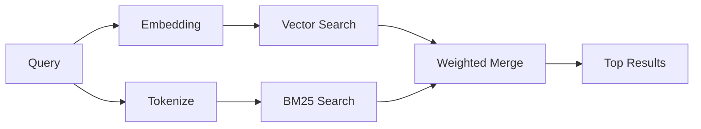

---
read_when:
    - memory_search işlevinin nasıl çalıştığını anlamak istiyorsunuz
    - Bir embedding sağlayıcısı seçmek istiyorsunuz
    - Arama kalitesine ince ayar yapmak istiyorsunuz
summary: Bellek araması, embedding’ler ve hibrit getirme kullanarak ilgili notları nasıl bulur
title: Bellek araması
x-i18n:
    generated_at: "2026-06-28T00:28:50Z"
    model: gpt-5.5
    postprocess_version: locale-links-v1
    provider: openai
    source_hash: b0bcb8cf400100ba8b6ddbb46bdf8b2a89a8bc32a550ee6df47c874e7e9e0879
    source_path: concepts/memory-search.md
    workflow: 16
---

`memory_search`, ifade özgün metinden farklı olsa bile bellek dosyalarınızdan ilgili notları bulur. Bunu belleği küçük parçalara dizinleyerek ve bunlarda embedding'ler, anahtar sözcükler veya ikisini birden kullanarak arama yaparak gerçekleştirir.

## Hızlı başlangıç

Bellek araması varsayılan olarak OpenAI embedding'lerini kullanır. Başka bir embedding arka ucu kullanmak için açıkça bir sağlayıcı ayarlayın:

```json5
{
  agents: {
    defaults: {
      memorySearch: {
        provider: "openai", // or "gemini", "local", "ollama", "openai-compatible", etc.
      },
    },
  },
}
```

Belleğe özel sağlayıcıları olan çok uç noktalı kurulumlarda `provider`, ilgili sağlayıcı `api: "ollama"` veya başka bir bellek embedding adaptörü sahibi ayarladığında `ollama-5080` gibi özel bir `models.providers.<id>` girdisi de olabilir.

API anahtarı olmadan yerel embedding'ler için `@openclaw/llama-cpp-provider` paketini kurun ve `provider: "local"` ayarlayın. Kaynak çalışma kopyaları hâlâ yerel derleme onayı gerektirebilir: `pnpm approve-builds`, ardından `pnpm rebuild node-llama-cpp`.

Bazı OpenAI uyumlu embedding uç noktaları, aramalar için `input_type: "query"` ve dizinlenen parçalar için `input_type: "document"` veya `"passage"` gibi asimetrik etiketler gerektirir. Bunları `memorySearch.queryInputType` ve `memorySearch.documentInputType` ile yapılandırın; [Bellek yapılandırması başvurusu](/tr/reference/memory-config#provider-specific-config) bölümüne bakın.

## Desteklenen sağlayıcılar

| Sağlayıcı         | Kimlik              | API anahtarı gerekir | Notlar                         |
| ----------------- | ------------------- | ------------- | ----------------------------- |
| Bedrock           | `bedrock`           | Hayır         | AWS kimlik bilgisi zincirini kullanır |
| DeepInfra         | `deepinfra`         | Evet          | Varsayılan: `BAAI/bge-m3`     |
| Gemini            | `gemini`            | Evet          | Görüntü/ses dizinlemeyi destekler |
| GitHub Copilot    | `github-copilot`    | Hayır         | Copilot aboneliğini kullanır  |
| Yerel             | `local`             | Hayır         | GGUF modeli, ~0,6 GB indirme  |
| Mistral           | `mistral`           | Evet          |                               |
| Ollama            | `ollama`            | Hayır         | Yerel/kendi barındırılan      |
| OpenAI            | `openai`            | Evet          | Varsayılan                    |
| OpenAI uyumlu     | `openai-compatible` | Genellikle    | Genel `/v1/embeddings`        |
| Voyage            | `voyage`            | Evet          |                               |

## Arama nasıl çalışır

OpenClaw iki alma yolunu paralel çalıştırır ve sonuçları birleştirir:



- **Vektör araması**, benzer anlama sahip notları bulur ("gateway ana makinesi",
  "OpenClaw çalıştıran makine" ile eşleşir).
- **BM25 anahtar sözcük araması**, tam eşleşmeleri bulur (kimlikler, hata dizeleri, yapılandırma
  anahtarları).

Yalnızca bir yol kullanılabiliyorsa diğeri tek başına çalışır. Kasıtlı yalnızca FTS modu (`provider: "none"`) ve otomatik/varsayılan sağlayıcı seçimi, embedding'ler kullanılamadığında bile sözcüksel sıralamayı kullanabilir.

Açıkça ayarlanmış yerel olmayan embedding sağlayıcıları farklıdır. `memorySearch.provider` değerini somut, uzak destekli bir sağlayıcıya ayarlarsanız ve bu sağlayıcı çalışma zamanında kullanılamazsa, `memory_search` yalnızca FTS sonuçlarını sessizce kullanmak yerine belleği kullanılamaz olarak bildirir. Bu, bozuk yapılandırılmış anlamsal sağlayıcının görünür kalmasını sağlar. Bilerek yalnızca FTS hatırlama için `provider: "none"` ayarlayın veya anlamsal sıralamayı geri yüklemek için sağlayıcı/kimlik doğrulama yapılandırmasını düzeltin.

## Arama kalitesini iyileştirme

Büyük bir not geçmişiniz olduğunda iki isteğe bağlı özellik yardımcı olur:

### Zamansal azalma

Eski notlar sıralama ağırlığını kademeli olarak kaybeder, böylece güncel bilgiler önce öne çıkar. Varsayılan 30 günlük yarı ömürle, geçen aydan bir not özgün ağırlığının %50'siyle puanlanır. `MEMORY.md` gibi her zaman geçerli dosyalara hiçbir zaman azalma uygulanmaz.

<Tip>
Aracınızın aylarca günlük notları varsa ve eski bilgiler güncel bağlamın üstüne çıkmaya devam ediyorsa zamansal azalmayı etkinleştirin.
</Tip>

### MMR (çeşitlilik)

Yinelenen sonuçları azaltır. Beş notun tamamı aynı yönlendirici yapılandırmasından bahsediyorsa, MMR en üst sonuçların tekrar etmek yerine farklı konuları kapsamasını sağlar.

<Tip>
`memory_search` farklı günlük notlardan neredeyse aynı parçaları döndürmeye devam ediyorsa MMR'yi etkinleştirin.
</Tip>

### İkisini de etkinleştirme

```json5
{
  agents: {
    defaults: {
      memorySearch: {
        query: {
          hybrid: {
            mmr: { enabled: true },
            temporalDecay: { enabled: true },
          },
        },
      },
    },
  },
}
```

## Çok modlu bellek

Gemini Embedding 2 ile Markdown'ın yanında görüntü ve ses dosyalarını dizinleyebilirsiniz. Arama sorguları metin olarak kalır, ancak görsel ve ses içerikleriyle eşleşir. Kurulum için [Bellek yapılandırması başvurusu](/tr/reference/memory-config) bölümüne bakın.

## Oturum belleği araması

`memory_search` daha önceki konuşmaları hatırlayabilsin diye oturum transkriptlerini isteğe bağlı olarak dizinleyebilirsiniz. Bu, `memorySearch.experimental.sessionMemory` üzerinden tercihli olarak etkinleştirilir. Ayrıntılar için [yapılandırma başvurusu](/tr/reference/memory-config) bölümüne bakın.

## Sorun giderme

**Sonuç yok mu?** Dizini kontrol etmek için `openclaw memory status` çalıştırın. Boşsa `openclaw memory index --force` çalıştırın.

**Yalnızca anahtar sözcük eşleşmeleri mi var?** Embedding sağlayıcınız yapılandırılmamış olabilir. `openclaw memory status --deep` ile kontrol edin.

**Yerel embedding'lerde zaman aşımı mı oluyor?** `ollama`, `lmstudio` ve `local` varsayılan olarak daha uzun bir satır içi toplu işlem zaman aşımı kullanır. Ana makine yalnızca yavaşsa `agents.defaults.memorySearch.sync.embeddingBatchTimeoutSeconds` ayarlayın ve `openclaw memory index --force` komutunu yeniden çalıştırın.

**CJK metni bulunamıyor mu?** FTS dizinini `openclaw memory index --force` ile yeniden oluşturun.

## Ek okuma

- [Active Memory](/tr/concepts/active-memory) -- etkileşimli sohbet oturumları için alt aracı belleği
- [Bellek](/tr/concepts/memory) -- dosya düzeni, arka uçlar, araçlar
- [Bellek yapılandırması başvurusu](/tr/reference/memory-config) -- tüm yapılandırma düğmeleri

## İlgili

- [Belleğe genel bakış](/tr/concepts/memory)
- [Active Memory](/tr/concepts/active-memory)
- [Yerleşik bellek motoru](/tr/concepts/memory-builtin)
