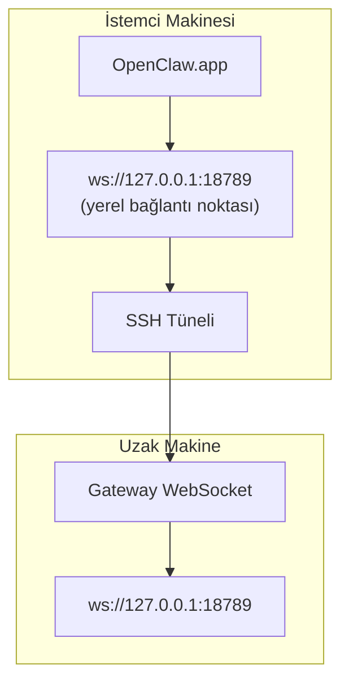

> Bu içerik [Remote Access](/gateway/remote#macos-persistent-ssh-tunnel-via-launchagent) sayfasına birleştirildi. Güncel kılavuz için o sayfaya bakın.

# Uzak Gateway ile OpenClaw.app Çalıştırma

OpenClaw.app, uzak bir gateway'e bağlanmak için SSH tünelleme kullanır. Bu kılavuz nasıl kurulacağını gösterir.

## Genel Bakış



## Hızlı Kurulum

### 1. Adım: SSH Config Ekleme

`~/.ssh/config` dosyasını düzenleyin ve şunu ekleyin:

```ssh
Host remote-gateway
    HostName <REMOTE_IP>          # ör. 172.27.187.184
    User <REMOTE_USER>            # ör. jefferson
    LocalForward 18789 127.0.0.1:18789
    IdentityFile ~/.ssh/id_rsa
```

`<REMOTE_IP>` ve `<REMOTE_USER>` değerlerini kendi değerlerinizle değiştirin.

### 2. Adım: SSH Anahtarını Kopyalama

Genel anahtarınızı uzak makineye kopyalayın (parolayı bir kez girin):

```bash
ssh-copy-id -i ~/.ssh/id_rsa <REMOTE_USER>@<REMOTE_IP>
```

### 3. Adım: Uzak Gateway Auth Ayarlama

```bash
openclaw config set gateway.remote.token "<your-token>"
```

Uzak gateway'iniz parola auth kullanıyorsa bunun yerine `gateway.remote.password` kullanın.
`OPENCLAW_GATEWAY_TOKEN` kabuk düzeyinde geçersiz kılma olarak hâlâ geçerlidir, ancak kalıcı
uzak istemci kurulumu `gateway.remote.token` / `gateway.remote.password` şeklindedir.

### 4. Adım: SSH Tünelini Başlatma

```bash
ssh -N remote-gateway &
```

### 5. Adım: OpenClaw.app Uygulamasını Yeniden Başlatma

```bash
# OpenClaw.app uygulamasından çıkın (⌘Q), sonra yeniden açın:
open /path/to/OpenClaw.app
```

Uygulama artık SSH tüneli üzerinden uzak gateway'e bağlanacaktır.

---

## Oturum Açıldığında Tüneli Otomatik Başlatma

SSH tünelinin oturum açtığınızda otomatik başlaması için bir Launch Agent oluşturun.

### PLIST dosyasını oluşturma

Bunu `~/Library/LaunchAgents/ai.openclaw.ssh-tunnel.plist` olarak kaydedin:

```xml
<?xml version="1.0" encoding="UTF-8"?>
<!DOCTYPE plist PUBLIC "-//Apple//DTD PLIST 1.0//EN" "http://www.apple.com/DTDs/PropertyList-1.0.dtd">
<plist version="1.0">
<dict>
    <key>Label</key>
    <string>ai.openclaw.ssh-tunnel</string>
    <key>ProgramArguments</key>
    <array>
        <string>/usr/bin/ssh</string>
        <string>-N</string>
        <string>remote-gateway</string>
    </array>
    <key>KeepAlive</key>
    <true/>
    <key>RunAtLoad</key>
    <true/>
</dict>
</plist>
```

### Launch Agent'i yükleme

```bash
launchctl bootstrap gui/$UID ~/Library/LaunchAgents/ai.openclaw.ssh-tunnel.plist
```

Tünel artık şunları yapacaktır:

- Oturum açtığınızda otomatik olarak başlamak
- Çökerse yeniden başlamak
- Arka planda çalışmaya devam etmek

Eski not: varsa artakalan `com.openclaw.ssh-tunnel` LaunchAgent'i kaldırın.

---

## Sorun Giderme

**Tünelin çalışıp çalışmadığını denetleme:**

```bash
ps aux | grep "ssh -N remote-gateway" | grep -v grep
lsof -i :18789
```

**Tüneli yeniden başlatma:**

```bash
launchctl kickstart -k gui/$UID/ai.openclaw.ssh-tunnel
```

**Tüneli durdurma:**

```bash
launchctl bootout gui/$UID/ai.openclaw.ssh-tunnel
```

---

## Nasıl Çalışır

| Bileşen                              | Ne Yapar                                                     |
| ------------------------------------ | ------------------------------------------------------------ |
| `LocalForward 18789 127.0.0.1:18789` | Yerel 18789 bağlantı noktasını uzak 18789 bağlantı noktasına yönlendirir |
| `ssh -N`                             | Uzak komut yürütmeden SSH çalıştırır (yalnızca bağlantı noktası yönlendirme) |
| `KeepAlive`                          | Tünel çökerse otomatik olarak yeniden başlatır               |
| `RunAtLoad`                          | Agent yüklendiğinde tüneli başlatır                          |

OpenClaw.app, istemci makinenizde `ws://127.0.0.1:18789` adresine bağlanır. SSH tüneli bu bağlantıyı, Gateway'in çalıştığı uzak makinedeki 18789 numaralı bağlantı noktasına yönlendirir.
