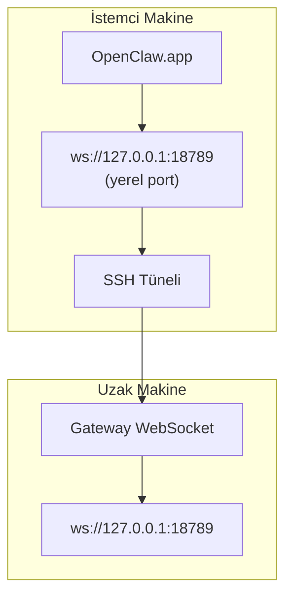

> Bu içerik [Uzak Erişim](/tr/gateway/remote#macos-persistent-ssh-tunnel-via-launchagent) sayfasına birleştirildi. Güncel kılavuz için o sayfaya bakın.

# Uzak bir Gateway ile OpenClaw.app çalıştırma

OpenClaw.app, uzak bir Gateway’e bağlanmak için SSH tünellemesini kullanır. Bu kılavuz bunun nasıl kurulacağını gösterir.

## Genel bakış



## Hızlı kurulum

### Adım 1: SSH yapılandırması ekleyin

`~/.ssh/config` dosyasını düzenleyin ve şunu ekleyin:

```ssh
Host remote-gateway
    HostName <REMOTE_IP>          # ör. 172.27.187.184
    User <REMOTE_USER>            # ör. jefferson
    LocalForward 18789 127.0.0.1:18789
    IdentityFile ~/.ssh/id_rsa
```

`<REMOTE_IP>` ve `<REMOTE_USER>` değerlerini kendi değerlerinizle değiştirin.

### Adım 2: SSH anahtarını kopyalayın

Genel anahtarınızı uzak makineye kopyalayın (bir kez parola girin):

```bash
ssh-copy-id -i ~/.ssh/id_rsa <REMOTE_USER>@<REMOTE_IP>
```

### Adım 3: Uzak Gateway kimlik doğrulamasını yapılandırın

```bash
openclaw config set gateway.remote.token "<your-token>"
```

Uzak Gateway’iniz parola kimlik doğrulaması kullanıyorsa bunun yerine `gateway.remote.password` kullanın.
`OPENCLAW_GATEWAY_TOKEN` kabuk düzeyinde geçersiz kılma olarak hâlâ geçerlidir, ancak kalıcı
uzak istemci kurulumu `gateway.remote.token` / `gateway.remote.password` şeklindedir.

### Adım 4: SSH tünelini başlatın

```bash
ssh -N remote-gateway &
```

### Adım 5: OpenClaw.app’i yeniden başlatın

```bash
# OpenClaw.app’ten çıkın (⌘Q), sonra yeniden açın:
open /path/to/OpenClaw.app
```

Uygulama artık SSH tüneli üzerinden uzak Gateway’e bağlanacaktır.

---

## Girişte tüneli otomatik başlatma

SSH tünelinin oturum açtığınızda otomatik olarak başlamasını istiyorsanız bir Launch Agent oluşturun.

### PLIST dosyasını oluşturun

Bunu `~/Library/LaunchAgents/ai.openclaw.ssh-tunnel.plist` olarak kaydedin:

```xml
<?xml version="1.0" encoding="UTF-8"?>
<!DOCTYPE plist PUBLIC "-//Apple//DTD PLIST 1.0//EN" "http://www.apple.com/DTDs/PropertyList-1.0.dtd">
<plist version="1.0">
<dict>
    <key>Label</key>
    <string>ai.openclaw.ssh-tunnel</string>
    <key>ProgramArguments</key>
    <array>
        <string>/usr/bin/ssh</string>
        <string>-N</string>
        <string>remote-gateway</string>
    </array>
    <key>KeepAlive</key>
    <true/>
    <key>RunAtLoad</key>
    <true/>
</dict>
</plist>
```

### Launch Agent’i yükleyin

```bash
launchctl bootstrap gui/$UID ~/Library/LaunchAgents/ai.openclaw.ssh-tunnel.plist
```

Tünel artık:

- oturum açtığınızda otomatik olarak başlayacak
- çökerse yeniden başlayacak
- arka planda çalışmaya devam edecek

Eski not: varsa kalan `com.openclaw.ssh-tunnel` LaunchAgent öğesini kaldırın.

---

## Sorun giderme

**Tünelin çalışıp çalışmadığını kontrol edin:**

```bash
ps aux | grep "ssh -N remote-gateway" | grep -v grep
lsof -i :18789
```

**Tüneli yeniden başlatın:**

```bash
launchctl kickstart -k gui/$UID/ai.openclaw.ssh-tunnel
```

**Tüneli durdurun:**

```bash
launchctl bootout gui/$UID/ai.openclaw.ssh-tunnel
```

---

## Nasıl çalışır

| Bileşen                              | Ne yapar                                                     |
| ------------------------------------ | ------------------------------------------------------------ |
| `LocalForward 18789 127.0.0.1:18789` | Yerel 18789 portunu uzak 18789 portuna yönlendirir           |
| `ssh -N`                             | Uzak komut çalıştırmadan SSH (yalnızca port yönlendirme)     |
| `KeepAlive`                          | Çökerse tüneli otomatik olarak yeniden başlatır              |
| `RunAtLoad`                          | Aracı yüklendiğinde tüneli başlatır                          |

OpenClaw.app, istemci makinenizde `ws://127.0.0.1:18789` adresine bağlanır. SSH tüneli bu bağlantıyı Gateway’in çalıştığı uzak makinedeki 18789 portuna iletir.

## İlgili

- [Uzak erişim](/tr/gateway/remote)
- [Tailscale](/tr/gateway/tailscale)
