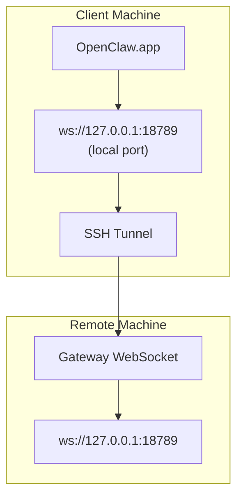

> Bu içerik [Uzaktan Erişim](/tr/gateway/remote#macos-persistent-ssh-tunnel-via-launchagent) içine birleştirildi. Güncel kılavuz için o sayfaya bakın.

# OpenClaw.app’i Uzak Gateway ile Çalıştırma

OpenClaw.app, uzak bir Gateway’e bağlanmak için SSH tünelleme kullanır. Bu kılavuz, bunu nasıl kuracağınızı gösterir.

## Genel bakış



## Hızlı kurulum

### Adım 1: SSH Yapılandırması Ekleyin

`~/.ssh/config` dosyasını düzenleyin ve şunu ekleyin:

```ssh
Host remote-gateway
    HostName <REMOTE_IP>          # e.g., 172.27.187.184
    User <REMOTE_USER>            # e.g., jefferson
    LocalForward 18789 127.0.0.1:18789
    IdentityFile ~/.ssh/id_rsa
```

`<REMOTE_IP>` ve `<REMOTE_USER>` değerlerini kendi değerlerinizle değiştirin.

### Adım 2: SSH Anahtarını Kopyalayın

Açık anahtarınızı uzak makineye kopyalayın (parolayı bir kez girin):

```bash
ssh-copy-id -i ~/.ssh/id_rsa <REMOTE_USER>@<REMOTE_IP>
```

### Adım 3: Uzak Gateway Kimlik Doğrulamasını Yapılandırın

```bash
openclaw config set gateway.remote.token "<your-token>"
```

Uzak Gateway’iniz parola kimlik doğrulaması kullanıyorsa bunun yerine `gateway.remote.password` kullanın.
`OPENCLAW_GATEWAY_TOKEN`, kabuk düzeyinde geçersiz kılma olarak hâlâ geçerlidir; ancak kalıcı
uzak istemci kurulumu `gateway.remote.token` / `gateway.remote.password` şeklindedir.

### Adım 4: SSH Tünelini Başlatın

```bash
ssh -N remote-gateway &
```

### Adım 5: OpenClaw.app’i Yeniden Başlatın

```bash
# Quit OpenClaw.app (⌘Q), then reopen:
open /path/to/OpenClaw.app
```

Uygulama artık SSH tüneli üzerinden uzak Gateway’e bağlanacaktır.

---

## Oturum Açıldığında Tüneli Otomatik Başlatma

SSH tünelinin oturum açtığınızda otomatik olarak başlaması için bir başlatma aracısı oluşturun.

### PLIST Dosyasını Oluşturun

Bunu `~/Library/LaunchAgents/ai.openclaw.ssh-tunnel.plist` olarak kaydedin:

```xml
<?xml version="1.0" encoding="UTF-8"?>
<!DOCTYPE plist PUBLIC "-//Apple//DTD PLIST 1.0//EN" "http://www.apple.com/DTDs/PropertyList-1.0.dtd">
<plist version="1.0">
<dict>
    <key>Label</key>
    <string>ai.openclaw.ssh-tunnel</string>
    <key>ProgramArguments</key>
    <array>
        <string>/usr/bin/ssh</string>
        <string>-N</string>
        <string>remote-gateway</string>
    </array>
    <key>KeepAlive</key>
    <true/>
    <key>RunAtLoad</key>
    <true/>
</dict>
</plist>
```

### Başlatma Aracısını Yükleyin

```bash
launchctl bootstrap gui/$UID ~/Library/LaunchAgents/ai.openclaw.ssh-tunnel.plist
```

Tünel artık:

- Oturum açtığınızda otomatik olarak başlar
- Çökerse yeniden başlatılır
- Arka planda çalışmaya devam eder

Eski sürüm notu: varsa kalan `com.openclaw.ssh-tunnel` LaunchAgent öğesini kaldırın.

---

## Sorun giderme

**Tünelin çalışıp çalışmadığını kontrol edin:**

```bash
ps aux | grep "ssh -N remote-gateway" | grep -v grep
lsof -i :18789
```

**Tüneli yeniden başlatın:**

```bash
launchctl kickstart -k gui/$UID/ai.openclaw.ssh-tunnel
```

**Tüneli durdurun:**

```bash
launchctl bootout gui/$UID/ai.openclaw.ssh-tunnel
```

---

## Nasıl çalışır

| Bileşen                             | Ne Yapar                                                       |
| ----------------------------------- | -------------------------------------------------------------- |
| `LocalForward 18789 127.0.0.1:18789` | Yerel 18789 bağlantı noktasını uzak 18789 bağlantı noktasına iletir |
| `ssh -N`                            | Uzak komut çalıştırmadan SSH kullanır (yalnızca bağlantı noktası iletme) |
| `KeepAlive`                         | Tünel çökerse otomatik olarak yeniden başlatır                 |
| `RunAtLoad`                         | Aracı yüklendiğinde tüneli başlatır                            |

OpenClaw.app, istemci makinenizde `ws://127.0.0.1:18789` adresine bağlanır. SSH tüneli, bu bağlantıyı Gateway’in çalıştığı uzak makinedeki 18789 bağlantı noktasına iletir.

## İlgili

- [Uzaktan erişim](/tr/gateway/remote)
- [Tailscale](/tr/gateway/tailscale)
