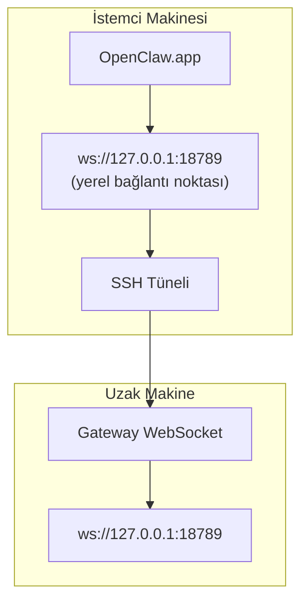

<Note>
Bu içerik artık [Uzaktan Erişim](/tr/gateway/remote#macos-persistent-ssh-tunnel-via-launchagent) sayfasında yer alıyor. Güncel kılavuz için bu sayfayı kullanın; bu sayfa yönlendirme hedefi olarak kalmaktadır.
</Note>

# OpenClaw.app'i Uzak Bir Gateway ile Çalıştırma

OpenClaw.app, bir SSH tüneli üzerinden uzak bir Gateway'e erişir: SSH `LocalForward`, yerel bir bağlantı noktasını uzak ana makinedeki Gateway WebSocket bağlantı noktasıyla eşler.

## Kurulum

1. `LocalForward 18789 127.0.0.1:18789` içeren bir SSH yapılandırma girdisi ekleyin (yapılandırma bloğunun tamamı için [Uzaktan Erişim](/tr/gateway/remote#macos-persistent-ssh-tunnel-via-launchagent) sayfasına bakın).
2. SSH anahtarınızı `ssh-copy-id` ile uzak ana makineye kopyalayın.
3. `openclaw config set gateway.remote.token "<your-token>"` aracılığıyla `gateway.remote.token` (veya `gateway.remote.password`) değerini ayarlayın.
4. Tüneli başlatın: `ssh -N remote-gateway &`.
5. OpenClaw.app'ten çıkın ve uygulamayı yeniden açın.

Yeniden başlatmalardan sonra çalışmaya devam eden ve bağlantıyı otomatik olarak yeniden kuran bir tünel için, elle `ssh -N` çalıştırmak yerine [Uzaktan Erişim](/tr/gateway/remote#macos-persistent-ssh-tunnel-via-launchagent) sayfasındaki LaunchAgent kurulumunu kullanın.

## Nasıl çalışır?

| Bileşen                             | İşlevi                                                         |
| ----------------------------------- | -------------------------------------------------------------- |
| `LocalForward 18789 127.0.0.1:18789` | Yerel 18789 bağlantı noktasını uzaktaki 18789 bağlantı noktasına yönlendirir |
| `ssh -N`                             | Uzak komutları çalıştırmadan SSH bağlantısı kurar (yalnızca bağlantı noktası yönlendirme) |
| `KeepAlive`                          | Tünel çökerse otomatik olarak yeniden başlatır (LaunchAgent)   |
| `RunAtLoad`                          | LaunchAgent yüklendiğinde tüneli başlatır (LaunchAgent)        |

OpenClaw.app, istemcideki `ws://127.0.0.1:18789` adresine bağlanır. Tünel bu bağlantıyı Gateway'in çalıştığı uzak ana makinedeki 18789 numaralı bağlantı noktasına yönlendirir.

## İlgili

- [Uzaktan erişim](/tr/gateway/remote)
- [Tailscale](/tr/gateway/tailscale)
