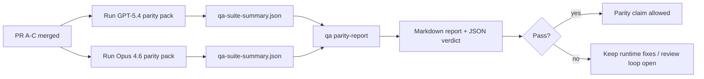

---
read_when:
    - GPT-5.4 / Codex eşdeğerliği PR serisinin gözden geçirilmesi
    - Eşdeğerlik programının arkasındaki altı sözleşmeli ajan mimarisinin bakımı
summary: GPT-5.4 / Codex eşdeğerliği programını dört birleştirme birimi olarak nasıl gözden geçirebilirsiniz
title: GPT-5.4 / Codex Eşdeğerliği Bakımcı Notları
x-i18n:
    generated_at: "2026-04-22T04:22:52Z"
    model: gpt-5.4
    provider: openai
    source_hash: b872d6a33b269c01b44537bfa8646329063298fdfcd3671a17d0eadbc9da5427
    source_path: help/gpt54-codex-agentic-parity-maintainers.md
    workflow: 15
---

# GPT-5.4 / Codex Eşdeğerliği Bakımcı Notları

Bu not, özgün altı sözleşmeli mimariyi kaybetmeden GPT-5.4 / Codex eşdeğerliği programını dört birleştirme birimi olarak nasıl gözden geçireceğinizi açıklar.

## Birleştirme birimleri

### PR A: strict-agentic yürütme

Şunların sahibidir:

- `executionContract`
- GPT-5 öncelikli aynı dönüşte devam tamamlama
- sonlandırıcı olmayan ilerleme takibi olarak `update_plan`
- yalnızca plana dayalı sessiz durmalar yerine açık engellenmiş durumlar

Şunların sahibi değildir:

- auth/runtime hata sınıflandırması
- izin doğruculuğu
- replay/continuation yeniden tasarımı
- eşdeğerlik kıyaslaması

### PR B: çalışma zamanı doğruculuğu

Şunların sahibidir:

- Codex OAuth kapsam doğruluğu
- tipli sağlayıcı/çalışma zamanı hata sınıflandırması
- doğrucu `/elevated full` kullanılabilirliği ve engellenme nedenleri

Şunların sahibi değildir:

- araç şeması normalleştirmesi
- replay/liveness durumu
- benchmark geçitlemesi

### PR C: yürütme doğruluğu

Şunların sahibidir:

- sağlayıcıya ait OpenAI/Codex araç uyumluluğu
- parametresiz strict şema işleme
- replay-invalid görünürleştirmesi
- duraklatılmış, engellenmiş ve terk edilmiş uzun görev durumu görünürlüğü

Şunların sahibi değildir:

- kendi kendine seçilen continuation
- sağlayıcı kancaları dışındaki genel Codex lehçe davranışı
- benchmark geçitlemesi

### PR D: eşdeğerlik harness'i

Şunların sahibidir:

- ilk dalga GPT-5.4 ve Opus 4.6 senaryo paketi
- eşdeğerlik belgeleri
- eşdeğerlik raporu ve sürüm geçidi mekanikleri

Şunların sahibi değildir:

- QA-lab dışındaki çalışma zamanı davranış değişiklikleri
- harness içindeki auth/proxy/DNS simülasyonu

## Özgün altı sözleşmeye geri eşleme

| Özgün sözleşme                          | Birleştirme birimi |
| --------------------------------------- | ------------------ |
| Sağlayıcı taşıma/auth doğruluğu         | PR B               |
| Araç sözleşmesi/şema uyumluluğu         | PR C               |
| Aynı dönüşte yürütme                    | PR A               |
| İzin doğruculuğu                        | PR B               |
| Replay/continuation/liveness doğruluğu  | PR C               |
| Benchmark/sürüm geçidi                  | PR D               |

## Gözden geçirme sırası

1. PR A
2. PR B
3. PR C
4. PR D

PR D kanıt katmanıdır. Çalışma zamanı doğruluğu PR'larının gecikme nedeni olmamalıdır.

## Nelere bakılmalı

### PR A

- GPT-5 çalıştırmaları yorumda durmak yerine eyleme geçiyor veya kapalı başarısız oluyor
- `update_plan` artık tek başına ilerleme gibi görünmüyor
- davranış GPT-5 öncelikli ve gömülü Pi kapsamlı kalıyor

### PR B

- auth/proxy/çalışma zamanı hataları artık genel “model failed” işlemesine çökmez
- `/elevated full` yalnızca gerçekten kullanılabilir olduğunda kullanılabilir olarak tanımlanır
- engellenme nedenleri hem modele hem kullanıcıya dönük çalışma zamanına görünür

### PR C

- strict OpenAI/Codex araç kaydı öngörülebilir davranır
- parametresiz araçlar strict şema kontrollerinde başarısız olmaz
- replay ve Compaction sonuçları doğrucu liveness durumunu korur

### PR D

- senaryo paketi anlaşılır ve yeniden üretilebilir
- paket yalnızca salt okunur akışları değil, değiştirici bir replay-safety hattını da içerir
- raporlar insanlar ve otomasyon tarafından okunabilir
- eşdeğerlik iddiaları anekdotal değil, kanıt desteklidir

PR D'den beklenen çıktılar:

- her model çalıştırması için `qa-suite-report.md` / `qa-suite-summary.json`
- toplu ve senaryo düzeyi karşılaştırma ile `qa-agentic-parity-report.md`
- makine tarafından okunabilir hüküm içeren `qa-agentic-parity-summary.json`

## Sürüm geçidi

Şunlar gerçekleşene kadar GPT-5.4'ün Opus 4.6 ile eşdeğer veya ondan üstün olduğunu iddia etmeyin:

- PR A, PR B ve PR C birleştirilmiş olmalı
- PR D ilk dalga eşdeğerlik paketini temiz şekilde çalıştırmalı
- çalışma zamanı doğruculuğu regresyon paketleri yeşil kalmalı
- eşdeğerlik raporu sahte başarı vakaları ve durma davranışında regresyon göstermemeli

Eşdeğerlik harness'i tek kanıt kaynağı değildir. Gözden geçirmede bu ayrımı açık tutun:

- GPT-5.4 ve Opus 4.6 arasındaki senaryo tabanlı karşılaştırmanın sahibi PR D'dir
- auth/proxy/DNS ve tam erişim doğruculuğu kanıtının sahibi olmaya yine PR B'nin deterministik paketleri devam eder

## Hedeften kanıta eşleme

| Tamamlama geçidi öğesi                  | Birincil sahip | Gözden geçirme çıktısı                                              |
| --------------------------------------- | -------------- | ------------------------------------------------------------------- |
| Yalnızca plan kaynaklı duraksama yok    | PR A           | strict-agentic çalışma zamanı testleri ve `approval-turn-tool-followthrough` |
| Sahte ilerleme veya sahte araç tamamlanması yok | PR A + PR D    | eşdeğerlik sahte başarı sayısı ve senaryo düzeyi rapor ayrıntıları  |
| Hatalı `/elevated full` yönlendirmesi yok | PR B         | deterministik çalışma zamanı doğruculuğu paketleri                  |
| Replay/liveness hataları açık kalır     | PR C + PR D    | yaşam döngüsü/replay paketleri artı `compaction-retry-mutating-tool` |
| GPT-5.4, Opus 4.6 ile eşleşir veya geçer | PR D         | `qa-agentic-parity-report.md` ve `qa-agentic-parity-summary.json`   |

## Gözden geçiren için kısa özet: önce ve sonra

| Önceden kullanıcıya görünen sorun                         | Sonradan gözden geçirme sinyali                                                         |
| --------------------------------------------------------- | --------------------------------------------------------------------------------------- |
| GPT-5.4 planlamadan sonra duruyordu                       | PR A, yalnızca yorum odaklı tamamlama yerine eylem veya engelleme davranışı gösterir   |
| Araç kullanımı strict OpenAI/Codex şemalarıyla kırılgan görünüyordu | PR C, araç kaydını ve parametresiz çağrımı öngörülebilir tutar                    |
| `/elevated full` ipuçları bazen yanıltıcıydı              | PR B, yönlendirmeyi gerçek çalışma zamanı yeteneğine ve engellenme nedenlerine bağlar  |
| Uzun görevler replay/Compaction belirsizliğinde kaybolabiliyordu | PR C, açık duraklatılmış, engellenmiş, terk edilmiş ve replay-invalid durum üretir |
| Eşdeğerlik iddiaları anekdotaldı                          | PR D, her iki modelde aynı senaryo kapsamıyla bir rapor ve JSON hüküm üretir           |
