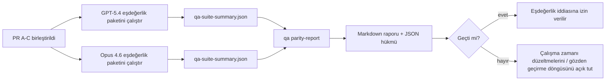

---
read_when:
    - GPT-5.4 / Codex eşdeğerlik PR serisini gözden geçirme
    - Eşdeğerlik programının arkasındaki altı sözleşmeli ajan mimarisini sürdürme
summary: GPT-5.4 / Codex eşdeğerlik programını dört birleştirme birimi olarak nasıl gözden geçireceğiniz
title: GPT-5.4 / Codex eşdeğerlik bakım notları
x-i18n:
    generated_at: "2026-04-24T09:13:33Z"
    model: gpt-5.4
    provider: openai
    source_hash: 803b62bf5bb6b00125f424fa733e743ecdec7f8410dec0782096f9d1ddbed6c0
    source_path: help/gpt54-codex-agentic-parity-maintainers.md
    workflow: 15
---

Bu not, özgün altı sözleşmeli mimariyi kaybetmeden GPT-5.4 / Codex eşdeğerlik programını dört birleştirme birimi olarak nasıl gözden geçireceğinizi açıklar.

## Birleştirme birimleri

### PR A: strict-agentic execution

Sahip oldukları:

- `executionContract`
- GPT-5 öncelikli aynı turda işi tamamlama
- terminal olmayan ilerleme takibi olarak `update_plan`
- yalnızca plan üzerinden sessizce durmak yerine açık engellenmiş durumlar

Sahip olmadıkları:

- kimlik doğrulama/çalışma zamanı hata sınıflandırması
- izin doğruculuğu
- yeniden oynatma/devam tasarımı
- eşdeğerlik kıyaslaması

### PR B: runtime truthfulness

Sahip oldukları:

- Codex OAuth kapsam doğruluğu
- tipli sağlayıcı/çalışma zamanı hata sınıflandırması
- doğru `/elevated full` kullanılabilirliği ve engellenme nedenleri

Sahip olmadıkları:

- araç şeması normalizasyonu
- yeniden oynatma/canlılık durumu
- benchmark geçidi

### PR C: execution correctness

Sahip oldukları:

- sağlayıcıya ait OpenAI/Codex araç uyumluluğu
- parametresiz katı şema işleme
- replay-invalid görünür kılma
- duraklatılmış, engellenmiş ve terk edilmiş uzun görev durumu görünürlüğü

Sahip olmadıkları:

- kendiliğinden seçilen devam etme
- sağlayıcı hook'ları dışındaki genel Codex lehçesi davranışı
- benchmark geçidi

### PR D: parity harness

Sahip oldukları:

- ilk dalga GPT-5.4 ve Opus 4.6 senaryo paketi
- eşdeğerlik belgeleri
- eşdeğerlik raporu ve sürüm geçidi mekanikleri

Sahip olmadıkları:

- QA-lab dışındaki çalışma zamanı davranış değişiklikleri
- harness içindeki kimlik doğrulama/proxy/DNS simülasyonu

## Özgün altı sözleşmeye geri eşleme

| Özgün sözleşme                          | Birleştirme birimi |
| --------------------------------------- | ------------------ |
| Sağlayıcı taşıma/kimlik doğrulama doğruluğu | PR B            |
| Araç sözleşmesi/şema uyumluluğu         | PR C               |
| Aynı turda yürütme                      | PR A               |
| İzin doğruculuğu                        | PR B               |
| Yeniden oynatma/devam/canlılık doğruluğu | PR C              |
| Benchmark/sürüm geçidi                  | PR D               |

## Gözden geçirme sırası

1. PR A
2. PR B
3. PR C
4. PR D

PR D kanıt katmanıdır. Çalışma zamanı doğruluğu PR'lerinin gecikme nedeni olmamalıdır.

## Nelere bakılmalı

### PR A

- GPT-5 çalıştırmaları yorumda kalmak yerine harekete geçiyor veya kapalı biçimde başarısız oluyor
- `update_plan` artık tek başına ilerleme gibi görünmüyor
- davranış GPT-5 öncelikli ve gömülü Pi kapsamlı kalıyor

### PR B

- kimlik doğrulama/proxy/çalışma zamanı hataları genel “model failed” işleyişine çökmeyi bırakıyor
- `/elevated full` yalnızca gerçekten mevcut olduğunda kullanılabilir olarak anlatılıyor
- engellenme nedenleri hem modele hem kullanıcıya dönük çalışma zamanına görünür oluyor

### PR C

- katı OpenAI/Codex araç kaydı öngörülebilir davranıyor
- parametresiz araçlar katı şema kontrollerinde başarısız olmuyor
- yeniden oynatma ve Compaction sonuçları doğru canlılık durumunu koruyor

### PR D

- senaryo paketi anlaşılır ve yeniden üretilebilir
- paket yalnızca salt okunur akışları değil, mutasyon yapan bir yeniden oynatma güvenliği hattını da içeriyor
- raporlar insanlar ve otomasyon tarafından okunabilir durumda
- eşdeğerlik iddiaları anekdota değil, kanıta dayanıyor

PR D'den beklenen artefaktlar:

- her model çalıştırması için `qa-suite-report.md` / `qa-suite-summary.json`
- toplu ve senaryo düzeyinde karşılaştırma ile `qa-agentic-parity-report.md`
- makine tarafından okunabilir hüküm içeren `qa-agentic-parity-summary.json`

## Sürüm geçidi

Şunlar gerçekleşmeden GPT-5.4'ün Opus 4.6 ile eşdeğer veya ondan üstün olduğunu iddia etmeyin:

- PR A, PR B ve PR C birleştirilmiş olmalı
- PR D ilk dalga eşdeğerlik paketini temiz biçimde çalıştırmalı
- çalışma zamanı doğruculuğu regresyon paketleri yeşil kalmalı
- eşdeğerlik raporu sahte başarı durumları ve durma davranışında regresyon göstermemeli

Eşdeğerlik harness'i tek kanıt kaynağı değildir. Gözden geçirmede bu ayrımı açık tutun:

- PR D, senaryo tabanlı GPT-5.4 ve Opus 4.6 karşılaştırmasının sahibidir
- PR B deterministik paketleri hâlâ kimlik doğrulama/proxy/DNS ve tam erişim doğruculuğu kanıtının sahibidir

## Hedeften kanıta eşleme

| Tamamlama geçidi öğesi                  | Birincil sahip | Gözden geçirme artefaktı                                             |
| --------------------------------------- | -------------- | -------------------------------------------------------------------- |
| Yalnızca plan nedeniyle duraklama yok   | PR A           | strict-agentic çalışma zamanı testleri ve `approval-turn-tool-followthrough` |
| Sahte ilerleme veya sahte araç tamamlanması yok | PR A + PR D | eşdeğerlik sahte başarı sayısı ve senaryo düzeyi rapor ayrıntıları |
| Yanlış `/elevated full` yönlendirmesi yok | PR B         | deterministik runtime-truthfulness paketleri                         |
| Yeniden oynatma/canlılık hataları açık kalıyor | PR C + PR D | yaşam döngüsü/yeniden oynatma paketleri ve `compaction-retry-mutating-tool` |
| GPT-5.4, Opus 4.6 ile eşleşiyor veya onu geçiyor | PR D     | `qa-agentic-parity-report.md` ve `qa-agentic-parity-summary.json`   |

## İnceleyici kısaltması: önce ve sonra

| Önce kullanıcıya görünen sorun                              | Sonraki gözden geçirme sinyali                                                         |
| ----------------------------------------------------------- | -------------------------------------------------------------------------------------- |
| GPT-5.4 planlamadan sonra duruyordu                         | PR A, yalnızca yorum içeren tamamlanma yerine harekete geç veya engellen davranışı gösteriyor |
| Katı OpenAI/Codex şemalarıyla araç kullanımı kırılgan görünüyordu | PR C, araç kaydını ve parametresiz çağırmayı öngörülebilir tutuyor               |
| `/elevated full` ipuçları bazen yanıltıcıydı               | PR B, yönlendirmeyi gerçek çalışma zamanı yeteneği ve engellenme nedenlerine bağlıyor |
| Uzun görevler yeniden oynatma/Compaction belirsizliğinde kaybolabiliyordu | PR C, açık duraklatılmış, engellenmiş, terk edilmiş ve replay-invalid durum yayıyor |
| Eşdeğerlik iddiaları anekdotsaldı                           | PR D, her iki modelde de aynı senaryo kapsamıyla rapor ve JSON hükmü üretiyor         |

## İlgili

- [GPT-5.4 / Codex agentic parity](/tr/help/gpt54-codex-agentic-parity)
