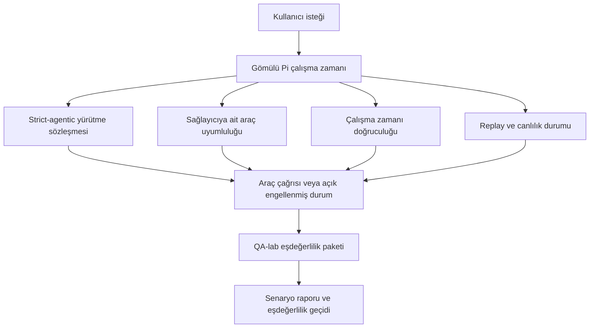
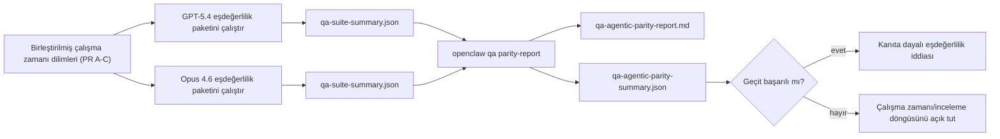

---
read_when:
    - GPT-5.4 veya Codex etmen davranışında hata ayıklama
    - OpenClaw etmen davranışını sınır modeller arasında karşılaştırma
    - strict-agentic, tool-schema, elevation ve replay düzeltmelerini inceleme
summary: OpenClaw, GPT-5.4 ve Codex tarzı modeller için etmen tabanlı yürütme açıklarını nasıl kapatır
title: GPT-5.4 / Codex etmen eşdeğerliliği
x-i18n:
    generated_at: "2026-04-24T09:13:34Z"
    model: gpt-5.4
    provider: openai
    source_hash: 9f8c7dcf21583e6dbac80da9ddd75f2dc9af9b80801072ade8fa14b04258d4dc
    source_path: help/gpt54-codex-agentic-parity.md
    workflow: 15
---

# OpenClaw'ta GPT-5.4 / Codex Etmen Eşdeğerliliği

OpenClaw, araç kullanan sınır modellerle zaten iyi çalışıyordu, ancak GPT-5.4 ve Codex tarzı modeller birkaç pratik açıdan hâlâ beklentinin altında kalıyordu:

- işi yapmak yerine planlamadan sonra durabiliyorlardı
- strict OpenAI/Codex araç şemalarını yanlış kullanabiliyorlardı
- tam erişim imkânsız olsa bile `/elevated full` isteyebiliyorlardı
- replay veya Compaction sırasında uzun süren görev durumunu kaybedebiliyorlardı
- Claude Opus 4.6 ile eşdeğerlilik iddiaları, tekrarlanabilir senaryolar yerine anekdotlara dayanıyordu

Bu eşdeğerlilik programı, bu boşlukları incelenebilir dört dilimde kapatır.

## Neler değişti

### PR A: strict-agentic yürütme

Bu dilim, gömülü Pi GPT-5 çalıştırmaları için isteğe bağlı bir `strict-agentic` yürütme sözleşmesi ekler.

Etkinleştirildiğinde OpenClaw, yalnızca plandan oluşan turları artık “yeterince iyi” tamamlanmış olarak kabul etmez. Model yalnızca ne yapmayı amaçladığını söylüyor ancak gerçekten araç kullanmıyor veya ilerleme kaydetmiyorsa, OpenClaw anında harekete geçmeye yönlendiren bir denemeyle yeniden dener ve ardından görevi sessizce sonlandırmak yerine açık bir engellenmiş durumla kapalı şekilde başarısız olur.

Bu, GPT-5.4 deneyimini özellikle şu durumlarda iyileştirir:

- kısa “tamam yap” devamları
- ilk adımın açık olduğu kod görevleri
- `update_plan` kullanımının dolgu metni yerine ilerleme takibi olması gereken akışlar

### PR B: çalışma zamanı doğruculuğu

Bu dilim, OpenClaw'ın iki konuda gerçeği söylemesini sağlar:

- sağlayıcı/çalışma zamanı çağrısının neden başarısız olduğu
- `/elevated full` seçeneğinin gerçekten kullanılabilir olup olmadığı

Bu, GPT-5.4'ün eksik kapsam, kimlik doğrulama yenileme başarısızlıkları, HTML 403 kimlik doğrulama hataları, proxy sorunları, DNS veya zaman aşımı hataları ve engellenmiş tam erişim modları için daha iyi çalışma zamanı sinyalleri alması anlamına gelir. Modelin yanlış çözümü uydurma veya çalışma zamanının sağlayamayacağı bir izin modunu istemeyi sürdürme olasılığı azalır.

### PR C: yürütme doğruluğu

Bu dilim iki tür doğruluğu iyileştirir:

- sağlayıcıya ait OpenAI/Codex araç şeması uyumluluğu
- replay ve uzun görev canlılığı görünürlüğü

Araç uyumluluğu çalışması, strict OpenAI/Codex araç kaydı için şema kaynaklı sürtünmeyi azaltır; özellikle parametresiz araçlar ve strict nesne-kök beklentileri çevresinde. Replay/canlılık çalışması, uzun süren görevleri daha gözlemlenebilir hâle getirir; böylece duraklatılmış, engellenmiş ve terk edilmiş durumlar genel hata metinleri içinde kaybolmak yerine görünür olur.

### PR D: eşdeğerlilik test altyapısı

Bu dilim, GPT-5.4 ve Opus 4.6'nın aynı senaryolar üzerinden çalıştırılıp ortak kanıtlarla karşılaştırılabilmesi için ilk QA-lab eşdeğerlilik paketini ekler.

Eşdeğerlilik paketi kanıt katmanıdır. Kendi başına çalışma zamanı davranışını değiştirmez.

Elinizde iki adet `qa-suite-summary.json` artifaktı olduğunda, sürüm geçidi karşılaştırmasını şu komutla oluşturun:

```bash
pnpm openclaw qa parity-report \
  --repo-root . \
  --candidate-summary .artifacts/qa-e2e/gpt54/qa-suite-summary.json \
  --baseline-summary .artifacts/qa-e2e/opus46/qa-suite-summary.json \
  --output-dir .artifacts/qa-e2e/parity
```

Bu komut şunları yazar:

- insan tarafından okunabilir bir Markdown raporu
- makine tarafından okunabilir bir JSON kararı
- açık bir `pass` / `fail` geçit sonucu

## Bunun pratikte GPT-5.4'ü neden iyileştirdiği

Bu çalışmadan önce, OpenClaw üzerinde GPT-5.4 gerçek kodlama oturumlarında Opus'a göre daha az etmen gibi hissedilebiliyordu; çünkü çalışma zamanı, GPT-5 tarzı modeller için özellikle zararlı olan bazı davranışlara tolerans gösteriyordu:

- yalnızca açıklama içeren turlar
- araçlar etrafındaki şema sürtünmesi
- belirsiz izin geri bildirimi
- sessiz replay veya Compaction bozulması

Amaç, GPT-5.4'ü Opus'u taklit etmeye zorlamak değildir. Amaç, GPT-5.4'e gerçek ilerlemeyi ödüllendiren, daha temiz araç ve izin semantiklerine sahip olan ve hata modlarını açık, hem makine hem insan tarafından okunabilir durumlara dönüştüren bir çalışma zamanı sözleşmesi vermektir.

Bu, kullanıcı deneyimini şundan değiştirir:

- “modelin iyi bir planı vardı ama durdu”

şuna:

- “model ya harekete geçti ya da OpenClaw neden yapamadığını tam olarak gösterdi”

## GPT-5.4 kullanıcıları için önce ve sonra

| Bu programdan önce                                                                       | PR A-D sonrası                                                                            |
| ---------------------------------------------------------------------------------------- | ----------------------------------------------------------------------------------------- |
| GPT-5.4, bir sonraki araç adımını atmadan makul bir plandan sonra durabiliyordu         | PR A, “yalnızca plan” davranışını “şimdi harekete geç veya engellenmiş durumu göster” yaklaşımına çevirir |
| Strict araç şemaları, parametresiz veya OpenAI/Codex biçimli araçları kafa karıştırıcı biçimde reddedebiliyordu | PR C, sağlayıcıya ait araç kaydı ve çağrımını daha öngörülebilir hâle getirir            |
| `/elevated full` yönlendirmesi engellenmiş çalışma zamanlarında belirsiz veya yanlış olabiliyordu | PR B, GPT-5.4'e ve kullanıcıya doğru çalışma zamanı ve izin ipuçları verir                |
| Replay veya Compaction hataları görevin sessizce kaybolmuş gibi hissettirebiliyordu     | PR C, duraklatılmış, engellenmiş, terk edilmiş ve replay-invalid sonuçları açıkça gösterir |
| “GPT-5.4 Opus'tan daha kötü hissettiriyor” ifadesi çoğunlukla anekdot düzeyindeydi      | PR D, bunu aynı senaryo paketi, aynı metrikler ve kesin bir pass/fail geçidine dönüştürür |

## Mimari



## Sürüm akışı



## Senaryo paketi

İlk dalga eşdeğerlilik paketi şu anda beş senaryoyu kapsar:

### `approval-turn-tool-followthrough`

Modelin, kısa bir onaydan sonra “Bunu yapacağım” noktasında durmadığını kontrol eder. Aynı tur içinde ilk somut eylemi gerçekleştirmelidir.

### `model-switch-tool-continuity`

Araç kullanan işin model/çalışma zamanı geçiş sınırları boyunca sıfırlanmak, açıklamaya dönmek veya yürütme bağlamını kaybetmek yerine tutarlı kalıp kalmadığını kontrol eder.

### `source-docs-discovery-report`

Modelin kaynakları ve belgeleri okuyabildiğini, bulguları sentezleyebildiğini ve ince bir özet üretip erken durmak yerine görevi etmen biçimde sürdürebildiğini kontrol eder.

### `image-understanding-attachment`

Ek içeren karma görevlerin eyleme dönük kalıp kalmadığını ve belirsiz anlatıma çöküp çökmediğini kontrol eder.

### `compaction-retry-mutating-tool`

Gerçek bir değiştirici yazma işlemi içeren bir görevin, çalışma Compaction yaptığında, yeniden denediğinde veya baskı altında yanıt durumunu kaybettiğinde replay güvenli görünmek yerine replay güvensizliğini açık tutup tutmadığını kontrol eder.

## Senaryo matrisi

| Senaryo                           | Ne test eder                              | İyi GPT-5.4 davranışı                                                            | Başarısızlık sinyali                                                                |
| --------------------------------- | ----------------------------------------- | -------------------------------------------------------------------------------- | ----------------------------------------------------------------------------------- |
| `approval-turn-tool-followthrough` | Bir plandan sonraki kısa onay turları     | Niyeti tekrar etmek yerine ilk somut araç eylemini hemen başlatır                | yalnızca plan içeren devam, araç etkinliği yok veya gerçek engel olmadan engellenmiş tur |
| `model-switch-tool-continuity`     | Araç kullanımı altında çalışma zamanı/model geçişi | Görev bağlamını korur ve tutarlı şekilde eyleme devam eder                       | açıklamaya sıfırlanma, araç bağlamının kaybı veya geçişten sonra durma              |
| `source-docs-discovery-report`     | Kaynak okuma + sentez + eylem             | Kaynakları bulur, araçları kullanır ve takılmadan yararlı bir rapor üretir       | zayıf özet, eksik araç çalışması veya eksik-tur durması                             |
| `image-understanding-attachment`   | Ek odaklı etmen işi                       | Eki yorumlar, araçlarla ilişkilendirir ve göreve devam eder                      | belirsiz anlatım, ekin yok sayılması veya somut bir sonraki eylemin olmaması        |
| `compaction-retry-mutating-tool`   | Compaction baskısı altında değiştirici iş | Gerçek bir yazma işlemi yapar ve yan etkiden sonra replay güvensizliğini açık tutar | değiştirici yazma gerçekleşir ama replay güvenliği ima edilir, eksiktir veya çelişkilidir |

## Sürüm geçidi

GPT-5.4, yalnızca birleştirilmiş çalışma zamanı eşdeğerlilik paketini ve çalışma zamanı doğruculuğu regresyonlarını aynı anda geçtiğinde eşdeğer veya daha iyi kabul edilebilir.

Gerekli sonuçlar:

- sonraki araç eylemi açıksa yalnızca plan kaynaklı durma olmaması
- gerçek yürütme olmadan sahte tamamlanma olmaması
- yanlış `/elevated full` yönlendirmesi olmaması
- sessiz replay veya Compaction terk edilmesi olmaması
- üzerinde anlaşılmış Opus 4.6 temel çizgisi kadar güçlü veya daha güçlü eşdeğerlilik paketi metrikleri

İlk dalga test altyapısında geçit şu karşılaştırmaları yapar:

- tamamlanma oranı
- istenmeyen durma oranı
- geçerli araç çağrısı oranı
- sahte başarı sayısı

Eşdeğerlilik kanıtı kasıtlı olarak iki katmana ayrılmıştır:

- PR D, QA-lab ile aynı senaryoda GPT-5.4 ve Opus 4.6 davranışını kanıtlar
- PR B'nin deterministik paketleri, test altyapısı dışında kimlik doğrulama, proxy, DNS ve `/elevated full` doğruculuğunu kanıtlar

## Hedeften kanıta matrisi

| Tamamlanma geçidi maddesi                              | Sorumlu PR  | Kanıt kaynağı                                                      | Geçiş sinyali                                                                           |
| ------------------------------------------------------ | ----------- | ------------------------------------------------------------------ | --------------------------------------------------------------------------------------- |
| GPT-5.4 artık planlamadan sonra durmuyor               | PR A        | `approval-turn-tool-followthrough` ve PR A çalışma zamanı paketleri | onay turları gerçek işi veya açık bir engellenmiş durumu tetikler                       |
| GPT-5.4 artık sahte ilerleme veya sahte araç tamamlanması göstermiyor | PR A + PR D | eşdeğerlilik raporu senaryo sonuçları ve sahte başarı sayısı       | şüpheli geçiş sonucu yok ve yalnızca açıklama içeren tamamlanma yok                     |
| GPT-5.4 artık yanlış `/elevated full` yönlendirmesi vermiyor | PR B        | deterministik doğruculuk paketleri                                 | engellenme nedenleri ve tam erişim ipuçları çalışma zamanına uygun şekilde doğru kalır  |
| Replay/canlılık hataları açık kalır                    | PR C + PR D | PR C yaşam döngüsü/replay paketleri ve `compaction-retry-mutating-tool` | değiştirici iş, sessizce kaybolmak yerine replay güvensizliğini açık tutar              |
| GPT-5.4, üzerinde anlaşılmış metriklerde Opus 4.6'ya yetişir veya geçer | PR D        | `qa-agentic-parity-report.md` ve `qa-agentic-parity-summary.json`  | aynı senaryo kapsamı ve tamamlanma, durma davranışı veya geçerli araç kullanımında regresyon olmaması |

## Eşdeğerlilik kararını nasıl okumalı

İlk dalga eşdeğerlilik paketi için son makine tarafından okunabilir karar olarak `qa-agentic-parity-summary.json` içindeki kararı kullanın.

- `pass`, GPT-5.4'ün Opus 4.6 ile aynı senaryoları kapsadığı ve üzerinde anlaşılmış toplu metriklerde gerileme göstermediği anlamına gelir.
- `fail`, en az bir kesin geçidin tetiklendiği anlamına gelir: daha zayıf tamamlanma, daha kötü istenmeyen durmalar, daha zayıf geçerli araç kullanımı, herhangi bir sahte başarı durumu veya eşleşmeyen senaryo kapsamı.
- “shared/base CI issue” tek başına bir eşdeğerlilik sonucu değildir. PR D dışındaki CI gürültüsü bir çalıştırmayı engelliyorsa, karar dal dönemine ait günlüklerden çıkarım yapmak yerine temiz bir birleştirilmiş çalışma zamanı yürütmesini beklemelidir.
- Kimlik doğrulama, proxy, DNS ve `/elevated full` doğruculuğu hâlâ PR B'nin deterministik paketlerinden gelir; bu nedenle son sürüm iddiası için her ikisi de gerekir: başarılı bir PR D eşdeğerlilik kararı ve yeşil PR B doğruculuk kapsamı.

## `strict-agentic` kimler etkinleştirmeli

`strict-agentic` şu durumlarda kullanılmalıdır:

- sonraki adım açık olduğunda ajanın hemen harekete geçmesi bekleniyorsa
- birincil çalışma zamanı GPT-5.4 veya Codex ailesi modellerse
- “yardımcı” yalnızca özetleyen yanıtlar yerine açık engellenmiş durumları tercih ediyorsanız

Varsayılan sözleşmeyi şu durumlarda koruyun:

- mevcut daha gevşek davranışı istiyorsanız
- GPT-5 ailesi modelleri kullanmıyorsanız
- çalışma zamanı zorlamasını değil istemleri test ediyorsanız

## İlgili

- [GPT-5.4 / Codex eşdeğerliliği bakım notları](/tr/help/gpt54-codex-agentic-parity-maintainers)
