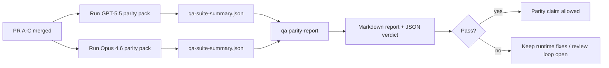

---
read_when:
    - GPT-5.5 / Codex eşdeğerlik PR serisinin incelenmesi
    - Eşdeğerlik programının arkasındaki altı sözleşmeli ajan tabanlı mimariyi sürdürme
summary: GPT-5.5 / Codex parite programını dört birleştirme birimi olarak inceleme
title: GPT-5.5 / Codex eşdeğerliği bakımcı notları
x-i18n:
    generated_at: "2026-05-06T09:16:00Z"
    model: gpt-5.5
    provider: openai
    source_hash: 5752b4610f8b0d70b80d880ea10df75478b5f85ca431cdb73d3b61d745b23356
    source_path: help/gpt55-codex-agentic-parity-maintainers.md
    workflow: 16
---

Bu not, özgün altı sözleşmeli mimariyi kaybetmeden GPT-5.5 / Codex parite programının dört birleştirme birimi olarak nasıl inceleneceğini açıklar.

## Birleştirme birimleri

### PR A: katı ajan odaklı yürütme

Sahip oldukları:

- `executionContract`
- GPT-5 öncelikli aynı turda takip
- terminal olmayan ilerleme takibi olarak `update_plan`
- yalnızca planla sessizce durma yerine açık engellenmiş durumlar

Sahip olmadıkları:

- auth/runtime hata sınıflandırması
- izin doğruluğu
- replay/devam yeniden tasarımı
- parite kıyaslaması

### PR B: runtime doğruluğu

Sahip oldukları:

- Codex OAuth kapsam doğruluğu
- tipli sağlayıcı/runtime hata sınıflandırması
- doğru `/elevated full` kullanılabilirliği ve engellenme nedenleri

Sahip olmadıkları:

- araç şeması normalleştirmesi
- replay/canlılık durumu
- kıyaslama kapısı

### PR C: yürütme doğruluğu

Sahip oldukları:

- sağlayıcıya ait OpenAI/Codex araç uyumluluğu
- parametresiz katı şema işleme
- replay-geçersiz durumunu görünür kılma
- duraklatılmış, engellenmiş ve terk edilmiş uzun görev durumu görünürlüğü

Sahip olmadıkları:

- kendi seçtiği devam
- sağlayıcı hook’ları dışındaki genel Codex lehçesi davranışı
- kıyaslama kapısı

### PR D: parite iskeleti

Sahip oldukları:

- ilk dalga GPT-5.5 ile Opus 4.6 senaryo paketi
- parite dokümantasyonu
- parite raporu ve yayın kapısı mekanikleri

Sahip olmadıkları:

- QA-lab dışındaki runtime davranış değişiklikleri
- iskelet içinde auth/proxy/DNS simülasyonu

## Özgün altı sözleşmeye geri eşleme

| Özgün sözleşme                         | Birleştirme birimi |
| -------------------------------------- | ------------------ |
| Sağlayıcı taşıma/auth doğruluğu        | PR B               |
| Araç sözleşmesi/şema uyumluluğu        | PR C               |
| Aynı tur yürütme                       | PR A               |
| İzin doğruluğu                         | PR B               |
| Replay/devam/canlılık doğruluğu       | PR C               |
| Kıyaslama/yayın kapısı                 | PR D               |

## İnceleme sırası

1. PR A
2. PR B
3. PR C
4. PR D

PR D kanıt katmanıdır. Runtime doğruluğu PR’larının gecikme nedeni olmamalıdır.

## Nelere bakılmalı

### PR A

- GPT-5 çalıştırmaları yorumda durmak yerine eyleme geçer veya kapalı şekilde başarısız olur
- `update_plan` artık tek başına ilerleme gibi görünmez
- davranış GPT-5 öncelikli ve gömülü Pi kapsamlı kalır

### PR B

- auth/proxy/runtime hataları genel "model failed" işlemeye indirgenmeyi bırakır
- `/elevated full` yalnızca gerçekten kullanılabilir olduğunda kullanılabilir diye açıklanır
- engellenme nedenleri hem modele hem de kullanıcıya dönük runtime’a görünür olur

### PR C

- katı OpenAI/Codex araç kaydı öngörülebilir davranır
- parametresiz araçlar katı şema kontrollerinde başarısız olmaz
- replay ve compaction sonuçları doğru canlılık durumunu korur

### PR D

- senaryo paketi anlaşılır ve yeniden üretilebilir olur
- paket yalnızca salt okunur akışları değil, mutasyon yapan bir replay güvenliği hattını da içerir
- raporlar insanlar ve otomasyon tarafından okunabilir olur
- parite iddiaları anekdota değil kanıta dayanır

PR D’den beklenen çıktılar:

- her model çalıştırması için `qa-suite-report.md` / `qa-suite-summary.json`
- toplu ve senaryo düzeyinde karşılaştırma içeren `qa-agentic-parity-report.md`
- makine tarafından okunabilir karar içeren `qa-agentic-parity-summary.json`

## Yayın kapısı

Şunlar gerçekleşene kadar GPT-5.5’in Opus 4.6 ile pariteye ulaştığını veya ondan üstün olduğunu iddia etmeyin:

- PR A, PR B ve PR C birleştirilmiş olmalı
- PR D ilk dalga parite paketini temiz çalıştırmalı
- runtime doğruluğu regresyon takımları yeşil kalmalı
- parite raporu sahte başarı vakası göstermemeli ve durma davranışında regresyon olmamalı

Parite iskeleti tek kanıt kaynağı değildir. İncelemede bu ayrımı açık tutun:

- PR D, senaryo tabanlı GPT-5.5 ile Opus 4.6 karşılaştırmasına sahiptir
- PR B deterministik takımları hâlâ auth/proxy/DNS ve tam erişim doğruluğu kanıtına sahiptir

## Hızlı maintainer birleştirme iş akışı

Bir parite PR’ını indirmeye hazır olduğunuzda ve tekrarlanabilir, düşük riskli bir sıra istediğinizde bunu kullanın.

1. Birleştirmeden önce kanıt eşiğinin karşılandığını doğrulayın:
   - yeniden üretilebilir belirti veya başarısız test
   - dokunulan kodda doğrulanmış kök neden
   - ilgili yolda düzeltme
   - regresyon testi veya açık manuel doğrulama notu
2. Birleştirmeden önce triage/etiketleme yapın:
   - PR inmemeliyse ilgili `r:*` otomatik kapatma etiketlerini uygulayın
   - birleştirme adaylarını çözülmemiş engelleyici başlıklardan arındırın
3. Dokunulan yüzeyde yerel olarak doğrulayın:
   - `pnpm check:changed`
   - testler değiştiğinde veya hata düzeltme güveni test kapsamına bağlı olduğunda `pnpm test:changed`
4. Standart maintainer akışıyla indirin (`/landpr` süreci), ardından doğrulayın:
   - bağlı issue’ların otomatik kapanma davranışı
   - `main` üzerindeki CI ve birleştirme sonrası durum
5. İndirdikten sonra ilgili açık PR’lar/issue’lar için yinelenen araması çalıştırın ve yalnızca kanonik bir referansla kapatın.

Kanıt eşiği öğelerinden herhangi biri eksikse birleştirmek yerine değişiklik isteyin.

## Hedeften kanıta harita

| Tamamlama kapısı öğesi                    | Birincil sahip | İnceleme çıktısı                                                     |
| ----------------------------------------- | -------------- | ------------------------------------------------------------------- |
| Yalnızca planla takılma yok               | PR A           | katı ajan odaklı runtime testleri ve `approval-turn-tool-followthrough` |
| Sahte ilerleme veya sahte araç tamamlama yok | PR A + PR D | parite sahte başarı sayısı ve senaryo düzeyi rapor ayrıntıları      |
| Yanlış `/elevated full` yönlendirmesi yok | PR B           | deterministik runtime doğruluğu takımları                           |
| Replay/canlılık hataları açık kalır       | PR C + PR D    | yaşam döngüsü/replay takımları ve `compaction-retry-mutating-tool`  |
| GPT-5.5, Opus 4.6 ile eşleşir veya onu geçer | PR D        | `qa-agentic-parity-report.md` ve `qa-agentic-parity-summary.json`   |

## İnceleyici kısaltması: öncesi ve sonrası

| Önceden kullanıcıya görünen sorun                         | Sonrasında inceleme sinyali                                                             |
| --------------------------------------------------------- | --------------------------------------------------------------------------------------- |
| GPT-5.5 planlamadan sonra durdu                           | PR A, yalnızca yorumla tamamlama yerine eyleme geç veya engellen davranışını gösterir   |
| Katı OpenAI/Codex şemalarıyla araç kullanımı kırılgan hissettirdi | PR C, araç kaydını ve parametresiz çağrıyı öngörülebilir tutar                  |
| `/elevated full` ipuçları bazen yanıltıcıydı              | PR B, yönlendirmeyi gerçek runtime yeteneğine ve engellenme nedenlerine bağlar          |
| Uzun görevler replay/compaction belirsizliğinde kaybolabiliyordu | PR C açık duraklatılmış, engellenmiş, terk edilmiş ve replay-geçersiz durumu yayar |
| Parite iddiaları anekdottu                                | PR D, her iki modelde de aynı senaryo kapsamıyla bir rapor ve JSON kararı üretir        |

## İlgili

- [GPT-5.5 / Codex ajan odaklı paritesi](/tr/help/gpt55-codex-agentic-parity)
