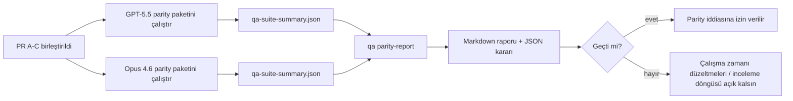

---
read_when:
    - GPT-5.5 / Codex parity PR serisini gözden geçirme
    - Parity programının arkasındaki altı sözleşmeli etmen mimarisini sürdürme
summary: GPT-5.5 / Codex parity programını dört birleştirme birimi olarak nasıl gözden geçirebilirsiniz
title: GPT-5.5 / Codex parity bakımcı notları
x-i18n:
    generated_at: "2026-04-26T11:32:41Z"
    model: gpt-5.4
    provider: openai
    source_hash: 8de69081f5985954b88583880c36388dc47116c3351c15d135b8ab3a660058e3
    source_path: help/gpt55-codex-agentic-parity-maintainers.md
    workflow: 15
---

Bu not, özgün altı sözleşmeli mimariyi kaybetmeden GPT-5.5 / Codex parity programını dört birleştirme birimi olarak nasıl gözden geçireceğinizi açıklar.

## Birleştirme birimleri

### PR A: strict-agentic execution

Sahip oldukları:

- `executionContract`
- GPT-5 öncelikli aynı turda devam etme
- terminal olmayan ilerleme takibi olarak `update_plan`
- yalnızca planla sessiz durmalar yerine açık engellenmiş durumlar

Sahip olmadıkları:

- kimlik doğrulama/çalışma zamanı hata sınıflandırması
- izin doğruluğu
- replay/devam ettirme yeniden tasarımı
- parity kıyaslaması

### PR B: runtime truthfulness

Sahip oldukları:

- Codex OAuth kapsam doğruluğu
- türlenmiş sağlayıcı/çalışma zamanı hata sınıflandırması
- doğru `/elevated full` kullanılabilirliği ve engellenme nedenleri

Sahip olmadıkları:

- araç şeması normalleştirme
- replay/canlılık durumu
- kıyaslama geçidi

### PR C: execution correctness

Sahip oldukları:

- sağlayıcıya ait OpenAI/Codex araç uyumluluğu
- parametresiz katı şema işleme
- replay-invalid yüzeye çıkarma
- duraklatılmış, engellenmiş ve terk edilmiş uzun görev durumu görünürlüğü

Sahip olmadıkları:

- kendiliğinden seçilmiş devam ettirme
- sağlayıcı kancaları dışındaki genel Codex lehçesi davranışı
- kıyaslama geçidi

### PR D: parity harness

Sahip oldukları:

- ilk dalga GPT-5.5 ve Opus 4.6 senaryo paketi
- parity belgeleri
- parity raporu ve sürüm geçidi mekanikleri

Sahip olmadıkları:

- QA-lab dışındaki çalışma zamanı davranışı değişiklikleri
- harness içinde auth/proxy/DNS simülasyonu

## Özgün altı sözleşmeye geri eşleme

| Özgün sözleşme                         | Birleştirme birimi |
| -------------------------------------- | ------------------ |
| Sağlayıcı taşıma/kimlik doğrulama doğruluğu | PR B           |
| Araç sözleşmesi/şema uyumluluğu        | PR C               |
| Aynı turda yürütme                     | PR A               |
| İzin doğruluğu                         | PR B               |
| Replay/devam ettirme/canlılık doğruluğu | PR C             |
| Kıyaslama/sürüm geçidi                 | PR D               |

## İnceleme sırası

1. PR A
2. PR B
3. PR C
4. PR D

PR D kanıt katmanıdır. Çalışma zamanı doğruluğu PR'larının gecikme nedeni bu olmamalıdır.

## Nelere bakılmalı

### PR A

- GPT-5 çalıştırmaları yorumda durmak yerine eyleme geçiyor veya kapalı şekilde başarısız oluyor
- `update_plan` artık tek başına ilerleme gibi görünmüyor
- davranış GPT-5 öncelikli ve gömülü-Pi kapsamlı kalıyor

### PR B

- auth/proxy/çalışma zamanı hataları genel “model failed” işlemesine çökmeyi bırakıyor
- `/elevated full` yalnızca gerçekten kullanılabiliyorsa kullanılabilir olarak tanımlanıyor
- engellenme nedenleri hem modele hem kullanıcıya dönük çalışma zamanına görünür oluyor

### PR C

- katı OpenAI/Codex araç kaydı öngörülebilir davranıyor
- parametresiz araçlar katı şema denetimlerinde başarısız olmuyor
- replay ve Compaction sonuçları doğru canlılık durumunu koruyor

### PR D

- senaryo paketi anlaşılır ve yeniden üretilebilir
- paket yalnızca salt okunur akışları değil, değiştirici bir replay güvenliği hattını da içeriyor
- raporlar insanlar ve otomasyon tarafından okunabilir
- parity iddiaları anekdota değil kanıta dayanıyor

PR D'den beklenen yapıtlar:

- her model çalıştırması için `qa-suite-report.md` / `qa-suite-summary.json`
- toplu ve senaryo düzeyi karşılaştırma içeren `qa-agentic-parity-report.md`
- makine tarafından okunabilir bir karar içeren `qa-agentic-parity-summary.json`

## Sürüm geçidi

Şunlar gerçekleşmeden GPT-5.5 parity'si veya Opus 4.6'ya üstünlük iddiasında bulunmayın:

- PR A, PR B ve PR C birleştirildi
- PR D ilk dalga parity paketini temiz şekilde çalıştırdı
- çalışma zamanı doğruluğu gerileme paketleri yeşil kaldı
- parity raporu sahte başarı vakası ve durma davranışında gerileme göstermiyor

Parity harness tek kanıt kaynağı değildir. İncelemede bu ayrımı açık tutun:

- PR D, senaryo tabanlı GPT-5.5 ve Opus 4.6 karşılaştırmasının sahibidir
- PR B deterministik paketleri hâlâ auth/proxy/DNS ve tam erişim doğruluğu kanıtının sahibidir

## Hızlı bakımcı birleştirme iş akışı

Bir parity PR'ını göndermeye hazır olduğunuzda ve tekrarlanabilir, düşük riskli bir sıra istediğinizde bunu kullanın.

1. Birleştirmeden önce kanıt eşiğinin karşılandığını doğrulayın:
   - yeniden üretilebilir belirti veya başarısız test
   - dokunulan kodda doğrulanmış kök neden
   - suçlanan yolda düzeltme
   - gerileme testi veya açık manuel doğrulama notu
2. Birleştirmeden önce sınıflandırın/etiketleyin:
   - PR'ın inmemesi gerekiyorsa ilgili `r:*` otomatik kapatma etiketlerini uygulayın
   - birleştirme adaylarını çözülmemiş engelleyici başlıklardan uzak tutun
3. Dokunulan yüzeyde yerel olarak doğrulayın:
   - `pnpm check:changed`
   - testler değiştiyse veya hata düzeltme güveni test kapsamına bağlıysa `pnpm test:changed`
4. Standart bakımcı akışıyla gönderin (`/landpr` süreci), ardından doğrulayın:
   - bağlantılı issue'ların otomatik kapanma davranışı
   - `main` üzerindeki CI ve birleştirme sonrası durum
5. Gönderdikten sonra ilgili açık PR/issue'lar için yinelenen arama yapın ve yalnızca kurallı bir referansla kapatın.

Kanıt eşiği öğelerinden herhangi biri eksikse birleştirmek yerine değişiklik isteyin.

## Hedeften kanıta eşleme

| Tamamlama geçidi öğesi                  | Birincil sahip | İnceleme yapıtı                                                     |
| --------------------------------------- | -------------- | ------------------------------------------------------------------- |
| Yalnızca plan kaynaklı duraklama yok    | PR A           | strict-agentic çalışma zamanı testleri ve `approval-turn-tool-followthrough` |
| Sahte ilerleme veya sahte araç tamamlanması yok | PR A + PR D | parity sahte başarı sayısı artı senaryo düzeyi rapor ayrıntıları |
| Yanlış `/elevated full` yönlendirmesi yok | PR B         | deterministik runtime-truthfulness paketleri                        |
| Replay/canlılık hataları açık kalır     | PR C + PR D    | yaşam döngüsü/replay paketleri artı `compaction-retry-mutating-tool` |
| GPT-5.5, Opus 4.6 ile eşleşir veya onu geçer | PR D      | `qa-agentic-parity-report.md` ve `qa-agentic-parity-summary.json`  |

## İnceleyenler için kısa özet: önce ve sonra

| Önceden kullanıcıya görünen sorun                         | Sonrasında inceleme sinyali                                                            |
| --------------------------------------------------------- | -------------------------------------------------------------------------------------- |
| GPT-5.5 planlamadan sonra duruyordu                       | PR A, yalnızca yorum temelli tamamlanma yerine eylem veya engellenme davranışı gösteriyor |
| Katı OpenAI/Codex şemalarıyla araç kullanımı kırılgan hissediliyordu | PR C, araç kaydı ve parametresiz çağrıyı öngörülebilir tutuyor              |
| `/elevated full` ipuçları bazen yanıltıcıydı              | PR B, yönlendirmeyi gerçek çalışma zamanı yeteneğine ve engellenme nedenlerine bağlıyor |
| Uzun görevler replay/Compaction belirsizliğinde kaybolabiliyordu | PR C, açık paused, blocked, abandoned ve replay-invalid durumu yayıyor      |
| Parity iddiaları anekdota dayanıyordu                     | PR D, her iki modelde de aynı senaryo kapsamıyla bir rapor ve JSON kararı üretiyor |

## İlgili

- [GPT-5.5 / Codex agentic parity](/tr/help/gpt55-codex-agentic-parity)
