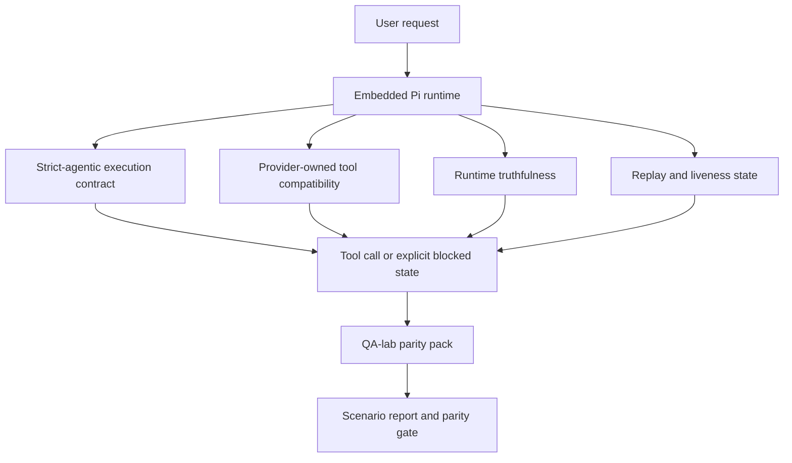
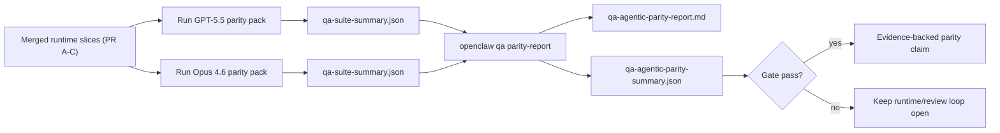

---
read_when:
    - GPT-5.5 veya Codex ajan davranışında hata ayıklama
    - OpenClaw ajan davranışını öncü modeller arasında karşılaştırma
    - Katı ajan temelli, araç şeması, yükseltme ve yeniden oynatma düzeltmelerini gözden geçirme
summary: OpenClaw, GPT-5.5 ve Codex tarzı modeller için ajan tabanlı yürütme boşluklarını nasıl kapatır
title: GPT-5.5 / Codex ajan özellikleri eşdeğerliği
x-i18n:
    generated_at: "2026-05-06T09:16:11Z"
    model: gpt-5.5
    provider: openai
    source_hash: bbc32f418dfffe2786093fa6b42b19f92a2d382c9408dfc55dd0154d67959390
    source_path: help/gpt55-codex-agentic-parity.md
    workflow: 16
---

OpenClaw, araç kullanan öncü modellerle zaten iyi çalışıyordu, ancak GPT-5.5 ve Codex tarzı modeller birkaç pratik noktada hâlâ beklenenden düşük performans gösteriyordu:

- işi yapmak yerine planlamadan sonra durabiliyorlardı
- katı OpenAI/Codex araç şemalarını hatalı kullanabiliyorlardı
- tam erişim imkânsız olsa bile `/elevated full` isteyebiliyorlardı
- yeniden oynatma veya Compaction sırasında uzun süren görev durumunu kaybedebiliyorlardı
- Claude Opus 4.6 ile parite iddiaları, tekrarlanabilir senaryolar yerine anekdotlara dayanıyordu

Bu parite programı bu boşlukları incelenebilir dört parçada giderir.

## Ne değişti

### PR A: strict-agentic yürütme

Bu parça, gömülü Pi GPT-5 çalıştırmaları için isteğe bağlı bir `strict-agentic` yürütme sözleşmesi ekler.

Etkinleştirildiğinde OpenClaw, yalnızca plan içeren turları "yeterince iyi" tamamlanma olarak kabul etmeyi bırakır. Model yalnızca ne yapmak istediğini söyler ve gerçekten araç kullanmaz ya da ilerleme kaydetmezse, OpenClaw şimdi-harekete-geç yönlendirmesiyle yeniden dener ve ardından görevi sessizce bitirmek yerine açık bir engellenmiş durumla güvenli biçimde başarısız olur.

Bu, GPT-5.5 deneyimini en çok şu durumlarda iyileştirir:

- kısa "tamam yap" takipleri
- ilk adımın açık olduğu kod görevleri
- `update_plan` kullanımının dolgu metin yerine ilerleme takibi olması gereken akışlar

### PR B: çalışma zamanı doğruluğu

Bu parça OpenClaw'ın iki konuda doğruyu söylemesini sağlar:

- sağlayıcı/çalışma zamanı çağrısının neden başarısız olduğu
- `/elevated full` seçeneğinin gerçekten kullanılabilir olup olmadığı

Bu, GPT-5.5'in eksik kapsam, kimlik doğrulama yenileme hataları, HTML 403 kimlik doğrulama hataları, proxy sorunları, DNS veya zaman aşımı hataları ve engellenmiş tam erişim modları için daha iyi çalışma zamanı sinyalleri alması anlamına gelir. Modelin yanlış çözüm yolu uydurma veya çalışma zamanının sağlayamayacağı bir izin modunu istemeye devam etme olasılığı azalır.

### PR C: yürütme doğruluğu

Bu parça iki tür doğruluğu iyileştirir:

- sağlayıcıya ait OpenAI/Codex araç şeması uyumluluğu
- yeniden oynatma ve uzun görev canlılığının görünür kılınması

Araç uyumluluğu çalışması, özellikle parametresiz araçlar ve katı nesne-kök beklentileri etrafında, katı OpenAI/Codex araç kaydı için şema sürtünmesini azaltır. Yeniden oynatma/canlılık çalışması uzun süren görevleri daha gözlemlenebilir yapar; böylece duraklatılmış, engellenmiş ve terk edilmiş durumlar genel hata metninin içinde kaybolmak yerine görünür olur.

### PR D: parite koşum takımı

Bu parça, GPT-5.5 ve Opus 4.6'nın aynı senaryolar üzerinden çalıştırılıp paylaşılan kanıtlarla karşılaştırılabilmesi için ilk dalga QA-lab parite paketini ekler.

Parite paketi kanıt katmanıdır. Tek başına çalışma zamanı davranışını değiştirmez.

İki `qa-suite-summary.json` yapıtınız olduktan sonra, sürüm geçidi karşılaştırmasını şu komutla oluşturun:

```bash
pnpm openclaw qa parity-report \
  --repo-root . \
  --candidate-summary .artifacts/qa-e2e/gpt55/qa-suite-summary.json \
  --baseline-summary .artifacts/qa-e2e/opus46/qa-suite-summary.json \
  --output-dir .artifacts/qa-e2e/parity
```

Bu komut şunları yazar:

- insan tarafından okunabilir bir Markdown raporu
- makine tarafından okunabilir bir JSON kararı
- açık bir `pass` / `fail` geçit sonucu

## Bunun GPT-5.5'i pratikte neden iyileştirdiği

Bu çalışmadan önce, OpenClaw üzerindeki GPT-5.5 gerçek kodlama oturumlarında Opus'a göre daha az ajan odaklı hissedebiliyordu; çünkü çalışma zamanı, GPT-5 tarzı modeller için özellikle zararlı olan davranışlara tolerans gösteriyordu:

- yalnızca yorum içeren turlar
- araçlar etrafında şema sürtünmesi
- belirsiz izin geri bildirimi
- sessiz yeniden oynatma veya Compaction bozulması

Amaç GPT-5.5'in Opus'u taklit etmesini sağlamak değildir. Amaç, GPT-5.5'e gerçek ilerlemeyi ödüllendiren, daha temiz araç ve izin semantiği sağlayan ve hata modlarını açık makine ve insan tarafından okunabilir durumlara dönüştüren bir çalışma zamanı sözleşmesi vermektir.

Bu, kullanıcı deneyimini şundan değiştirir:

- "modelin iyi bir planı vardı ama durdu"

şuna:

- "model ya harekete geçti ya da OpenClaw neden bunu yapamadığını tam olarak gösterdi"

## GPT-5.5 kullanıcıları için öncesi ve sonrası

| Bu programdan önce                                                                            | PR A-D sonrası                                                                             |
| ---------------------------------------------------------------------------------------------- | ---------------------------------------------------------------------------------------- |
| GPT-5.5 makul bir plandan sonra bir sonraki araç adımını atmadan durabiliyordu                   | PR A, "yalnızca plan" durumunu "şimdi harekete geç veya engellenmiş durumu göster" durumuna çevirir                         |
| Katı araç şemaları parametresiz veya OpenAI/Codex biçimli araçları kafa karıştırıcı biçimlerde reddedebiliyordu | PR C, sağlayıcıya ait araç kaydını ve çağrısını daha öngörülebilir hale getirir              |
| `/elevated full` yönlendirmesi engellenmiş çalışma zamanlarında belirsiz veya yanlış olabiliyordu                          | PR B, GPT-5.5'e ve kullanıcıya doğru çalışma zamanı ve izin ipuçları verir                    |
| Yeniden oynatma veya Compaction hataları görevin sessizce kaybolduğu hissini verebiliyordu                    | PR C, duraklatılmış, engellenmiş, terk edilmiş ve yeniden oynatma için geçersiz sonuçları açıkça gösterir         |
| "GPT-5.5 Opus'tan daha kötü hissettiriyor" çoğunlukla anekdotlara dayanıyordu                                           | PR D bunu aynı senaryo paketine, aynı metriklere ve katı bir başarılı/başarısız geçidine dönüştürür |

## Mimari



## Sürüm akışı



## Senaryo paketi

İlk dalga parite paketi şu anda beş senaryoyu kapsar:

### `approval-turn-tool-followthrough`

Modelin kısa bir onaydan sonra "Bunu yapacağım" noktasında durmadığını denetler. Aynı turda ilk somut eylemi yapmalıdır.

### `model-switch-tool-continuity`

Araç kullanan işin, model/çalışma zamanı geçiş sınırları boyunca yoruma sıfırlanmak veya yürütme bağlamını kaybetmek yerine tutarlı kalmasını denetler.

### `source-docs-discovery-report`

Modelin kaynak ve belgeleri okuyabildiğini, bulguları sentezleyebildiğini ve ince bir özet üretip erken durmak yerine göreve ajan odaklı biçimde devam edebildiğini denetler.

### `image-understanding-attachment`

Ekleri içeren karma modlu görevlerin eyleme dönük kaldığını ve belirsiz anlatıma dönüşmediğini denetler.

### `compaction-retry-mutating-tool`

Gerçek bir değiştirici yazma içeren bir görevin, çalıştırma sıkıştırıldığında, yeniden denendiğinde veya baskı altında yanıt durumunu kaybettiğinde sessizce yeniden oynatma açısından güvenli görünmek yerine yeniden oynatma güvensizliğini açık tuttuğunu denetler.

## Senaryo matrisi

| Senaryo                           | Neyi test eder                           | İyi GPT-5.5 davranışı                                                          | Hata sinyali                                                                 |
| ---------------------------------- | --------------------------------------- | ------------------------------------------------------------------------------ | ------------------------------------------------------------------------------ |
| `approval-turn-tool-followthrough` | Bir plandan sonra kısa onay turları       | Niyeti yeniden ifade etmek yerine ilk somut araç eylemini hemen başlatır  | yalnızca plan içeren takip, araç etkinliği olmaması veya gerçek bir engelleyici olmadan engellenmiş tur  |
| `model-switch-tool-continuity`     | Araç kullanımı altında çalışma zamanı/model geçişi  | Görev bağlamını korur ve tutarlı biçimde eyleme devam eder                         | yoruma sıfırlanır, araç bağlamını kaybeder veya geçişten sonra durur              |
| `source-docs-discovery-report`     | Kaynak okuma + sentez + eylem     | Kaynakları bulur, araçları kullanır ve takılmadan yararlı bir rapor üretir       | ince özet, eksik araç çalışması veya tamamlanmamış turda durma                       |
| `image-understanding-attachment`   | Ek odaklı ajan odaklı çalışma          | Eki yorumlar, onu araçlara bağlar ve göreve devam eder        | belirsiz anlatım, ekin yok sayılması veya somut sonraki eylemin olmaması                |
| `compaction-retry-mutating-tool`   | Compaction baskısı altında değiştirici çalışma | Gerçek bir yazma gerçekleştirir ve yan etkiden sonra yeniden oynatma güvensizliğini açık tutar | değiştirici yazma gerçekleşir ancak yeniden oynatma güvenliği ima edilir, eksiktir veya çelişkilidir |

## Sürüm geçidi

GPT-5.5, yalnızca birleştirilmiş çalışma zamanı parite paketini ve çalışma zamanı doğruluğu regresyonlarını aynı anda geçtiğinde paritede veya daha iyi kabul edilebilir.

Gerekli sonuçlar:

- bir sonraki araç eylemi açıkken yalnızca plan nedeniyle takılma olmaması
- gerçek yürütme olmadan sahte tamamlanma olmaması
- hatalı `/elevated full` yönlendirmesi olmaması
- sessiz yeniden oynatma veya Compaction terk etmesi olmaması
- en az uzlaşılan Opus 4.6 temel çizgisi kadar güçlü parite paketi metrikleri

İlk dalga koşum takımı şunları karşılaştırır:

- tamamlanma oranı
- istenmeyen durma oranı
- geçerli araç çağrısı oranı
- sahte başarı sayısı

Parite kanıtı bilinçli olarak iki katmana ayrılmıştır:

- PR D, QA-lab ile aynı senaryoda GPT-5.5 ve Opus 4.6 davranışını kanıtlar
- PR B deterministik paketleri, koşum takımının dışında kimlik doğrulama, proxy, DNS ve `/elevated full` doğruluğunu kanıtlar

## Hedeften kanıta matrisi

| Tamamlanma geçidi öğesi                                     | Sahip PR   | Kanıt kaynağı                                                    | Geçme sinyali                                                                              |
| -------------------------------------------------------- | ----------- | ------------------------------------------------------------------ | ---------------------------------------------------------------------------------------- |
| GPT-5.5 artık planlamadan sonra takılmıyor                  | PR A        | `approval-turn-tool-followthrough` artı PR A çalışma zamanı paketleri        | onay turları gerçek işi veya açık bir engellenmiş durumu tetikler                            |
| GPT-5.5 artık ilerlemeyi veya araç tamamlanmasını sahte göstermiyor | PR A + PR D | parite raporu senaryo sonuçları ve sahte başarı sayısı             | şüpheli geçme sonucu yok ve yalnızca yorumla tamamlanma yok                             |
| GPT-5.5 artık yanlış `/elevated full` yönlendirmesi vermiyor  | PR B        | deterministik doğruluk paketleri                                  | engellenme nedenleri ve tam erişim ipuçları çalışma zamanıyla doğru kalır                              |
| Yeniden oynatma/canlılık hataları açık kalır                   | PR C + PR D | PR C yaşam döngüsü/yeniden oynatma paketleri artı `compaction-retry-mutating-tool` | değiştirici çalışma sessizce kaybolmak yerine yeniden oynatma güvensizliğini açık tutar            |
| GPT-5.5 uzlaşılan metriklerde Opus 4.6 ile eşleşir veya onu geçer  | PR D        | `qa-agentic-parity-report.md` ve `qa-agentic-parity-summary.json` | aynı senaryo kapsamı ve tamamlanma, durma davranışı veya geçerli araç kullanımı konusunda regresyon olmaması |

## Parite kararını okuma

İlk dalga parite paketi için nihai makine tarafından okunabilir karar olarak `qa-agentic-parity-summary.json` içindeki kararı kullanın.

- `pass`, GPT-5.5'in Opus 4.6 ile aynı senaryoları kapsadığı ve üzerinde anlaşılmış toplu metriklerde gerilemediği anlamına gelir.
- `fail`, en az bir katı geçidin tetiklendiği anlamına gelir: daha zayıf tamamlama, daha kötü istenmeyen durmalar, daha zayıf geçerli araç kullanımı, herhangi bir sahte başarı durumu veya eşleşmeyen senaryo kapsamı.
- "paylaşılan/temel CI sorunu" tek başına bir parite sonucu değildir. PR D dışındaki CI gürültüsü bir çalıştırmayı engellerse, karar dal dönemi günlüklerinden çıkarılmak yerine temiz bir birleştirilmiş çalışma zamanı yürütmesini beklemelidir.
- Auth, proxy, DNS ve `/elevated full` doğruluğu hâlâ PR B'nin deterministik paketlerinden gelir; bu nedenle nihai sürüm iddiası ikisini de gerektirir: geçen bir PR D parite kararı ve yeşil PR B doğruluk kapsamı.

## `strict-agentic` kimler tarafından etkinleştirilmeli?

`strict-agentic` kullanın:

- bir sonraki adım açık olduğunda agent'ın hemen harekete geçmesi bekleniyorsa
- GPT-5.5 veya Codex ailesi modeller birincil çalışma zamanıysa
- "yardımcı" yalnızca özet yanıtlar yerine açıkça belirtilmiş engellenmiş durumları tercih ediyorsanız

Varsayılan sözleşmeyi koruyun:

- mevcut daha gevşek davranışı istiyorsanız
- GPT-5 ailesi modeller kullanmıyorsanız
- çalışma zamanı zorlaması yerine prompt'ları test ediyorsanız

## İlgili

- [GPT-5.5 / Codex parite bakımcı notları](/tr/help/gpt55-codex-agentic-parity-maintainers)
