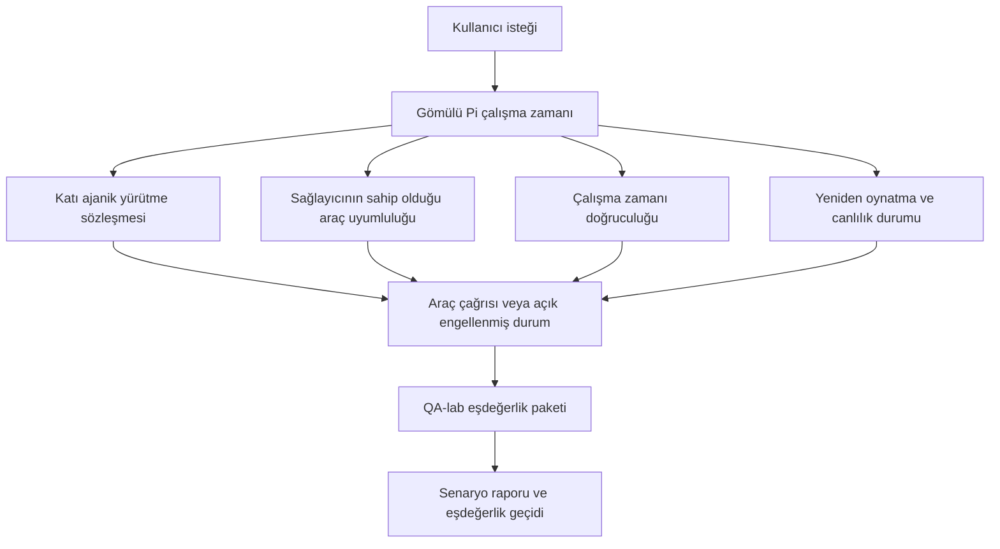
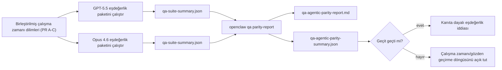

---
read_when:
    - GPT-5.5 veya Codex ajan davranışını ayıklama
    - Sınır modeller arasında OpenClaw'un ajanik davranışını karşılaştırma
    - Katı ajaniklik, araç şeması, yetki yükseltme ve yeniden oynatma düzeltmelerini gözden geçirme
summary: OpenClaw'un GPT-5.5 ve Codex tarzı modeller için ajanik yürütme boşluklarını nasıl kapattığı
title: GPT-5.5 / Codex ajanik eşdeğerlik
x-i18n:
    generated_at: "2026-04-26T11:32:46Z"
    model: gpt-5.4
    provider: openai
    source_hash: 8a3b9375cd9e9d95855c4a1135953e00fd7a939e52fb7b75342da3bde2d83fe1
    source_path: help/gpt55-codex-agentic-parity.md
    workflow: 15
---

# OpenClaw'da GPT-5.5 / Codex Ajanik Eşdeğerliği

OpenClaw, araç kullanan sınır modellerle zaten iyi çalışıyordu, ancak GPT-5.5 ve Codex tarzı modeller birkaç pratik açıdan hâlâ beklenen düzeyde değildi:

- işi yapmak yerine planlamadan sonra durabiliyorlardı
- katı OpenAI/Codex araç şemalarını yanlış kullanabiliyorlardı
- tam erişim imkânsız olduğunda bile `/elevated full` isteyebiliyorlardı
- yeniden oynatma veya Compaction sırasında uzun süren görev durumunu kaybedebiliyorlardı
- Claude Opus 4.6'ya karşı eşdeğerlik iddiaları tekrar edilebilir senaryolar yerine anekdotlara dayanıyordu

Bu eşdeğerlik programı bu boşlukları gözden geçirilebilir dört dilimde kapatır.

## Neler değişti

### PR A: katı ajanik yürütme

Bu dilim, gömülü Pi GPT-5 çalıştırmaları için isteğe bağlı bir `strict-agentic` yürütme sözleşmesi ekler.

Etkinleştirildiğinde OpenClaw, yalnızca plan içeren turları artık “yeterince iyi” tamamlanma olarak kabul etmez. Model yalnızca ne yapmayı amaçladığını söylüyor ve gerçekten araç kullanmıyor ya da ilerleme kaydetmiyorsa OpenClaw bir şimdi-harekete-geç yönlendirmesiyle yeniden dener, ardından görevi sessizce bitirmek yerine açık bir engellenmiş durumla kapalı hata verir.

Bu özellikle GPT-5.5 deneyimini şu durumlarda iyileştirir:

- kısa “tamam yap” takipleri
- ilk adımın bariz olduğu kod görevleri
- `update_plan` kullanımının dolgu metni değil ilerleme takibi olması gereken akışlar

### PR B: çalışma zamanı doğruculuğu

Bu dilim, OpenClaw'un iki konuda doğruyu söylemesini sağlar:

- sağlayıcı/çalışma zamanı çağrısının neden başarısız olduğu
- `/elevated full` seçeneğinin gerçekten kullanılabilir olup olmadığı

Bu, GPT-5.5'in eksik kapsam, auth yenileme hataları, HTML 403 auth hataları, proxy sorunları, DNS veya zaman aşımı hataları ve engellenmiş tam erişim modları için daha iyi çalışma zamanı sinyalleri alması anlamına gelir. Modelin yanlış çözümü halüsinasyonla üretme veya çalışma zamanının sağlayamayacağı bir izin modunu istemeye devam etme olasılığı azalır.

### PR C: yürütme doğruluğu

Bu dilim iki tür doğruluğu iyileştirir:

- sağlayıcının sahip olduğu OpenAI/Codex araç şeması uyumluluğu
- yeniden oynatma ve uzun görev canlılık görünürlüğü

Araç uyumluluğu çalışması, özellikle parametresiz araçlar ve katı nesne-kök beklentileri etrafında, katı OpenAI/Codex araç kaydı için şema sürtünmesini azaltır. Yeniden oynatma/canlılık çalışması, uzun süren görevleri daha gözlemlenebilir hâle getirir; böylece duraklatılmış, engellenmiş ve terk edilmiş durumlar genel hata metinlerinin içinde kaybolmak yerine görünür olur.

### PR D: eşdeğerlik harness'i

Bu dilim, GPT-5.5 ve Opus 4.6'nın aynı senaryolar üzerinden çalıştırılıp ortak kanıtlarla karşılaştırılabilmesi için ilk dalga QA-lab eşdeğerlik paketini ekler.

Eşdeğerlik paketi kanıt katmanıdır. Kendi başına çalışma zamanı davranışını değiştirmez.

İki adet `qa-suite-summary.json` artifaktınız olduktan sonra, sürüm geçidi karşılaştırmasını şununla oluşturun:

```bash
pnpm openclaw qa parity-report \
  --repo-root . \
  --candidate-summary .artifacts/qa-e2e/gpt55/qa-suite-summary.json \
  --baseline-summary .artifacts/qa-e2e/opus46/qa-suite-summary.json \
  --output-dir .artifacts/qa-e2e/parity
```

Bu komut şunları yazar:

- insanlar tarafından okunabilir bir Markdown raporu
- makine tarafından okunabilir bir JSON kararı
- açık bir `pass` / `fail` geçit sonucu

## Bu, pratikte GPT-5.5'i neden iyileştiriyor

Bu çalışmadan önce OpenClaw üzerindeki GPT-5.5, gerçek kodlama oturumlarında Opus'a göre daha az ajanik hissettirebiliyordu çünkü çalışma zamanı, özellikle GPT-5 tarzı modeller için zararlı olan davranışlara tolerans gösteriyordu:

- yalnızca yorum içeren turlar
- araçlar etrafında şema sürtünmesi
- belirsiz izin geri bildirimi
- sessiz yeniden oynatma veya Compaction bozulmaları

Amaç GPT-5.5'i Opus'u taklit etmeye zorlamak değildir. Amaç, GPT-5.5'e gerçek ilerlemeyi ödüllendiren, daha temiz araç ve izin semantiği sağlayan ve hata modlarını açık, hem makine hem insan tarafından okunabilir durumlara dönüştüren bir çalışma zamanı sözleşmesi vermektir.

Bu, kullanıcı deneyimini şundan:

- “modelin iyi bir planı vardı ama durdu”

şuna dönüştürür:

- “model ya harekete geçti ya da OpenClaw neden geçemediğini tam olarak gösterdi”

## GPT-5.5 kullanıcıları için önce ve sonra

| Bu programdan önce                                                                          | PR A-D sonrası                                                                       |
| ------------------------------------------------------------------------------------------- | ------------------------------------------------------------------------------------- |
| GPT-5.5 mantıklı bir plandan sonra sonraki araç adımını atmadan durabiliyordu              | PR A, “yalnızca plan”ı “hemen harekete geç veya engellenmiş bir durum göster”e çevirir |
| Katı araç şemaları parametresiz veya OpenAI/Codex biçimli araçları kafa karıştırıcı şekilde reddedebiliyordu | PR C, sağlayıcının sahip olduğu araç kaydı ve çağrımını daha öngörülebilir hâle getirir |
| `/elevated full` yönlendirmesi engellenmiş çalışma zamanlarında belirsiz veya yanlış olabiliyordu | PR B, GPT-5.5'e ve kullanıcıya doğru çalışma zamanı ve izin ipuçları verir            |
| Yeniden oynatma veya Compaction hataları görevin sessizce kaybolmuş gibi hissettirebiliyordu | PR C, duraklatılmış, engellenmiş, terk edilmiş ve replay-invalid sonuçları açıkça gösterir |
| “GPT-5.5, Opus'tan daha kötü hissettiriyor” çoğunlukla anekdottu                           | PR D bunu aynı senaryo paketi, aynı metrikler ve sert bir pass/fail geçidine dönüştürür |

## Mimari



## Sürüm akışı



## Senaryo paketi

İlk dalga eşdeğerlik paketi şu anda beş senaryoyu kapsıyor:

### `approval-turn-tool-followthrough`

Kısa bir onaydan sonra modelin “Bunu yapacağım” deyip durmadığını denetler. Aynı turda ilk somut eylemi yapmalıdır.

### `model-switch-tool-continuity`

Araç kullanan işlerin model/çalışma zamanı geçiş sınırları boyunca yorum moduna sıfırlanmak veya yürütme bağlamını kaybetmek yerine tutarlı kalıp kalmadığını denetler.

### `source-docs-discovery-report`

Modelin kaynak ve belgeleri okuyup bulguları sentezleyebildiğini ve ince bir özet üretip erken durmak yerine göreve ajanik biçimde devam edebildiğini denetler.

### `image-understanding-attachment`

Ek içeren karma mod görevlerin eyleme dönük kalıp kalmadığını ve belirsiz anlatıma çökmediğini denetler.

### `compaction-retry-mutating-tool`

Gerçek bir değiştirici yazma işlemi içeren görevin, çalışma Compaction yapar, yeniden dener veya baskı altında yanıt durumunu kaybederse, yeniden oynatma güvensizliğini sessizce güvenli görünür kılmak yerine açık tutup tutmadığını denetler.

## Senaryo matrisi

| Senaryo                           | Neyi test eder                         | İyi GPT-5.5 davranışı                                                          | Hata sinyali                                                                      |
| --------------------------------- | -------------------------------------- | ------------------------------------------------------------------------------ | --------------------------------------------------------------------------------- |
| `approval-turn-tool-followthrough` | Bir plandan sonraki kısa onay turları  | Niyeti yeniden ifade etmek yerine ilk somut araç eylemini hemen başlatır      | yalnızca plan içeren takip, araç etkinliği yok veya gerçek engel olmadan engellenmiş tur |
| `model-switch-tool-continuity`    | Araç kullanımı altında çalışma zamanı/model geçişi | Görev bağlamını korur ve tutarlı biçimde eyleme devam eder                    | yoruma sıfırlanma, araç bağlamını kaybetme veya geçişten sonra durma             |
| `source-docs-discovery-report`    | Kaynak okuma + sentez + eylem          | Kaynakları bulur, araç kullanır ve takılmadan faydalı bir rapor üretir        | ince özet, eksik araç işi veya tamamlanmamış turda durma                         |
| `image-understanding-attachment`  | Ek odaklı ajanik çalışma               | Eki yorumlar, araçlarla ilişkilendirir ve göreve devam eder                   | belirsiz anlatım, ekin yok sayılması veya somut sonraki eylem olmaması           |
| `compaction-retry-mutating-tool`  | Compaction baskısı altında değiştirici iş | Gerçek bir yazma yapar ve yan etkiden sonra yeniden oynatma güvensizliğini açık tutar | değiştirici yazma olur ama yeniden oynatma güvenliği ima edilir, eksiktir veya çelişkilidir |

## Sürüm geçidi

GPT-5.5, ancak birleştirilmiş çalışma zamanı eşdeğerlik paketini ve çalışma zamanı doğruculuğu regresyonlarını aynı anda geçtiğinde eşdeğer veya daha iyi kabul edilebilir.

Gerekli sonuçlar:

- sonraki araç eylemi açıksa yalnızca plan nedeniyle durma olmaması
- gerçek yürütme olmadan sahte tamamlanma olmaması
- yanlış `/elevated full` yönlendirmesi olmaması
- sessiz yeniden oynatma veya Compaction terki olmaması
- üzerinde anlaşılmış Opus 4.6 temel çizgisi kadar güçlü veya daha güçlü eşdeğerlik paketi metrikleri

İlk dalga harness için geçit şu değerleri karşılaştırır:

- tamamlanma oranı
- istenmeyen durma oranı
- geçerli araç çağrısı oranı
- sahte başarı sayısı

Eşdeğerlik kanıtı özellikle iki katmana ayrılmıştır:

- PR D, QA-lab ile aynı senaryoda GPT-5.5 ve Opus 4.6 davranışını kanıtlar
- PR B deterministic suite'leri, harness dışında auth, proxy, DNS ve `/elevated full` doğruculuğunu kanıtlar

## Hedeften kanıta matrisi

| Tamamlanma geçidi öğesi                              | Sorumlu PR  | Kanıt kaynağı                                                     | Geçiş sinyali                                                                         |
| --------------------------------------------------- | ----------- | ----------------------------------------------------------------- | ------------------------------------------------------------------------------------- |
| GPT-5.5 planlamadan sonra artık takılmıyor          | PR A        | `approval-turn-tool-followthrough` artı PR A çalışma zamanı suite'leri | onay turları gerçek işi veya açık bir engellenmiş durumu tetikler                     |
| GPT-5.5 artık sahte ilerleme veya sahte araç tamamlanması üretmiyor | PR A + PR D | eşdeğerlik raporu senaryo sonuçları ve sahte başarı sayısı        | şüpheli pass sonucu yok ve yalnızca yorum içeren tamamlanma yok                       |
| GPT-5.5 artık yanlış `/elevated full` yönlendirmesi vermiyor | PR B        | deterministic doğruculuk suite'leri                               | engellenme nedenleri ve tam erişim ipuçları çalışma zamanı açısından doğru kalır      |
| Yeniden oynatma/canlılık hataları açık kalır        | PR C + PR D | PR C yaşam döngüsü/yeniden oynatma suite'leri artı `compaction-retry-mutating-tool` | değiştirici iş, sessizce kaybolmak yerine yeniden oynatma güvensizliğini açık tutar   |
| GPT-5.5, üzerinde anlaşılmış metriklerde Opus 4.6 ile eşleşir veya onu geçer | PR D        | `qa-agentic-parity-report.md` ve `qa-agentic-parity-summary.json` | aynı senaryo kapsamı ve tamamlanma, durma davranışı veya geçerli araç kullanımında regresyon olmaması |

## Eşdeğerlik kararını nasıl okumalı

İlk dalga eşdeğerlik paketi için nihai makine tarafından okunabilir karar olarak `qa-agentic-parity-summary.json` içindeki kararı kullanın.

- `pass`, GPT-5.5'in Opus 4.6 ile aynı senaryoları kapsadığı ve üzerinde anlaşılmış toplu metriklerde regresyon göstermediği anlamına gelir.
- `fail`, en az bir sert geçidin tetiklendiği anlamına gelir: daha zayıf tamamlanma, daha kötü istenmeyen durmalar, daha zayıf geçerli araç kullanımı, herhangi bir sahte başarı vakası veya uyuşmayan senaryo kapsamı.
- “shared/base CI issue” tek başına bir eşdeğerlik sonucu değildir. PR D dışındaki CI gürültüsü bir çalıştırmayı engelliyorsa karar, dal dönemi loglarından çıkarım yapmak yerine temiz bir birleştirilmiş çalışma zamanı yürütmesini beklemelidir.
- Auth, proxy, DNS ve `/elevated full` doğruculuğu hâlâ PR B'nin deterministic suite'lerinden gelir; bu yüzden nihai sürüm iddiası ikisini de gerektirir: geçen bir PR D eşdeğerlik kararı ve yeşil PR B doğruculuk kapsamı.

## `strict-agentic` özelliğini kimler etkinleştirmeli

Şu durumlarda `strict-agentic` kullanın:

- bir sonraki adım açık olduğunda ajanın hemen harekete geçmesi bekleniyorsa
- birincil çalışma zamanı GPT-5.5 veya Codex ailesi modellerse
- “yardımcı” yalnızca özetleyen yanıtlar yerine açık engellenmiş durumları tercih ediyorsanız

Şu durumlarda varsayılan sözleşmeyi koruyun:

- mevcut daha gevşek davranışı istiyorsanız
- GPT-5 ailesi modeller kullanmıyorsanız
- çalışma zamanı zorlaması yerine istemleri test ediyorsanız

## İlgili

- [GPT-5.5 / Codex parity maintainer notes](/tr/help/gpt55-codex-agentic-parity-maintainers)
