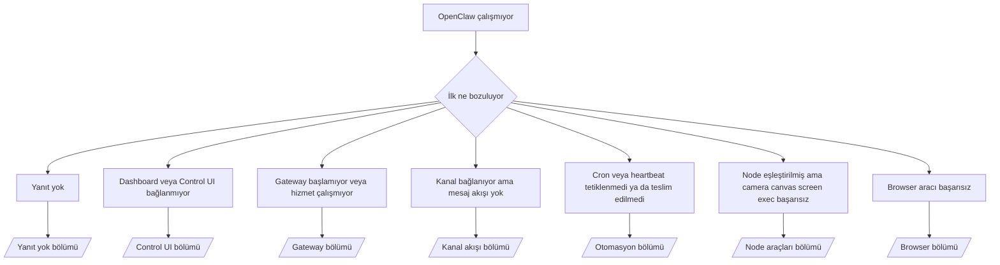

---
read_when:
    - OpenClaw çalışmıyor ve bir çözüme giden en hızlı yolu istiyorsunuz
    - Derin runbook'lara dalmadan önce bir ön inceleme akışı istiyorsunuz
summary: OpenClaw için belirti odaklı ilk sorun giderme merkezi
title: Genel Sorun Giderme
x-i18n:
    generated_at: "2026-04-05T13:56:09Z"
    model: gpt-5.4
    provider: openai
    source_hash: 23ae9638af5edf5a5e0584ccb15ba404223ac3b16c2d62eb93b2c9dac171c252
    source_path: help/troubleshooting.md
    workflow: 15
---

# Sorun Giderme

Yalnızca 2 dakikanız varsa bu sayfayı ön inceleme giriş noktası olarak kullanın.

## İlk 60 saniye

Aşağıdaki tam sırayı aynen çalıştırın:

```bash
openclaw status
openclaw status --all
openclaw gateway probe
openclaw gateway status
openclaw doctor
openclaw channels status --probe
openclaw logs --follow
```

İyi çıktı tek satırda şöyle görünür:

- `openclaw status` → yapılandırılmış kanalları ve belirgin auth hatası olmadığını gösterir.
- `openclaw status --all` → tam rapor mevcuttur ve paylaşılabilir.
- `openclaw gateway probe` → beklenen gateway hedefine erişilebilir (`Reachable: yes`). `RPC: limited - missing scope: operator.read`, bozulmuş tanılamadır; bağlantı hatası değildir.
- `openclaw gateway status` → `Runtime: running` ve `RPC probe: ok`.
- `openclaw doctor` → engelleyici config/hizmet hatası yok.
- `openclaw channels status --probe` → erişilebilir gateway, hesap başına canlı taşıma durumunu ve `works` veya `audit ok` gibi probe/denetim sonuçlarını döndürür; gateway'e erişilemiyorsa komut yalnızca config özetlerine geri düşer.
- `openclaw logs --follow` → istikrarlı etkinlik, tekrar eden ölümcül hata yok.

## Anthropic uzun bağlam 429

Şunu görürseniz:
`HTTP 429: rate_limit_error: Extra usage is required for long context requests`,
şuraya gidin: [/gateway/troubleshooting#anthropic-429-extra-usage-required-for-long-context](/gateway/troubleshooting#anthropic-429-extra-usage-required-for-long-context).

## Plugin yüklemesi eksik openclaw extensions nedeniyle başarısız oluyor

Yükleme `package.json missing openclaw.extensions` ile başarısız olursa plugin paketi,
OpenClaw'ın artık kabul etmediği eski bir biçim kullanıyordur.

Plugin paketindeki düzeltme:

1. `package.json` içine `openclaw.extensions` ekleyin.
2. Girdileri derlenmiş çalışma zamanı dosyalarına yönlendirin (genellikle `./dist/index.js`).
3. Plugin'i yeniden yayımlayın ve `openclaw plugins install <package>` komutunu tekrar çalıştırın.

Örnek:

```json
{
  "name": "@openclaw/my-plugin",
  "version": "1.2.3",
  "openclaw": {
    "extensions": ["./dist/index.js"]
  }
}
```

Başvuru: [Plugin architecture](/plugins/architecture)

## Karar ağacı



<AccordionGroup>
  <Accordion title="Yanıt yok">
    ```bash
    openclaw status
    openclaw gateway status
    openclaw channels status --probe
    openclaw pairing list --channel <channel> [--account <id>]
    openclaw logs --follow
    ```

    İyi çıktı şöyle görünür:

    - `Runtime: running`
    - `RPC probe: ok`
    - Kanalınızda taşıma bağlantısı görünür ve desteklendiği yerlerde `channels status --probe` içinde `works` veya `audit ok` görünür
    - Gönderici onaylanmış görünür (veya DM ilkesi açık/allowlist'tedir)

    Yaygın günlük imzaları:

    - `drop guild message (mention required` → Discord'da mention geçidi mesajı engelledi.
    - `pairing request` → gönderici onaylanmamış ve DM eşleştirme onayı bekliyor.
    - Kanal günlüklerinde `blocked` / `allowlist` → gönderici, oda veya grup filtrelenmiş.

    Derin sayfalar:

    - [/gateway/troubleshooting#no-replies](/gateway/troubleshooting#no-replies)
    - [/channels/troubleshooting](/tr/channels/troubleshooting)
    - [/channels/pairing](/tr/channels/pairing)

  </Accordion>

  <Accordion title="Dashboard veya Control UI bağlanmıyor">
    ```bash
    openclaw status
    openclaw gateway status
    openclaw logs --follow
    openclaw doctor
    openclaw channels status --probe
    ```

    İyi çıktı şöyle görünür:

    - `openclaw gateway status` içinde `Dashboard: http://...` gösterilir
    - `RPC probe: ok`
    - Günlüklerde auth döngüsü yok

    Yaygın günlük imzaları:

    - `device identity required` → HTTP/güvenli olmayan bağlam cihaz auth işlemini tamamlayamıyor.
    - `origin not allowed` → tarayıcı `Origin` değeri, Control UI gateway hedefi için izinli değil.
    - Yeniden deneme ipuçlarıyla birlikte `AUTH_TOKEN_MISMATCH` (`canRetryWithDeviceToken=true`) → güvenilir cihaz token'ı ile bir yeniden deneme otomatik olarak gerçekleşebilir.
    - Bu önbelleğe alınmış token yeniden denemesi, eşleştirilmiş cihaz token'ı ile saklanan önbelleğe alınmış kapsam kümesini yeniden kullanır. Açık `deviceToken` / açık `scopes` çağıranları kendi istenen kapsam kümesini korur.
    - Eşzamansız Tailscale Serve Control UI yolunda, aynı `{scope, ip}` için başarısız denemeler, sınırlayıcı başarısızlığı kaydetmeden önce serileştirilir; bu yüzden eşzamanlı ikinci bir kötü yeniden deneme zaten `retry later` gösterebilir.
    - Bir localhost tarayıcı origin'inden `too many failed authentication attempts (retry later)` → aynı `Origin` içinden tekrarlanan başarısız denemeler geçici olarak kilitlenmiştir; başka bir localhost origin'i ayrı bir bucket kullanır.
    - Bu yeniden denemeden sonra tekrarlanan `unauthorized` → yanlış token/password, auth modu uyuşmazlığı veya eski eşleştirilmiş cihaz token'ı.
    - `gateway connect failed:` → UI yanlış URL/portu hedefliyor veya gateway erişilemez durumda.

    Derin sayfalar:

    - [/gateway/troubleshooting#dashboard-control-ui-connectivity](/gateway/troubleshooting#dashboard-control-ui-connectivity)
    - [/web/control-ui](/web/control-ui)
    - [/gateway/authentication](/gateway/authentication)

  </Accordion>

  <Accordion title="Gateway başlamıyor veya hizmet kurulu ama çalışmıyor">
    ```bash
    openclaw status
    openclaw gateway status
    openclaw logs --follow
    openclaw doctor
    openclaw channels status --probe
    ```

    İyi çıktı şöyle görünür:

    - `Service: ... (loaded)`
    - `Runtime: running`
    - `RPC probe: ok`

    Yaygın günlük imzaları:

    - `Gateway start blocked: set gateway.mode=local` veya `existing config is missing gateway.mode` → gateway modu remote ya da config dosyasında local-mode damgası eksik ve onarılması gerekiyor.
    - `refusing to bind gateway ... without auth` → geçerli gateway auth yolu olmadan loopback olmayan bind (token/password veya uygun şekilde yapılandırılmış trusted-proxy).
    - `another gateway instance is already listening` veya `EADDRINUSE` → port zaten kullanımda.

    Derin sayfalar:

    - [/gateway/troubleshooting#gateway-service-not-running](/gateway/troubleshooting#gateway-service-not-running)
    - [/gateway/background-process](/gateway/background-process)
    - [/gateway/configuration](/gateway/configuration)

  </Accordion>

  <Accordion title="Kanal bağlanıyor ama mesaj akışı yok">
    ```bash
    openclaw status
    openclaw gateway status
    openclaw logs --follow
    openclaw doctor
    openclaw channels status --probe
    ```

    İyi çıktı şöyle görünür:

    - Kanal taşıması bağlı.
    - Eşleştirme/allowlist denetimleri geçiyor.
    - Gerektiği yerde mention'lar algılanıyor.

    Yaygın günlük imzaları:

    - `mention required` → grup mention geçidi işlemeyi engelledi.
    - `pairing` / `pending` → DM göndericisi henüz onaylanmadı.
    - `not_in_channel`, `missing_scope`, `Forbidden`, `401/403` → kanal izin/token sorunu.

    Derin sayfalar:

    - [/gateway/troubleshooting#channel-connected-messages-not-flowing](/gateway/troubleshooting#channel-connected-messages-not-flowing)
    - [/channels/troubleshooting](/tr/channels/troubleshooting)

  </Accordion>

  <Accordion title="Cron veya heartbeat tetiklenmedi ya da teslim edilmedi">
    ```bash
    openclaw status
    openclaw gateway status
    openclaw cron status
    openclaw cron list
    openclaw cron runs --id <jobId> --limit 20
    openclaw logs --follow
    ```

    İyi çıktı şöyle görünür:

    - `cron.status`, etkin olduğunu ve bir sonraki uyandırmayı gösterir.
    - `cron runs`, son `ok` girdilerini gösterir.
    - Heartbeat etkindir ve etkin saatlerin dışında değildir.

    Yaygın günlük imzaları:

- `cron: scheduler disabled; jobs will not run automatically` → cron devre dışı.
- `heartbeat skipped` ve `reason=quiet-hours` → yapılandırılmış etkin saatlerin dışında.
- `heartbeat skipped` ve `reason=empty-heartbeat-file` → `HEARTBEAT.md` var ama yalnızca boş/başlık iskeleti içeriyor.
- `heartbeat skipped` ve `reason=no-tasks-due` → `HEARTBEAT.md` görev modu etkin ama görev aralıklarının hiçbiri henüz vadesi gelmemiş.
- `heartbeat skipped` ve `reason=alerts-disabled` → tüm heartbeat görünürlüğü kapalı (`showOk`, `showAlerts` ve `useIndicator` kapalı).
- `requests-in-flight` → ana hat meşgul; heartbeat uyandırması ertelendi.
- `unknown accountId` → heartbeat teslim hedefi hesabı mevcut değil.

      Derin sayfalar:

      - [/gateway/troubleshooting#cron-and-heartbeat-delivery](/gateway/troubleshooting#cron-and-heartbeat-delivery)
      - [/automation/cron-jobs#troubleshooting](/tr/automation/cron-jobs#troubleshooting)
      - [/gateway/heartbeat](/gateway/heartbeat)

    </Accordion>

    <Accordion title="Node eşleştirilmiş ama araç camera canvas screen exec başarısız oluyor">
      ```bash
      openclaw status
      openclaw gateway status
      openclaw nodes status
      openclaw nodes describe --node <idOrNameOrIp>
      openclaw logs --follow
      ```

      İyi çıktı şöyle görünür:

      - Node, `node` rolü için bağlı ve eşleştirilmiş olarak listelenir.
      - Çağırdığınız komut için capability vardır.
      - Araç için izin durumu verilmiş durumdadır.

      Yaygın günlük imzaları:

      - `NODE_BACKGROUND_UNAVAILABLE` → node uygulamasını ön plana getirin.
      - `*_PERMISSION_REQUIRED` → OS izni reddedilmiş/eksik.
      - `SYSTEM_RUN_DENIED: approval required` → exec onayı beklemede.
      - `SYSTEM_RUN_DENIED: allowlist miss` → komut exec allowlist'inde değil.

      Derin sayfalar:

      - [/gateway/troubleshooting#node-paired-tool-fails](/gateway/troubleshooting#node-paired-tool-fails)
      - [/nodes/troubleshooting](/nodes/troubleshooting)
      - [/tools/exec-approvals](/tools/exec-approvals)

    </Accordion>

    <Accordion title="Exec aniden onay istemeye başladı">
      ```bash
      openclaw config get tools.exec.host
      openclaw config get tools.exec.security
      openclaw config get tools.exec.ask
      openclaw gateway restart
      ```

      Ne değişti:

      - `tools.exec.host` ayarlanmamışsa varsayılan `auto` olur.
      - `host=auto`, sandbox çalışma zamanı etkinse `sandbox`, aksi halde `gateway` olarak çözülür.
      - `host=auto` yalnızca yönlendirmedir; istemsiz "YOLO" davranışı gateway/node üzerinde `security=full` + `ask=off` ile gelir.
      - `gateway` ve `node` üzerinde, ayarlanmamış `tools.exec.security` varsayılanı `full` olur.
      - Ayarlanmamış `tools.exec.ask` varsayılanı `off` olur.
      - Sonuç: onay görüyorsanız bazı host-local veya oturum başına ilkeler exec'i geçerli varsayılanlardan daha sıkı hâle getirmiştir.

      Geçerli varsayılan onaysız davranışı geri yükleyin:

      ```bash
      openclaw config set tools.exec.host gateway
      openclaw config set tools.exec.security full
      openclaw config set tools.exec.ask off
      openclaw gateway restart
      ```

      Daha güvenli alternatifler:

      - Yalnızca kararlı host yönlendirmesi istiyorsanız sadece `tools.exec.host=gateway` ayarlayın.
      - Host exec istiyor ama allowlist dışı durumlarda yine de gözden geçirme istiyorsanız `security=allowlist` ile `ask=on-miss` kullanın.
      - `host=auto` değerinin yeniden `sandbox` olarak çözülmesini istiyorsanız sandbox modunu etkinleştirin.

      Yaygın günlük imzaları:

      - `Approval required.` → komut `/approve ...` bekliyor.
      - `SYSTEM_RUN_DENIED: approval required` → node-host exec onayı beklemede.
      - `exec host=sandbox requires a sandbox runtime for this session` → örtük/açık sandbox seçimi var ama sandbox modu kapalı.

      Derin sayfalar:

      - [/tools/exec](/tools/exec)
      - [/tools/exec-approvals](/tools/exec-approvals)
      - [/gateway/security#runtime-expectation-drift](/gateway/security#runtime-expectation-drift)

    </Accordion>

    <Accordion title="Browser aracı başarısız oluyor">
      ```bash
      openclaw status
      openclaw gateway status
      openclaw browser status
      openclaw logs --follow
      openclaw doctor
      ```

      İyi çıktı şöyle görünür:

      - Browser durumu `running: true` ve seçilmiş bir browser/profile gösterir.
      - `openclaw` başlar veya `user` yerel Chrome sekmelerini görebilir.

      Yaygın günlük imzaları:

      - `unknown command "browser"` veya `unknown command 'browser'` → `plugins.allow` ayarlanmış ve `browser` içermiyor.
      - `Failed to start Chrome CDP on port` → yerel browser başlatma başarısız oldu.
      - `browser.executablePath not found` → yapılandırılmış ikili dosya yolu yanlış.
      - `browser.cdpUrl must be http(s) or ws(s)` → yapılandırılmış CDP URL'si desteklenmeyen bir şema kullanıyor.
      - `browser.cdpUrl has invalid port` → yapılandırılmış CDP URL'sinde kötü veya geçersiz aralıkta bir port var.
      - `No Chrome tabs found for profile="user"` → Chrome MCP attach profilinde açık yerel Chrome sekmesi yok.
      - `Remote CDP for profile "<name>" is not reachable` → yapılandırılmış uzak CDP uç noktasına bu host'tan erişilemiyor.
      - `Browser attachOnly is enabled ... not reachable` veya `Browser attachOnly is enabled and CDP websocket ... is not reachable` → attach-only profilinde canlı CDP hedefi yok.
      - attach-only veya uzak CDP profillerinde eski viewport / dark-mode / locale / offline geçersiz kılmaları → gateway'i yeniden başlatmadan etkin kontrol oturumunu kapatmak ve öykünme durumunu serbest bırakmak için `openclaw browser stop --browser-profile <name>` çalıştırın.

      Derin sayfalar:

      - [/gateway/troubleshooting#browser-tool-fails](/gateway/troubleshooting#browser-tool-fails)
      - [/tools/browser#missing-browser-command-or-tool](/tools/browser#missing-browser-command-or-tool)
      - [/tools/browser-linux-troubleshooting](/tools/browser-linux-troubleshooting)
      - [/tools/browser-wsl2-windows-remote-cdp-troubleshooting](/tools/browser-wsl2-windows-remote-cdp-troubleshooting)

    </Accordion>
  </AccordionGroup>

## İlgili

- [FAQ](/help/faq) — sık sorulan sorular
- [Gateway Troubleshooting](/gateway/troubleshooting) — gateway'e özgü sorunlar
- [Doctor](/gateway/doctor) — otomatik sağlık denetimleri ve onarımlar
- [Channel Troubleshooting](/tr/channels/troubleshooting) — kanal bağlantı sorunları
- [Automation Troubleshooting](/tr/automation/cron-jobs#troubleshooting) — cron ve heartbeat sorunları
