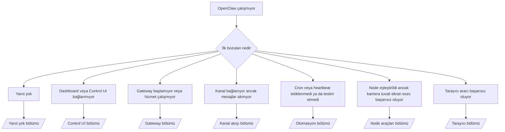

---
read_when:
    - OpenClaw çalışmıyor ve düzeltmeye giden en hızlı yola ihtiyacınız var
    - Ayrıntılı çalıştırma kılavuzlarına geçmeden önce bir triyaj akışı istiyorsunuz
summary: OpenClaw için belirti odaklı sorun giderme merkezi
title: Genel sorun giderme
x-i18n:
    generated_at: "2026-06-28T00:42:39Z"
    model: gpt-5.5
    postprocess_version: locale-links-v1
    provider: openai
    source_hash: ae1236c73e3a5c9237bd81d603e8dca18c595a8bcbb71f5931bfbf2389b342cd
    source_path: help/troubleshooting.md
    workflow: 16
---

Yalnızca 2 dakikanız varsa, bu sayfayı triyaj giriş kapısı olarak kullanın.

## İlk 60 saniye

Bu tam basamağı sırayla çalıştırın:

```bash
openclaw status
openclaw status --all
openclaw gateway probe
openclaw gateway status
openclaw doctor
openclaw channels status --probe
openclaw logs --follow
```

Tek satırda iyi çıktı:

- `openclaw status` → yapılandırılmış kanalları gösterir ve belirgin kimlik doğrulama hatası yoktur.
- `openclaw status --all` → tam rapor mevcuttur ve paylaşılabilir.
- `openclaw gateway probe` → beklenen Gateway hedefi erişilebilirdir (`Reachable: yes`). `Capability: ...`, sondanın hangi kimlik doğrulama düzeyini kanıtlayabildiğini söyler ve `Read probe: limited - missing scope: operator.read` bağlantı hatası değil, zayıflamış tanılamadır.
- `openclaw gateway status` → `Runtime: running`, `Connectivity probe: ok` ve makul bir `Capability: ...` satırı. Okuma kapsamlı RPC kanıtına da ihtiyacınız varsa `--require-rpc` kullanın.
- `openclaw doctor` → engelleyici yapılandırma/hizmet hatası yoktur.
- `openclaw channels status --probe` → erişilebilir Gateway, canlı hesap başına
  taşıma durumunu ve `works` veya `audit ok` gibi sonda/denetim sonuçlarını döndürür; Gateway
  erişilemezse komut yalnızca yapılandırma özetlerine geri döner.
- `openclaw logs --follow` → düzenli etkinlik, tekrarlayan ölümcül hata yok.

## Asistan sınırlı hissediyor veya araçlar eksik

Asistan dosyaları inceleyemiyor, komut çalıştıramıyor, tarayıcı otomasyonu kullanamıyor veya
beklenen araçları göremiyorsa, önce geçerli araç profilini kontrol edin:

```bash
openclaw status
openclaw status --all
openclaw doctor
```

Yaygın nedenler:

- `tools.profile: "messaging"` yalnızca sohbet ajanları için kasıtlı olarak dardır.
- `tools.profile: "coding"` depo, dosya, kabuk ve çalışma zamanı iş akışları için
  olağan profildir.
- `tools.profile: "full"` en geniş araç kümesini açar ve güvenilir operatör denetimli
  ajanlarla sınırlı olmalıdır.
- Ajan başına `agents.list[].tools` geçersiz kılmaları, bir ajan için kök
  profili daraltabilir veya genişletebilir.

Kök veya ajan başına araç profilini değiştirin, ardından Gateway’i yeniden başlatın veya yeniden yükleyin
ve `openclaw status --all` komutunu tekrar çalıştırın. Profil modeli ve izin/verme engelleme geçersiz kılmaları için [Araçlar](/tr/tools) bölümüne bakın.

## Anthropic uzun bağlam 429

Şunu görürseniz:
`HTTP 429: rate_limit_error: Extra usage is required for long context requests`,
[/gateway/troubleshooting#anthropic-429-extra-usage-required-for-long-context](/tr/gateway/troubleshooting#anthropic-429-extra-usage-required-for-long-context) bölümüne gidin.

## Yerel OpenAI uyumlu arka uç doğrudan çalışıyor ancak OpenClaw’da başarısız oluyor

Yerel veya kendi barındırdığınız `/v1` arka ucunuz küçük doğrudan
`/v1/chat/completions` sondalarına yanıt veriyor ancak `openclaw infer model run` ya da normal
ajan dönüşlerinde başarısız oluyorsa:

1. Hata, `messages[].content` için string beklendiğinden söz ediyorsa,
   `models.providers.<provider>.models[].compat.requiresStringContent: true` ayarlayın.
2. Arka uç hâlâ yalnızca OpenClaw ajan dönüşlerinde başarısız oluyorsa,
   `models.providers.<provider>.models[].compat.supportsTools: false` ayarlayın ve yeniden deneyin.
3. Küçük doğrudan çağrılar hâlâ çalışıyor ancak daha büyük OpenClaw istemleri
   arka ucu çökertiyorsa, kalan sorunu yukarı akış model/sunucu sınırlaması olarak değerlendirin ve
   ayrıntılı runbook ile devam edin:
   [/gateway/troubleshooting#local-openai-compatible-backend-passes-direct-probes-but-agent-runs-fail](/tr/gateway/troubleshooting#local-openai-compatible-backend-passes-direct-probes-but-agent-runs-fail)

## Plugin kurulumu eksik openclaw extensions ile başarısız oluyor

Kurulum `package.json missing openclaw.extensions` ile başarısız oluyorsa, plugin paketi
OpenClaw’ın artık kabul etmediği eski bir şekil kullanıyordur.

Plugin paketinde düzeltin:

1. `package.json` dosyasına `openclaw.extensions` ekleyin.
2. Girdileri derlenmiş çalışma zamanı dosyalarına yönlendirin (genellikle `./dist/index.js`).
3. Plugin’i yeniden yayımlayın ve `openclaw plugins install <package>` komutunu tekrar çalıştırın.

Örnek:

```json
{
  "name": "@openclaw/my-plugin",
  "version": "1.2.3",
  "openclaw": {
    "extensions": ["./dist/index.js"]
  }
}
```

Başvuru: [Plugin mimarisi](/tr/plugins/architecture)

## Kurulum ilkesi plugin kurulumlarını veya güncellemelerini engelliyor

Bir güncelleme tamamlanıyor ancak plugin’ler eski kalıyor, devre dışı bırakılıyor veya
`blocked by install policy`, `install policy failed closed` ya da
`Disabled "<plugin>" after plugin update failure` gibi iletiler gösteriyorsa,
`security.installPolicy` değerini kontrol edin.

Kurulum ilkesi, plugin kurulumlarında ve güncellemelerinde çalışır. OpenClaw’a ait plugin
sürümleri normalde OpenClaw sürümüyle birlikte ilerler; bu nedenle bir OpenClaw güncellemesi,
güncelleme sonrası eşitleme sırasında eşleşen `@openclaw/*` plugin güncellemelerini de
gerektirebilir.

Eşleşen yükseltme kuralını da sürdürmüyorsanız bu geniş ilke şekillerinden kaçının:

- OpenClaw’a ait plugin’leri tek bir tam eski sürüme dondurmak; örneğin yalnızca
  `@openclaw/*@2026.5.3` sürümüne izin vermek.
- Yalnızca kaynak türüne göre engellemek; örneğin her npm, ağ veya
  `request.mode: "update"` plugin isteği.
- İlke komutunu isteğe bağlı kabul etmek. `security.installPolicy`
  etkinleştirildiğinde eksik, yavaş, okunamayan veya izin tarafından engellenen bir ilke yürütülebiliri
  kapalı başarısız olur.
- İlke isteğinin `openclawVersion` değerini ve plugin aday meta verilerini
  dikkate almadan plugin sürümlerini onaylamak.

Daha güvenli ilke kuralları, tek bir sürümü sonsuza kadar sabitlemek yerine
aday geçerli OpenClaw ana bilgisayarıyla uyumlu olduğunda güvenilir OpenClaw’a ait plugin güncellemelerine izin verir. npm’i varsayılan olarak engelliyorsanız, kullandığınız güvenilir `@openclaw/*` plugin paketleri veya plugin kimlikleri için dar bir istisna tanımlayın. Kurulum ve güncelleme isteklerini
ayırıyorsanız, aynı güven kuralını `request.mode: "update"` için uygulayın.

Kurtarma:

```bash
openclaw doctor --deep
openclaw plugins update --all
openclaw status --all
```

İlke kasıtlı olarak katıysa, güvenilir OpenClaw yükseltme
penceresi için gevşetin, `openclaw plugins update --all` komutunu yeniden çalıştırın, ardından daha katı kuralı geri yükleyin.
Bir plugin güncelleme hatasından sonra devre dışı bırakıldıysa, inceleyin ve yalnızca
güncelleme başarılı olduktan sonra yeniden etkinleştirin:

```bash
openclaw plugins inspect <plugin-id> --runtime --json
openclaw plugins enable <plugin-id>
```

Başvuru: [Operatör kurulum ilkesi](/tr/tools/skills-config#operator-install-policy-securityinstallpolicy)

## Plugin var ancak şüpheli sahiplik nedeniyle engellendi

`openclaw doctor`, kurulum veya başlangıç uyarıları şunu gösteriyorsa:

```text
blocked plugin candidate: suspicious ownership (... uid=1000, expected uid=0 or root)
plugin present but blocked
```

Plugin dosyaları, onları yükleyen süreçten farklı bir Unix kullanıcısına aittir. Plugin yapılandırmasını kaldırmayın. Dosya sahipliğini düzeltin veya OpenClaw’u durum dizininin sahibi olan aynı kullanıcıyla çalıştırın.

Docker kurulumları normalde `node` (uid `1000`) olarak çalışır. Varsayılan Docker kurulumu için ana makine bağlama noktalarını onarın:

```bash
sudo chown -R 1000:1000 /path/to/openclaw-config /path/to/openclaw-workspace
openclaw doctor --fix
```

OpenClaw’u bilinçli olarak root olarak çalıştırıyorsanız, bunun yerine yönetilen Plugin kökünü root sahipliğiyle onarın:

```bash
sudo chown -R root:root /path/to/openclaw-config/npm
openclaw doctor --fix
```

Daha ayrıntılı belgeler:

- [Plugin yolu sahipliği](/tr/tools/plugin#blocked-plugin-path-ownership)
- [Docker izinleri](/tr/install/docker#permissions-and-eacces)

## Karar ağacı



<AccordionGroup>
  <Accordion title="Yanıt yok">
    ```bash
    openclaw status
    openclaw gateway status
    openclaw channels status --probe
    openclaw pairing list --channel <channel> [--account <id>]
    openclaw logs --follow
    ```

    İyi çıktı şöyle görünür:

    - `Runtime: running`
    - `Connectivity probe: ok`
    - `Capability: read-only`, `write-capable` veya `admin-capable`
    - Kanalınız aktarımın bağlı olduğunu ve desteklenen yerlerde `channels status --probe` içinde `works` veya `audit ok` gösterir
    - Gönderen onaylı görünür (veya DM ilkesi açık/izin listesindedir)

    Yaygın günlük imzaları:

    - `drop guild message (mention required` → bahsetme geçidi Discord’da mesajı engelledi.
    - `pairing request` → gönderen onaylanmamış ve DM eşleştirme onayı bekliyor.
    - Kanal günlüklerinde `blocked` / `allowlist` → gönderen, oda veya grup filtrelenmiş.

    Derin sayfalar:

    - [/gateway/troubleshooting#no-replies](/tr/gateway/troubleshooting#no-replies)
    - [/channels/troubleshooting](/tr/channels/troubleshooting)
    - [/channels/pairing](/tr/channels/pairing)

  </Accordion>

  <Accordion title="Dashboard veya Control UI bağlanmıyor">
    ```bash
    openclaw status
    openclaw gateway status
    openclaw logs --follow
    openclaw doctor
    openclaw channels status --probe
    ```

    İyi çıktı şöyle görünür:

    - `Dashboard: http://...`, `openclaw gateway status` içinde gösterilir
    - `Connectivity probe: ok`
    - `Capability: read-only`, `write-capable` veya `admin-capable`
    - Günlüklerde kimlik doğrulama döngüsü yok

    Yaygın günlük imzaları:

    - `device identity required` → HTTP/güvenli olmayan bağlam cihaz kimlik doğrulamasını tamamlayamaz.
    - `origin not allowed` → tarayıcı `Origin`, Control UI
      Gateway hedefi için izinli değil.
    - Yeniden deneme ipuçlarıyla (`canRetryWithDeviceToken=true`) `AUTH_TOKEN_MISMATCH` → güvenilen bir cihaz belirteciyle tek bir yeniden deneme otomatik olarak gerçekleşebilir.
    - Bu önbelleğe alınmış belirteç yeniden denemesi, eşleştirilmiş
      cihaz belirteciyle saklanan önbelleğe alınmış kapsam kümesini yeniden kullanır. Açık `deviceToken` / açık `scopes` çağıranları ise
      istedikleri kapsam kümesini korur.
    - Eşzamansız Tailscale Serve Control UI yolunda, aynı
      `{scope, ip}` için başarısız denemeler, sınırlayıcı başarısızlığı kaydetmeden önce sıraya alınır; bu yüzden ikinci bir eşzamanlı hatalı yeniden deneme zaten `retry later` gösterebilir.
    - Bir localhost
      tarayıcı kökeninden `too many failed authentication attempts (retry later)` → aynı `Origin` üzerinden tekrarlanan başarısızlıklar geçici olarak
      kilitlenir; başka bir localhost kökeni ayrı bir kova kullanır.
    - Bu yeniden denemeden sonra tekrarlanan `unauthorized` → yanlış belirteç/parola, kimlik doğrulama modu uyumsuzluğu veya eski eşleştirilmiş cihaz belirteci.
    - `gateway connect failed:` → UI yanlış URL/portu hedefliyor veya Gateway erişilemez.

    Derin sayfalar:

    - [/gateway/troubleshooting#dashboard-control-ui-connectivity](/tr/gateway/troubleshooting#dashboard-control-ui-connectivity)
    - [/web/control-ui](/tr/web/control-ui)
    - [/gateway/authentication](/tr/gateway/authentication)

  </Accordion>

  <Accordion title="Gateway başlamıyor veya hizmet yüklü ama çalışmıyor">
    ```bash
    openclaw status
    openclaw gateway status
    openclaw logs --follow
    openclaw doctor
    openclaw channels status --probe
    ```

    İyi çıktı şöyle görünür:

    - `Service: ... (loaded)`
    - `Runtime: running`
    - `Connectivity probe: ok`
    - `Capability: read-only`, `write-capable` veya `admin-capable`

    Yaygın günlük imzaları:

    - `Gateway start blocked: set gateway.mode=local` veya `existing config is missing gateway.mode` → Gateway modu uzakta, ya da yapılandırma dosyasında yerel mod damgası eksik ve onarılmalı.
    - `refusing to bind gateway ... without auth` → geçerli bir Gateway kimlik doğrulama yolu (belirteç/parola veya yapılandırılmışsa güvenilen proxy) olmadan local loopback dışı bağlama.
    - `another gateway instance is already listening` veya `EADDRINUSE` → port zaten alınmış.

    Derin sayfalar:

    - [/gateway/troubleshooting#gateway-service-not-running](/tr/gateway/troubleshooting#gateway-service-not-running)
    - [/gateway/background-process](/tr/gateway/background-process)
    - [/gateway/configuration](/tr/gateway/configuration)

  </Accordion>

  <Accordion title="Kanal bağlanıyor ancak mesajlar akmıyor">
    ```bash
    openclaw status
    openclaw gateway status
    openclaw logs --follow
    openclaw doctor
    openclaw channels status --probe
    ```

    İyi çıktı şöyle görünür:

    - Kanal taşıması bağlıdır.
    - Eşleştirme/izin listesi denetimleri geçer.
    - Gerekli yerlerde bahsetmeler algılanır.

    Yaygın günlük imzaları:

    - `mention required` → grup bahsetme kapısı işlemeyi engelledi.
    - `pairing` / `pending` → DM göndereni henüz onaylanmadı.
    - `not_in_channel`, `missing_scope`, `Forbidden`, `401/403` → kanal izin belirteci sorunu.

    Derin sayfalar:

    - [/gateway/troubleshooting#channel-connected-messages-not-flowing](/tr/gateway/troubleshooting#channel-connected-messages-not-flowing)
    - [/channels/troubleshooting](/tr/channels/troubleshooting)

  </Accordion>

  <Accordion title="Cron veya heartbeat tetiklenmedi ya da teslim edilmedi">
    ```bash
    openclaw status
    openclaw gateway status
    openclaw cron status
    openclaw cron list
    openclaw cron runs --id <jobId> --limit 20
    openclaw logs --follow
    ```

    İyi çıktı şöyle görünür:

    - `cron.status`, sonraki uyanma ile etkin olduğunu gösterir.
    - `cron runs`, yakın tarihli `ok` girdilerini gösterir.
    - Heartbeat etkindir ve etkin saatlerin dışında değildir.

    Yaygın günlük imzaları:

    - `cron: scheduler disabled; jobs will not run automatically` → cron devre dışıdır.
    - `heartbeat skipped` ile `reason=quiet-hours` → yapılandırılmış etkin saatlerin dışında.
    - `heartbeat skipped` ile `reason=empty-heartbeat-file` → `HEARTBEAT.md` var ancak yalnızca boş, yorum, başlık, çit veya boş kontrol listesi iskeleti içeriyor.
    - `heartbeat skipped` ile `reason=no-tasks-due` → `HEARTBEAT.md` görev modu etkin ancak görev aralıklarının hiçbiri henüz gelmedi.
    - `heartbeat skipped` ile `reason=alerts-disabled` → tüm heartbeat görünürlüğü devre dışı (`showOk`, `showAlerts` ve `useIndicator` tamamen kapalı).
    - `requests-in-flight` → ana hat meşgul; heartbeat uyanması ertelendi.
    - `unknown accountId` → heartbeat teslim hedefi hesabı yok.

    Derin sayfalar:

    - [/gateway/troubleshooting#cron-and-heartbeat-delivery](/tr/gateway/troubleshooting#cron-and-heartbeat-delivery)
    - [/automation/cron-jobs#troubleshooting](/tr/automation/cron-jobs#troubleshooting)
    - [/gateway/heartbeat](/tr/gateway/heartbeat)

  </Accordion>

  <Accordion title="Node eşlendi ancak kamera canvas ekran exec aracı başarısız oluyor">
    ```bash
    openclaw status
    openclaw gateway status
    openclaw nodes status
    openclaw nodes describe --node <idOrNameOrIp>
    openclaw logs --follow
    ```

    İyi çıktı şöyle görünür:

    - Node bağlı olarak listelenir ve `node` rolü için eşlenmiştir.
    - Çağırdığınız komut için yetenek vardır.
    - Araç için izin durumu verilmiştir.

    Yaygın günlük imzaları:

    - `NODE_BACKGROUND_UNAVAILABLE` → node uygulamasını ön plana getirin.
    - `*_PERMISSION_REQUIRED` → işletim sistemi izni reddedildi/eksik.
    - `SYSTEM_RUN_DENIED: approval required` → exec onayı beklemede.
    - `SYSTEM_RUN_DENIED: allowlist miss` → komut exec izin listesinde değil.

    Derin sayfalar:

    - [/gateway/troubleshooting#node-paired-tool-fails](/tr/gateway/troubleshooting#node-paired-tool-fails)
    - [/nodes/troubleshooting](/tr/nodes/troubleshooting)
    - [/tools/exec-approvals](/tr/tools/exec-approvals)

  </Accordion>

  <Accordion title="Exec aniden onay istiyor">
    ```bash
    openclaw config get tools.exec.host
    openclaw config get tools.exec.security
    openclaw config get tools.exec.ask
    openclaw gateway restart
    ```

    Ne değişti:

    - `tools.exec.host` ayarlanmamışsa varsayılan `auto` olur.
    - `host=auto`, sandbox çalışma zamanı etkinken `sandbox` değerine, aksi halde `gateway` değerine çözümlenir.
    - `host=auto` yalnızca yönlendirmedir; istemsiz "YOLO" davranışı Gateway/node üzerinde `security=full` ile `ask=off` birleşiminden gelir.
    - `gateway` ve `node` üzerinde, ayarlanmamış `tools.exec.security` varsayılan olarak `full` olur.
    - Ayarlanmamış `tools.exec.ask` varsayılan olarak `off` olur.
    - Sonuç: onaylar görüyorsanız, ana makineye yerel veya oturum başına bir politika exec'i mevcut varsayılanlardan daha sıkı hale getirmiştir.

    Mevcut varsayılan onaysız davranışı geri yükleyin:

    ```bash
    openclaw config set tools.exec.host gateway
    openclaw config set tools.exec.security full
    openclaw config set tools.exec.ask off
    openclaw gateway restart
    ```

    Daha güvenli alternatifler:

    - Yalnızca kararlı ana makine yönlendirmesi istiyorsanız sadece `tools.exec.host=gateway` ayarlayın.
    - Ana makine exec'i istiyor ancak izin listesi kaçırmalarında yine de inceleme istiyorsanız `ask=on-miss` ile `security=allowlist` kullanın.
    - `host=auto` değerinin yeniden `sandbox` değerine çözümlenmesini istiyorsanız sandbox modunu etkinleştirin.

    Yaygın günlük imzaları:

    - `Approval required.` → komut `/approve ...` bekliyor.
    - `SYSTEM_RUN_DENIED: approval required` → node ana makine exec onayı beklemede.
    - `exec host=sandbox requires a sandbox runtime for this session` → örtük/açık sandbox seçimi var ancak sandbox modu kapalı.

    Derin sayfalar:

    - [/tools/exec](/tr/tools/exec)
    - [/tools/exec-approvals](/tr/tools/exec-approvals)
    - [/gateway/security#what-the-audit-checks-high-level](/tr/gateway/security#what-the-audit-checks-high-level)

  </Accordion>

  <Accordion title="Tarayıcı aracı başarısız oluyor">
    ```bash
    openclaw status
    openclaw gateway status
    openclaw browser status
    openclaw logs --follow
    openclaw doctor
    ```

    İyi çıktı şöyle görünür:

    - Tarayıcı durumu `running: true` ve seçilmiş bir tarayıcı/profil gösterir.
    - `openclaw` başlar veya `user` yerel Chrome sekmelerini görebilir.

    Yaygın günlük imzaları:

    - `unknown command "browser"` veya `unknown command 'browser'` → `plugins.allow` ayarlanmış ve `browser` içermiyor.
    - `Failed to start Chrome CDP on port` → yerel tarayıcı başlatma başarısız oldu.
    - `browser.executablePath not found` → yapılandırılmış ikili dosya yolu yanlış.
    - `browser.cdpUrl must be http(s) or ws(s)` → yapılandırılmış CDP URL'si desteklenmeyen bir şema kullanıyor.
    - `browser.cdpUrl has invalid port` → yapılandırılmış CDP URL'sinde hatalı veya aralık dışında bir bağlantı noktası var.
    - `No Chrome tabs found for profile="user"` → Chrome MCP ekleme profilinde açık yerel Chrome sekmesi yok.
    - `Remote CDP for profile "<name>" is not reachable` → yapılandırılmış uzak CDP uç noktasına bu ana makineden ulaşılamıyor.
    - `Browser attachOnly is enabled ... not reachable` veya `Browser attachOnly is enabled and CDP websocket ... is not reachable` → yalnızca ekleme profilinde canlı CDP hedefi yok.
    - yalnızca ekleme veya uzak CDP profillerinde eski görünüm alanı / koyu mod / yerel ayar / çevrimdışı geçersiz kılmaları → etkin denetim oturumunu kapatmak ve gateway'i yeniden başlatmadan emülasyon durumunu serbest bırakmak için `openclaw browser stop --browser-profile <name>` çalıştırın.

    Derin sayfalar:

    - [/gateway/troubleshooting#browser-tool-fails](/tr/gateway/troubleshooting#browser-tool-fails)
    - [/tools/browser#missing-browser-command-or-tool](/tr/tools/browser#missing-browser-command-or-tool)
    - [/tools/browser-linux-troubleshooting](/tr/tools/browser-linux-troubleshooting)
    - [/tools/browser-wsl2-windows-remote-cdp-troubleshooting](/tr/tools/browser-wsl2-windows-remote-cdp-troubleshooting)

  </Accordion>

</AccordionGroup>

## İlgili

- [SSS](/tr/help/faq) — sık sorulan sorular
- [Gateway Sorun Giderme](/tr/gateway/troubleshooting) — gateway'e özgü sorunlar
- [Doctor](/tr/gateway/doctor) — otomatik sağlık denetimleri ve onarımlar
- [Kanal Sorun Giderme](/tr/channels/troubleshooting) — kanal bağlantı sorunları
- [Otomasyon Sorun Giderme](/tr/automation/cron-jobs#troubleshooting) — cron ve Heartbeat sorunları
