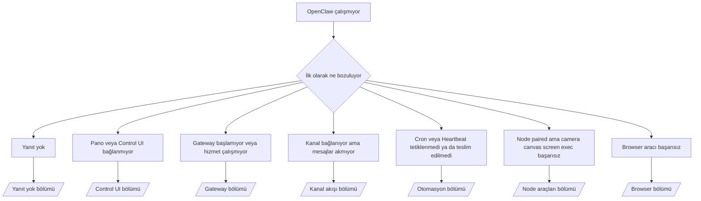

---
read_when:
    - OpenClaw çalışmıyor ve düzeltmeye giden en hızlı yola ihtiyacınız var
    - Derin runbook'lara dalmadan önce bir triyaj akışı istiyorsunuz
summary: OpenClaw için belirti öncelikli sorun giderme merkezi
title: Genel sorun giderme
x-i18n:
    generated_at: "2026-04-24T09:14:19Z"
    model: gpt-5.4
    provider: openai
    source_hash: c832c3f7609c56a5461515ed0f693d2255310bf2d3958f69f57c482bcbef97f0
    source_path: help/troubleshooting.md
    workflow: 15
---

Yalnızca 2 dakikanız varsa bu sayfayı triyaj için giriş noktası olarak kullanın.

## İlk 60 saniye

Bu tam sırayı aynen çalıştırın:

```bash
openclaw status
openclaw status --all
openclaw gateway probe
openclaw gateway status
openclaw doctor
openclaw channels status --probe
openclaw logs --follow
```

Tek satırda iyi çıktı:

- `openclaw status` → yapılandırılmış kanalları ve belirgin kimlik doğrulama hatalarının olmadığını gösterir.
- `openclaw status --all` → tam rapor mevcuttur ve paylaşılabilir.
- `openclaw gateway probe` → beklenen Gateway hedefine ulaşılabilir (`Reachable: yes`). `Capability: ...`, taramanın hangi kimlik doğrulama düzeyini kanıtlayabildiğini söyler; `Read probe: limited - missing scope: operator.read` ise bozulmuş tanılamadır, bağlantı başarısızlığı değildir.
- `openclaw gateway status` → `Runtime: running`, `Connectivity probe: ok` ve makul bir `Capability: ...` satırı. Okuma kapsamlı RPC kanıtına da ihtiyacınız varsa `--require-rpc` kullanın.
- `openclaw doctor` → engelleyici yapılandırma/hizmet hatası yok.
- `openclaw channels status --probe` → erişilebilir Gateway canlı hesap başına
  taşıma durumunu ve `works` veya `audit ok` gibi tarama/denetim sonuçlarını döndürür; Gateway'e ulaşılamıyorsa komut yalnızca yapılandırma özetlerine geri düşer.
- `openclaw logs --follow` → düzenli etkinlik, tekrar eden ölümcül hata yok.

## Anthropic uzun bağlam 429

Şunu görürseniz:
`HTTP 429: rate_limit_error: Extra usage is required for long context requests`,
şuraya gidin: [/gateway/troubleshooting#anthropic-429-extra-usage-required-for-long-context](/tr/gateway/troubleshooting#anthropic-429-extra-usage-required-for-long-context).

## Yerel OpenAI uyumlu arka uç doğrudan çalışıyor ama OpenClaw'da başarısız oluyor

Yerel veya kendi barındırdığınız `/v1` arka ucu küçük doğrudan
`/v1/chat/completions` taramalarına yanıt veriyor ama `openclaw infer model run` veya normal
ajan turlarında başarısız oluyorsa:

1. Hata `messages[].content` alanının dize beklediğini söylüyorsa
   `models.providers.<provider>.models[].compat.requiresStringContent: true` ayarlayın.
2. Arka uç yalnızca OpenClaw ajan turlarında hâlâ başarısız oluyorsa
   `models.providers.<provider>.models[].compat.supportsTools: false` ayarlayın ve yeniden deneyin.
3. Küçük doğrudan çağrılar hâlâ çalışıyor ama daha büyük OpenClaw istemleri
   arka ucu çökertiyorsa kalan sorunu bir yukarı akış model/sunucu sınırlaması olarak değerlendirin ve
   derin runbook'a geçin:
   [/gateway/troubleshooting#local-openai-compatible-backend-passes-direct-probes-but-agent-runs-fail](/tr/gateway/troubleshooting#local-openai-compatible-backend-passes-direct-probes-but-agent-runs-fail)

## Plugin yükleme openclaw extensions eksik hatasıyla başarısız oluyor

Yükleme `package.json missing openclaw.extensions` ile başarısız oluyorsa Plugin paketi,
OpenClaw'ın artık kabul etmediği eski bir biçim kullanıyordur.

Plugin paketinde düzeltme:

1. `package.json` dosyasına `openclaw.extensions` ekleyin.
2. Girdileri derlenmiş çalışma zamanı dosyalarına yönlendirin (genellikle `./dist/index.js`).
3. Plugin'i yeniden yayımlayın ve `openclaw plugins install <package>` komutunu tekrar çalıştırın.

Örnek:

```json
{
  "name": "@openclaw/my-plugin",
  "version": "1.2.3",
  "openclaw": {
    "extensions": ["./dist/index.js"]
  }
}
```

Başvuru: [Plugin architecture](/tr/plugins/architecture)

## Karar ağacı



<AccordionGroup>
  <Accordion title="Yanıt yok">
    ```bash
    openclaw status
    openclaw gateway status
    openclaw channels status --probe
    openclaw pairing list --channel <channel> [--account <id>]
    openclaw logs --follow
    ```

    İyi çıktı şöyle görünür:

    - `Runtime: running`
    - `Connectivity probe: ok`
    - `Capability: read-only`, `write-capable` veya `admin-capable`
    - Kanalınız taşıma bağlantısını gösterir ve desteklenen yerlerde `channels status --probe` içinde `works` veya `audit ok` görünür
    - Gönderen onaylı görünür (veya DM ilkesi open/allowlist'tir)

    Yaygın günlük imzaları:

    - `drop guild message (mention required` → mention geçitlemesi Discord'da mesajı engelledi.
    - `pairing request` → gönderen onaysız ve DM Pairing onayı bekliyor.
    - Kanal günlüklerinde `blocked` / `allowlist` → gönderen, oda veya grup filtrelenmiş.

    Derin sayfalar:

    - [/gateway/troubleshooting#no-replies](/tr/gateway/troubleshooting#no-replies)
    - [/channels/troubleshooting](/tr/channels/troubleshooting)
    - [/channels/pairing](/tr/channels/pairing)

  </Accordion>

  <Accordion title="Pano veya Control UI bağlanmıyor">
    ```bash
    openclaw status
    openclaw gateway status
    openclaw logs --follow
    openclaw doctor
    openclaw channels status --probe
    ```

    İyi çıktı şöyle görünür:

    - `Dashboard: http://...`, `openclaw gateway status` içinde gösterilir
    - `Connectivity probe: ok`
    - `Capability: read-only`, `write-capable` veya `admin-capable`
    - Günlüklerde kimlik doğrulama döngüsü yok

    Yaygın günlük imzaları:

    - `device identity required` → HTTP/güvenli olmayan bağlam cihaz kimlik doğrulamasını tamamlayamıyor.
    - `origin not allowed` → tarayıcı `Origin`, Control UI Gateway hedefi için izinli değil.
    - `AUTH_TOKEN_MISMATCH` ve yeniden deneme ipuçları (`canRetryWithDeviceToken=true`) → önbelleğe alınmış cihaz belirteciyle bir güvenilir yeniden deneme otomatik olarak gerçekleşebilir.
    - Bu önbelleğe alınmış belirteç yeniden denemesi, paired
      cihaz belirteciyle birlikte saklanan önbelleğe alınmış kapsam kümesini yeniden kullanır. Açık `deviceToken` / açık `scopes` çağıranlar kendi istedikleri kapsam kümesini korur.
    - Eşzamansız Tailscale Serve Control UI yolunda, aynı
      `{scope, ip}` için başarısız denemeler sınırlayıcı hatayı kaydetmeden önce serileştirilir; bu yüzden ikinci bir eşzamanlı kötü yeniden deneme zaten `retry later` gösterebilir.
    - localhost tarayıcı kaynağından gelen `too many failed authentication attempts (retry later)` → aynı `Origin` kaynağından gelen tekrarlı başarısızlıklar geçici olarak kilitlenmiştir; başka bir localhost kaynağı ayrı bir kova kullanır.
    - Bu yeniden denemeden sonra tekrarlanan `unauthorized` → yanlış token/parola, auth mode uyuşmazlığı veya eski paired cihaz belirteci.
    - `gateway connect failed:` → UI yanlış URL/portu hedefliyor veya Gateway'e ulaşılamıyor.

    Derin sayfalar:

    - [/gateway/troubleshooting#dashboard-control-ui-connectivity](/tr/gateway/troubleshooting#dashboard-control-ui-connectivity)
    - [/web/control-ui](/tr/web/control-ui)
    - [/gateway/authentication](/tr/gateway/authentication)

  </Accordion>

  <Accordion title="Gateway başlamıyor veya hizmet kurulu ama çalışmıyor">
    ```bash
    openclaw status
    openclaw gateway status
    openclaw logs --follow
    openclaw doctor
    openclaw channels status --probe
    ```

    İyi çıktı şöyle görünür:

    - `Service: ... (loaded)`
    - `Runtime: running`
    - `Connectivity probe: ok`
    - `Capability: read-only`, `write-capable` veya `admin-capable`

    Yaygın günlük imzaları:

    - `Gateway start blocked: set gateway.mode=local` veya `existing config is missing gateway.mode` → Gateway modu remote, ya da yapılandırma dosyasında local-mode damgası eksik ve onarılmalı.
    - `refusing to bind gateway ... without auth` → geçerli bir Gateway auth yolu olmadan loopback dışı bağlama (token/password veya yapılandırılmış yerde trusted-proxy).
    - `another gateway instance is already listening` veya `EADDRINUSE` → port zaten kullanımda.

    Derin sayfalar:

    - [/gateway/troubleshooting#gateway-service-not-running](/tr/gateway/troubleshooting#gateway-service-not-running)
    - [/gateway/background-process](/tr/gateway/background-process)
    - [/gateway/configuration](/tr/gateway/configuration)

  </Accordion>

  <Accordion title="Kanal bağlanıyor ama mesajlar akmıyor">
    ```bash
    openclaw status
    openclaw gateway status
    openclaw logs --follow
    openclaw doctor
    openclaw channels status --probe
    ```

    İyi çıktı şöyle görünür:

    - Kanal taşıması bağlıdır.
    - Pairing/allowlist kontrolleri geçer.
    - Gerekli olduğunda mention'lar algılanır.

    Yaygın günlük imzaları:

    - `mention required` → grup mention geçitlemesi işlemeyi engelledi.
    - `pairing` / `pending` → DM göndereni henüz onaylanmamış.
    - `not_in_channel`, `missing_scope`, `Forbidden`, `401/403` → kanal izin belirteci sorunu.

    Derin sayfalar:

    - [/gateway/troubleshooting#channel-connected-messages-not-flowing](/tr/gateway/troubleshooting#channel-connected-messages-not-flowing)
    - [/channels/troubleshooting](/tr/channels/troubleshooting)

  </Accordion>

  <Accordion title="Cron veya Heartbeat tetiklenmedi ya da teslim edilmedi">
    ```bash
    openclaw status
    openclaw gateway status
    openclaw cron status
    openclaw cron list
    openclaw cron runs --id <jobId> --limit 20
    openclaw logs --follow
    ```

    İyi çıktı şöyle görünür:

    - `cron.status`, etkin ve bir sonraki uyandırmayı gösterir.
    - `cron runs`, son `ok` girdilerini gösterir.
    - Heartbeat etkindir ve etkin saatlerin dışında değildir.

    Yaygın günlük imzaları:

    - `cron: scheduler disabled; jobs will not run automatically` → Cron devre dışı.
    - `heartbeat skipped` ve `reason=quiet-hours` → yapılandırılmış etkin saatlerin dışında.
    - `heartbeat skipped` ve `reason=empty-heartbeat-file` → `HEARTBEAT.md` var ama yalnızca boş/başlık iskeleti içeriyor.
    - `heartbeat skipped` ve `reason=no-tasks-due` → `HEARTBEAT.md` görev modu etkin ama görev aralıklarının hiçbiri henüz zamanı gelmiş değil.
    - `heartbeat skipped` ve `reason=alerts-disabled` → tüm Heartbeat görünürlüğü devre dışı (`showOk`, `showAlerts` ve `useIndicator` hepsi kapalı).
    - `requests-in-flight` → ana hat meşgul; Heartbeat uyandırması ertelendi.
    - `unknown accountId` → Heartbeat teslim hedefi hesabı yok.

    Derin sayfalar:

    - [/gateway/troubleshooting#cron-and-heartbeat-delivery](/tr/gateway/troubleshooting#cron-and-heartbeat-delivery)
    - [/automation/cron-jobs#troubleshooting](/tr/automation/cron-jobs#troubleshooting)
    - [/gateway/heartbeat](/tr/gateway/heartbeat)

  </Accordion>

  <Accordion title="Node paired ama araç başarısız: camera canvas screen exec">
    ```bash
    openclaw status
    openclaw gateway status
    openclaw nodes status
    openclaw nodes describe --node <idOrNameOrIp>
    openclaw logs --follow
    ```

    İyi çıktı şöyle görünür:

    - Node, `node` rolü için bağlı ve paired olarak listelenir.
    - Çağırdığınız komut için yetenek vardır.
    - Araç için izin durumu verilmiştir.

    Yaygın günlük imzaları:

    - `NODE_BACKGROUND_UNAVAILABLE` → Node uygulamasını ön plana getirin.
    - `*_PERMISSION_REQUIRED` → OS izni reddedilmiş/eksik.
    - `SYSTEM_RUN_DENIED: approval required` → exec onayı beklemede.
    - `SYSTEM_RUN_DENIED: allowlist miss` → komut exec izin listesinde değil.

    Derin sayfalar:

    - [/gateway/troubleshooting#node-paired-tool-fails](/tr/gateway/troubleshooting#node-paired-tool-fails)
    - [/nodes/troubleshooting](/tr/nodes/troubleshooting)
    - [/tools/exec-approvals](/tr/tools/exec-approvals)

  </Accordion>

  <Accordion title="Exec birdenbire onay istemeye başladı">
    ```bash
    openclaw config get tools.exec.host
    openclaw config get tools.exec.security
    openclaw config get tools.exec.ask
    openclaw gateway restart
    ```

    Neler değişti:

    - `tools.exec.host` ayarlı değilse varsayılan `auto` değeridir.
    - `host=auto`, etkin bir sandbox çalışma zamanı varsa `sandbox`, aksi hâlde `gateway` olarak çözülür.
    - `host=auto` yalnızca yönlendirmedir; istemsiz "YOLO" davranışı `gateway`/`node` üzerinde `security=full` ve `ask=off` ayarlarından gelir.
    - `gateway` ve `node` üzerinde ayarlanmamış `tools.exec.security` varsayılan olarak `full` olur.
    - Ayarlanmamış `tools.exec.ask` varsayılan olarak `off` olur.
    - Sonuç: onaylar görüyorsanız, bazı host-local veya oturum başına ilkeler exec davranışını mevcut varsayılanlardan daha sıkı hâle getirmiştir.

    Mevcut varsayılan onaysız davranışı geri yükleyin:

    ```bash
    openclaw config set tools.exec.host gateway
    openclaw config set tools.exec.security full
    openclaw config set tools.exec.ask off
    openclaw gateway restart
    ```

    Daha güvenli alternatifler:

    - Yalnızca kararlı host yönlendirmesi istiyorsanız sadece `tools.exec.host=gateway` ayarlayın.
    - Host exec istiyor ama allowlist kaçırmalarında yine de inceleme istiyorsanız `security=allowlist` ile `ask=on-miss` kullanın.
    - `host=auto` değerinin yeniden `sandbox` olarak çözülmesini istiyorsanız sandbox modunu etkinleştirin.

    Yaygın günlük imzaları:

    - `Approval required.` → komut `/approve ...` üzerinde bekliyor.
    - `SYSTEM_RUN_DENIED: approval required` → node-host exec onayı beklemede.
    - `exec host=sandbox requires a sandbox runtime for this session` → örtük/açık sandbox seçimi var ama sandbox modu kapalı.

    Derin sayfalar:

    - [/tools/exec](/tr/tools/exec)
    - [/tools/exec-approvals](/tr/tools/exec-approvals)
    - [/gateway/security#what-the-audit-checks-high-level](/tr/gateway/security#what-the-audit-checks-high-level)

  </Accordion>

  <Accordion title="Browser aracı başarısız">
    ```bash
    openclaw status
    openclaw gateway status
    openclaw browser status
    openclaw logs --follow
    openclaw doctor
    ```

    İyi çıktı şöyle görünür:

    - Browser durumu `running: true` ve seçilmiş browser/profil gösterir.
    - `openclaw` başlar veya `user` yerel Chrome sekmelerini görebilir.

    Yaygın günlük imzaları:

    - `unknown command "browser"` veya `unknown command 'browser'` → `plugins.allow` ayarlanmış ve `browser` içermiyor.
    - `Failed to start Chrome CDP on port` → yerel browser başlatması başarısız oldu.
    - `browser.executablePath not found` → yapılandırılmış ikili dosya yolu yanlış.
    - `browser.cdpUrl must be http(s) or ws(s)` → yapılandırılmış CDP URL'si desteklenmeyen bir şema kullanıyor.
    - `browser.cdpUrl has invalid port` → yapılandırılmış CDP URL'sinde kötü veya aralık dışı bir port var.
    - `No Chrome tabs found for profile="user"` → Chrome MCP attach profilinin açık yerel Chrome sekmesi yok.
    - `Remote CDP for profile "<name>" is not reachable` → yapılandırılmış uzak CDP uç noktasına bu hosttan ulaşılamıyor.
    - `Browser attachOnly is enabled ... not reachable` veya `Browser attachOnly is enabled and CDP websocket ... is not reachable` → attach-only profilin canlı CDP hedefi yok.
    - attach-only veya uzak CDP profillerinde eski viewport / dark-mode / locale / offline geçersiz kılmaları → etkin denetim oturumunu kapatıp emülasyon durumunu Gateway'i yeniden başlatmadan serbest bırakmak için `openclaw browser stop --browser-profile <name>` çalıştırın.

    Derin sayfalar:

    - [/gateway/troubleshooting#browser-tool-fails](/tr/gateway/troubleshooting#browser-tool-fails)
    - [/tools/browser#missing-browser-command-or-tool](/tr/tools/browser#missing-browser-command-or-tool)
    - [/tools/browser-linux-troubleshooting](/tr/tools/browser-linux-troubleshooting)
    - [/tools/browser-wsl2-windows-remote-cdp-troubleshooting](/tr/tools/browser-wsl2-windows-remote-cdp-troubleshooting)

  </Accordion>

</AccordionGroup>

## İlgili

- [SSS](/tr/help/faq) — sık sorulan sorular
- [Gateway Sorun Giderme](/tr/gateway/troubleshooting) — Gateway'e özgü sorunlar
- [Doctor](/tr/gateway/doctor) — otomatik sağlık denetimleri ve onarımlar
- [Kanal Sorun Giderme](/tr/channels/troubleshooting) — kanal bağlantı sorunları
- [Otomasyon Sorun Giderme](/tr/automation/cron-jobs#troubleshooting) — Cron ve Heartbeat sorunları
