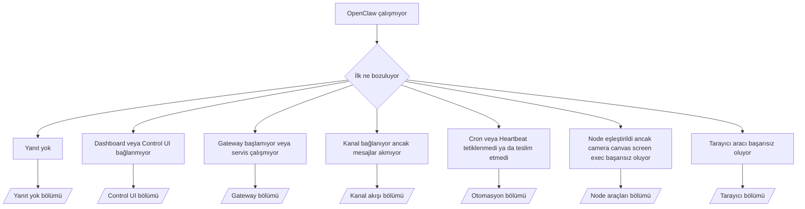

---
read_when:
    - OpenClaw çalışmıyor ve düzeltmeye ulaşmanın en hızlı yoluna ihtiyacınız var
    - Derin çalıştırma kılavuzlarına dalmadan önce bir triyaj akışı istiyorsunuz
summary: OpenClaw için belirti odaklı sorun giderme merkezi
title: Genel sorun giderme
x-i18n:
    generated_at: "2026-05-06T09:17:05Z"
    model: gpt-5.5
    provider: openai
    source_hash: 624fa34cda3b440fa9cc636beb3fe6e3608a77a332933fa593097ebc556ac745
    source_path: help/troubleshooting.md
    workflow: 16
---

Yalnızca 2 dakikanız varsa, bu sayfayı triyaj için giriş kapısı olarak kullanın.

## İlk 60 saniye

Bu tam basamakları sırayla çalıştırın:

```bash
openclaw status
openclaw status --all
openclaw gateway probe
openclaw gateway status
openclaw doctor
openclaw channels status --probe
openclaw logs --follow
```

Tek satırda iyi çıktı:

- `openclaw status` → yapılandırılmış kanalları gösterir ve belirgin kimlik doğrulama hatası yoktur.
- `openclaw status --all` → tam rapor mevcuttur ve paylaşılabilir.
- `openclaw gateway probe` → beklenen gateway hedefi erişilebilirdir (`Reachable: yes`). `Capability: ...`, probun hangi kimlik doğrulama düzeyini kanıtlayabildiğini söyler ve `Read probe: limited - missing scope: operator.read` bağlantı hatası değil, kısıtlı tanılamadır.
- `openclaw gateway status` → `Runtime: running`, `Connectivity probe: ok` ve makul bir `Capability: ...` satırı. Okuma kapsamlı RPC kanıtına da ihtiyacınız varsa `--require-rpc` kullanın.
- `openclaw doctor` → engelleyici yapılandırma/servis hatası yoktur.
- `openclaw channels status --probe` → erişilebilir gateway, `works` veya `audit ok` gibi prob/denetim sonuçlarıyla birlikte hesap başına canlı taşıma durumunu döndürür; gateway erişilemezse komut yalnızca yapılandırma özetlerine geri döner.
- `openclaw logs --follow` → düzenli etkinlik vardır, tekrarlayan ölümcül hata yoktur.

## Anthropic uzun bağlam 429

Şunu görürseniz:
`HTTP 429: rate_limit_error: Extra usage is required for long context requests`,
[/gateway/troubleshooting#anthropic-429-extra-usage-required-for-long-context](/tr/gateway/troubleshooting#anthropic-429-extra-usage-required-for-long-context) sayfasına gidin.

## Yerel OpenAI uyumlu arka uç doğrudan çalışıyor ancak OpenClaw içinde başarısız oluyor

Yerel veya kendi barındırdığınız `/v1` arka ucu küçük doğrudan
`/v1/chat/completions` problarına yanıt veriyor ancak `openclaw infer model run` veya normal
agent turlarında başarısız oluyorsa:

1. Hata, `messages[].content` için bir string beklendiğini belirtiyorsa,
   `models.providers.<provider>.models[].compat.requiresStringContent: true` ayarlayın.
2. Arka uç hâlâ yalnızca OpenClaw agent turlarında başarısız oluyorsa,
   `models.providers.<provider>.models[].compat.supportsTools: false` ayarlayın ve yeniden deneyin.
3. Küçük doğrudan çağrılar hâlâ çalışıyor ancak daha büyük OpenClaw istemleri arka ucu çökertiyorsa,
   kalan sorunu yukarı akış model/sunucu sınırlaması olarak ele alın ve ayrıntılı runbook ile devam edin:
   [/gateway/troubleshooting#local-openai-compatible-backend-passes-direct-probes-but-agent-runs-fail](/tr/gateway/troubleshooting#local-openai-compatible-backend-passes-direct-probes-but-agent-runs-fail)

## Plugin kurulumu eksik openclaw extensions nedeniyle başarısız oluyor

Kurulum `package.json missing openclaw.extensions` ile başarısız oluyorsa Plugin paketi,
OpenClaw tarafından artık kabul edilmeyen eski bir biçim kullanıyordur.

Plugin paketinde düzeltin:

1. `package.json` dosyasına `openclaw.extensions` ekleyin.
2. Girdileri derlenmiş runtime dosyalarına yönlendirin (genellikle `./dist/index.js`).
3. Plugin paketini yeniden yayımlayın ve `openclaw plugins install <package>` komutunu tekrar çalıştırın.

Örnek:

```json
{
  "name": "@openclaw/my-plugin",
  "version": "1.2.3",
  "openclaw": {
    "extensions": ["./dist/index.js"]
  }
}
```

Referans: [Plugin mimarisi](/tr/plugins/architecture)

## Plugin mevcut ancak şüpheli sahiplik nedeniyle engellenmiş

`openclaw doctor`, kurulum veya başlangıç uyarıları şunu gösteriyorsa:

```text
blocked plugin candidate: suspicious ownership (... uid=1000, expected uid=0 or root)
plugin present but blocked
```

Plugin dosyaları, onları yükleyen işlemden farklı bir Unix kullanıcısına aittir.
Plugin yapılandırmasını kaldırmayın. Dosya sahipliğini düzeltin veya OpenClaw’ı
durum dizininin sahibi olan aynı kullanıcıyla çalıştırın.

Docker kurulumları normalde `node` (uid `1000`) olarak çalışır. Varsayılan Docker
kurulumu için host bind mount’larını onarın:

```bash
sudo chown -R 1000:1000 /path/to/openclaw-config /path/to/openclaw-workspace
openclaw doctor --fix
```

OpenClaw’ı bilerek root olarak çalıştırıyorsanız, bunun yerine yönetilen Plugin kökünü
root sahipliğine onarın:

```bash
sudo chown -R root:root /path/to/openclaw-config/npm
openclaw doctor --fix
```

Daha ayrıntılı belgeler:

- [Plugin yolu sahipliği](/tr/tools/plugin#blocked-plugin-path-ownership)
- [Docker izinleri](/tr/install/docker#permissions-and-eacces)

## Karar ağacı



<AccordionGroup>
  <Accordion title="Yanıt yok">
    ```bash
    openclaw status
    openclaw gateway status
    openclaw channels status --probe
    openclaw pairing list --channel <channel> [--account <id>]
    openclaw logs --follow
    ```

    İyi çıktı şöyle görünür:

    - `Runtime: running`
    - `Connectivity probe: ok`
    - `Capability: read-only`, `write-capable` veya `admin-capable`
    - Kanalınız taşımanın bağlı olduğunu gösterir ve desteklendiği yerlerde `channels status --probe` içinde `works` veya `audit ok` görünür
    - Gönderen onaylı görünür (veya DM ilkesi açık/izin listesindedir)

    Yaygın günlük imzaları:

    - `drop guild message (mention required` → Discord’da mention kapısı mesajı engelledi.
    - `pairing request` → gönderen onaylanmamış ve DM eşleştirme onayı bekliyor.
    - Kanal günlüklerinde `blocked` / `allowlist` → gönderen, oda veya grup filtreleniyor.

    Ayrıntılı sayfalar:

    - [/gateway/troubleshooting#no-replies](/tr/gateway/troubleshooting#no-replies)
    - [/channels/troubleshooting](/tr/channels/troubleshooting)
    - [/channels/pairing](/tr/channels/pairing)

  </Accordion>

  <Accordion title="Dashboard veya Control UI bağlanmıyor">
    ```bash
    openclaw status
    openclaw gateway status
    openclaw logs --follow
    openclaw doctor
    openclaw channels status --probe
    ```

    İyi çıktı şöyle görünür:

    - `openclaw gateway status` içinde `Dashboard: http://...` gösterilir
    - `Connectivity probe: ok`
    - `Capability: read-only`, `write-capable` veya `admin-capable`
    - Günlüklerde kimlik doğrulama döngüsü yoktur

    Yaygın günlük imzaları:

    - `device identity required` → HTTP/güvenli olmayan bağlam cihaz kimlik doğrulamasını tamamlayamaz.
    - `origin not allowed` → tarayıcı `Origin` değeri Control UI gateway hedefi için izinli değildir.
    - Yeniden deneme ipuçlarıyla `AUTH_TOKEN_MISMATCH` (`canRetryWithDeviceToken=true`) → güvenilir cihaz token’ıyla bir yeniden deneme otomatik olarak gerçekleşebilir.
    - Bu önbelleğe alınmış token yeniden denemesi, eşleştirilmiş cihaz token’ıyla saklanan önbelleğe alınmış kapsam kümesini yeniden kullanır. Açık `deviceToken` / açık `scopes` çağıranları bunun yerine istedikleri kapsam kümesini korur.
    - Asenkron Tailscale Serve Control UI yolunda, aynı `{scope, ip}` için başarısız denemeler sınırlayıcı hatayı kaydetmeden önce serileştirilir; bu nedenle ikinci eşzamanlı hatalı yeniden deneme zaten `retry later` gösterebilir.
    - Bir localhost tarayıcı origin’inden `too many failed authentication attempts (retry later)` → aynı `Origin` kaynaklı tekrarlanan başarısızlıklar geçici olarak kilitlenir; başka bir localhost origin’i ayrı bir kova kullanır.
    - Bu yeniden denemeden sonra tekrarlayan `unauthorized` → yanlış token/parola, kimlik doğrulama modu uyumsuzluğu veya bayat eşleştirilmiş cihaz token’ı.
    - `gateway connect failed:` → UI yanlış URL/porta hedefleniyor veya gateway erişilemiyor.

    Ayrıntılı sayfalar:

    - [/gateway/troubleshooting#dashboard-control-ui-connectivity](/tr/gateway/troubleshooting#dashboard-control-ui-connectivity)
    - [/web/control-ui](/tr/web/control-ui)
    - [/gateway/authentication](/tr/gateway/authentication)

  </Accordion>

  <Accordion title="Gateway başlamıyor veya servis kurulu ama çalışmıyor">
    ```bash
    openclaw status
    openclaw gateway status
    openclaw logs --follow
    openclaw doctor
    openclaw channels status --probe
    ```

    İyi çıktı şöyle görünür:

    - `Service: ... (loaded)`
    - `Runtime: running`
    - `Connectivity probe: ok`
    - `Capability: read-only`, `write-capable` veya `admin-capable`

    Yaygın günlük imzaları:

    - `Gateway start blocked: set gateway.mode=local` veya `existing config is missing gateway.mode` → gateway modu remote’tur ya da yapılandırma dosyasında local-mode damgası eksiktir ve onarılmalıdır.
    - `refusing to bind gateway ... without auth` → geçerli bir gateway kimlik doğrulama yolu (token/parola veya yapılandırılmışsa trusted-proxy) olmadan loopback dışı bind.
    - `another gateway instance is already listening` veya `EADDRINUSE` → port zaten kullanımda.

    Ayrıntılı sayfalar:

    - [/gateway/troubleshooting#gateway-service-not-running](/tr/gateway/troubleshooting#gateway-service-not-running)
    - [/gateway/background-process](/tr/gateway/background-process)
    - [/gateway/configuration](/tr/gateway/configuration)

  </Accordion>

  <Accordion title="Kanal bağlanıyor ancak mesajlar akmıyor">
    ```bash
    openclaw status
    openclaw gateway status
    openclaw logs --follow
    openclaw doctor
    openclaw channels status --probe
    ```

    İyi çıktı şöyle görünür:

    - Kanal taşıması bağlıdır.
    - Eşleştirme/izin listesi kontrolleri geçer.
    - Gerekli yerlerde mention’lar algılanır.

    Yaygın günlük imzaları:

    - `mention required` → grup mention kapısı işlemeyi engelledi.
    - `pairing` / `pending` → DM göndereni henüz onaylı değildir.
    - `not_in_channel`, `missing_scope`, `Forbidden`, `401/403` → kanal izin token’ı sorunu.

    Ayrıntılı sayfalar:

    - [/gateway/troubleshooting#channel-connected-messages-not-flowing](/tr/gateway/troubleshooting#channel-connected-messages-not-flowing)
    - [/channels/troubleshooting](/tr/channels/troubleshooting)

  </Accordion>

  <Accordion title="Cron veya Heartbeat tetiklenmedi ya da teslim etmedi">
    ```bash
    openclaw status
    openclaw gateway status
    openclaw cron status
    openclaw cron list
    openclaw cron runs --id <jobId> --limit 20
    openclaw logs --follow
    ```

    İyi çıktı şöyle görünür:

    - `cron.status`, bir sonraki uyanışla birlikte etkin olduğunu gösterir.
    - `cron runs`, yakın tarihli `ok` girdilerini gösterir.
    - Heartbeat etkindir ve aktif saatlerin dışında değildir.

    Yaygın günlük imzaları:

    - `cron: scheduler disabled; jobs will not run automatically` → Cron devre dışıdır.
    - `reason=quiet-hours` ile `heartbeat skipped` → yapılandırılmış aktif saatlerin dışındadır.
    - `reason=empty-heartbeat-file` ile `heartbeat skipped` → `HEARTBEAT.md` vardır ancak yalnızca boş/yalnızca başlıklı iskelet içerir.
    - `reason=no-tasks-due` ile `heartbeat skipped` → `HEARTBEAT.md` görev modu aktiftir ancak görev aralıklarının hiçbiri henüz gelmemiştir.
    - `reason=alerts-disabled` ile `heartbeat skipped` → tüm Heartbeat görünürlüğü devre dışıdır (`showOk`, `showAlerts` ve `useIndicator` kapalıdır).
    - `requests-in-flight` → ana hat meşguldür; Heartbeat uyanışı ertelenmiştir.
    - `unknown accountId` → Heartbeat teslim hedefi hesabı mevcut değildir.

    Ayrıntılı sayfalar:

    - [/gateway/troubleshooting#cron-and-heartbeat-delivery](/tr/gateway/troubleshooting#cron-and-heartbeat-delivery)
    - [/automation/cron-jobs#troubleshooting](/tr/automation/cron-jobs#troubleshooting)
    - [/gateway/heartbeat](/tr/gateway/heartbeat)

  </Accordion>

  <Accordion title="Node eşleştirildi ancak tool camera canvas screen exec başarısız oluyor">
    ```bash
    openclaw status
    openclaw gateway status
    openclaw nodes status
    openclaw nodes describe --node <idOrNameOrIp>
    openclaw logs --follow
    ```

    İyi çıktı şöyle görünür:

    - Node bağlı ve `node` rolü için eşleştirilmiş olarak listelenir.
    - Çağırdığınız komut için capability vardır.
    - Araç için izin durumu verilmiştir.

    Yaygın günlük imzaları:

    - `NODE_BACKGROUND_UNAVAILABLE` → node uygulamasını ön plana getir.
    - `*_PERMISSION_REQUIRED` → İşletim sistemi izni reddedildi/eksik.
    - `SYSTEM_RUN_DENIED: approval required` → exec onayı beklemede.
    - `SYSTEM_RUN_DENIED: allowlist miss` → komut exec izin listesinde değil.

    Derin sayfalar:

    - [/gateway/troubleshooting#node-paired-tool-fails](/tr/gateway/troubleshooting#node-paired-tool-fails)
    - [/nodes/troubleshooting](/tr/nodes/troubleshooting)
    - [/tools/exec-approvals](/tr/tools/exec-approvals)

  </Accordion>

  <Accordion title="Exec aniden onay istiyor">
    ```bash
    openclaw config get tools.exec.host
    openclaw config get tools.exec.security
    openclaw config get tools.exec.ask
    openclaw gateway restart
    ```

    Değişenler:

    - `tools.exec.host` ayarlanmamışsa varsayılan `auto` olur.
    - `host=auto`, bir sandbox çalışma zamanı etkin olduğunda `sandbox`, aksi halde `gateway` olarak çözümlenir.
    - `host=auto` yalnızca yönlendirmedir; istem göstermeyen "YOLO" davranışı gateway/node üzerinde `security=full` artı `ask=off` ile gelir.
    - `gateway` ve `node` üzerinde, ayarlanmamış `tools.exec.security` varsayılan olarak `full` olur.
    - Ayarlanmamış `tools.exec.ask` varsayılan olarak `off` olur.
    - Sonuç: onaylar görüyorsanız bazı host yerel veya oturum başına ilkeler exec davranışını mevcut varsayılanlardan daha sıkı hale getirmiştir.

    Mevcut varsayılan onaysız davranışı geri yükle:

    ```bash
    openclaw config set tools.exec.host gateway
    openclaw config set tools.exec.security full
    openclaw config set tools.exec.ask off
    openclaw gateway restart
    ```

    Daha güvenli alternatifler:

    - Yalnızca kararlı host yönlendirmesi istiyorsanız sadece `tools.exec.host=gateway` ayarlayın.
    - Host exec istiyor ama izin listesi eşleşmediğinde yine de inceleme istiyorsanız `security=allowlist` ile `ask=on-miss` kullanın.
    - `host=auto` değerinin yeniden `sandbox` olarak çözümlenmesini istiyorsanız sandbox modunu etkinleştirin.

    Yaygın günlük imzaları:

    - `Approval required.` → komut `/approve ...` bekliyor.
    - `SYSTEM_RUN_DENIED: approval required` → node-host exec onayı beklemede.
    - `exec host=sandbox requires a sandbox runtime for this session` → örtük/açık sandbox seçimi var ama sandbox modu kapalı.

    Derin sayfalar:

    - [/tools/exec](/tr/tools/exec)
    - [/tools/exec-approvals](/tr/tools/exec-approvals)
    - [/gateway/security#what-the-audit-checks-high-level](/tr/gateway/security#what-the-audit-checks-high-level)

  </Accordion>

  <Accordion title="Tarayıcı aracı başarısız oluyor">
    ```bash
    openclaw status
    openclaw gateway status
    openclaw browser status
    openclaw logs --follow
    openclaw doctor
    ```

    İyi çıktı şöyle görünür:

    - Tarayıcı durumu `running: true` değerini ve seçilmiş bir tarayıcı/profil gösterir.
    - `openclaw` başlar veya `user` yerel Chrome sekmelerini görebilir.

    Yaygın günlük imzaları:

    - `unknown command "browser"` veya `unknown command 'browser'` → `plugins.allow` ayarlı ve `browser` içermiyor.
    - `Failed to start Chrome CDP on port` → yerel tarayıcı başlatma başarısız oldu.
    - `browser.executablePath not found` → yapılandırılmış ikili dosya yolu yanlış.
    - `browser.cdpUrl must be http(s) or ws(s)` → yapılandırılmış CDP URL'si desteklenmeyen bir şema kullanıyor.
    - `browser.cdpUrl has invalid port` → yapılandırılmış CDP URL'sinde hatalı veya aralık dışında bir port var.
    - `No Chrome tabs found for profile="user"` → Chrome MCP ekleme profilinde açık yerel Chrome sekmesi yok.
    - `Remote CDP for profile "<name>" is not reachable` → yapılandırılmış uzak CDP uç noktasına bu hosttan erişilemiyor.
    - `Browser attachOnly is enabled ... not reachable` veya `Browser attachOnly is enabled and CDP websocket ... is not reachable` → yalnızca ekleme profilinde canlı CDP hedefi yok.
    - yalnızca ekleme veya uzak CDP profillerinde eskimiş viewport / dark-mode / locale / offline geçersiz kılmaları → etkin kontrol oturumunu kapatmak ve Gateway'i yeniden başlatmadan emülasyon durumunu serbest bırakmak için `openclaw browser stop --browser-profile <name>` çalıştırın.

    Derin sayfalar:

    - [/gateway/troubleshooting#browser-tool-fails](/tr/gateway/troubleshooting#browser-tool-fails)
    - [/tools/browser#missing-browser-command-or-tool](/tr/tools/browser#missing-browser-command-or-tool)
    - [/tools/browser-linux-troubleshooting](/tr/tools/browser-linux-troubleshooting)
    - [/tools/browser-wsl2-windows-remote-cdp-troubleshooting](/tr/tools/browser-wsl2-windows-remote-cdp-troubleshooting)

  </Accordion>

</AccordionGroup>

## İlgili

- [SSS](/tr/help/faq) — sık sorulan sorular
- [Gateway Sorun Giderme](/tr/gateway/troubleshooting) — Gateway'e özgü sorunlar
- [Doctor](/tr/gateway/doctor) — otomatik sağlık denetimleri ve onarımlar
- [Kanal Sorun Giderme](/tr/channels/troubleshooting) — kanal bağlantısı sorunları
- [Otomasyon Sorun Giderme](/tr/automation/cron-jobs#troubleshooting) — Cron ve Heartbeat sorunları
