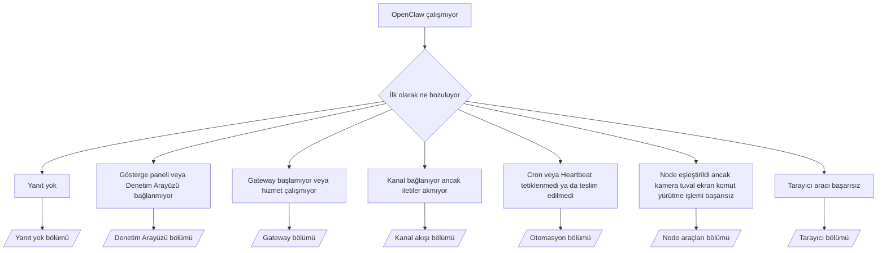

---
read_when:
    - OpenClaw çalışmıyor ve sorunu gidermenin en hızlı yoluna ihtiyacınız var
    - Ayrıntılı çalışma kılavuzlarına geçmeden önce bir önceliklendirme akışı istiyorsunuz
summary: OpenClaw için önce belirtiye odaklanan sorun giderme merkezi
title: Genel sorun giderme
x-i18n:
    generated_at: "2026-07-12T11:52:11Z"
    model: gpt-5.6
    postprocess_version: locale-links-v1
    provider: openai
    source_hash: db50e0cdf4d11f3aa6196be445358d904a2b9c40c89243f1b124c77167f6dd85
    source_path: help/troubleshooting.md
    workflow: 16
---

Sorun ayıklama giriş noktası. 2 dakika içinde tanı koyun, ardından ayrıntılı sayfaya geçin.

## İlk 60 saniye

Bu adımları sırayla çalıştırın:

```bash
openclaw status
openclaw status --all
openclaw gateway probe
openclaw gateway status
openclaw doctor
openclaw channels status --probe
openclaw logs --follow
```

İyi çıktı, her biri tek satır:

- `openclaw status`, yapılandırılmış kanalları gösterir ve kimlik doğrulama hatası içermez.
- `openclaw status --all`, eksiksiz ve paylaşılabilir bir rapor oluşturur.
- `openclaw gateway probe`, `Reachable: yes` gösterir. `Capability: ...`,
  yoklamanın doğruladığı kimlik doğrulama düzeyidir; `Read probe: limited - missing scope:
operator.read`, bağlantı hatası değil, kısıtlı tanılamadır.
- `openclaw gateway status`, `Runtime: running`, `Connectivity probe:
ok` ve makul bir `Capability: ...` gösterir. Okuma kapsamlı RPC doğrulamasını da
  zorunlu kılmak için `--require-rpc` ekleyin.
- `openclaw doctor`, engelleyici yapılandırma/hizmet hatası bildirmez.
- `openclaw channels status --probe`, Gateway erişilebilir olduğunda hesap başına
  canlı aktarım durumunu (`works` / `audit ok`) döndürür; erişilebilir olmadığında
  yalnızca yapılandırmaya dayalı özetlere geri döner.
- `openclaw logs --follow`, düzenli etkinlik gösterir ve yinelenen kritik hata içermez.

## Asistan kısıtlı görünüyor veya araçlar eksik

Etkin araç profilini kontrol edin:

```bash
openclaw status
openclaw status --all
openclaw doctor
```

Yaygın nedenler:

- `tools.profile: "minimal"` yalnızca `session_status` kullanımına izin verir.
- `tools.profile: "messaging"` yalnızca sohbet eden aracılar için dar kapsamlıdır.
- `tools.profile: "coding"`, yeni yerel yapılandırmalar için varsayılandır (depo, dosya,
  kabuk ve çalışma zamanı işlemleri).
- `tools.profile: "full"` profil kısıtlamalarını kaldırır; kullanımını güvenilir,
  operatör denetimindeki aracılarla sınırlayın.
- Aracı başına `agents.list[].tools`, tek bir aracı için kök profili
  daraltır veya genişletir.

Profili değiştirin, Gateway'i yeniden başlatın veya yeniden yükleyin, ardından
`openclaw status --all` ile tekrar kontrol edin. Profil/grup tablosunun tamamı: [Araç profilleri](/tr/gateway/config-tools#tool-profiles).

## Anthropic uzun bağlam 429 hatası

`HTTP 429: rate_limit_error: Extra usage is required for long context requests`
→ [Anthropic 429: uzun bağlam için ek kullanım gerekli](/tr/gateway/troubleshooting#anthropic-429-extra-usage-required-for-long-context).

## Yerel OpenAI uyumlu arka uç doğrudan çalışıyor ancak OpenClaw'da başarısız oluyor

Yerel/kendi barındırdığınız `/v1` arka ucu, doğrudan `/v1/chat/completions`
yoklamalarına yanıt veriyor ancak `openclaw infer model run` veya normal aracı turlarında başarısız oluyor:

1. Hata, `messages[].content` için dize beklendiğini belirtiyorsa
   `models.providers.<provider>.models[].compat.requiresStringContent: true` ayarını yapın.
2. Hâlâ yalnızca OpenClaw aracı turlarında başarısız oluyorsa
   `models.providers.<provider>.models[].compat.supportsTools: false` ayarını yapıp yeniden deneyin.
3. Küçük doğrudan çağrılar çalışıyor ancak daha büyük OpenClaw istemleri arka ucu çökertiyorsa bu,
   OpenClaw hatası değil, üst model/sunucu sınırıdır. [Yerel OpenAI uyumlu arka uç doğrudan yoklamaları geçiyor ancak aracı çalıştırmaları başarısız oluyor](/tr/gateway/troubleshooting#local-openai-compatible-backend-passes-direct-probes-but-agent-runs-fail)
   bölümünden devam edin.

## Eksik openclaw uzantıları nedeniyle Plugin kurulumu başarısız oluyor

`package.json missing openclaw.extensions`, plugin paketinin OpenClaw'ın artık
kabul etmediği bir yapı kullandığı anlamına gelir.

Plugin paketinde düzeltin:

1. `package.json` dosyasına derlenmiş çalışma zamanı dosyalarını (genellikle
   `./dist/index.js`) gösteren `openclaw.extensions` alanını ekleyin.
2. Yeniden yayımlayın, ardından `openclaw plugins install <package>` komutunu tekrar çalıştırın.

```json
{
  "name": "@openclaw/my-plugin",
  "version": "1.2.3",
  "openclaw": {
    "extensions": ["./dist/index.js"]
  }
}
```

Başvuru: [Plugin mimarisi](/tr/plugins/architecture)

## Kurulum politikası plugin kurulumlarını veya güncellemelerini engelliyor

Güncelleme tamamlanıyor ancak plugin'ler eski kalıyor, devre dışı bırakılıyor veya
`blocked by install policy`, `install policy failed closed` ya da
`Disabled "<plugin>" after plugin update failure` gösteriyorsa `security.installPolicy`
ayarını kontrol edin.

Kurulum politikası, plugin kurulumları ve güncellemelerinde çalışır. `@openclaw/*`
plugin sürümleri normalde OpenClaw sürümüyle birlikte ilerlediğinden, bir OpenClaw
güncellemesi son güncelleme eşitlemesi sırasında eşleşen bir plugin güncellemesi gerektirebilir.

Eşleşen yükseltme kuralını da sürdürmüyorsanız şu politika yapılarını kullanmaktan kaçının:

- OpenClaw'a ait plugin'leri tek bir eski kesin sürümde sabitlemek (örneğin yalnızca
  `@openclaw/*@2026.5.3`).
- Yalnızca kaynak türüne göre engellemek (her npm, ağ veya `request.mode:
"update"` isteği).
- Politika komutunu isteğe bağlı kabul etmek: `security.installPolicy`
  etkinleştirildiğinde eksik, yavaş, okunamayan veya izinler nedeniyle engellenen
  politika yürütülebilir dosyası kapalı durumda başarısız olur.
- İsteğin `openclawVersion` değerini plugin adayının meta verileriyle karşılaştırmadan
  sürümleri onaylamak.

Tek bir sürümü sonsuza kadar sabitlemek yerine, geçerli ana makineyle uyumlu
güvenilir `@openclaw/*` güncellemelerine izin veren kuralları tercih edin. npm'i
varsayılan olarak engelliyorsanız kullandığınız plugin kimlikleri için dar kapsamlı
bir istisna ekleyin ve kurulumlara uyguladığınız güven kuralını
`request.mode: "update"` için de uygulayın.

Kurtarma:

```bash
openclaw doctor --deep
openclaw plugins update --all
openclaw status --all
```

Politika kasıtlı olarak katıysa güvenilir yükseltme süresi boyunca gevşetin,
`openclaw plugins update --all` komutunu yeniden çalıştırın, ardından daha katı
kuralı geri yükleyin. Güncelleme hatası bir plugin'i devre dışı bıraktıysa yeniden
etkinleştirmeden önce inceleyin:

```bash
openclaw plugins inspect <plugin-id> --runtime --json
openclaw plugins enable <plugin-id>
```

Başvuru: [Operatör kurulum politikası](/tr/tools/skills-config#operator-install-policy-securityinstallpolicy)

## Plugin mevcut ancak şüpheli sahiplik nedeniyle engelleniyor

`openclaw doctor`, kurulum veya başlangıç uyarıları şunları gösterir:

```text
blocked plugin candidate: suspicious ownership (... uid=1000, expected uid=0 or root)
plugin present but blocked
```

Plugin dosyaları, bunları yükleyen işlemden farklı bir Unix kullanıcısına aittir.
Plugin yapılandırmasını kaldırmayın; dosya sahipliğini düzeltin veya OpenClaw'ı
durum dizininin sahibi olan kullanıcıyla çalıştırın.

Docker kurulumları `node` (uid `1000`) olarak çalışır. Ana makine bağlama noktalarını düzeltin:

```bash
sudo chown -R 1000:1000 /path/to/openclaw-config /path/to/openclaw-workspace
openclaw doctor --fix
```

OpenClaw'ı kasıtlı olarak root kullanıcısıyla çalıştırıyorsanız bunun yerine yönetilen
plugin kökünü düzeltin:

```bash
sudo chown -R root:root /path/to/openclaw-config/npm
openclaw doctor --fix
```

Ayrıntılı belgeler: [Engellenen plugin yolu sahipliği](/tr/tools/plugin#blocked-plugin-path-ownership), [Docker: İzinler ve EACCES](/tr/install/docker#shell-helpers-optional)

## Karar ağacı



<AccordionGroup>
  <Accordion title="Yanıt yok">
    ```bash
    openclaw status
    openclaw gateway status
    openclaw channels status --probe
    openclaw pairing list --channel <channel> [--account <id>]
    openclaw logs --follow
    ```

    İyi çıktı:

    - `Runtime: running`
    - `Connectivity probe: ok`
    - `Capability: read-only`, `write-capable` veya `admin-capable`
    - Kanal, aktarımın bağlı olduğunu ve desteklendiği yerlerde
      `channels status --probe` içinde `works` veya `audit ok` değerini gösterir
    - Gönderici onaylanmıştır (veya doğrudan ileti politikası açık/izin listesidir)

    Günlük imzaları:

    - `drop guild message (mention required` → Discord etiketleme geçidi iletiyi engelledi.
    - `pairing request` → gönderici onaylanmamış, doğrudan ileti eşleştirme onayı bekleniyor.
    - Kanal günlüklerindeki `blocked` / `allowlist` → gönderici, oda veya grup filtrelendi.

    Ayrıntılı sayfalar: [Yanıt yok](/tr/gateway/troubleshooting#no-replies), [Kanal sorunlarını giderme](/tr/channels/troubleshooting), [Eşleştirme](/tr/channels/pairing)

  </Accordion>

  <Accordion title="Gösterge paneli veya Denetim Arayüzü bağlanmıyor">
    ```bash
    openclaw status
    openclaw gateway status
    openclaw logs --follow
    openclaw doctor
    openclaw channels status --probe
    ```

    İyi çıktı:

    - `openclaw gateway status` içinde `Dashboard: http://...` gösterilir
    - `Connectivity probe: ok`
    - `Capability: read-only`, `write-capable` veya `admin-capable`
    - Günlüklerde kimlik doğrulama döngüsü yoktur

    Günlük imzaları:

    - `device identity required` → HTTP/güvenli olmayan bağlam, cihaz kimlik doğrulamasını tamamlayamaz.
    - `origin not allowed` → tarayıcının `Origin` değeri, Denetim Arayüzü Gateway hedefi için izinli değildir.
    - `AUTH_TOKEN_MISMATCH` ve `canRetryWithDeviceToken=true` → eşleştirilmiş token'ın önbelleğe alınmış kapsamları yeniden kullanılarak güvenilir cihaz token'ıyla bir kez otomatik olarak yeniden deneme yapılabilir.
    - Bu yeniden denemeden sonra yinelenen `unauthorized` → yanlış token/parola, kimlik doğrulama modu uyuşmazlığı veya eski eşleştirilmiş cihaz token'ı.
    - `too many failed authentication attempts (retry later)` → bu tarayıcı `Origin` değerinden gelen yinelenen hatalar geçici olarak kilitlendi; diğer localhost kaynakları ayrı bölmeler kullanır. Tailscale Serve eşzamanlı yeniden deneme ayrıntısı için [Gösterge paneli/Denetim Arayüzü bağlantısı](/tr/gateway/troubleshooting#dashboard-control-ui-connectivity) bölümüne bakın.
    - `gateway connect failed:` → arayüz yanlış URL/portu hedefliyor veya Gateway erişilemez durumda.

    Ayrıntılı sayfalar: [Gösterge paneli/Denetim Arayüzü bağlantısı](/tr/gateway/troubleshooting#dashboard-control-ui-connectivity), [Denetim Arayüzü](/tr/web/control-ui), [Kimlik doğrulama](/tr/gateway/authentication)

  </Accordion>

  <Accordion title="Gateway başlamıyor veya hizmet kurulu olmasına rağmen çalışmıyor">
    ```bash
    openclaw status
    openclaw gateway status
    openclaw logs --follow
    openclaw doctor
    openclaw channels status --probe
    ```

    İyi çıktı:

    - `Service: ... (loaded)`
    - `Runtime: running`
    - `Connectivity probe: ok`
    - `Capability: read-only`, `write-capable` veya `admin-capable`

    Günlük imzaları:

    - `Gateway start blocked: set gateway.mode=local` veya `existing config is missing gateway.mode` → Gateway modu uzaktır ya da yapılandırmada yerel mod işareti eksiktir ve onarılması gerekir.
    - `refusing to bind gateway ... without auth` → geçerli bir kimlik doğrulama yolu (token/parola veya yapılandırıldığı yerde güvenilir proxy) olmadan local loopback dışı bağlama.
    - `another gateway instance is already listening` veya `EADDRINUSE` → port zaten kullanımda.

    Ayrıntılı sayfalar: [Gateway hizmeti çalışmıyor](/tr/gateway/troubleshooting#gateway-service-not-running), [Arka plan işlemi](/tr/gateway/background-process), [Yapılandırma](/tr/gateway/configuration)

  </Accordion>

  <Accordion title="Kanal bağlanıyor ancak iletiler akmıyor">
    ```bash
    openclaw status
    openclaw gateway status
    openclaw logs --follow
    openclaw doctor
    openclaw channels status --probe
    ```

    İyi çıktı:

    - Kanal aktarımı bağlıdır.
    - Eşleştirme/izin listesi kontrolleri geçer.
    - Gerekli yerlerde etiketlemeler algılanır.

    Günlük imzaları:

    - `mention required` → grup etiketleme geçidi işlemeyi engelledi.
    - `pairing` / `pending` → doğrudan ileti gönderen kişi henüz onaylanmadı.
    - `not_in_channel`, `missing_scope`, `Forbidden`, `401/403` → kanal izin token'ı sorunu.

    Ayrıntılı sayfalar: [Kanal bağlı, iletiler akmıyor](/tr/gateway/troubleshooting#channel-connected-messages-not-flowing), [Kanal sorunlarını giderme](/tr/channels/troubleshooting)

  </Accordion>

  <Accordion title="Cron veya Heartbeat tetiklenmedi ya da teslim edilmedi">
    ```bash
    openclaw status
    openclaw gateway status
    openclaw cron status
    openclaw cron list
    openclaw cron runs --id <jobId> --limit 20
    openclaw logs --follow
    ```

    İyi çıktı:

    - `cron status`, zamanlayıcının etkin olduğunu ve bir sonraki uyanma zamanını gösterir.
    - `cron runs`, yakın tarihli `ok` girdilerini gösterir.
    - Heartbeat etkindir ve etkin saatler içindedir.

    Günlük imzaları:

    - `cron: scheduler disabled; jobs will not run automatically` → Cron devre dışı.
    - `heartbeat skipped` nedeni `quiet-hours` → yapılandırılmış etkin saatlerin dışında.
    - `heartbeat skipped` nedeni `empty-heartbeat-file` → `HEARTBEAT.md` mevcut ancak yalnızca boş satır, yorum, başlık, çit veya boş kontrol listesi iskeleti içeriyor.
    - `heartbeat skipped` nedeni `no-tasks-due` → görev modu etkin ancak henüz hiçbir görevin aralığı dolmadı.
    - `heartbeat skipped` nedeni `alerts-disabled` → `showOk`, `showAlerts` ve `useIndicator` seçeneklerinin tümü kapalı.
    - `requests-in-flight` → ana hat meşgul; Heartbeat uyandırması ertelendi.
    - `unknown accountId` → Heartbeat teslimat hedefi hesabı mevcut değil.

    Ayrıntılı sayfalar: [Cron ve Heartbeat teslimatı](/tr/gateway/troubleshooting#cron-and-heartbeat-delivery), [Zamanlanmış görevler: Sorun giderme](/tr/automation/cron-jobs#troubleshooting), [Heartbeat](/tr/gateway/heartbeat)

  </Accordion>

  <Accordion title="Node eşleştirildi ancak araç kamera tuval ekran exec işlemlerinde başarısız oluyor">
    ```bash
    openclaw status
    openclaw gateway status
    openclaw nodes status
    openclaw nodes describe --node <idOrNameOrIp>
    openclaw logs --follow
    ```

    Beklenen çıktı:

    - Node, `node` rolü için bağlı ve eşleştirilmiş olarak listelenir.
    - Çalıştırdığınız komut için gerekli yetenek mevcuttur.
    - Araç için izin durumu verilmiş olarak görünür.

    Günlük işaretleri:

    - `NODE_BACKGROUND_UNAVAILABLE` → Node uygulamasını ön plana getirin.
    - `*_PERMISSION_REQUIRED` → işletim sistemi izni reddedilmiş veya eksik.
    - `SYSTEM_RUN_DENIED: approval required` → exec onayı beklemede.
    - `SYSTEM_RUN_DENIED: allowlist miss` → komut exec izin listesinde değil.

    Ayrıntılı sayfalar: [Node eşleştirildi, araç başarısız oluyor](/tr/gateway/troubleshooting#node-paired-tool-fails), [Node sorun giderme](/tr/nodes/troubleshooting), [Exec onayları](/tr/tools/exec-approvals)

  </Accordion>

  <Accordion title="Exec aniden onay istemeye başlıyor">
    ```bash
    openclaw config get tools.exec.host
    openclaw config get tools.exec.security
    openclaw config get tools.exec.ask
    openclaw gateway restart
    ```

    Değişenler:

    - Ayarlanmamış `tools.exec.host` varsayılan olarak `auto` değerini kullanır; etkin bir korumalı alan çalışma zamanı varsa bu değer `sandbox`, aksi durumda `gateway` olarak çözümlenir.
    - `host=auto` yalnızca yönlendirme yapar; istem gösterilmeyen davranış gateway/node üzerinde `security=full` ile `ask=off` birleşiminden kaynaklanır.
    - Ayarlanmamış `tools.exec.security`, `gateway`/`node` üzerinde varsayılan olarak `full` değerini kullanır.
    - Ayarlanmamış `tools.exec.ask` varsayılan olarak `off` değerini kullanır.
    - Onay istemleri görüyorsanız ana makineye özgü veya oturum başına bir ilke, exec ayarlarını bu varsayılanlardan daha sıkı hâle getirmiştir.

    Güncel onaysız çalışma varsayılanlarını geri yükleyin:

    ```bash
    openclaw config set tools.exec.host gateway
    openclaw config set tools.exec.security full
    openclaw config set tools.exec.ask off
    openclaw gateway restart
    ```

    Daha güvenli alternatifler:

    - Kararlı ana makine yönlendirmesi için yalnızca `tools.exec.host=gateway` ayarını yapın.
    - İzin listesi eşleşmediğinde inceleme gerektiren ana makine exec işlemleri için `security=allowlist` ile `ask=on-miss` kullanın.
    - `host=auto` değerinin yeniden `sandbox` olarak çözümlenmesi için korumalı alan modunu etkinleştirin.

    Günlük işaretleri:

    - `Approval required.` → komut `/approve ...` bekliyor.
    - `SYSTEM_RUN_DENIED: approval required` → Node ana makinesindeki exec onayı beklemede.
    - `exec host=sandbox requires a sandbox runtime for this session` → korumalı alan örtük veya açıkça seçilmiş ancak korumalı alan modu kapalı.

    Ayrıntılı sayfalar: [Exec](/tr/tools/exec), [Exec onayları](/tr/tools/exec-approvals), [Güvenlik: Denetimin kontrol ettikleri](/tr/gateway/security#what-the-audit-checks-high-level)

  </Accordion>

  <Accordion title="Tarayıcı aracı başarısız oluyor">
    ```bash
    openclaw status
    openclaw gateway status
    openclaw browser status
    openclaw logs --follow
    openclaw doctor
    ```

    Beklenen çıktı:

    - Tarayıcı durumu `running: true` değerini ve seçilmiş bir tarayıcı/profili gösterir.
    - `openclaw` profili başlatılır veya `user` profili yerel Chrome sekmelerini görür.

    Günlük işaretleri:

    - `unknown command "browser"` → `plugins.allow` ayarlanmış ve `browser` değerini dışlıyor.
    - `Failed to start Chrome CDP on port` → yerel tarayıcı başlatılamadı.
    - `browser.executablePath not found` → yapılandırılmış ikili dosya yolu yanlış.
    - `browser.cdpUrl must be http(s) or ws(s)` → yapılandırılmış CDP URL'si desteklenmeyen bir şema kullanıyor.
    - `browser.cdpUrl has invalid port` → yapılandırılmış CDP URL'sinin bağlantı noktası geçersiz veya izin verilen aralığın dışında.
    - `No Chrome tabs found for profile="user"` → Chrome MCP bağlanma profilinde açık yerel Chrome sekmesi yok.
    - `Remote CDP for profile "<name>" is not reachable` → yapılandırılmış uzak CDP uç noktasına bu ana makineden erişilemiyor.
    - `Browser attachOnly is enabled ... not reachable` → yalnızca bağlanma profili için etkin bir CDP hedefi yok.
    - Yalnızca bağlanma veya uzak CDP profillerindeki eski görüntü alanı/koyu mod/yerel ayar/çevrimdışı geçersiz kılmaları → Gateway'i yeniden başlatmadan denetim oturumunu kapatmak ve öykünme durumunu serbest bırakmak için `openclaw browser stop --browser-profile <name>` komutunu çalıştırın.

    Ayrıntılı sayfalar: [Tarayıcı aracı başarısız oluyor](/tr/gateway/troubleshooting#browser-tool-fails), [Eksik tarayıcı komutu veya aracı](/tr/tools/browser#missing-browser-command-or-tool), [Tarayıcı: Linux sorun giderme](/tr/tools/browser-linux-troubleshooting), [Tarayıcı: WSL2/Windows uzak CDP sorun giderme](/tr/tools/browser-wsl2-windows-remote-cdp-troubleshooting)

  </Accordion>

</AccordionGroup>

## İlgili

- [SSS](/tr/help/faq) — sık sorulan sorular
- [Gateway Sorun Giderme](/tr/gateway/troubleshooting) — Gateway'e özgü sorunlar
- [Doctor](/tr/gateway/doctor) — otomatik sistem durumu kontrolleri ve onarımlar
- [Kanal Sorun Giderme](/tr/channels/troubleshooting) — kanal bağlantısı sorunları
- [Zamanlanmış görevler: Sorun giderme](/tr/automation/cron-jobs#troubleshooting) — Cron ve Heartbeat sorunları
