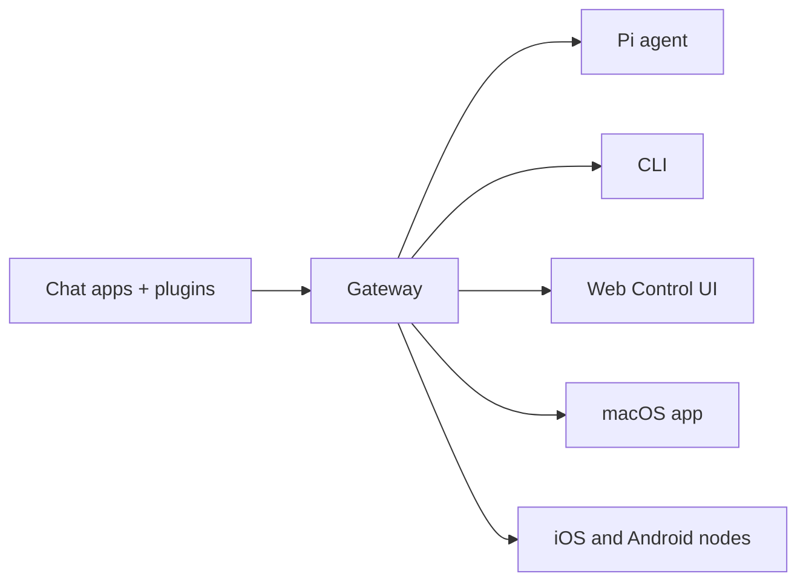

---
read_when:
    - OpenClaw'ı yeni başlayanlara tanıtma
summary: OpenClaw, her işletim sisteminde çalışan AI ajanları için çok kanallı bir Gateway'dir.
title: OpenClaw
x-i18n:
    generated_at: "2026-04-22T04:23:19Z"
    model: gpt-5.4
    provider: openai
    source_hash: 923d34fa604051d502e4bc902802d6921a4b89a9447f76123aa8d2ff085f0b99
    source_path: index.md
    workflow: 15
---

# OpenClaw 🦞

<p align="center">
    
    
</p>

> _"PUL PUL!"_ — Muhtemelen bir uzay ıstakozu

<p align="center">
  <strong>Discord, Google Chat, iMessage, Matrix, Microsoft Teams, Signal, Slack, Telegram, WhatsApp, Zalo ve daha fazlasında AI ajanları için her işletim sisteminde çalışan Gateway.</strong><br />
  Bir mesaj gönderin, cebinizden bir ajan yanıtı alın. Yerleşik kanallar, paketle gelen kanal plugin'leri, WebChat ve mobil Node'lar üzerinden tek bir Gateway çalıştırın.
</p>

<Columns>
  <Card title="Başlayın" href="/tr/start/getting-started" icon="rocket">
    OpenClaw'ı kurun ve Gateway'i dakikalar içinde ayağa kaldırın.
  </Card>
  <Card title="Onboarding'i Çalıştırın" href="/tr/start/wizard" icon="sparkles">
    `openclaw onboard` ve eşleştirme akışları ile rehberli kurulum.
  </Card>
  <Card title="Control UI'ı Açın" href="/web/control-ui" icon="layout-dashboard">
    Sohbet, yapılandırma ve oturumlar için tarayıcı panosunu başlatın.
  </Card>
</Columns>

## OpenClaw nedir?

OpenClaw, sevdiğiniz sohbet uygulamalarını ve kanal yüzeylerini — yerleşik kanallar ile Discord, Google Chat, iMessage, Matrix, Microsoft Teams, Signal, Slack, Telegram, WhatsApp, Zalo ve daha fazlası gibi paketle gelen veya harici kanal plugin'lerini — Pi gibi AI kodlama ajanlarına bağlayan **self-hosted bir gateway**'dir. Kendi makinenizde (veya bir sunucuda) tek bir Gateway süreci çalıştırırsınız ve bu süreç mesajlaşma uygulamalarınız ile her zaman erişilebilir bir AI asistanı arasındaki köprü olur.

**Kimler için?** Her yerden mesaj gönderebilecekleri kişisel bir AI asistanı isteyen, ancak verileri üzerindeki denetimden vazgeçmek veya barındırılan bir hizmete güvenmek istemeyen geliştiriciler ve ileri düzey kullanıcılar.

**Onu farklı kılan nedir?**

- **Self-hosted**: sizin donanımınızda, sizin kurallarınızla çalışır
- **Çok kanallı**: tek bir Gateway, yerleşik kanalları ve paketle gelen ya da harici kanal plugin'lerini aynı anda sunar
- **Ajana özgü**: araç kullanımı, oturumlar, bellek ve çok ajanlı yönlendirme ile kodlama ajanları için tasarlanmıştır
- **Açık kaynak**: MIT lisanslı, topluluk odaklı

**Neye ihtiyacınız var?** Node 24 (önerilir) veya uyumluluk için Node 22 LTS (`22.14+`), seçtiğiniz sağlayıcıdan bir API anahtarı ve 5 dakika. En iyi kalite ve güvenlik için kullanılabilen en güçlü yeni nesil modeli kullanın.

## Nasıl çalışır



Gateway, oturumlar, yönlendirme ve kanal bağlantıları için tek doğruluk kaynağıdır.

## Temel yetenekler

<Columns>
  <Card title="Çok kanallı gateway" icon="network" href="/tr/channels">
    Tek bir Gateway süreciyle Discord, iMessage, Signal, Slack, Telegram, WhatsApp, WebChat ve daha fazlası.
  </Card>
  <Card title="Plugin kanalları" icon="plug" href="/tr/tools/plugin">
    Paketle gelen plugin'ler Matrix, Nostr, Twitch, Zalo ve daha fazlasını güncel normal sürümlere ekler.
  </Card>
  <Card title="Çok ajanlı yönlendirme" icon="route" href="/tr/concepts/multi-agent">
    Ajan, çalışma alanı veya gönderici başına yalıtılmış oturumlar.
  </Card>
  <Card title="Medya desteği" icon="image" href="/tr/nodes/images">
    Görseller, ses ve belgeler gönderin ve alın.
  </Card>
  <Card title="Web Control UI" icon="monitor" href="/web/control-ui">
    Sohbet, yapılandırma, oturumlar ve Node'lar için tarayıcı panosu.
  </Card>
  <Card title="Mobil Node'lar" icon="smartphone" href="/tr/nodes">
    Canvas, kamera ve ses etkin iş akışları için iOS ve Android Node'larını eşleştirin.
  </Card>
</Columns>

## Hızlı başlangıç

<Steps>
  <Step title="OpenClaw'ı kurun">
    ```bash
    npm install -g openclaw@latest
    ```
  </Step>
  <Step title="Onboarding'i çalıştırın ve hizmeti kurun">
    ```bash
    openclaw onboard --install-daemon
    ```
  </Step>
  <Step title="Sohbet edin">
    Tarayıcınızda Control UI'ı açın ve bir mesaj gönderin:

    ```bash
    openclaw dashboard
    ```

    Veya bir kanal bağlayın ([Telegram](/tr/channels/telegram) en hızlısıdır) ve telefonunuzdan sohbet edin.

  </Step>
</Steps>

Tam kurulum ve geliştirme ortamına mı ihtiyacınız var? [Getting Started](/tr/start/getting-started) bölümüne bakın.

## Pano

Gateway başladıktan sonra tarayıcıdaki Control UI'ı açın.

- Yerel varsayılan: [http://127.0.0.1:18789/](http://127.0.0.1:18789/)
- Uzak erişim: [Web surfaces](/web) ve [Tailscale](/tr/gateway/tailscale)

<p align="center">
  
</p>

## Yapılandırma (isteğe bağlı)

Yapılandırma `~/.openclaw/openclaw.json` içinde bulunur.

- **Hiçbir şey yapmazsanız**, OpenClaw paketle gelen Pi ikilisini RPC modunda gönderici başına oturumlarla kullanır.
- Daha sıkı hale getirmek istiyorsanız, `channels.whatsapp.allowFrom` ile başlayın ve (gruplar için) mention kuralları ekleyin.

Örnek:

```json5
{
  channels: {
    whatsapp: {
      allowFrom: ["+15555550123"],
      groups: { "*": { requireMention: true } },
    },
  },
  messages: { groupChat: { mentionPatterns: ["@openclaw"] } },
}
```

## Buradan başlayın

<Columns>
  <Card title="Belge merkezleri" href="/tr/start/hubs" icon="book-open">
    Kullanım senaryosuna göre düzenlenmiş tüm belgeler ve kılavuzlar.
  </Card>
  <Card title="Yapılandırma" href="/tr/gateway/configuration" icon="settings">
    Temel Gateway ayarları, belirteçler ve sağlayıcı yapılandırması.
  </Card>
  <Card title="Uzak erişim" href="/tr/gateway/remote" icon="globe">
    SSH ve tailnet erişim desenleri.
  </Card>
  <Card title="Kanallar" href="/tr/channels/telegram" icon="message-square">
    Feishu, Microsoft Teams, WhatsApp, Telegram, Discord ve daha fazlası için kanala özgü kurulum.
  </Card>
  <Card title="Node'lar" href="/tr/nodes" icon="smartphone">
    Eşleştirme, Canvas, kamera ve cihaz eylemleriyle iOS ve Android Node'ları.
  </Card>
  <Card title="Yardım" href="/tr/help" icon="life-buoy">
    Yaygın düzeltmeler ve sorun giderme başlangıç noktası.
  </Card>
</Columns>

## Daha fazla bilgi

<Columns>
  <Card title="Tam özellik listesi" href="/tr/concepts/features" icon="list">
    Tam kanal, yönlendirme ve medya yetenekleri.
  </Card>
  <Card title="Çok ajanlı yönlendirme" href="/tr/concepts/multi-agent" icon="route">
    Çalışma alanı yalıtımı ve ajan başına oturumlar.
  </Card>
  <Card title="Güvenlik" href="/tr/gateway/security" icon="shield">
    Belirteçler, izin listeleri ve güvenlik denetimleri.
  </Card>
  <Card title="Sorun giderme" href="/tr/gateway/troubleshooting" icon="wrench">
    Gateway tanılamaları ve yaygın hatalar.
  </Card>
  <Card title="Hakkında ve katkılar" href="/tr/reference/credits" icon="info">
    Projenin kökenleri, katkıda bulunanlar ve lisans.
  </Card>
</Columns>
