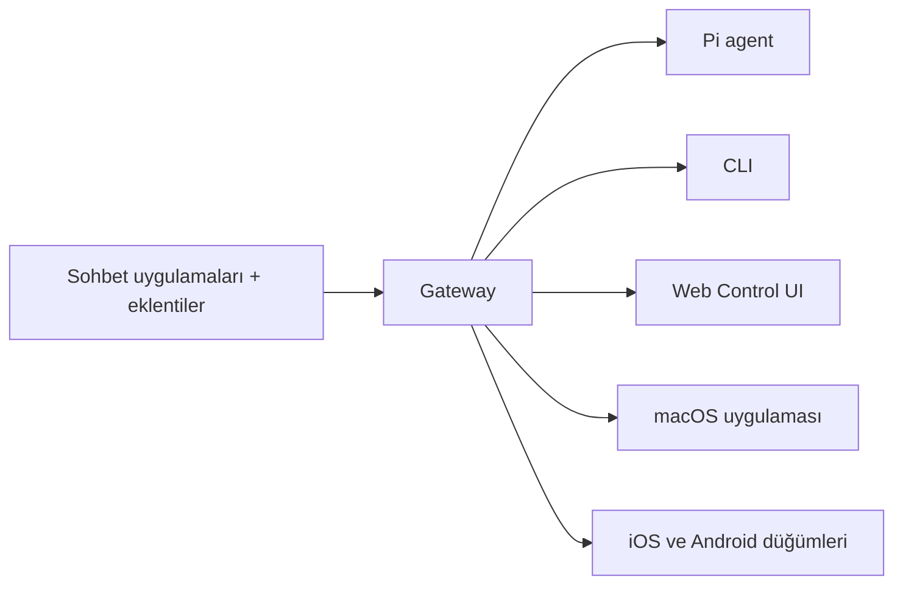

---
read_when:
    - OpenClaw'ı yeni kullanıcılara tanıtıyorsunuz
summary: OpenClaw, her işletim sisteminde çalışan AI ajanları için çok kanallı bir gateway'dir.
title: OpenClaw
x-i18n:
    generated_at: "2026-04-05T13:55:55Z"
    model: gpt-5.4
    provider: openai
    source_hash: 9c29a8d9fc41a94b650c524bb990106f134345560e6d615dac30e8815afff481
    source_path: index.md
    workflow: 15
---

# OpenClaw 🦞

<p align="center">
    
    
</p>

> _"EXFOLIATE! EXFOLIATE!"_ — Muhtemelen bir uzay ıstakozu

<p align="center">
  <strong>Discord, Google Chat, iMessage, Matrix, Microsoft Teams, Signal, Slack, Telegram, WhatsApp, Zalo ve daha fazlasında AI ajanları için her işletim sistemine uygun gateway.</strong><br />
  Bir mesaj gönderin, cebinizden bir ajan yanıtı alın. Yerleşik kanallar, paketlenmiş kanal eklentileri, WebChat ve mobil düğümler genelinde tek bir Gateway çalıştırın.
</p>

<Columns>
  <Card title="Başlayın" href="/start/getting-started" icon="rocket">
    OpenClaw'ı yükleyin ve Gateway'i birkaç dakika içinde ayağa kaldırın.
  </Card>
  <Card title="Başlangıç kurulumunu çalıştırın" href="/start/wizard" icon="sparkles">
    `openclaw onboard` ve eşleme akışlarıyla rehberli kurulum.
  </Card>
  <Card title="Kontrol UI'ı açın" href="/web/control-ui" icon="layout-dashboard">
    Sohbet, yapılandırma ve oturumlar için tarayıcı panosunu başlatın.
  </Card>
</Columns>

## OpenClaw nedir?

OpenClaw, favori sohbet uygulamalarınızı ve kanal yüzeylerinizi — yerleşik kanallar ile Discord, Google Chat, iMessage, Matrix, Microsoft Teams, Signal, Slack, Telegram, WhatsApp, Zalo ve daha fazlası gibi paketlenmiş veya harici kanal eklentileri dahil — Pi gibi AI kodlama ajanlarına bağlayan, **self-hosted bir gateway**'dir. Kendi makinenizde (veya bir sunucuda) tek bir Gateway süreci çalıştırırsınız ve bu, mesajlaşma uygulamalarınız ile her zaman erişilebilir bir AI asistanı arasındaki köprü haline gelir.

**Kimler için?** Verileri üzerindeki kontrolü kaybetmeden veya barındırılan bir hizmete güvenmeden, her yerden mesaj gönderebilecekleri kişisel bir AI asistanı isteyen geliştiriciler ve ileri düzey kullanıcılar.

**Onu farklı kılan nedir?**

- **Self-hosted**: kendi donanımınızda, kendi kurallarınızla çalışır
- **Çok kanallı**: tek bir Gateway aynı anda yerleşik kanallara ek olarak paketlenmiş veya harici kanal eklentilerine de hizmet verir
- **Ajana özgü**: araç kullanımı, oturumlar, bellek ve çok ajanlı yönlendirme ile kodlama ajanları için tasarlanmıştır
- **Açık kaynak**: MIT lisanslı, topluluk odaklı

**Neye ihtiyacınız var?** Uyumluluk için Node 24 (önerilir) veya Node 22 LTS (`22.14+`), seçtiğiniz sağlayıcıdan bir API anahtarı ve 5 dakika. En iyi kalite ve güvenlik için mevcut en güçlü yeni nesil modeli kullanın.

## Nasıl çalışır



Gateway, oturumlar, yönlendirme ve kanal bağlantıları için tek gerçek kaynaktır.

## Temel yetenekler

<Columns>
  <Card title="Çok kanallı gateway" icon="network">
    Tek bir Gateway süreciyle Discord, iMessage, Signal, Slack, Telegram, WhatsApp, WebChat ve daha fazlası.
  </Card>
  <Card title="Eklenti kanalları" icon="plug">
    Paketlenmiş eklentiler, normal güncel sürümlerde Matrix, Nostr, Twitch, Zalo ve daha fazlasını ekler.
  </Card>
  <Card title="Çok ajanlı yönlendirme" icon="route">
    Ajan, çalışma alanı veya gönderici başına yalıtılmış oturumlar.
  </Card>
  <Card title="Medya desteği" icon="image">
    Görüntü, ses ve belge gönderin ve alın.
  </Card>
  <Card title="Web Control UI" icon="monitor">
    Sohbet, yapılandırma, oturumlar ve düğümler için tarayıcı panosu.
  </Card>
  <Card title="Mobil düğümler" icon="smartphone">
    Canvas, kamera ve ses etkin iş akışları için iOS ve Android düğümlerini eşleyin.
  </Card>
</Columns>

## Hızlı başlangıç

<Steps>
  <Step title="OpenClaw'ı yükleyin">
    ```bash
    npm install -g openclaw@latest
    ```
  </Step>
  <Step title="Başlangıç kurulumunu yapın ve hizmeti yükleyin">
    ```bash
    openclaw onboard --install-daemon
    ```
  </Step>
  <Step title="Sohbet edin">
    Tarayıcınızda Kontrol UI'ı açın ve bir mesaj gönderin:

    ```bash
    openclaw dashboard
    ```

    Veya bir kanal bağlayın ([Telegram](/tr/channels/telegram) en hızlısıdır) ve telefonunuzdan sohbet edin.

  </Step>
</Steps>

Tam kurulum ve geliştirme ayarlarına mı ihtiyacınız var? [Getting Started](/start/getting-started) bölümüne bakın.

## Pano

Gateway başladıktan sonra tarayıcı Kontrol UI'ını açın.

- Yerel varsayılan: [http://127.0.0.1:18789/](http://127.0.0.1:18789/)
- Uzak erişim: [Web surfaces](/web) ve [Tailscale](/gateway/tailscale)

<p align="center">
  
</p>

## Yapılandırma (isteğe bağlı)

Yapılandırma `~/.openclaw/openclaw.json` konumunda bulunur.

- **Hiçbir şey yapmazsanız**, OpenClaw paketlenmiş Pi ikilisini RPC modunda ve gönderici başına oturumlarla kullanır.
- Kilitlemek istiyorsanız, `channels.whatsapp.allowFrom` ve (gruplar için) mention kurallarıyla başlayın.

Örnek:

```json5
{
  channels: {
    whatsapp: {
      allowFrom: ["+15555550123"],
      groups: { "*": { requireMention: true } },
    },
  },
  messages: { groupChat: { mentionPatterns: ["@openclaw"] } },
}
```

## Buradan başlayın

<Columns>
  <Card title="Belge merkezleri" href="/start/hubs" icon="book-open">
    Kullanım durumuna göre düzenlenmiş tüm belgeler ve kılavuzlar.
  </Card>
  <Card title="Yapılandırma" href="/gateway/configuration" icon="settings">
    Temel Gateway ayarları, token'lar ve sağlayıcı yapılandırması.
  </Card>
  <Card title="Uzak erişim" href="/gateway/remote" icon="globe">
    SSH ve tailnet erişim kalıpları.
  </Card>
  <Card title="Kanallar" href="/tr/channels/telegram" icon="message-square">
    Feishu, Microsoft Teams, WhatsApp, Telegram, Discord ve daha fazlası için kanala özgü kurulum.
  </Card>
  <Card title="Düğümler" href="/nodes" icon="smartphone">
    Eşleme, Canvas, kamera ve cihaz eylemleriyle iOS ve Android düğümleri.
  </Card>
  <Card title="Yardım" href="/help" icon="life-buoy">
    Yaygın düzeltmeler ve sorun giderme giriş noktası.
  </Card>
</Columns>

## Daha fazla bilgi

<Columns>
  <Card title="Tam özellik listesi" href="/concepts/features" icon="list">
    Eksiksiz kanal, yönlendirme ve medya yetenekleri.
  </Card>
  <Card title="Çok ajanlı yönlendirme" href="/concepts/multi-agent" icon="route">
    Çalışma alanı yalıtımı ve ajan başına oturumlar.
  </Card>
  <Card title="Güvenlik" href="/gateway/security" icon="shield">
    Token'lar, izin listeleri ve güvenlik kontrolleri.
  </Card>
  <Card title="Sorun giderme" href="/gateway/troubleshooting" icon="wrench">
    Gateway tanılamaları ve yaygın hatalar.
  </Card>
  <Card title="Hakkında ve katkıda bulunanlar" href="/reference/credits" icon="info">
    Proje kökenleri, katkıda bulunanlar ve lisans.
  </Card>
</Columns>
