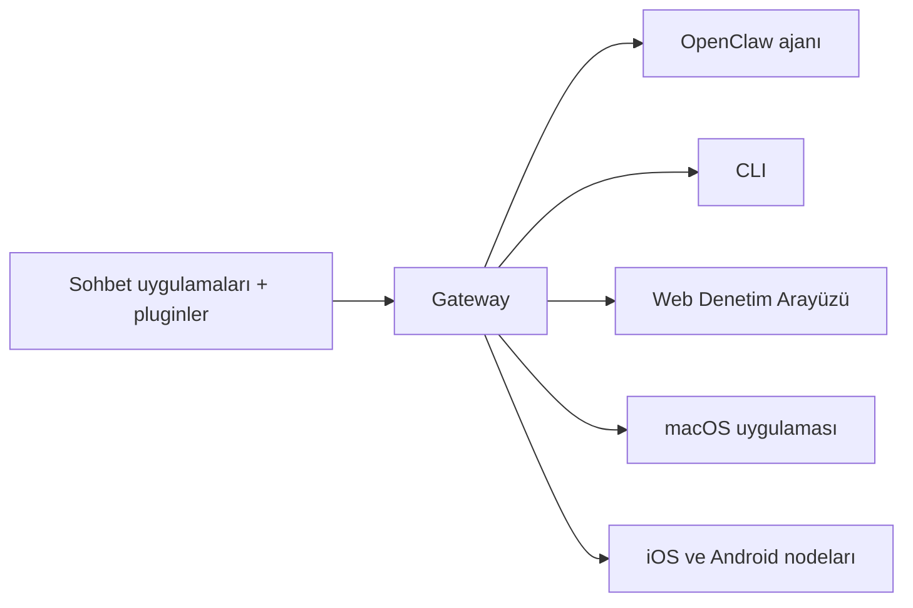

---
read_when:
    - OpenClaw'ı yeni başlayanlara tanıtma
summary: OpenClaw, herhangi bir işletim sisteminde çalışan, yapay zekâ ajanlarına yönelik çok kanallı bir Gateway'dir.
title: OpenClaw
x-i18n:
    generated_at: "2026-07-16T17:11:34Z"
    model: gpt-5.6
    postprocess_version: locale-links-v1
    prompt_version: 32
    provider: openai
    source_hash: fe97e7299be4855fd9af21838e0626b5a5c8aafe46d982859e9033f0efec2443
    source_path: index.md
    workflow: 16
---

# OpenClaw 🦞

<p align="center">
    
    
</p>

> _"PUL PUL DÖKÜL! PUL PUL DÖKÜL!"_ — Muhtemelen bir uzay ıstakozu

<p align="center">
  <strong>Discord, Google Chat, iMessage, Matrix, Microsoft Teams, Signal, Slack, Telegram, WhatsApp, Zalo ve daha fazlasındaki yapay zekâ ajanları için her işletim sisteminde çalışan Gateway.</strong><br />
  Mesaj gönderin, cebinizden bir ajan yanıtı alın. Kanal pluginleri, WebChat ve mobil nodelar genelinde tek bir Gateway çalıştırın.
</p>

<Columns>
  <Card title="Başlayın" href="/tr/start/getting-started" icon="rocket">
    OpenClaw'u kurun ve Gateway'i dakikalar içinde çalıştırın.
  </Card>
  <Card title="İlk Kurulumu Çalıştırın" href="/tr/start/wizard" icon="list-checks">
    `openclaw onboard` ve eşleştirme akışlarıyla yönlendirmeli kurulum.
  </Card>
  <Card title="Bir Kanal Bağlayın" href="/tr/channels" icon="message-circle">
    Her yerden sohbet etmek için Discord, Signal, Telegram, WhatsApp ve daha fazlasını bağlayın.
  </Card>
  <Card title="Denetim Arayüzünü Açın" href="/tr/web/control-ui" icon="layout-dashboard">
    Sohbet, yapılandırma ve oturumlar için tarayıcı panosunu açın.
  </Card>
</Columns>

## Belgelere göz atın

Mobil tarayıcılar, tam masaüstü sekme çubuğu olmadan bölüm menüsünü gösterebilir. Sayfa gövdesinden aynı üst düzey belge alanlarına ulaşmak için
bu merkez bağlantılarını kullanın.

<Columns>
  <Card title="Başlayın" href="/tr" icon="rocket">
    Genel bakış, vitrin, ilk adımlar ve kurulum kılavuzları.
  </Card>
  <Card title="Kurulum" href="/tr/install" icon="download">
    Kurulum yolları, güncellemeler, konteynerler, barındırma ve gelişmiş kurulum.
  </Card>
  <Card title="Kanallar" href="/tr/channels" icon="messages-square">
    Mesajlaşma kanalları, eşleştirme, yönlendirme, erişim grupları ve kanal kalite güvencesi.
  </Card>
  <Card title="Ajanlar" href="/tr/concepts/architecture" icon="bot">
    Mimari, oturumlar, bağlam, bellek ve çoklu ajan yönlendirmesi.
  </Card>
  <Card title="Yetenekler" href="/tr/tools" icon="wand-sparkles">
    Araçlar, Skills, Cron, webhooklar ve otomasyon yetenekleri.
  </Card>
  <Card title="ClawHub" href="/tr/clawhub" icon="store">
    Plugin pazarı, yayımlama, seçki oluşturma ve güven kılavuzu.
  </Card>
  <Card title="Modeller" href="/tr/providers" icon="brain">
    Sağlayıcılar, model yapılandırması, yük devretme ve yerel model hizmetleri.
  </Card>
  <Card title="Platformlar" href="/tr/platforms" icon="monitor-smartphone">
    macOS, Windows, iOS, Android, nodelar ve web yüzeyleri.
  </Card>
  <Card title="Gateway ve Operasyonlar" href="/tr/gateway" icon="server">
    Gateway yapılandırması, güvenlik, tanılama ve operasyonlar.
  </Card>
  <Card title="Referans" href="/tr/cli" icon="terminal">
    CLI referansı, şemalar, RPC, sürüm notları ve şablonlar.
  </Card>
  <Card title="Yardım" href="/tr/help" icon="life-buoy">
    Sorun giderme, sık sorulan sorular, testler, tanılama ve ortam kontrolleri.
  </Card>
</Columns>

## OpenClaw nedir?

OpenClaw, favori sohbet uygulamalarınızı — Discord, Google Chat, iMessage, Matrix, Microsoft Teams, Signal, Slack, Telegram, WhatsApp, Zalo ve daha fazlasını kanal pluginleri aracılığıyla — yapay zekâ kodlama ajanlarına bağlayan **kendi sunucunuzda barındırılan bir gateway'dir**. Kendi makinenizde (veya bir sunucuda) tek bir Gateway işlemi çalıştırırsınız; bu işlem, mesajlaşma uygulamalarınız ile her zaman erişilebilir bir yapay zekâ asistanı arasında köprü olur.

**Kimler için?** Verilerinin denetiminden vazgeçmeden veya barındırılan bir hizmete bağımlı kalmadan, her yerden mesaj gönderebilecekleri kişisel bir yapay zekâ asistanı isteyen geliştiriciler ve ileri düzey kullanıcılar için.

**Onu farklı kılan nedir?**

- **Kendi sunucunuzda barındırılır**: donanımınızda, kurallarınıza göre çalışır
- **Çok kanallı**: tek bir Gateway, yapılandırılmış tüm kanal pluginlerine aynı anda hizmet verir
- **Ajan odaklı**: araç kullanımı, oturumlar, bellek ve çoklu ajan yönlendirmesiyle kodlama ajanları için geliştirilmiştir
- **Açık kaynaklı**: MIT lisanslı ve topluluk odaklıdır

**Nelere ihtiyacınız var?** Node 24.15+ (önerilir), uyumluluk için Node 22 LTS (`22.22.3+`) veya Node 25.9+, seçtiğiniz sağlayıcıdan bir API anahtarı ve 5 dakika. En iyi kalite ve güvenlik için mevcut en güçlü en yeni nesil modeli kullanın.

## Nasıl çalışır?



Gateway; oturumlar, yönlendirme ve kanal bağlantıları için tek doğruluk kaynağıdır.

## Temel yetenekler

<Columns>
  <Card title="Çok kanallı gateway" icon="network" href="/tr/channels">
    Tek bir Gateway işlemiyle Discord, iMessage, Signal, Slack, Telegram, WhatsApp, WebChat ve daha fazlası.
  </Card>
  <Card title="Plugin kanalları" icon="plug" href="/tr/tools/plugin">
    Kanal pluginleri Matrix, Nostr, Twitch, Zalo ve daha fazlasını ekler; resmî pluginler gerektiğinde kurulur.
  </Card>
  <Card title="Çoklu ajan yönlendirmesi" icon="route" href="/tr/concepts/multi-agent">
    Ajan, çalışma alanı veya gönderici başına yalıtılmış oturumlar.
  </Card>
  <Card title="Medya desteği" icon="image" href="/tr/nodes/images">
    Görüntü, ses ve belge gönderip alın.
  </Card>
  <Card title="Web Denetim Arayüzü" icon="monitor" href="/tr/web/control-ui">
    Sohbet, yapılandırma, oturumlar ve nodelar için tarayıcı panosu.
  </Card>
  <Card title="Mobil nodelar" icon="smartphone" href="/tr/nodes">
    Canvas, kamera ve ses özellikli iş akışları için iOS ve Android nodelarını eşleştirin.
  </Card>
</Columns>

## Hızlı başlangıç

<Steps>
  <Step title="OpenClaw'u Kurun">
    ```bash
    npm install -g openclaw@latest
    ```
  </Step>
  <Step title="İlk kurulumu yapın ve hizmeti kurun">
    ```bash
    openclaw onboard --install-daemon
    ```
  </Step>
  <Step title="Sohbet edin">
    Tarayıcınızda Denetim Arayüzünü açın ve bir mesaj gönderin:

    ```bash
    openclaw dashboard
    ```

    Alternatif olarak bir kanal bağlayın ([Telegram](/tr/channels/telegram) en hızlısıdır) ve telefonunuzdan sohbet edin.

  </Step>
</Steps>

Eksiksiz kurulum ve geliştirme ortamı kurulumu mu gerekiyor? [Başlangıç](/tr/start/getting-started) sayfasına bakın.

## Pano

Gateway başladıktan sonra tarayıcı Denetim Arayüzünü açın.

- Yerel varsayılan: [http://127.0.0.1:18789/](http://127.0.0.1:18789/)
- Uzaktan erişim: [Web yüzeyleri](/tr/web) ve [Tailscale](/tr/gateway/tailscale)

<p align="center">
  
</p>

## Yapılandırma (isteğe bağlı)

Yapılandırma `~/.openclaw/openclaw.json` konumunda bulunur.

- **Hiçbir şey yapmazsanız** OpenClaw, paketle birlikte gelen OpenClaw ajan çalışma zamanını kullanır; doğrudan mesajlar ajanın ana oturumunu paylaşır ve her grup sohbeti kendi oturumuna sahip olur.
- Erişimi kısıtlamak istiyorsanız `channels.whatsapp.allowFrom` ile ve (gruplar için) bahsetme kurallarıyla başlayın.

Örnek:

```json5
{
  channels: {
    whatsapp: {
      allowFrom: ["+15555550123"],
      groups: { "*": { requireMention: true } },
    },
  },
  messages: { groupChat: { mentionPatterns: ["@openclaw"] } },
}
```

## Buradan başlayın

<Columns>
  <Card title="Belge merkezleri" href="/tr/start/hubs" icon="book-open">
    Kullanım senaryosuna göre düzenlenmiş tüm belgeler ve kılavuzlar.
  </Card>
  <Card title="Yapılandırma" href="/tr/gateway/configuration" icon="settings">
    Temel Gateway ayarları, tokenlar ve sağlayıcı yapılandırması.
  </Card>
  <Card title="Uzaktan erişim" href="/tr/gateway/remote" icon="globe">
    SSH ve tailnet erişim kalıpları.
  </Card>
  <Card title="Kanallar" href="/tr/channels/telegram" icon="message-square">
    Discord, Feishu, Microsoft Teams, Telegram, WhatsApp ve daha fazlası için kanala özel kurulum.
  </Card>
  <Card title="Nodelar" href="/tr/nodes" icon="smartphone">
    Eşleştirme, Canvas, kamera ve cihaz eylemlerine sahip iOS ve Android nodeları.
  </Card>
  <Card title="Yardım" href="/tr/help" icon="life-buoy">
    Yaygın düzeltmeler ve sorun giderme başlangıç noktası.
  </Card>
</Columns>

## Daha fazla bilgi edinin

<Columns>
  <Card title="Tam özellik listesi" href="/tr/concepts/features" icon="list">
    Tüm kanal, yönlendirme ve medya yetenekleri.
  </Card>
  <Card title="Çoklu ajan yönlendirmesi" href="/tr/concepts/multi-agent" icon="route">
    Çalışma alanı yalıtımı ve ajan başına oturumlar.
  </Card>
  <Card title="Güvenlik" href="/tr/gateway/security" icon="shield">
    Tokenlar, izin listeleri ve güvenlik denetimleri.
  </Card>
  <Card title="Sorun giderme" href="/tr/gateway/troubleshooting" icon="wrench">
    Gateway tanılaması ve yaygın hatalar.
  </Card>
  <Card title="Hakkında ve katkıda bulunanlar" href="/tr/reference/credits" icon="info">
    Projenin kökeni, katkıda bulunanlar ve lisans.
  </Card>
</Columns>
