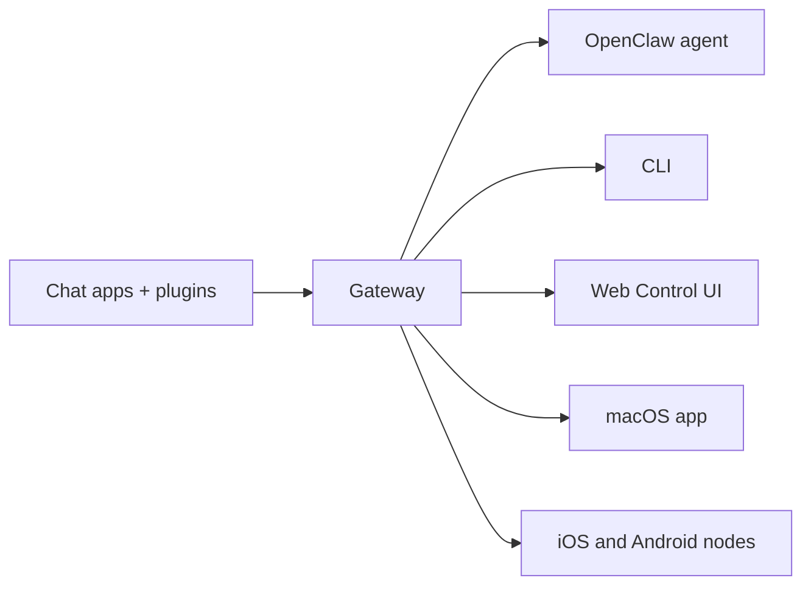

---
read_when:
    - OpenClaw'ı yeni başlayanlara tanıtma
summary: OpenClaw, herhangi bir işletim sisteminde çalışan AI ajanları için çok kanallı bir Gateway'dir.
title: OpenClaw
x-i18n:
    generated_at: "2026-06-28T00:42:35Z"
    model: gpt-5.5
    postprocess_version: locale-links-v1
    provider: openai
    source_hash: fcaa54a0a6d7aa62193fd9f03428bbcbfdcb2c00a184bcd6f49e4e093fefc473
    source_path: index.md
    workflow: 16
---

# OpenClaw 🦞

<p align="center">
    
    
</p>

> _"PUL PUL DÖKÜL! PUL PUL DÖKÜL!"_ — Muhtemelen uzaydan bir ıstakoz

<p align="center">
  <strong>Discord, Google Chat, iMessage, Matrix, Microsoft Teams, Signal, Slack, Telegram, WhatsApp, Zalo ve daha fazlasında AI ajanları için her işletim sisteminde çalışan Gateway.</strong><br />
  Bir mesaj gönderin, cebinizden bir ajan yanıtı alın. Yerleşik kanallar, paketli kanal Plugin'leri, WebChat ve mobil düğümler genelinde tek bir Gateway çalıştırın.
</p>

<Columns>
  <Card title="Başlayın" href="/tr/start/getting-started" icon="rocket">
    OpenClaw'u kurun ve Gateway'i dakikalar içinde ayağa kaldırın.
  </Card>
  <Card title="Başlatma Sihirbazını Çalıştırın" href="/tr/start/wizard" icon="list-checks">
    `openclaw onboard` ve eşleştirme akışlarıyla yönlendirmeli kurulum.
  </Card>
  <Card title="Kontrol Kullanıcı Arayüzünü Açın" href="/tr/web/control-ui" icon="layout-dashboard">
    Sohbet, yapılandırma ve oturumlar için tarayıcı panosunu başlatın.
  </Card>
</Columns>

## OpenClaw nedir?

OpenClaw, favori sohbet uygulamalarınızı ve kanal yüzeylerinizi — yerleşik kanalların yanı sıra Discord, Google Chat, iMessage, Matrix, Microsoft Teams, Signal, Slack, Telegram, WhatsApp, Zalo ve daha fazlası gibi paketli veya harici kanal Plugin'lerini — AI kodlama ajanlarına bağlayan **kendi barındırdığınız bir gateway**'dir. Kendi makinenizde (veya bir sunucuda) tek bir Gateway süreci çalıştırırsınız ve bu, mesajlaşma uygulamalarınız ile her zaman kullanılabilir bir AI asistanı arasında köprü olur.

**Kimler için?** Verilerinin kontrolünden vazgeçmeden veya barındırılan bir hizmete bağlı kalmadan her yerden mesaj atabilecekleri kişisel bir AI asistanı isteyen geliştiriciler ve ileri düzey kullanıcılar için.

**Onu farklı kılan nedir?**

- **Kendi barındırdığınız**: donanımınızda, kurallarınızla çalışır
- **Çok kanallı**: tek bir Gateway, yerleşik kanalların yanı sıra paketli veya harici kanal Plugin'lerini aynı anda sunar
- **Ajan odaklı**: araç kullanımı, oturumlar, bellek ve çok ajanlı yönlendirme ile kodlama ajanları için tasarlanmıştır
- **Açık kaynak**: MIT lisanslı, topluluk odaklı

**Neye ihtiyacınız var?** Node 24 (önerilir) veya uyumluluk için Node 22 LTS (`22.19+`), seçtiğiniz sağlayıcıdan bir API anahtarı ve 5 dakika. En iyi kalite ve güvenlik için mevcut en güçlü son nesil modeli kullanın.

## Nasıl çalışır?



Gateway; oturumlar, yönlendirme ve kanal bağlantıları için tek doğruluk kaynağıdır.

## Temel yetenekler

<Columns>
  <Card title="Çok kanallı gateway" icon="network" href="/tr/channels">
    Tek bir Gateway süreciyle Discord, iMessage, Signal, Slack, Telegram, WhatsApp, WebChat ve daha fazlası.
  </Card>
  <Card title="Plugin kanalları" icon="plug" href="/tr/tools/plugin">
    Paketli Plugin'ler, normal güncel sürümlerde Matrix, Nostr, Twitch, Zalo ve daha fazlasını ekler.
  </Card>
  <Card title="Çok ajanlı yönlendirme" icon="route" href="/tr/concepts/multi-agent">
    Ajan, çalışma alanı veya gönderen başına yalıtılmış oturumlar.
  </Card>
  <Card title="Medya desteği" icon="image" href="/tr/nodes/images">
    Görsel, ses ve belge gönderin ve alın.
  </Card>
  <Card title="Web Kontrol Kullanıcı Arayüzü" icon="monitor" href="/tr/web/control-ui">
    Sohbet, yapılandırma, oturumlar ve düğümler için tarayıcı panosu.
  </Card>
  <Card title="Mobil düğümler" icon="smartphone" href="/tr/nodes">
    Canvas, kamera ve ses etkin iş akışları için iOS ve Android düğümlerini eşleştirin.
  </Card>
</Columns>

## Hızlı başlangıç

<Steps>
  <Step title="OpenClaw'u kurun">
    ```bash
    npm install -g openclaw@latest
    ```
  </Step>
  <Step title="Başlatma sihirbazını çalıştırın ve hizmeti kurun">
    ```bash
    openclaw onboard --install-daemon
    ```
  </Step>
  <Step title="Sohbet edin">
    Tarayıcınızda Kontrol Kullanıcı Arayüzünü açın ve bir mesaj gönderin:

    ```bash
    openclaw dashboard
    ```

    Veya bir kanal bağlayın ([Telegram](/tr/channels/telegram) en hızlısıdır) ve telefonunuzdan sohbet edin.

  </Step>
</Steps>

Tam kurulum ve geliştirme yapılandırmasına mı ihtiyacınız var? [Başlarken](/tr/start/getting-started) bölümüne bakın.

## Pano

Gateway başladıktan sonra tarayıcı Kontrol Kullanıcı Arayüzünü açın.

- Yerel varsayılan: [http://127.0.0.1:18789/](http://127.0.0.1:18789/)
- Uzak erişim: [Web yüzeyleri](/tr/web) ve [Tailscale](/tr/gateway/tailscale)

<p align="center">
  
</p>

## Yapılandırma (isteğe bağlı)

Yapılandırma `~/.openclaw/openclaw.json` konumunda bulunur.

- **Hiçbir şey yapmazsanız**, OpenClaw gönderene özel oturumlarla paketli OpenClaw ajan çalışma zamanını kullanır.
- Kilitlemek istiyorsanız, `channels.whatsapp.allowFrom` ve (gruplar için) bahsetme kurallarıyla başlayın.

Örnek:

```json5
{
  channels: {
    whatsapp: {
      allowFrom: ["+15555550123"],
      groups: { "*": { requireMention: true } },
    },
  },
  messages: { groupChat: { mentionPatterns: ["@openclaw"] } },
}
```

## Buradan başlayın

<Columns>
  <Card title="Dokümantasyon merkezleri" href="/tr/start/hubs" icon="book-open">
    Kullanım senaryosuna göre düzenlenmiş tüm dokümantasyon ve kılavuzlar.
  </Card>
  <Card title="Yapılandırma" href="/tr/gateway/configuration" icon="settings">
    Temel Gateway ayarları, belirteçler ve sağlayıcı yapılandırması.
  </Card>
  <Card title="Uzak erişim" href="/tr/gateway/remote" icon="globe">
    SSH ve tailnet erişim kalıpları.
  </Card>
  <Card title="Kanallar" href="/tr/channels/telegram" icon="message-square">
    Feishu, Microsoft Teams, WhatsApp, Telegram, Discord ve daha fazlası için kanala özel kurulum.
  </Card>
  <Card title="Düğümler" href="/tr/nodes" icon="smartphone">
    Eşleştirme, Canvas, kamera ve cihaz eylemleriyle iOS ve Android düğümleri.
  </Card>
  <Card title="Yardım" href="/tr/help" icon="life-buoy">
    Yaygın düzeltmeler ve sorun giderme giriş noktası.
  </Card>
</Columns>

## Daha fazla bilgi edinin

<Columns>
  <Card title="Tam özellik listesi" href="/tr/concepts/features" icon="list">
    Eksiksiz kanal, yönlendirme ve medya yetenekleri.
  </Card>
  <Card title="Çok ajanlı yönlendirme" href="/tr/concepts/multi-agent" icon="route">
    Çalışma alanı yalıtımı ve ajan başına oturumlar.
  </Card>
  <Card title="Güvenlik" href="/tr/gateway/security" icon="shield">
    Belirteçler, izin listeleri ve güvenlik denetimleri.
  </Card>
  <Card title="Sorun giderme" href="/tr/gateway/troubleshooting" icon="wrench">
    Gateway tanılama ve yaygın hatalar.
  </Card>
  <Card title="Hakkında ve teşekkürler" href="/tr/reference/credits" icon="info">
    Projenin kökenleri, katkıda bulunanlar ve lisans.
  </Card>
</Columns>
