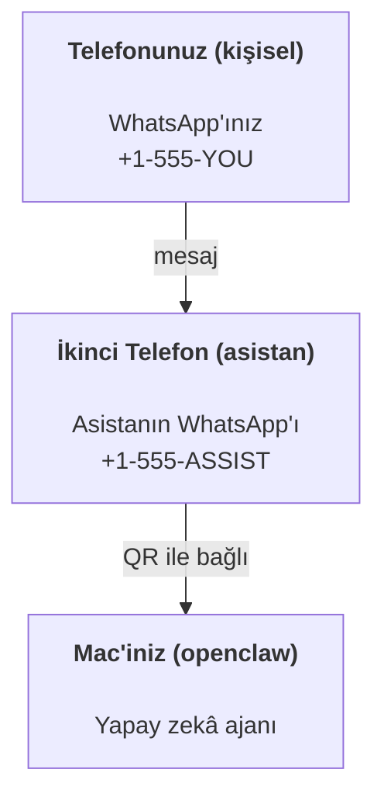

---
read_when:
    - Yeni bir asistan örneğini kullanıma hazırlama
    - Güvenlik/izin etkilerini inceleme
summary: Güvenlik uyarılarıyla OpenClaw'ı kişisel asistan olarak çalıştırmaya yönelik uçtan uca kılavuz
title: Kişisel asistan kurulumu
x-i18n:
    generated_at: "2026-07-16T17:45:24Z"
    model: gpt-5.6
    postprocess_version: locale-links-v1
    prompt_version: 32
    provider: openai
    source_hash: e8c34e31314f55647059fd600935330110add27b338a675bc0ce1529bebb207d
    source_path: start/openclaw.md
    workflow: 16
---

OpenClaw; Discord, Google Chat, iMessage, Matrix, Microsoft Teams, Signal, Slack, Telegram, WhatsApp, Zalo ve daha fazlasını yapay zekâ ajanlarına bağlayan, kendi sunucunuzda barındırılan bir Gateway'dir. Bu kılavuz, "kişisel asistan" kurulumunu ele alır: her zaman etkin yapay zekâ asistanınız gibi davranan, özel olarak ayrılmış bir WhatsApp numarası.

## Önce güvenlik

Bir ajana kanal erişimi vermek, onu (araç politikanıza bağlı olarak) makinenizde komut çalıştırabilecek, çalışma alanınızdaki dosyaları okuyup yazabilecek ve bağlı herhangi bir kanal üzerinden dışarıya mesaj gönderebilecek bir konuma getirir. Başlangıçta tedbirli davranın:

- Her zaman `channels.whatsapp.allowFrom` ayarlayın (kişisel Mac'inizde asla herkese açık şekilde çalıştırmayın).
- Asistan için özel olarak ayrılmış bir WhatsApp numarası kullanın.
- Heartbeat'ler varsayılan olarak her 30 dakikada bir çalışır. Kuruluma güvenene kadar `agents.defaults.heartbeat.every: "0m"` ayarlayarak devre dışı bırakın.

## Ön koşullar

- OpenClaw kurulmuş ve ilk kurulumu tamamlanmış olmalıdır; bunu henüz yapmadıysanız [Başlangıç](/tr/start/getting-started) bölümüne bakın
- Asistan için ikinci bir telefon numarası (SIM/eSIM/ön ödemeli)

## İki telefonlu kurulum (önerilen)

İstenen kurulum şudur:



Kişisel WhatsApp hesabınızı OpenClaw'a bağlarsanız size gelen her mesaj "ajan girdisi" hâline gelir. Genellikle istenen bu değildir.

## 5 dakikalık hızlı başlangıç

1. WhatsApp Web'i eşleştirin (QR gösterilir; asistan telefonuyla tarayın):

```bash
openclaw channels login
```

2. Gateway'i başlatın (çalışır durumda bırakın):

```bash
openclaw gateway --port 18789
```

3. `~/.openclaw/openclaw.json` içine asgari bir yapılandırma ekleyin:

```json5
{
  gateway: { mode: "local" },
  channels: { whatsapp: { allowFrom: ["+15555550123"] } },
}
```

Şimdi izin listesindeki telefonunuzdan asistan numarasına mesaj gönderin.

İlk kurulum tamamlandığında OpenClaw, panoyu otomatik olarak açar ve sade (token içermeyen) bir bağlantı yazdırır. Pano kimlik doğrulaması isterse yapılandırılmış paylaşılan gizli değeri Control UI ayarlarına yapıştırın. İlk kurulum varsayılan olarak token kullanır (`gateway.auth.token`), ancak `gateway.auth.mode` değerini `password` olarak değiştirdiyseniz parola kimlik doğrulaması da çalışır. Daha sonra yeniden açmak için: `openclaw dashboard`.

## Ajana bir çalışma alanı verin (AGENTS)

OpenClaw, çalışma talimatlarını ve "belleği" çalışma alanı dizininden okur.

OpenClaw varsayılan olarak ajan çalışma alanı olarak `~/.openclaw/workspace` kullanır ve ilk kurulum ya da ilk ajan çalıştırması sırasında bunu (başlangıç `AGENTS.md`, `SOUL.md`, `TOOLS.md`, `IDENTITY.md`, `USER.md`, `HEARTBEAT.md` dosyalarıyla birlikte) otomatik olarak oluşturur. `BOOTSTRAP.md` yalnızca yepyeni bir çalışma alanında oluşturulur ve silindikten sonra yeniden oluşturulmamalıdır. `MEMORY.md` isteğe bağlıdır ve hiçbir zaman otomatik oluşturulmaz; mevcut olduğunda normal oturumlar için yüklenir. Alt ajan oturumlarına yalnızca `AGENTS.md` ve `TOOLS.md` eklenir.

<Tip>
Bu klasörü OpenClaw'ın belleği olarak değerlendirin ve `AGENTS.md` ile bellek dosyalarınızın yedeklenmesi için onu bir git deposu (tercihen özel) hâline getirin. Git kuruluysa yepyeni çalışma alanları `git init` ile otomatik olarak başlatılır.
</Tip>

Tam ilk kurulum sihirbazını çalıştırmadan çalışma alanı ve yapılandırma klasörlerini oluşturmak için:

```bash
openclaw setup --baseline
```

(Yalın `openclaw setup`, `openclaw onboard` için bir diğer addır ve tam etkileşimli sihirbazı çalıştırır.)

Tam çalışma alanı düzeni ve yedekleme kılavuzu: [Ajan çalışma alanı](/tr/concepts/agent-workspace)
Bellek iş akışı: [Bellek](/tr/concepts/memory)

İsteğe bağlı: `agents.defaults.workspace` ile farklı bir çalışma alanı seçin (`~` desteklenir).

```json5
{
  agents: {
    defaults: {
      workspace: "~/.openclaw/workspace",
    },
  },
}
```

Kendi çalışma alanı dosyalarınızı zaten bir depodan sağlıyorsanız önyükleme dosyalarının oluşturulmasını tamamen devre dışı bırakabilirsiniz:

```json5
{
  agents: {
    defaults: {
      skipBootstrap: true,
    },
  },
}
```

## OpenClaw'ı "bir asistana" dönüştüren yapılandırma

OpenClaw varsayılan olarak iyi bir asistan kurulumuyla gelir, ancak genellikle şunları ayarlamak istersiniz:

- [`SOUL.md`](/tr/concepts/soul) içindeki kişilik/talimatlar
- düşünme varsayılanları (istenirse)
- Heartbeat'ler (güvenmeye başladıktan sonra)

Örnek:

```json5
{
  logging: { level: "info" },
  agents: {
    defaults: {
      model: { primary: "anthropic/claude-opus-4-8" },
      workspace: "~/.openclaw/workspace",
      thinkingDefault: "high",
      timeoutSeconds: 1800,
      // 0 ile başlayın; daha sonra etkinleştirin.
      heartbeat: { every: "0m" },
    },
    list: [
      {
        id: "main",
        default: true,
        groupChat: {
          mentionPatterns: ["@openclaw", "openclaw"],
        },
      },
    ],
  },
  channels: {
    whatsapp: {
      allowFrom: ["+15555550123"],
      groups: {
        "*": { requireMention: true },
      },
    },
  },
  session: {
    scope: "per-sender",
    resetTriggers: ["/new", "/reset"],
    reset: {
      mode: "daily",
      atHour: 4,
      idleMinutes: 10080,
    },
  },
}
```

## Oturumlar ve bellek

- Oturum satırları, döküm satırları ve meta veriler (token kullanımı, son rota vb.): `~/.openclaw/agents/<agentId>/agent/openclaw-agent.sqlite`
- Eski/arşiv döküm yapıtları: `~/.openclaw/agents/<agentId>/sessions/`
- Eski satırların taşıma kaynağı: `~/.openclaw/agents/<agentId>/sessions/sessions.json`
- `/new` veya `/reset`, ilgili sohbet için yeni bir oturum başlatır (`session.resetTriggers` üzerinden yapılandırılabilir). Tek başına gönderilirse OpenClaw, modeli çağırmadan sıfırlamayı onaylar.
- `/compact [instructions]`, oturum bağlamını sıkıştırır ve kalan bağlam bütçesini bildirir.

## Heartbeat'ler (proaktif mod)

OpenClaw varsayılan olarak aşağıdaki istemle her 30 dakikada bir Heartbeat çalıştırır:
`Read HEARTBEAT.md if it exists (workspace context). Follow it strictly. Do not infer or repeat old tasks from prior chats. If nothing needs attention, reply HEARTBEAT_OK.`
Devre dışı bırakmak için `agents.defaults.heartbeat.every: "0m"` ayarlayın.

- `HEARTBEAT.md` mevcut ancak fiilen boşsa (yalnızca boş satırlar, Markdown/HTML yorumları, `# Heading` gibi Markdown başlıkları, çit işaretleri veya boş kontrol listesi taslakları içeriyorsa), OpenClaw API çağrılarından tasarruf etmek için Heartbeat çalıştırmasını atlar.
- Dosya yoksa Heartbeat yine çalışır ve ne yapılacağına model karar verir.
- Ajan `HEARTBEAT_OK` ile yanıt verirse (isteğe bağlı olarak kısa dolgu metniyle; bkz. `agents.defaults.heartbeat.ackMaxChars`), OpenClaw ilgili Heartbeat için dışarıya teslimatı engeller.
- Varsayılan olarak DM tarzı `user:<id>` hedeflerine Heartbeat teslimatına izin verilir. Heartbeat çalıştırmalarını etkin tutarken doğrudan hedeflere teslimatı engellemek için `agents.defaults.heartbeat.directPolicy: "block"` ayarlayın.
- Heartbeat'ler tam ajan turları çalıştırır; daha kısa aralıklar daha fazla token tüketir.

```json5
{
  agents: {
    defaults: {
      heartbeat: { every: "30m" },
    },
  },
}
```

## Gelen ve giden medya

Gelen ekler (görseller/sesler/belgeler) şablonlar aracılığıyla komutunuza sunulabilir:

- `{{MediaPath}}` (yerel geçici dosya yolu)
- `{{MediaUrl}}` (sözde URL)
- `{{Transcript}}` (ses dökümü etkinse)

Ajanın giden ekleri, mesaj aracındaki veya yanıt yükündeki `media`, `mediaUrl`, `mediaUrls`, `path` ya da `filePath` gibi yapılandırılmış medya alanlarını kullanır. Örnek mesaj aracı argümanları:

```json
{
  "message": "Ekran görüntüsü burada.",
  "mediaUrl": "https://example.com/screenshot.png"
}
```

OpenClaw, yapılandırılmış medyayı metinle birlikte gönderir. Eski nihai asistan yanıtları uyumluluk amacıyla hâlâ normalleştirilebilir; ancak araç çıktısı, tarayıcı çıktısı, akış blokları ve mesaj eylemleri metni ek komutları olarak ayrıştırmaz.

Yerel yol davranışı, ajanla aynı dosya okuma güven modelini izler:

- `tools.fs.workspaceOnly`, `true` ise giden yerel medya yolları OpenClaw geçici kökü, medya önbelleği, ajan çalışma alanı yolları ve korumalı alanda oluşturulan dosyalarla sınırlı kalır.
- `tools.fs.workspaceOnly`, `false` ise giden yerel medya, ajanın okumasına zaten izin verilen ana makineye yerel dosyaları kullanabilir.
- Yerel yollar mutlak, çalışma alanına göreli veya `~/` ile ana dizine göreli olabilir.
- Ana makineye yerel gönderimler yine yalnızca medya ve güvenli belge türlerine (görseller, ses, video, PDF, Office belgeleri ve Markdown/MD, TXT, JSON, YAML ve YML gibi doğrulanmış metin belgeleri) izin verir. Bu, mevcut ana makine okuma güven sınırının bir uzantısıdır; gizli bilgi tarayıcısı değildir: ajan ana makineye yerel bir `secret.txt` veya `config.json` dosyasını okuyabiliyorsa uzantı ve içerik doğrulaması eşleştiğinde bu dosyayı ekleyebilir.

Hassas dosyaları ajanın okuyabildiği dosya sisteminin dışında tutun veya daha sıkı yerel yol gönderimleri için `tools.fs.workspaceOnly: true` ayarını koruyun.

## İşletim kontrol listesi

```bash
openclaw status          # yerel durum (kimlik bilgileri, oturumlar, sıraya alınmış olaylar)
openclaw status --all    # tam tanılama (salt okunur, yapıştırılabilir)
openclaw status --deep   # kanalları yokla (WhatsApp Web + Telegram + Discord + Slack + Signal)
openclaw health --json   # WS bağlantısı üzerinden gateway sağlık durumu anlık görüntüsü
```

Günlükler `/tmp/openclaw/` altında bulunur (varsayılan: `openclaw-YYYY-MM-DD.log`).

## Sonraki adımlar

- WebChat: [WebChat](/tr/web/webchat)
- Gateway işletimi: [Gateway işletim kılavuzu](/tr/gateway)
- Cron + uyandırmalar: [Cron işleri](/tr/automation/cron-jobs)
- macOS menü çubuğu yardımcı uygulaması: [OpenClaw macOS uygulaması](/tr/platforms/macos)
- iOS Node uygulaması: [iOS uygulaması](/tr/platforms/ios)
- Android Node uygulaması: [Android uygulaması](/tr/platforms/android)
- Windows Hub: [Windows](/tr/platforms/windows)
- Linux durumu: [Linux uygulaması](/tr/platforms/linux)
- Güvenlik: [Güvenlik](/tr/gateway/security)

## İlgili

- [Başlangıç](/tr/start/getting-started)
- [Kurulum](/tr/start/setup)
- [Kanallara genel bakış](/tr/channels)
