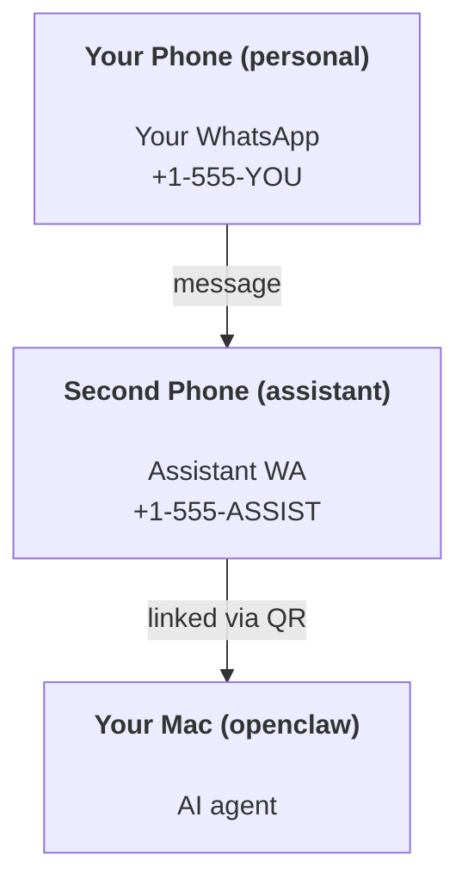

---
read_when:
    - Yeni bir asistan örneğini kullanıma hazırlama
    - Güvenlik/izin etkilerini gözden geçirme
summary: OpenClaw’ı güvenlik uyarılarıyla kişisel asistan olarak çalıştırmaya yönelik uçtan uca kılavuz
title: Kişisel asistan kurulumu
x-i18n:
    generated_at: "2026-06-28T01:19:32Z"
    model: gpt-5.5
    postprocess_version: locale-links-v1
    provider: openai
    source_hash: b0cd640872a2a60fd88d2dc3df6d038ef8574163430d8683ef9b67921b0c87f4
    source_path: start/openclaw.md
    workflow: 16
---

OpenClaw, Discord, Google Chat, iMessage, Matrix, Microsoft Teams, Signal, Slack, Telegram, WhatsApp, Zalo ve daha fazlasını AI ajanlarına bağlayan, kendi barındırdığınız bir gateway'dir. Bu kılavuz "kişisel asistan" kurulumunu kapsar: her zaman açık AI asistanınız gibi davranan özel bir WhatsApp numarası.

## ⚠️ Önce güvenlik

Bir ajanı şu konumlara getiriyorsunuz:

- makinenizde komut çalıştırmak (araç politikanıza bağlı olarak)
- çalışma alanınızdaki dosyaları okumak/yazmak
- WhatsApp/Telegram/Discord/Mattermost ve diğer paketli kanallar üzerinden dışarı mesaj göndermek

Temkinli başlayın:

- Her zaman `channels.whatsapp.allowFrom` ayarlayın (kişisel Mac'inizde herkese açık çalıştırmayın).
- Asistan için özel bir WhatsApp numarası kullanın.
- Heartbeat artık varsayılan olarak her 30 dakikada bir çalışır. Kuruluma güvenene kadar `agents.defaults.heartbeat.every: "0m"` ayarlayarak devre dışı bırakın.

## Ön koşullar

- OpenClaw kurulmuş ve ilk yapılandırması tamamlanmış olmalı - bunu henüz yapmadıysanız [Başlarken](/tr/start/getting-started) bölümüne bakın
- Asistan için ikinci bir telefon numarası (SIM/eSIM/ön ödemeli)

## İki telefonlu kurulum (önerilir)

İstediğiniz düzen şudur:



Kişisel WhatsApp'ınızı OpenClaw'a bağlarsanız, size gelen her mesaj "ajan girdisi" haline gelir. Genellikle istediğiniz şey bu değildir.

## 5 dakikalık hızlı başlangıç

1. WhatsApp Web'i eşleştirin (QR gösterir; asistan telefonuyla tarayın):

```bash
openclaw channels login
```

2. Gateway'i başlatın (çalışır halde bırakın):

```bash
openclaw gateway --port 18789
```

3. `~/.openclaw/openclaw.json` içine minimal bir yapılandırma koyun:

```json5
{
  gateway: { mode: "local" },
  channels: { whatsapp: { allowFrom: ["+15555550123"] } },
}
```

Şimdi izin listesine alınmış telefonunuzdan asistan numarasına mesaj gönderin.

İlk yapılandırma tamamlandığında OpenClaw panoyu otomatik açar ve temiz (token içermeyen) bir bağlantı yazdırır. Pano kimlik doğrulaması isterse, yapılandırılmış paylaşılan gizli anahtarı Control UI ayarlarına yapıştırın. İlk yapılandırma varsayılan olarak token kullanır (`gateway.auth.token`), ancak `gateway.auth.mode` değerini `password` olarak değiştirdiyseniz parola kimlik doğrulaması da çalışır. Daha sonra tekrar açmak için: `openclaw dashboard`.

## Ajan için bir çalışma alanı verin (AGENTS)

OpenClaw, çalışma talimatlarını ve "belleği" çalışma alanı dizininden okur.

Varsayılan olarak OpenClaw, ajan çalışma alanı olarak `~/.openclaw/workspace` kullanır ve kurulumda/ilk ajan çalıştırmasında bunu (başlangıç `AGENTS.md`, `SOUL.md`, `TOOLS.md`, `IDENTITY.md`, `USER.md`, `HEARTBEAT.md` ile birlikte) otomatik oluşturur. `BOOTSTRAP.md` yalnızca çalışma alanı tamamen yeniyken oluşturulur (sildikten sonra geri gelmemelidir). `MEMORY.md` isteğe bağlıdır (otomatik oluşturulmaz); varsa normal oturumlar için yüklenir. Alt ajan oturumları yalnızca `AGENTS.md` ve `TOOLS.md` dosyalarını enjekte eder.

<Tip>
Bu klasörü OpenClaw'ın belleği gibi değerlendirin ve `AGENTS.md` ile bellek dosyalarınızın yedeklenmesi için onu bir git reposu yapın (tercihen özel). Git kuruluysa, yepyeni çalışma alanları otomatik olarak başlatılır.
</Tip>

```bash
openclaw setup
```

Tam çalışma alanı düzeni + yedekleme kılavuzu: [Ajan çalışma alanı](/tr/concepts/agent-workspace)
Bellek iş akışı: [Bellek](/tr/concepts/memory)

İsteğe bağlı: `agents.defaults.workspace` ile farklı bir çalışma alanı seçin (`~` destekler).

```json5
{
  agents: {
    defaults: {
      workspace: "~/.openclaw/workspace",
    },
  },
}
```

Kendi çalışma alanı dosyalarınızı zaten bir repodan gönderiyorsanız, bootstrap dosyası oluşturmayı tamamen devre dışı bırakabilirsiniz:

```json5
{
  agents: {
    defaults: {
      skipBootstrap: true,
    },
  },
}
```

## Onu "bir asistana" dönüştüren yapılandırma

OpenClaw iyi bir asistan kurulumu ile varsayılan gelir, ancak genellikle şunları ayarlamak istersiniz:

- [`SOUL.md`](/tr/concepts/soul) içinde persona/talimatlar
- düşünme varsayılanları (istenirse)
- Heartbeat (ona güvendiğinizde)

Örnek:

```json5
{
  logging: { level: "info" },
  agents: {
    defaults: {
      model: { primary: "anthropic/claude-opus-4-6" },
      workspace: "~/.openclaw/workspace",
      thinkingDefault: "high",
      timeoutSeconds: 1800,
      // Start with 0; enable later.
      heartbeat: { every: "0m" },
    },
    list: [
      {
        id: "main",
        default: true,
        groupChat: {
          mentionPatterns: ["@openclaw", "openclaw"],
        },
      },
    ],
  },
  channels: {
    whatsapp: {
      allowFrom: ["+15555550123"],
      groups: {
        "*": { requireMention: true },
      },
    },
  },
  session: {
    scope: "per-sender",
    resetTriggers: ["/new", "/reset"],
    reset: {
      mode: "daily",
      atHour: 4,
      idleMinutes: 10080,
    },
  },
}
```

## Oturumlar ve bellek

- Oturum dosyaları: `~/.openclaw/agents/<agentId>/sessions/{{SessionId}}.jsonl`
- Oturum meta verileri (token kullanımı, son rota vb.): `~/.openclaw/agents/<agentId>/sessions/sessions.json` (eski: `~/.openclaw/sessions/sessions.json`)
- `/new` veya `/reset`, o sohbet için yeni bir oturum başlatır (`resetTriggers` ile yapılandırılabilir). Tek başına gönderilirse OpenClaw, modeli çağırmadan sıfırlamayı onaylar.
- `/compact [instructions]` oturum bağlamını sıkıştırır ve kalan bağlam bütçesini bildirir.

## Heartbeat (proaktif mod)

Varsayılan olarak OpenClaw, şu istemle her 30 dakikada bir Heartbeat çalıştırır:
`Read HEARTBEAT.md if it exists (workspace context). Follow it strictly. Do not infer or repeat old tasks from prior chats. If nothing needs attention, reply HEARTBEAT_OK.`
Devre dışı bırakmak için `agents.defaults.heartbeat.every: "0m"` ayarlayın.

- `HEARTBEAT.md` varsa ancak fiilen boşsa (yalnızca boş satırlar, Markdown/HTML yorumları, `# Heading` gibi Markdown başlıkları, fence işaretçileri veya boş kontrol listesi taslakları), OpenClaw API çağrılarını azaltmak için Heartbeat çalıştırmasını atlar.
- Dosya yoksa Heartbeat yine çalışır ve model ne yapılacağına karar verir.
- Ajan `HEARTBEAT_OK` ile yanıt verirse (isteğe bağlı olarak kısa dolgu ile; bkz. `agents.defaults.heartbeat.ackMaxChars`), OpenClaw bu Heartbeat için dışa teslimi bastırır.
- Varsayılan olarak, DM tarzı `user:<id>` hedeflerine Heartbeat teslimine izin verilir. Heartbeat çalıştırmalarını aktif tutarken doğrudan hedef teslimini bastırmak için `agents.defaults.heartbeat.directPolicy: "block"` ayarlayın.
- Heartbeat tam ajan dönüşleri çalıştırır - daha kısa aralıklar daha fazla token tüketir.

```json5
{
  agents: {
    defaults: {
      heartbeat: { every: "30m" },
    },
  },
}
```

## Medya girişi ve çıkışı

Gelen ekler (görüntüler/sesler/belgeler) şablonlar üzerinden komutunuza sunulabilir:

- `{{MediaPath}}` (yerel geçici dosya yolu)
- `{{MediaUrl}}` (sözde URL)
- `{{Transcript}}` (ses transkripsiyonu etkinse)

Ajandan çıkan ekler, mesaj aracı veya yanıt yükü üzerinde `media`, `mediaUrl`, `mediaUrls`, `path` ya da `filePath` gibi yapılandırılmış medya alanlarını kullanır. Örnek mesaj aracı argümanları:

```json
{
  "message": "Here's the screenshot.",
  "mediaUrl": "https://example.com/screenshot.png"
}
```

OpenClaw yapılandırılmış medyayı metinle birlikte gönderir. Eski nihai asistan yanıtları uyumluluk için hâlâ normalize edilebilir, ancak araç çıktısı, tarayıcı çıktısı, akış blokları ve mesaj eylemleri metni ek komutları olarak ayrıştırmaz.

Yerel yol davranışı, ajanla aynı dosya okuma güven modelini izler:

- `tools.fs.workspaceOnly` `true` ise, dışa giden yerel medya yolları OpenClaw geçici kökü, medya önbelleği, ajan çalışma alanı yolları ve sandbox tarafından oluşturulan dosyalarla sınırlı kalır.
- `tools.fs.workspaceOnly` `false` ise, dışa giden yerel medya, ajanın zaten okumasına izin verilen host-yerel dosyaları kullanabilir.
- Yerel yollar mutlak, çalışma alanına göre göreli veya `~/` ile ana dizine göre göreli olabilir.
- Host-yerel gönderimler yine yalnızca medya ve güvenli belge türlerine izin verir (görüntüler, ses, video, PDF, Office belgeleri ve Markdown/MD, TXT, JSON, YAML ve YML gibi doğrulanmış metin belgeleri). Bu, mevcut host okuma güven sınırının bir uzantısıdır; gizli tarayıcı değildir: ajan host-yerel bir `secret.txt` veya `config.json` okuyabiliyorsa, uzantı ve içerik doğrulaması eşleştiğinde o dosyayı ekleyebilir.

Bu, fs politikanız bu okumalarına zaten izin veriyorsa çalışma alanı dışındaki oluşturulmuş görüntülerin/dosyaların artık gönderilebileceği, rastgele host-yerel metin uzantılarının ise engelli kalacağı anlamına gelir. Hassas dosyaları ajanın okuyabildiği dosya sisteminin dışında tutun veya daha katı yerel yol gönderimleri için `tools.fs.workspaceOnly=true` tutun.

## Operasyon kontrol listesi

```bash
openclaw status          # local status (creds, sessions, queued events)
openclaw status --all    # full diagnosis (read-only, pasteable)
openclaw status --deep   # asks the gateway for a live health probe with channel probes when supported
openclaw health --json   # gateway health snapshot (WS; default can return a fresh cached snapshot)
```

Günlükler `/tmp/openclaw/` altında tutulur (varsayılan: `openclaw-YYYY-MM-DD.log`).

## Sonraki adımlar

- WebChat: [WebChat](/tr/web/webchat)
- Gateway işlemleri: [Gateway çalışma kılavuzu](/tr/gateway)
- Cron + uyandırmalar: [Cron işleri](/tr/automation/cron-jobs)
- macOS menü çubuğu yardımcı uygulaması: [OpenClaw macOS uygulaması](/tr/platforms/macos)
- iOS düğüm uygulaması: [iOS uygulaması](/tr/platforms/ios)
- Android düğüm uygulaması: [Android uygulaması](/tr/platforms/android)
- Windows Hub: [Windows](/tr/platforms/windows)
- Linux durumu: [Linux uygulaması](/tr/platforms/linux)
- Güvenlik: [Güvenlik](/tr/gateway/security)

## İlgili

- [Başlarken](/tr/start/getting-started)
- [Kurulum](/tr/start/setup)
- [Kanallara genel bakış](/tr/channels)
