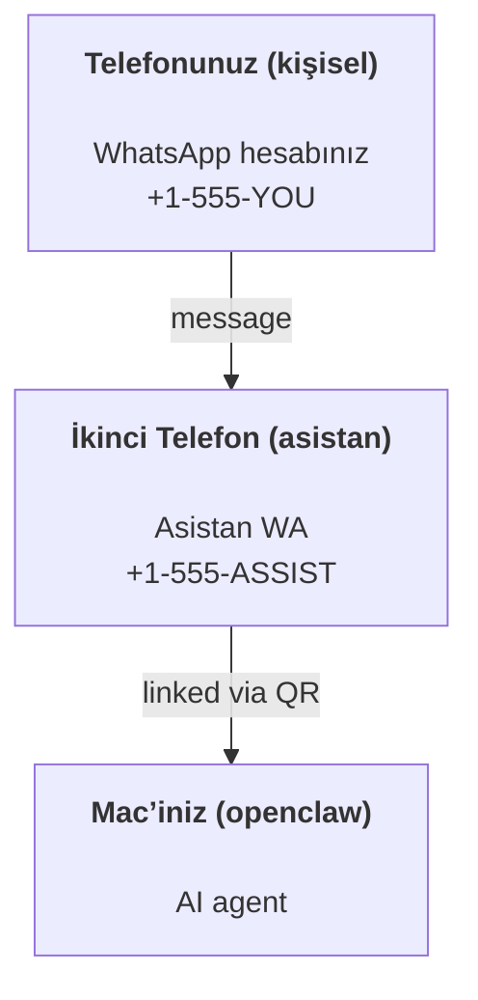

---
read_when:
    - Yeni bir asistan örneği için onboarding yapıyorsanız
    - Güvenlik/izin etkilerini gözden geçiriyorsanız
summary: OpenClaw’u güvenlik uyarılarıyla birlikte kişisel asistan olarak çalıştırmak için uçtan uca kılavuz
title: Kişisel Asistan Kurulumu
x-i18n:
    generated_at: "2026-04-05T14:09:18Z"
    model: gpt-5.4
    provider: openai
    source_hash: 02f10a9f7ec08f71143cbae996d91cbdaa19897a40f725d8ef524def41cf2759
    source_path: start/openclaw.md
    workflow: 15
---

# OpenClaw ile kişisel bir asistan oluşturma

OpenClaw; Discord, Google Chat, iMessage, Matrix, Microsoft Teams, Signal, Slack, Telegram, WhatsApp, Zalo ve daha fazlasını AI ajanlarına bağlayan, kendi kendine barındırılan bir Gateway’dir. Bu kılavuz, "kişisel asistan" kurulumunu kapsar: her zaman açık AI asistanınız gibi davranan özel bir WhatsApp numarası.

## ⚠️ Önce güvenlik

Bir ajanı şu konuma yerleştiriyorsunuz:

- makinenizde komut çalıştırmak (araç ilkenize bağlı olarak)
- çalışma alanınızdaki dosyaları okumak/yazmak
- WhatsApp/Telegram/Discord/Mattermost ve diğer paketli kanallar üzerinden dışarıya mesaj göndermek

Temkinli başlayın:

- Her zaman `channels.whatsapp.allowFrom` ayarlayın (kişisel Mac’inizde asla herkese açık çalıştırmayın).
- Asistan için özel bir WhatsApp numarası kullanın.
- Heartbeat’ler artık varsayılan olarak her 30 dakikada birdir. Kuruluma güvenene kadar `agents.defaults.heartbeat.every: "0m"` ayarlayarak devre dışı bırakın.

## Önkoşullar

- OpenClaw yüklü ve onboarding tamamlanmış olmalı — bunu henüz yapmadıysanız [Getting Started](/start/getting-started) bölümüne bakın
- Asistan için ikinci bir telefon numarası (SIM/eSIM/ön ödemeli)

## İki telefonlu kurulum (önerilir)

İstediğiniz yapı şudur:



Kişisel WhatsApp hesabınızı OpenClaw’a bağlarsanız, size gelen her mesaj “ajan girdisi” haline gelir. Bu genellikle isteyeceğiniz şey değildir.

## 5 dakikalık hızlı başlangıç

1. WhatsApp Web’i eşleştirin (QR gösterir; asistan telefonuyla tarayın):

```bash
openclaw channels login
```

2. Gateway’i başlatın (çalışır durumda bırakın):

```bash
openclaw gateway --port 18789
```

3. `~/.openclaw/openclaw.json` içine minimal bir yapılandırma yerleştirin:

```json5
{
  gateway: { mode: "local" },
  channels: { whatsapp: { allowFrom: ["+15555550123"] } },
}
```

Şimdi izin verilen telefonunuzdan asistan numarasına mesaj gönderin.

Onboarding tamamlandığında panoyu otomatik açar ve temiz (token içermeyen) bir bağlantı yazdırırız. Kimlik doğrulama isterse, yapılandırılmış paylaşılan gizli anahtarı Control UI ayarlarına yapıştırın. Onboarding varsayılan olarak bir token kullanır (`gateway.auth.token`), ancak `gateway.auth.mode` değerini `password` olarak değiştirdiyseniz parola kimlik doğrulaması da çalışır. Daha sonra yeniden açmak için: `openclaw dashboard`.

## Ajana bir çalışma alanı verin (AGENTS)

OpenClaw, çalışma alanı dizininden işletim yönergelerini ve “belleği” okur.

Varsayılan olarak OpenClaw, ajan çalışma alanı olarak `~/.openclaw/workspace` kullanır ve bunu (başlangıç için `AGENTS.md`, `SOUL.md`, `TOOLS.md`, `IDENTITY.md`, `USER.md`, `HEARTBEAT.md` ile birlikte) kurulumda/ilk ajan çalıştırmasında otomatik oluşturur. `BOOTSTRAP.md` yalnızca çalışma alanı tamamen yeniyse oluşturulur (sildikten sonra geri gelmemelidir). `MEMORY.md` isteğe bağlıdır (otomatik oluşturulmaz); varsa normal oturumlar için yüklenir. Alt ajan oturumları yalnızca `AGENTS.md` ve `TOOLS.md` enjekte eder.

İpucu: bu klasörü OpenClaw’un “belleği” gibi değerlendirin ve `AGENTS.md` + bellek dosyalarınız yedeklensin diye bunu bir git deposu yapın (tercihen özel). Git yüklüyse, yepyeni çalışma alanları otomatik başlatılır.

```bash
openclaw setup
```

Tam çalışma alanı düzeni + yedekleme kılavuzu: [Agent workspace](/tr/concepts/agent-workspace)
Bellek iş akışı: [Memory](/tr/concepts/memory)

İsteğe bağlı: `agents.defaults.workspace` ile farklı bir çalışma alanı seçin (`~` desteklenir).

```json5
{
  agent: {
    workspace: "~/.openclaw/workspace",
  },
}
```

Zaten kendi çalışma alanı dosyalarınızı bir depodan sağlıyorsanız, bootstrap dosyası oluşturmayı tamamen devre dışı bırakabilirsiniz:

```json5
{
  agent: {
    skipBootstrap: true,
  },
}
```

## Bunu "bir asistana" dönüştüren yapılandırma

OpenClaw varsayılan olarak iyi bir asistan kurulumu sunar, ancak genellikle şunları ayarlamak istersiniz:

- [`SOUL.md`](/tr/concepts/soul) içindeki persona/yönergeler
- düşünme varsayılanları (istenirse)
- heartbeat’ler (güven kazandıktan sonra)

Örnek:

```json5
{
  logging: { level: "info" },
  agent: {
    model: "anthropic/claude-opus-4-6",
    workspace: "~/.openclaw/workspace",
    thinkingDefault: "high",
    timeoutSeconds: 1800,
    // 0 ile başlayın; daha sonra etkinleştirin.
    heartbeat: { every: "0m" },
  },
  channels: {
    whatsapp: {
      allowFrom: ["+15555550123"],
      groups: {
        "*": { requireMention: true },
      },
    },
  },
  routing: {
    groupChat: {
      mentionPatterns: ["@openclaw", "openclaw"],
    },
  },
  session: {
    scope: "per-sender",
    resetTriggers: ["/new", "/reset"],
    reset: {
      mode: "daily",
      atHour: 4,
      idleMinutes: 10080,
    },
  },
}
```

## Oturumlar ve bellek

- Oturum dosyaları: `~/.openclaw/agents/<agentId>/sessions/{{SessionId}}.jsonl`
- Oturum meta verileri (token kullanımı, son rota vb.): `~/.openclaw/agents/<agentId>/sessions/sessions.json` (eski: `~/.openclaw/sessions/sessions.json`)
- `/new` veya `/reset`, o sohbet için yeni bir oturum başlatır (`resetTriggers` ile yapılandırılabilir). Tek başına gönderilirse, ajan sıfırlamayı onaylamak için kısa bir merhaba ile yanıt verir.
- `/compact [instructions]`, oturum bağlamını sıkıştırır ve kalan bağlam bütçesini bildirir.

## Heartbeat’ler (proaktif mod)

Varsayılan olarak OpenClaw her 30 dakikada bir şu istemle heartbeat çalıştırır:
`Read HEARTBEAT.md if it exists (workspace context). Follow it strictly. Do not infer or repeat old tasks from prior chats. If nothing needs attention, reply HEARTBEAT_OK.`
Devre dışı bırakmak için `agents.defaults.heartbeat.every: "0m"` ayarlayın.

- Eğer `HEARTBEAT.md` varsa ama fiilen boşsa (yalnızca boş satırlar ve `# Heading` gibi markdown başlıkları içeriyorsa), OpenClaw API çağrılarını azaltmak için heartbeat çalıştırmasını atlar.
- Dosya yoksa, heartbeat yine çalışır ve ne yapılacağına model karar verir.
- Ajan `HEARTBEAT_OK` ile yanıt verirse (isteğe bağlı kısa dolgu ile; bkz. `agents.defaults.heartbeat.ackMaxChars`), OpenClaw o heartbeat için dışa giden teslimatı bastırır.
- Varsayılan olarak, `user:<id>` tarzı DM hedeflerine heartbeat teslimatına izin verilir. Heartbeat çalıştırmalarını etkin tutarken doğrudan hedef teslimatını bastırmak için `agents.defaults.heartbeat.directPolicy: "block"` ayarlayın.
- Heartbeat’ler tam ajan dönüşleri çalıştırır — daha kısa aralıklar daha fazla token tüketir.

```json5
{
  agent: {
    heartbeat: { every: "30m" },
  },
}
```

## İçeri ve dışarı medya

Gelen ekler (görseller/ses/belgeler), şablonlar aracılığıyla komutunuza aktarılabilir:

- `{{MediaPath}}` (yerel geçici dosya yolu)
- `{{MediaUrl}}` (sözde URL)
- `{{Transcript}}` (ses dökümü etkinse)

Ajandan giden ekler: kendi satırında `MEDIA:<path-or-url>` ekleyin (boşluk yok). Örnek:

```
İşte ekran görüntüsü.
MEDIA:https://example.com/screenshot.png
```

OpenClaw bunları ayıklar ve metnin yanında medya olarak gönderir.

Yerel yol davranışı, ajanla aynı dosya okuma güven modeli izler:

- Eğer `tools.fs.workspaceOnly` değeri `true` ise, giden `MEDIA:` yerel yolları OpenClaw geçici kökü, medya önbelleği, ajan çalışma alanı yolları ve sandbox tarafından oluşturulan dosyalarla sınırlı kalır.
- Eğer `tools.fs.workspaceOnly` değeri `false` ise, giden `MEDIA:` ajan zaten okuyabildiği ana makine yerel dosyalarını kullanabilir.
- Ana makine yerel gönderimleri yine de yalnızca medya ve güvenli belge türlerine izin verir (görseller, ses, video, PDF ve Office belgeleri). Düz metin ve gizli bilgi benzeri dosyalar gönderilebilir medya olarak değerlendirilmez.

Bu da, dosya sistemi ilkeniz bu okumalara zaten izin veriyorsa, çalışma alanı dışındaki oluşturulmuş görsellerin/dosyaların artık keyfi ana makine metin eki sızdırmasını yeniden açmadan gönderilebileceği anlamına gelir.

## İşletim kontrol listesi

```bash
openclaw status          # yerel durum (kimlik bilgileri, oturumlar, kuyruktaki olaylar)
openclaw status --all    # tam teşhis (salt okunur, yapıştırılabilir)
openclaw status --deep   # desteklendiğinde kanal probe'ları ile birlikte canlı bir sağlık probe'u için gateway'e sorar
openclaw health --json   # gateway sağlık anlık görüntüsü (WS; varsayılan olarak yeni bir önbellekli anlık görüntü döndürebilir)
```

Günlükler `/tmp/openclaw/` altında bulunur (varsayılan: `openclaw-YYYY-MM-DD.log`).

## Sonraki adımlar

- WebChat: [WebChat](/web/webchat)
- Gateway işlemleri: [Gateway runbook](/tr/gateway)
- Cron + uyandırmalar: [Cron jobs](/tr/automation/cron-jobs)
- macOS menü çubuğu eşlikçi uygulaması: [OpenClaw macOS app](/tr/platforms/macos)
- iOS node uygulaması: [iOS app](/tr/platforms/ios)
- Android node uygulaması: [Android app](/tr/platforms/android)
- Windows durumu: [Windows (WSL2)](/tr/platforms/windows)
- Linux durumu: [Linux app](/tr/platforms/linux)
- Güvenlik: [Security](/tr/gateway/security)
