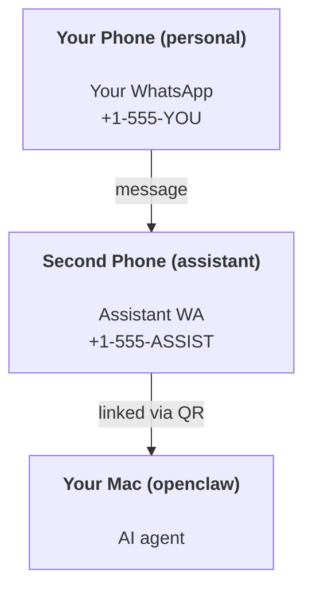

---
read_when:
    - Yeni bir asistan örneğini kullanıma hazırlama
    - Güvenlik/izin etkileri inceleniyor
summary: OpenClaw'ı güvenlik uyarılarıyla kişisel asistan olarak çalıştırmak için uçtan uca kılavuz
title: Kişisel asistan kurulumu
x-i18n:
    generated_at: "2026-04-30T09:46:03Z"
    model: gpt-5.5
    provider: openai
    source_hash: b0614272f9a2b30e0900c55b39a8bd6a2b71b9f5d5fbf0fe00c534b91193e6a0
    source_path: start/openclaw.md
    workflow: 16
---

# OpenClaw ile kişisel asistan oluşturma

OpenClaw; Discord, Google Chat, iMessage, Matrix, Microsoft Teams, Signal, Slack, Telegram, WhatsApp, Zalo ve daha fazlasını AI ajanlarına bağlayan, kendi barındırdığınız bir Gateway'dir. Bu kılavuz "kişisel asistan" kurulumunu kapsar: her zaman açık AI asistanınız gibi davranan özel bir WhatsApp numarası.

## ⚠️ Önce güvenlik

Bir ajanı şu konumlara getiriyorsunuz:

- makinenizde komut çalıştırma (araç politikanıza bağlı olarak)
- çalışma alanınızdaki dosyaları okuma/yazma
- WhatsApp/Telegram/Discord/Mattermost ve paketle gelen diğer kanallar üzerinden dışarı mesaj gönderme

Muhafazakar başlayın:

- Her zaman `channels.whatsapp.allowFrom` ayarlayın (kişisel Mac'inizde dünyaya açık çalıştırmayın).
- Asistan için özel bir WhatsApp numarası kullanın.
- Heartbeat'ler artık varsayılan olarak 30 dakikada bir çalışır. Kuruluma güvenene kadar `agents.defaults.heartbeat.every: "0m"` ayarlayarak devre dışı bırakın.

## Ön koşullar

- OpenClaw kurulmuş ve ilk kurulumu yapılmış olmalı — bunu henüz yapmadıysanız [Başlarken](/tr/start/getting-started) bölümüne bakın
- Asistan için ikinci bir telefon numarası (SIM/eSIM/ön ödemeli)

## İki telefonlu kurulum (önerilir)

İstediğiniz yapı şudur:



Kişisel WhatsApp hesabınızı OpenClaw'a bağlarsanız, size gelen her mesaj “ajan girdisi” olur. Bu çoğu zaman istediğiniz şey değildir.

## 5 dakikalık hızlı başlangıç

1. WhatsApp Web'i eşleştirin (QR gösterilir; asistan telefonuyla tarayın):

```bash
openclaw channels login
```

2. Gateway'i başlatın (çalışır durumda bırakın):

```bash
openclaw gateway --port 18789
```

3. `~/.openclaw/openclaw.json` içine asgari bir yapılandırma koyun:

```json5
{
  gateway: { mode: "local" },
  channels: { whatsapp: { allowFrom: ["+15555550123"] } },
}
```

Şimdi izin verilenler listesine eklediğiniz telefondan asistan numarasına mesaj gönderin.

İlk kurulum tamamlandığında OpenClaw panoyu otomatik açar ve temiz (token içermeyen) bir bağlantı yazdırır. Pano kimlik doğrulaması isterse, yapılandırılmış paylaşılan sırrı Control UI ayarlarına yapıştırın. İlk kurulum varsayılan olarak bir token (`gateway.auth.token`) kullanır, ancak `gateway.auth.mode` değerini `password` olarak değiştirdiyseniz parola kimlik doğrulaması da çalışır. Daha sonra tekrar açmak için: `openclaw dashboard`.

## Ajana bir çalışma alanı verin (AGENTS)

OpenClaw, çalışma yönergelerini ve “belleği” çalışma alanı dizininden okur.

OpenClaw varsayılan olarak ajan çalışma alanı için `~/.openclaw/workspace` kullanır ve kurulumda/ilk ajan çalıştırmasında bunu (artı başlangıç `AGENTS.md`, `SOUL.md`, `TOOLS.md`, `IDENTITY.md`, `USER.md`, `HEARTBEAT.md`) otomatik olarak oluşturur. `BOOTSTRAP.md` yalnızca çalışma alanı yepyeniyse oluşturulur (sildikten sonra geri gelmemelidir). `MEMORY.md` isteğe bağlıdır (otomatik oluşturulmaz); mevcut olduğunda normal oturumlar için yüklenir. Alt ajan oturumları yalnızca `AGENTS.md` ve `TOOLS.md` enjekte eder.

<Tip>
Bu klasörü OpenClaw'ın belleği gibi ele alın ve bir git deposu yapın (tercihen özel), böylece `AGENTS.md` ve bellek dosyalarınız yedeklenir. Git yüklüyse yepyeni çalışma alanları otomatik olarak başlatılır.
</Tip>

```bash
openclaw setup
```

Tam çalışma alanı düzeni + yedekleme kılavuzu: [Ajan çalışma alanı](/tr/concepts/agent-workspace)
Bellek iş akışı: [Bellek](/tr/concepts/memory)

İsteğe bağlı: `agents.defaults.workspace` ile farklı bir çalışma alanı seçin (`~` desteklenir).

```json5
{
  agents: {
    defaults: {
      workspace: "~/.openclaw/workspace",
    },
  },
}
```

Kendi çalışma alanı dosyalarınızı zaten bir depodan gönderiyorsanız, bootstrap dosyası oluşturmayı tamamen devre dışı bırakabilirsiniz:

```json5
{
  agents: {
    defaults: {
      skipBootstrap: true,
    },
  },
}
```

## Bunu "bir asistana" dönüştüren yapılandırma

OpenClaw varsayılan olarak iyi bir asistan kurulumuyla gelir, ancak genelde şunları ayarlamak istersiniz:

- [`SOUL.md`](/tr/concepts/soul) içindeki persona/yönergeler
- düşünme varsayılanları (istenirse)
- Heartbeat'ler (güvendikten sonra)

Örnek:

```json5
{
  logging: { level: "info" },
  agent: {
    model: "anthropic/claude-opus-4-6",
    workspace: "~/.openclaw/workspace",
    thinkingDefault: "high",
    timeoutSeconds: 1800,
    // Start with 0; enable later.
    heartbeat: { every: "0m" },
  },
  channels: {
    whatsapp: {
      allowFrom: ["+15555550123"],
      groups: {
        "*": { requireMention: true },
      },
    },
  },
  routing: {
    groupChat: {
      mentionPatterns: ["@openclaw", "openclaw"],
    },
  },
  session: {
    scope: "per-sender",
    resetTriggers: ["/new", "/reset"],
    reset: {
      mode: "daily",
      atHour: 4,
      idleMinutes: 10080,
    },
  },
}
```

## Oturumlar ve bellek

- Oturum dosyaları: `~/.openclaw/agents/<agentId>/sessions/{{SessionId}}.jsonl`
- Oturum meta verileri (token kullanımı, son rota vb.): `~/.openclaw/agents/<agentId>/sessions/sessions.json` (eski: `~/.openclaw/sessions/sessions.json`)
- `/new` veya `/reset`, o sohbet için yeni bir oturum başlatır (`resetTriggers` üzerinden yapılandırılabilir). Tek başına gönderilirse OpenClaw modeli çağırmadan sıfırlamayı onaylar.
- `/compact [instructions]` oturum bağlamını sıkıştırır ve kalan bağlam bütçesini bildirir.

## Heartbeat'ler (proaktif mod)

Varsayılan olarak OpenClaw, şu istemle her 30 dakikada bir Heartbeat çalıştırır:
`Read HEARTBEAT.md if it exists (workspace context). Follow it strictly. Do not infer or repeat old tasks from prior chats. If nothing needs attention, reply HEARTBEAT_OK.`
Devre dışı bırakmak için `agents.defaults.heartbeat.every: "0m"` ayarlayın.

- `HEARTBEAT.md` varsa ancak fiilen boşsa (yalnızca boş satırlar ve `# Heading` gibi markdown başlıkları), OpenClaw API çağrılarını azaltmak için Heartbeat çalıştırmasını atlar.
- Dosya eksikse Heartbeat yine çalışır ve model ne yapacağına karar verir.
- Ajan `HEARTBEAT_OK` ile yanıt verirse (isteğe bağlı kısa dolgu ile; bkz. `agents.defaults.heartbeat.ackMaxChars`), OpenClaw o Heartbeat için dışa gönderimi bastırır.
- Varsayılan olarak DM tarzı `user:<id>` hedeflerine Heartbeat teslimine izin verilir. Heartbeat çalıştırmalarını aktif tutarken doğrudan hedef teslimini bastırmak için `agents.defaults.heartbeat.directPolicy: "block"` ayarlayın.
- Heartbeat'ler tam ajan turu çalıştırır — daha kısa aralıklar daha fazla token tüketir.

```json5
{
  agent: {
    heartbeat: { every: "30m" },
  },
}
```

## Gelen ve giden medya

Gelen ekler (görseller/ses/belgeler) şablonlar aracılığıyla komutunuza sunulabilir:

- `{{MediaPath}}` (yerel geçici dosya yolu)
- `{{MediaUrl}}` (sözde URL)
- `{{Transcript}}` (ses transkripsiyonu etkinse)

Ajandan giden ekler: kendi satırında `MEDIA:<path-or-url>` ekleyin (boşluk yok). Örnek:

```
Here’s the screenshot.
MEDIA:https://example.com/screenshot.png
```

OpenClaw bunları çıkarır ve metnin yanında medya olarak gönderir.

Yerel yol davranışı, ajanla aynı dosya okuma güven modelini izler:

- `tools.fs.workspaceOnly` `true` ise, giden `MEDIA:` yerel yolları OpenClaw geçici kökü, medya önbelleği, ajan çalışma alanı yolları ve sandbox tarafından oluşturulan dosyalarla sınırlı kalır.
- `tools.fs.workspaceOnly` `false` ise, giden `MEDIA:` ajanın zaten okumasına izin verilen ana makine yerel dosyalarını kullanabilir.
- Ana makine yerelinden gönderimler yine yalnızca medya ve güvenli belge türlerine izin verir (görseller, ses, video, PDF ve Office belgeleri). Düz metin ve sır gibi görünen dosyalar gönderilebilir medya olarak ele alınmaz.

Bu, çalışma alanı dışındaki oluşturulmuş görsellerin/dosyaların, fs politikanız bu okumaya zaten izin verdiğinde, rastgele ana makine metin eki dışa sızdırmasını yeniden açmadan artık gönderilebileceği anlamına gelir.

## İşletim kontrol listesi

```bash
openclaw status          # local status (creds, sessions, queued events)
openclaw status --all    # full diagnosis (read-only, pasteable)
openclaw status --deep   # asks the gateway for a live health probe with channel probes when supported
openclaw health --json   # gateway health snapshot (WS; default can return a fresh cached snapshot)
```

Günlükler `/tmp/openclaw/` altında bulunur (varsayılan: `openclaw-YYYY-MM-DD.log`).

## Sonraki adımlar

- WebChat: [WebChat](/tr/web/webchat)
- Gateway işlemleri: [Gateway runbook](/tr/gateway)
- Cron + uyandırmalar: [Cron işleri](/tr/automation/cron-jobs)
- macOS menü çubuğu eşlikçisi: [OpenClaw macOS uygulaması](/tr/platforms/macos)
- iOS Node uygulaması: [iOS uygulaması](/tr/platforms/ios)
- Android Node uygulaması: [Android uygulaması](/tr/platforms/android)
- Windows durumu: [Windows (WSL2)](/tr/platforms/windows)
- Linux durumu: [Linux uygulaması](/tr/platforms/linux)
- Güvenlik: [Güvenlik](/tr/gateway/security)

## İlgili

- [Başlarken](/tr/start/getting-started)
- [Kurulum](/tr/start/setup)
- [Kanallara genel bakış](/tr/channels)
