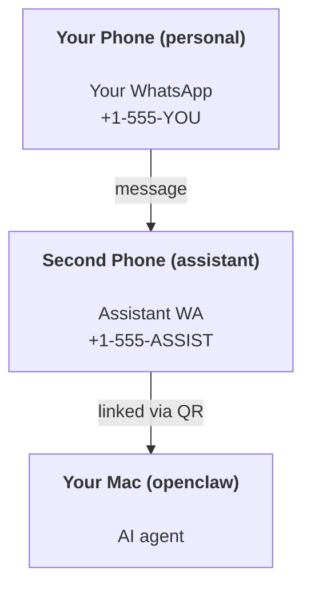

---
read_when:
    - Yeni bir asistan örneğini kullanıma hazırlama
    - Güvenlik/izin etkileri inceleniyor
summary: Güvenlik uyarılarıyla birlikte OpenClaw'ı kişisel asistan olarak çalıştırmaya yönelik uçtan uca kılavuz
title: Kişisel asistan kurulumu
x-i18n:
    generated_at: "2026-05-02T22:22:54Z"
    model: gpt-5.5
    provider: openai
    source_hash: 9f6087d0756c98741166135df8b915eb5a0803b23e68e486d2d25ec98d4dca79
    source_path: start/openclaw.md
    workflow: 16
---

# OpenClaw ile kişisel asistan oluşturma

OpenClaw; Discord, Google Chat, iMessage, Matrix, Microsoft Teams, Signal, Slack, Telegram, WhatsApp, Zalo ve daha fazlasını AI ajanlarına bağlayan, self-hosted bir Gateway'dir. Bu kılavuz "kişisel asistan" kurulumunu kapsar: her zaman açık AI asistanınız gibi davranan, ona ayrılmış bir WhatsApp numarası.

## ⚠️ Önce güvenlik

Bir ajanı şu konuma getiriyorsunuz:

- makinenizde komut çalıştırma (araç politikanıza bağlı olarak)
- çalışma alanınızdaki dosyaları okuma/yazma
- WhatsApp/Telegram/Discord/Mattermost ve diğer paketli kanallar üzerinden dışarı mesaj gönderme

Temkinli başlayın:

- Her zaman `channels.whatsapp.allowFrom` ayarlayın (kişisel Mac'inizde asla dünyaya açık çalıştırmayın).
- Asistan için ayrılmış bir WhatsApp numarası kullanın.
- Heartbeat'ler artık varsayılan olarak her 30 dakikada bir çalışır. Kuruluma güvenene kadar `agents.defaults.heartbeat.every: "0m"` ayarlayarak devre dışı bırakın.

## Önkoşullar

- OpenClaw kurulmuş ve ilk katılımı tamamlanmış olmalı — bunu henüz yapmadıysanız [Başlarken](/tr/start/getting-started) bölümüne bakın
- Asistan için ikinci bir telefon numarası (SIM/eSIM/ön ödemeli)

## İki telefonlu kurulum (önerilen)

İstediğiniz yapı şudur:



Kişisel WhatsApp'ınızı OpenClaw'a bağlarsanız, size gelen her mesaj “ajan girdisi” haline gelir. Bu genellikle istediğiniz şey değildir.

## 5 dakikalık hızlı başlangıç

1. WhatsApp Web'i eşleştirin (QR gösterir; asistan telefonuyla tarayın):

```bash
openclaw channels login
```

2. Gateway'i başlatın (çalışır durumda bırakın):

```bash
openclaw gateway --port 18789
```

3. `~/.openclaw/openclaw.json` içine minimal bir yapılandırma koyun:

```json5
{
  gateway: { mode: "local" },
  channels: { whatsapp: { allowFrom: ["+15555550123"] } },
}
```

Şimdi izin verilenler listesindeki telefonunuzdan asistan numarasına mesaj gönderin.

İlk katılım bittiğinde OpenClaw kontrol panelini otomatik olarak açar ve temiz (tokenize edilmemiş) bir bağlantı yazdırır. Kontrol paneli kimlik doğrulaması isterse, yapılandırılmış paylaşılan sırrı Control UI ayarlarına yapıştırın. İlk katılım varsayılan olarak bir token (`gateway.auth.token`) kullanır, ancak `gateway.auth.mode` değerini `password` olarak değiştirdiyseniz parola kimlik doğrulaması da çalışır. Daha sonra yeniden açmak için: `openclaw dashboard`.

## Ajana bir çalışma alanı verin (AGENTS)

OpenClaw, çalışma talimatlarını ve “belleği” çalışma alanı dizininden okur.

Varsayılan olarak OpenClaw, ajan çalışma alanı olarak `~/.openclaw/workspace` kullanır ve kurulumda/ilk ajan çalıştırmasında bunu (başlangıç `AGENTS.md`, `SOUL.md`, `TOOLS.md`, `IDENTITY.md`, `USER.md`, `HEARTBEAT.md` ile birlikte) otomatik olarak oluşturur. `BOOTSTRAP.md` yalnızca çalışma alanı yepyeni olduğunda oluşturulur (sildikten sonra geri gelmemelidir). `MEMORY.md` isteğe bağlıdır (otomatik oluşturulmaz); mevcut olduğunda normal oturumlar için yüklenir. Alt ajan oturumları yalnızca `AGENTS.md` ve `TOOLS.md` enjekte eder.

<Tip>
Bu klasörü OpenClaw'ın belleği gibi ele alın ve `AGENTS.md` ile bellek dosyalarınızın yedeklenmesi için onu bir git deposu yapın (tercihen özel). Git kuruluysa, yepyeni çalışma alanları otomatik olarak başlatılır.
</Tip>

```bash
openclaw setup
```

Tam çalışma alanı düzeni + yedekleme kılavuzu: [Ajan çalışma alanı](/tr/concepts/agent-workspace)
Bellek iş akışı: [Bellek](/tr/concepts/memory)

İsteğe bağlı: `agents.defaults.workspace` ile farklı bir çalışma alanı seçin (`~` destekler).

```json5
{
  agents: {
    defaults: {
      workspace: "~/.openclaw/workspace",
    },
  },
}
```

Kendi çalışma alanı dosyalarınızı zaten bir depodan gönderiyorsanız, bootstrap dosyası oluşturmayı tamamen devre dışı bırakabilirsiniz:

```json5
{
  agents: {
    defaults: {
      skipBootstrap: true,
    },
  },
}
```

## Bunu "bir asistana" dönüştüren yapılandırma

OpenClaw varsayılan olarak iyi bir asistan kurulumu sunar, ancak genellikle şunları ayarlamak istersiniz:

- [`SOUL.md`](/tr/concepts/soul) içindeki kişilik/talimatlar
- düşünme varsayılanları (istenirse)
- Heartbeat'ler (ona güvendiğinizde)

Örnek:

```json5
{
  logging: { level: "info" },
  agent: {
    model: "anthropic/claude-opus-4-6",
    workspace: "~/.openclaw/workspace",
    thinkingDefault: "high",
    timeoutSeconds: 1800,
    // Start with 0; enable later.
    heartbeat: { every: "0m" },
  },
  channels: {
    whatsapp: {
      allowFrom: ["+15555550123"],
      groups: {
        "*": { requireMention: true },
      },
    },
  },
  routing: {
    groupChat: {
      mentionPatterns: ["@openclaw", "openclaw"],
    },
  },
  session: {
    scope: "per-sender",
    resetTriggers: ["/new", "/reset"],
    reset: {
      mode: "daily",
      atHour: 4,
      idleMinutes: 10080,
    },
  },
}
```

## Oturumlar ve bellek

- Oturum dosyaları: `~/.openclaw/agents/<agentId>/sessions/{{SessionId}}.jsonl`
- Oturum meta verileri (token kullanımı, son yönlendirme vb.): `~/.openclaw/agents/<agentId>/sessions/sessions.json` (eski: `~/.openclaw/sessions/sessions.json`)
- `/new` veya `/reset`, o sohbet için yeni bir oturum başlatır (`resetTriggers` üzerinden yapılandırılabilir). Tek başına gönderilirse, OpenClaw modeli çağırmadan sıfırlamayı onaylar.
- `/compact [instructions]` oturum bağlamını sıkıştırır ve kalan bağlam bütçesini bildirir.

## Heartbeat'ler (proaktif mod)

Varsayılan olarak OpenClaw, şu istemle her 30 dakikada bir Heartbeat çalıştırır:
`Read HEARTBEAT.md if it exists (workspace context). Follow it strictly. Do not infer or repeat old tasks from prior chats. If nothing needs attention, reply HEARTBEAT_OK.`
Devre dışı bırakmak için `agents.defaults.heartbeat.every: "0m"` ayarlayın.

- `HEARTBEAT.md` mevcut ama fiilen boşsa (yalnızca boş satırlar ve `# Heading` gibi markdown başlıkları), OpenClaw API çağrılarını azaltmak için Heartbeat çalıştırmasını atlar.
- Dosya yoksa Heartbeat yine çalışır ve model ne yapılacağına karar verir.
- Ajan `HEARTBEAT_OK` ile yanıt verirse (isteğe bağlı kısa dolgu ile; bkz. `agents.defaults.heartbeat.ackMaxChars`), OpenClaw bu Heartbeat için giden teslimatı bastırır.
- Varsayılan olarak, DM tarzı `user:<id>` hedeflerine Heartbeat teslimatına izin verilir. Heartbeat çalıştırmalarını etkin tutarken doğrudan hedef teslimatını bastırmak için `agents.defaults.heartbeat.directPolicy: "block"` ayarlayın.
- Heartbeat'ler tam ajan dönüşleri çalıştırır — daha kısa aralıklar daha fazla token tüketir.

```json5
{
  agent: {
    heartbeat: { every: "30m" },
  },
}
```

## Gelen ve giden medya

Gelen ekler (görseller/ses/belgeler) şablonlar aracılığıyla komutunuza sunulabilir:

- `{{MediaPath}}` (yerel geçici dosya yolu)
- `{{MediaUrl}}` (sözde URL)
- `{{Transcript}}` (ses transkripsiyonu etkinse)

Ajanın giden ekleri: kendi satırında `MEDIA:<path-or-url>` ekleyin (boşluk yok). Örnek:

```
Here’s the screenshot.
MEDIA:https://example.com/screenshot.png
```

OpenClaw bunları çıkarır ve metnin yanında medya olarak gönderir.

Yerel yol davranışı, ajanla aynı dosya okuma güven modelini izler:

- `tools.fs.workspaceOnly` `true` ise, giden `MEDIA:` yerel yolları OpenClaw geçici kökü, medya önbelleği, ajan çalışma alanı yolları ve sandbox tarafından oluşturulan dosyalarla sınırlı kalır.
- `tools.fs.workspaceOnly` `false` ise, giden `MEDIA:` ajanın zaten okumasına izin verilen host-local dosyaları kullanabilir.
- Yerel yollar mutlak, çalışma alanına göre göreli veya `~/` ile ev dizinine göre göreli olabilir.
- Host-local gönderimler yine de yalnızca medya ve güvenli belge türlerine izin verir (görseller, ses, video, PDF ve Office belgeleri). Düz metin ve gizli bilgiye benzeyen dosyalar gönderilebilir medya olarak değerlendirilmez.

Bu, dosya sistemi politikanız bu okumaları zaten izinliyorsa, çalışma alanı dışındaki oluşturulmuş görsellerin/dosyaların artık gönderilebileceği anlamına gelir; bunu yaparken rastgele host metin eki sızdırma yeniden açılmaz.

## Operasyon kontrol listesi

```bash
openclaw status          # local status (creds, sessions, queued events)
openclaw status --all    # full diagnosis (read-only, pasteable)
openclaw status --deep   # asks the gateway for a live health probe with channel probes when supported
openclaw health --json   # gateway health snapshot (WS; default can return a fresh cached snapshot)
```

Günlükler `/tmp/openclaw/` altında bulunur (varsayılan: `openclaw-YYYY-MM-DD.log`).

## Sonraki adımlar

- WebChat: [WebChat](/tr/web/webchat)
- Gateway operasyonları: [Gateway runbook](/tr/gateway)
- Cron + uyandırmalar: [Cron işleri](/tr/automation/cron-jobs)
- macOS menü çubuğu eşlikçisi: [OpenClaw macOS uygulaması](/tr/platforms/macos)
- iOS Node uygulaması: [iOS uygulaması](/tr/platforms/ios)
- Android Node uygulaması: [Android uygulaması](/tr/platforms/android)
- Windows durumu: [Windows (WSL2)](/tr/platforms/windows)
- Linux durumu: [Linux uygulaması](/tr/platforms/linux)
- Güvenlik: [Güvenlik](/tr/gateway/security)

## İlgili

- [Başlarken](/tr/start/getting-started)
- [Kurulum](/tr/start/setup)
- [Kanallar genel bakışı](/tr/channels)
