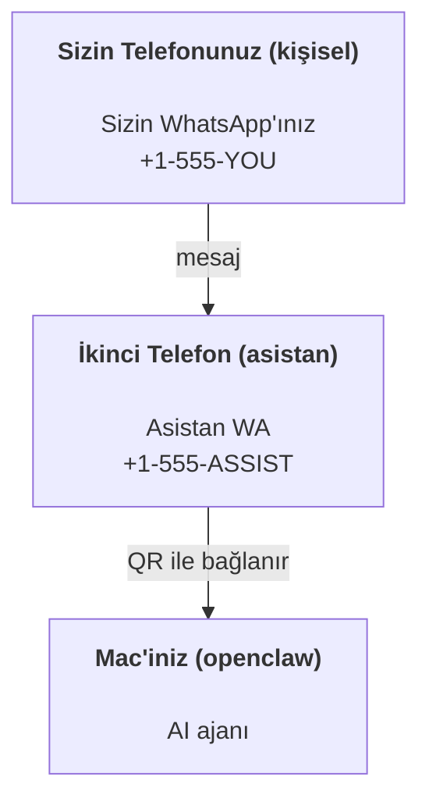

---
read_when:
    - Yeni bir asistan örneğini onboarding sürecinden geçirme
    - Güvenlik/izin etkilerini gözden geçirme
summary: OpenClaw'ı kişisel asistan olarak çalıştırmak için güvenlik uyarıları içeren uçtan uca kılavuz
title: Kişisel asistan kurulumu
x-i18n:
    generated_at: "2026-04-24T09:32:07Z"
    model: gpt-5.4
    provider: openai
    source_hash: 3048f2faae826fc33d962f1fac92da3c0ce464d2de803fee381c897eb6c76436
    source_path: start/openclaw.md
    workflow: 15
---

# OpenClaw ile kişisel asistan oluşturma

OpenClaw; Discord, Google Chat, iMessage, Matrix, Microsoft Teams, Signal, Slack, Telegram, WhatsApp, Zalo ve daha fazlasını AI ajanlarına bağlayan self-hosted bir gateway'dir. Bu kılavuz “kişisel asistan” kurulumunu kapsar: her zaman açık AI asistanınız gibi davranan özel bir WhatsApp numarası.

## ⚠️ Önce güvenlik

Bir ajanı şu konuma getiriyorsunuz:

- makinenizde komut çalıştırmak (araç politikanıza bağlı olarak)
- çalışma alanınızdaki dosyaları okumak/yazmak
- WhatsApp/Telegram/Discord/Mattermost ve diğer paketlenmiş kanallar üzerinden mesajları dışarı geri göndermek

Tutucu başlayın:

- Her zaman `channels.whatsapp.allowFrom` ayarlayın (kişisel Mac'inizde asla dünyaya açık çalıştırmayın).
- Asistan için özel bir WhatsApp numarası kullanın.
- Heartbeat'ler artık varsayılan olarak her 30 dakikada bir çalışır. Kuruluma güvenene kadar `agents.defaults.heartbeat.every: "0m"` ayarlayarak devre dışı bırakın.

## Ön koşullar

- OpenClaw kurulu ve onboarding tamamlanmış olmalı — bunu henüz yapmadıysanız [Başlangıç](/tr/start/getting-started) sayfasına bakın
- Asistan için ikinci bir telefon numarası (SIM/eSIM/ön ödemeli)

## İki telefonlu kurulum (önerilir)

İstediğiniz yapı şudur:



Kişisel WhatsApp'ınızı OpenClaw'a bağlarsanız size gelen her mesaj “ajan girdisi” olur. Bu, nadiren isteyeceğiniz şeydir.

## 5 dakikalık hızlı başlangıç

1. WhatsApp Web'i eşleştirin (QR gösterir; asistan telefonuyla tarayın):

```bash
openclaw channels login
```

2. Gateway'i başlatın (çalışır durumda bırakın):

```bash
openclaw gateway --port 18789
```

3. `~/.openclaw/openclaw.json` içine en küçük yapılandırmayı koyun:

```json5
{
  gateway: { mode: "local" },
  channels: { whatsapp: { allowFrom: ["+15555550123"] } },
}
```

Şimdi izin listesine alınmış telefonunuzdan asistan numarasına mesaj gönderin.

Onboarding tamamlandığında OpenClaw panoyu otomatik açar ve temiz (tokensız) bir bağlantı yazdırır. Pano auth isterse yapılandırılmış paylaşılan gizli bilgiyi Control UI ayarlarına yapıştırın. Onboarding varsayılan olarak bir token kullanır (`gateway.auth.token`), ancak `gateway.auth.mode` değerini `password` yaptıysanız parola auth da çalışır. Daha sonra yeniden açmak için: `openclaw dashboard`.

## Ajana bir çalışma alanı verin (AGENTS)

OpenClaw, çalışma yönergelerini ve “belleği” çalışma alanı dizininden okur.

Varsayılan olarak OpenClaw ajan çalışma alanı olarak `~/.openclaw/workspace` kullanır ve bunu (ayrıca başlangıç `AGENTS.md`, `SOUL.md`, `TOOLS.md`, `IDENTITY.md`, `USER.md`, `HEARTBEAT.md` ile birlikte) kurulumda/ilk ajan çalıştırmasında otomatik oluşturur. `BOOTSTRAP.md` yalnızca çalışma alanı yepyeniyse oluşturulur (sildikten sonra geri gelmemelidir). `MEMORY.md` isteğe bağlıdır (otomatik oluşturulmaz); mevcutsa normal oturumlar için yüklenir. Alt ajan oturumları yalnızca `AGENTS.md` ve `TOOLS.md` enjekte eder.

İpucu: bu klasörü OpenClaw'ın “belleği” olarak düşünün ve `AGENTS.md` + bellek dosyalarınız yedeklenmiş olsun diye onu bir git deposu yapın (tercihen özel). Git kuruluysa yepyeni çalışma alanları otomatik olarak başlatılır.

```bash
openclaw setup
```

Tam çalışma alanı düzeni + yedekleme kılavuzu: [Ajan çalışma alanı](/tr/concepts/agent-workspace)
Bellek iş akışı: [Bellek](/tr/concepts/memory)

İsteğe bağlı: `agents.defaults.workspace` ile farklı bir çalışma alanı seçin (`~` desteklenir).

```json5
{
  agent: {
    workspace: "~/.openclaw/workspace",
  },
}
```

Zaten kendi çalışma alanı dosyalarınızı bir depodan getiriyorsanız bootstrap dosyası oluşturmayı tamamen devre dışı bırakabilirsiniz:

```json5
{
  agent: {
    skipBootstrap: true,
  },
}
```

## Bunu “bir asistana” dönüştüren yapılandırma

OpenClaw varsayılan olarak iyi bir asistan kurulumuyla gelir, ancak genelde şunları ayarlamak istersiniz:

- [`SOUL.md`](/tr/concepts/soul) içinde persona/yönergeler
- thinking varsayılanları (istenirse)
- Heartbeat'ler (ona güvenmeye başladıktan sonra)

Örnek:

```json5
{
  logging: { level: "info" },
  agent: {
    model: "anthropic/claude-opus-4-6",
    workspace: "~/.openclaw/workspace",
    thinkingDefault: "high",
    timeoutSeconds: 1800,
    // 0 ile başlayın; daha sonra etkinleştirin.
    heartbeat: { every: "0m" },
  },
  channels: {
    whatsapp: {
      allowFrom: ["+15555550123"],
      groups: {
        "*": { requireMention: true },
      },
    },
  },
  routing: {
    groupChat: {
      mentionPatterns: ["@openclaw", "openclaw"],
    },
  },
  session: {
    scope: "per-sender",
    resetTriggers: ["/new", "/reset"],
    reset: {
      mode: "daily",
      atHour: 4,
      idleMinutes: 10080,
    },
  },
}
```

## Oturumlar ve bellek

- Oturum dosyaları: `~/.openclaw/agents/<agentId>/sessions/{{SessionId}}.jsonl`
- Oturum meta verileri (token kullanımı, son yol vb.): `~/.openclaw/agents/<agentId>/sessions/sessions.json` (legacy: `~/.openclaw/sessions/sessions.json`)
- `/new` veya `/reset`, o sohbet için yeni bir oturum başlatır (`resetTriggers` ile yapılandırılabilir). Tek başına gönderilirse ajan sıfırlamayı onaylamak için kısa bir merhaba yanıtı verir.
- `/compact [instructions]`, oturum bağlamını sıkıştırır ve kalan bağlam bütçesini bildirir.

## Heartbeat'ler (proaktif mod)

Varsayılan olarak OpenClaw her 30 dakikada bir şu istemle Heartbeat çalıştırır:
`Read HEARTBEAT.md if it exists (workspace context). Follow it strictly. Do not infer or repeat old tasks from prior chats. If nothing needs attention, reply HEARTBEAT_OK.`
Devre dışı bırakmak için `agents.defaults.heartbeat.every: "0m"` ayarlayın.

- `HEARTBEAT.md` varsa ama etkin olarak boşsa (yalnızca boş satırlar ve `# Heading` gibi markdown başlıkları içeriyorsa), OpenClaw API çağrılarını korumak için Heartbeat çalıştırmasını atlar.
- Dosya eksikse Heartbeat yine çalışır ve model ne yapacağına karar verir.
- Ajan `HEARTBEAT_OK` ile yanıt verirse (isteğe bağlı kısa dolgu ile; bkz. `agents.defaults.heartbeat.ackMaxChars`), OpenClaw o Heartbeat için giden teslimi bastırır.
- Varsayılan olarak Heartbeat'in `user:<id>` tarzı DM hedeflerine teslimine izin verilir. Heartbeat çalıştırmalarını etkin tutarken doğrudan hedef teslimini bastırmak için `agents.defaults.heartbeat.directPolicy: "block"` ayarlayın.
- Heartbeat'ler tam ajan turları çalıştırır — daha kısa aralıklar daha fazla token yakar.

```json5
{
  agent: {
    heartbeat: { every: "30m" },
  },
}
```

## Medya giriş ve çıkışı

Gelen ekler (görseller/ses/belgeler), şablonlar aracılığıyla komutunuza yüzeye çıkarılabilir:

- `{{MediaPath}}` (yerel geçici dosya yolu)
- `{{MediaUrl}}` (sözde URL)
- `{{Transcript}}` (ses transkripsiyonu etkinse)

Ajandan çıkan ekler: kendi satırında `MEDIA:<path-or-url>` bulunmalıdır (boşluk yok). Örnek:

```
Here’s the screenshot.
MEDIA:https://example.com/screenshot.png
```

OpenClaw bunları çıkarır ve metnin yanında medya olarak gönderir.

Yerel yol davranışı, ajanla aynı dosya okuma güven modelini izler:

- `tools.fs.workspaceOnly` değeri `true` ise giden `MEDIA:` yerel yolları OpenClaw temp kökü, medya önbelleği, ajan çalışma alanı yolları ve sandbox tarafından doğrulanmış dosyalarla sınırlı kalır.
- `tools.fs.workspaceOnly` değeri `false` ise giden `MEDIA:` ajanın zaten okumasına izin verilen host-yerel dosyaları kullanabilir.
- Host-yerel gönderimler yine de yalnızca medya ve güvenli belge türlerine izin verir (görseller, ses, video, PDF ve Office belgeleri). Düz metin ve gizli bilgi benzeri dosyalar gönderilebilir medya olarak değerlendirilmez.

Bu, fs politikanız zaten o okumalara izin verdiğinde, çalışma alanı dışındaki üretilmiş görsellerin/dosyaların artık gönderilebildiği anlamına gelir; bunu yaparken keyfi host metin eki sızdırmasını yeniden açmaz.

## Operasyon kontrol listesi

```bash
openclaw status          # yerel durum (kimlik bilgileri, oturumlar, kuyruktaki olaylar)
openclaw status --all    # tam tanılama (salt okunur, paylaşılabilir)
openclaw status --deep   # desteklendiğinde kanal yoklamalarıyla canlı sağlık yoklaması için gateway'e sorar
openclaw health --json   # gateway sağlık anlık görüntüsü (WS; varsayılan olarak taze önbellekli anlık görüntü döndürebilir)
```

Günlükler `/tmp/openclaw/` altında yaşar (varsayılan: `openclaw-YYYY-MM-DD.log`).

## Sonraki adımlar

- WebChat: [WebChat](/tr/web/webchat)
- Gateway operasyonları: [Gateway çalışma kitabı](/tr/gateway)
- Cron + uyandırmalar: [Cron işleri](/tr/automation/cron-jobs)
- macOS menü çubuğu yardımcı uygulaması: [OpenClaw macOS uygulaması](/tr/platforms/macos)
- iOS node uygulaması: [iOS uygulaması](/tr/platforms/ios)
- Android node uygulaması: [Android uygulaması](/tr/platforms/android)
- Windows durumu: [Windows (WSL2)](/tr/platforms/windows)
- Linux durumu: [Linux uygulaması](/tr/platforms/linux)
- Güvenlik: [Güvenlik](/tr/gateway/security)

## İlgili

- [Başlangıç](/tr/start/getting-started)
- [Kurulum](/tr/start/setup)
- [Kanallara genel bakış](/tr/channels)
