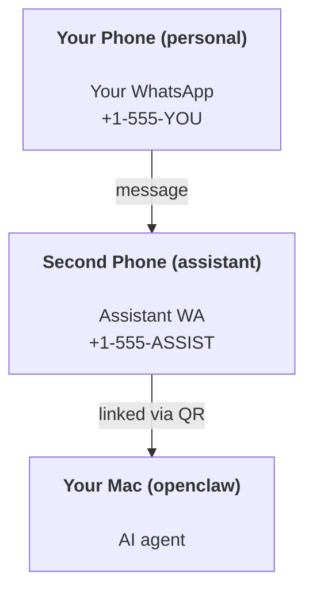

---
read_when:
    - Yeni bir asistan örneğini kullanıma alma
    - Güvenlik/izin etkileri inceleniyor
summary: OpenClaw'u kişisel asistan olarak çalıştırmaya yönelik, güvenlik uyarılarını içeren uçtan uca kılavuz
title: Kişisel asistan kurulumu
x-i18n:
    generated_at: "2026-05-11T20:36:25Z"
    model: gpt-5.5
    provider: openai
    source_hash: 74dd13c4b43faa8e29e1fd56a355f36c6cf7c3fa8193bb62c1056211933f4df9
    source_path: start/openclaw.md
    workflow: 16
---

OpenClaw, Discord, Google Chat, iMessage, Matrix, Microsoft Teams, Signal, Slack, Telegram, WhatsApp, Zalo ve daha fazlasını AI agents'a bağlayan, kendi barındırılan bir Gateway'dir. Bu kılavuz "kişisel asistan" kurulumunu kapsar: her zaman açık AI asistanınız gibi davranan, WhatsApp'a ayrılmış bir numara.

## ⚠️ Önce güvenlik

Bir agent'ı şu konumlara yerleştiriyorsunuz:

- makinenizde komutlar çalıştırma (araç politikanıza bağlı olarak)
- çalışma alanınızdaki dosyaları okuma/yazma
- WhatsApp/Telegram/Discord/Mattermost ve diğer paketli kanallar üzerinden dışarı mesaj gönderme

Temkinli başlayın:

- Her zaman `channels.whatsapp.allowFrom` ayarlayın (kişisel Mac'inizde dünyaya açık şekilde asla çalıştırmayın).
- Asistan için ayrılmış bir WhatsApp numarası kullanın.
- Heartbeat'ler artık varsayılan olarak her 30 dakikada birdir. Kuruluma güvenene kadar `agents.defaults.heartbeat.every: "0m"` ayarlayarak devre dışı bırakın.

## Önkoşullar

- OpenClaw kurulmuş ve ilk kurulumu tamamlanmış olmalı - bunu henüz yapmadıysanız [Başlarken](/tr/start/getting-started) bölümüne bakın
- Asistan için ikinci bir telefon numarası (SIM/eSIM/ön ödemeli)

## İki telefonlu kurulum (önerilir)

İstediğiniz yapı budur:



Kişisel WhatsApp'ınızı OpenClaw'a bağlarsanız, size gelen her mesaj "agent girdisi" haline gelir. Bu nadiren istediğiniz şeydir.

## 5 dakikalık hızlı başlangıç

1. WhatsApp Web'i eşleştirin (QR gösterir; asistan telefonuyla tarayın):

```bash
openclaw channels login
```

2. Gateway'i başlatın (çalışır durumda bırakın):

```bash
openclaw gateway --port 18789
```

3. `~/.openclaw/openclaw.json` içine en küçük yapılandırmayı koyun:

```json5
{
  gateway: { mode: "local" },
  channels: { whatsapp: { allowFrom: ["+15555550123"] } },
}
```

Şimdi izin listesine alınmış telefonunuzdan asistan numarasına mesaj gönderin.

İlk kurulum tamamlandığında, OpenClaw panoyu otomatik açar ve temiz (tokenleştirilmemiş) bir bağlantı yazdırır. Pano kimlik doğrulaması isterse, yapılandırılmış paylaşılan gizli anahtarı Control UI ayarlarına yapıştırın. İlk kurulum varsayılan olarak bir token kullanır (`gateway.auth.token`), ancak `gateway.auth.mode` değerini `password` olarak değiştirdiyseniz parola kimlik doğrulaması da çalışır. Daha sonra yeniden açmak için: `openclaw dashboard`.

## Agent'a bir çalışma alanı verin (AGENTS)

OpenClaw işletim talimatlarını ve "belleği" çalışma alanı dizininden okur.

Varsayılan olarak OpenClaw, agent çalışma alanı olarak `~/.openclaw/workspace` kullanır ve kurulumda/ilk agent çalıştırmasında bunu (artı başlangıç `AGENTS.md`, `SOUL.md`, `TOOLS.md`, `IDENTITY.md`, `USER.md`, `HEARTBEAT.md`) otomatik oluşturur. `BOOTSTRAP.md` yalnızca çalışma alanı yepyeniyse oluşturulur (sildikten sonra geri gelmemelidir). `MEMORY.md` isteğe bağlıdır (otomatik oluşturulmaz); mevcut olduğunda normal oturumlar için yüklenir. Subagent oturumları yalnızca `AGENTS.md` ve `TOOLS.md` enjekte eder.

<Tip>
Bu klasörü OpenClaw'ın belleği gibi ele alın ve `AGENTS.md` ile bellek dosyalarınızın yedeklenmesi için onu bir git deposu yapın (ideal olarak özel). Git kuruluysa, yepyeni çalışma alanları otomatik başlatılır.
</Tip>

```bash
openclaw setup
```

Tam çalışma alanı düzeni + yedekleme kılavuzu: [Agent çalışma alanı](/tr/concepts/agent-workspace)
Bellek iş akışı: [Bellek](/tr/concepts/memory)

İsteğe bağlı: `agents.defaults.workspace` ile farklı bir çalışma alanı seçin (`~` destekler).

```json5
{
  agents: {
    defaults: {
      workspace: "~/.openclaw/workspace",
    },
  },
}
```

Kendi çalışma alanı dosyalarınızı zaten bir depodan gönderiyorsanız, bootstrap dosyası oluşturmayı tamamen devre dışı bırakabilirsiniz:

```json5
{
  agents: {
    defaults: {
      skipBootstrap: true,
    },
  },
}
```

## Onu "bir asistan"a dönüştüren yapılandırma

OpenClaw varsayılan olarak iyi bir asistan kurulumuyla gelir, ancak genellikle şunları ayarlamak istersiniz:

- [`SOUL.md`](/tr/concepts/soul) içindeki persona/talimatlar
- düşünme varsayılanları (istenirse)
- heartbeat'ler (ona güvendiğinizde)

Örnek:

```json5
{
  logging: { level: "info" },
  agents: {
    defaults: {
      model: { primary: "anthropic/claude-opus-4-6" },
      workspace: "~/.openclaw/workspace",
      thinkingDefault: "high",
      timeoutSeconds: 1800,
      // Start with 0; enable later.
      heartbeat: { every: "0m" },
    },
    list: [
      {
        id: "main",
        default: true,
        groupChat: {
          mentionPatterns: ["@openclaw", "openclaw"],
        },
      },
    ],
  },
  channels: {
    whatsapp: {
      allowFrom: ["+15555550123"],
      groups: {
        "*": { requireMention: true },
      },
    },
  },
  session: {
    scope: "per-sender",
    resetTriggers: ["/new", "/reset"],
    reset: {
      mode: "daily",
      atHour: 4,
      idleMinutes: 10080,
    },
  },
}
```

## Oturumlar ve bellek

- Oturum dosyaları: `~/.openclaw/agents/<agentId>/sessions/{{SessionId}}.jsonl`
- Oturum meta verileri (token kullanımı, son rota vb.): `~/.openclaw/agents/<agentId>/sessions/sessions.json` (eski: `~/.openclaw/sessions/sessions.json`)
- `/new` veya `/reset`, o sohbet için yeni bir oturum başlatır (`resetTriggers` üzerinden yapılandırılabilir). Tek başına gönderilirse OpenClaw modeli çağırmadan sıfırlamayı onaylar.
- `/compact [instructions]`, oturum bağlamını sıkıştırır ve kalan bağlam bütçesini bildirir.

## Heartbeat'ler (proaktif mod)

Varsayılan olarak OpenClaw, şu istemle her 30 dakikada bir heartbeat çalıştırır:
`Read HEARTBEAT.md if it exists (workspace context). Follow it strictly. Do not infer or repeat old tasks from prior chats. If nothing needs attention, reply HEARTBEAT_OK.`
Devre dışı bırakmak için `agents.defaults.heartbeat.every: "0m"` ayarlayın.

- `HEARTBEAT.md` varsa ancak fiilen boşsa (yalnızca boş satırlar ve `# Heading` gibi markdown başlıkları), OpenClaw API çağrılarından tasarruf etmek için heartbeat çalıştırmasını atlar.
- Dosya yoksa heartbeat yine çalışır ve model ne yapacağına karar verir.
- Agent `HEARTBEAT_OK` ile yanıt verirse (isteğe bağlı kısa dolgu ile; bkz. `agents.defaults.heartbeat.ackMaxChars`), OpenClaw bu heartbeat için giden teslimatı bastırır.
- Varsayılan olarak, DM tarzı `user:<id>` hedeflerine heartbeat teslimatına izin verilir. Heartbeat çalıştırmalarını etkin tutarken doğrudan hedef teslimatını bastırmak için `agents.defaults.heartbeat.directPolicy: "block"` ayarlayın.
- Heartbeat'ler tam agent dönüşleri çalıştırır - daha kısa aralıklar daha fazla token tüketir.

```json5
{
  agents: {
    defaults: {
      heartbeat: { every: "30m" },
    },
  },
}
```

## Gelen ve giden medya

Gelen ekler (görüntüler/ses/belgeler) şablonlar aracılığıyla komutunuza sunulabilir:

- `{{MediaPath}}` (yerel geçici dosya yolu)
- `{{MediaUrl}}` (sözde URL)
- `{{Transcript}}` (ses dökümü etkinse)

Agent'tan giden ekler: kendi satırında `MEDIA:<path-or-url>` ekleyin (boşluk yok). Örnek:

```
İşte ekran görüntüsü.
MEDIA:https://example.com/screenshot.png
```

OpenClaw bunları çıkarır ve metnin yanında medya olarak gönderir.

Yerel yol davranışı, agent ile aynı dosya okuma güven modelini izler:

- `tools.fs.workspaceOnly` `true` ise, giden `MEDIA:` yerel yolları OpenClaw geçici kökü, medya önbelleği, agent çalışma alanı yolları ve sandbox tarafından oluşturulmuş dosyalarla sınırlı kalır.
- `tools.fs.workspaceOnly` `false` ise, giden `MEDIA:` agent'ın zaten okumasına izin verilen ana makine yerel dosyalarını kullanabilir.
- Yerel yollar mutlak, çalışma alanına göre göreli veya `~/` ile ev dizinine göre göreli olabilir.
- Ana makine yerel gönderimleri hâlâ yalnızca medya ve güvenli belge türlerine izin verir (görüntüler, ses, video, PDF ve Office belgeleri). Düz metin ve gizli anahtara benzeyen dosyalar gönderilebilir medya olarak ele alınmaz.

Bu, çalışma alanı dışındaki oluşturulmuş görüntülerin/dosyaların artık, fs politikanız bu okumaya zaten izin verdiğinde, rastgele ana makine metin eki sızdırmasını yeniden açmadan gönderilebileceği anlamına gelir.

## İşletim kontrol listesi

```bash
openclaw status          # local status (creds, sessions, queued events)
openclaw status --all    # full diagnosis (read-only, pasteable)
openclaw status --deep   # asks the gateway for a live health probe with channel probes when supported
openclaw health --json   # gateway health snapshot (WS; default can return a fresh cached snapshot)
```

Günlükler `/tmp/openclaw/` altında bulunur (varsayılan: `openclaw-YYYY-MM-DD.log`).

## Sonraki adımlar

- WebChat: [WebChat](/tr/web/webchat)
- Gateway operasyonları: [Gateway runbook](/tr/gateway)
- Cron + uyandırmalar: [Cron işleri](/tr/automation/cron-jobs)
- macOS menü çubuğu yardımcısı: [OpenClaw macOS uygulaması](/tr/platforms/macos)
- iOS node uygulaması: [iOS uygulaması](/tr/platforms/ios)
- Android node uygulaması: [Android uygulaması](/tr/platforms/android)
- Windows durumu: [Windows (WSL2)](/tr/platforms/windows)
- Linux durumu: [Linux uygulaması](/tr/platforms/linux)
- Güvenlik: [Güvenlik](/tr/gateway/security)

## İlgili

- [Başlarken](/tr/start/getting-started)
- [Kurulum](/tr/start/setup)
- [Kanallara genel bakış](/tr/channels)
