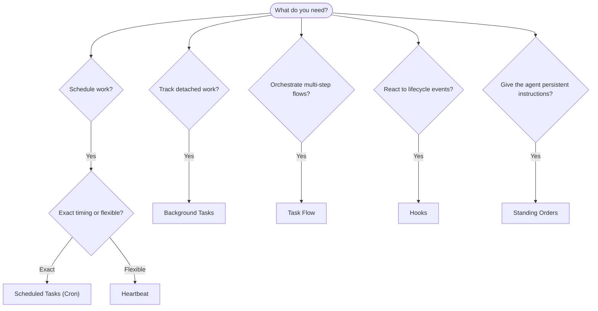

---
read_when:
    - Вибір способу автоматизації роботи з OpenClaw
    - Вибір між Heartbeat, Cron, хуками та постійними вказівками
    - Пошук правильної точки входу для автоматизації
summary: 'Огляд механізмів автоматизації: завдання, Cron, хуки, постійні вказівки та Task Flow'
title: Автоматизація та завдання
x-i18n:
    generated_at: "2026-04-29T09:13:04Z"
    model: gpt-5.5
    provider: openai
    source_hash: da79bdd32a231f90850697b94bf061a778e9d0ad81420119ccd3fa0d3bc16fc1
    source_path: automation/index.md
    workflow: 16
---

OpenClaw виконує роботу у фоні через завдання, заплановані роботи, обробники подій і постійні інструкції. Ця сторінка допоможе вибрати правильний механізм і зрозуміти, як вони працюють разом.

## Короткий посібник для вибору

| Варіант використання                                | Рекомендовано            | Чому                                              |
| --------------------------------------- | ---------------------- | ------------------------------------------------ |
| Надіслати щоденний звіт рівно о 9:00         | Заплановані завдання (Cron) | Точний час, ізольоване виконання                 |
| Нагадати мені через 20 хвилин                 | Заплановані завдання (Cron) | Одноразове завдання з точним часом (`--at`)            |
| Запускати щотижневий глибокий аналіз                | Заплановані завдання (Cron) | Самостійне завдання, може використовувати іншу модель         |
| Перевіряти вхідні кожні 30 хв                | Heartbeat              | Об'єднується з іншими перевірками, враховує контекст         |
| Моніторити календар на майбутні події    | Heartbeat              | Природний вибір для періодичної обізнаності               |
| Переглянути стан підагенту або запуску ACP | Фонові завдання       | Журнал завдань відстежує всю відокремлену роботу            |
| Перевірити, що запускалося і коли                 | Фонові завдання       | `openclaw tasks list` і `openclaw tasks audit` |
| Багатоетапне дослідження з подальшим підсумком      | Task Flow              | Стійка оркестрація з відстеженням ревізій     |
| Запустити скрипт під час скидання сесії           | Хуки                  | Керується подіями, спрацьовує на події життєвого циклу          |
| Виконувати код під час кожного виклику інструмента         | Plugin-хуки           | Внутрішньопроцесні хуки можуть перехоплювати виклики інструментів        |
| Завжди перевіряти відповідність перед відповіддю | Постійні розпорядження        | Автоматично вставляються в кожну сесію        |

### Заплановані завдання (Cron) і Heartbeat

| Вимір       | Заплановані завдання (Cron)              | Heartbeat                             |
| --------------- | ----------------------------------- | ------------------------------------- |
| Час          | Точний (cron-вирази, одноразові запуски)  | Приблизний (типово кожні 30 хв)    |
| Контекст сесії | Новий (ізольований) або спільний          | Повний контекст основної сесії             |
| Записи завдань    | Завжди створюються                      | Ніколи не створюються                         |
| Доставка        | Канал, webhook або без виводу         | Вбудовано в основну сесію                |
| Найкраще для        | Звітів, нагадувань, фонових робіт | Перевірок вхідних, календаря, сповіщень |

Використовуйте Заплановані завдання (Cron), коли потрібен точний час або ізольоване виконання. Використовуйте Heartbeat, коли робота виграє від повного контексту сесії, а приблизний час підходить.

## Основні поняття

### Заплановані завдання (cron)

Cron — це вбудований планувальник Gateway для точного часу. Він зберігає роботи, пробуджує агента в потрібний момент і може доставляти вивід у чат-канал або webhook-ендпоінт. Підтримує одноразові нагадування, повторювані вирази та вхідні webhook-тригери.

Див. [Заплановані завдання](/uk/automation/cron-jobs).

### Завдання

Журнал фонових завдань відстежує всю відокремлену роботу: запуски ACP, створення підагентів, ізольовані виконання cron і операції CLI. Завдання — це записи, а не планувальники. Використовуйте `openclaw tasks list` і `openclaw tasks audit`, щоб переглядати їх.

Див. [Фонові завдання](/uk/automation/tasks).

### Task Flow

Task Flow — це субстрат оркестрації потоків над фоновими завданнями. Він керує стійкими багатоетапними потоками з керованими та дзеркальними режимами синхронізації, відстеженням ревізій і `openclaw tasks flow list|show|cancel` для перегляду.

Див. [Task Flow](/uk/automation/taskflow).

### Постійні розпорядження

Постійні розпорядження надають агенту постійні операційні повноваження для визначених програм. Вони зберігаються у файлах робочого простору (зазвичай `AGENTS.md`) і вставляються в кожну сесію. Поєднуйте їх із cron для примусового виконання за часом.

Див. [Постійні розпорядження](/uk/automation/standing-orders).

### Хуки

Внутрішні хуки — це керовані подіями скрипти, які запускаються подіями життєвого циклу агента
(`/new`, `/reset`, `/stop`), Compaction сесії, запуском gateway і потоком
повідомлень. Вони автоматично виявляються з директорій і ними можна керувати
за допомогою `openclaw hooks`. Для внутрішньопроцесного перехоплення викликів інструментів використовуйте
[Plugin-хуки](/uk/plugins/hooks).

Див. [Хуки](/uk/automation/hooks).

### Heartbeat

Heartbeat — це періодичний хід основної сесії (типово кожні 30 хвилин). Він об'єднує кілька перевірок (вхідні, календар, сповіщення) в один хід агента з повним контекстом сесії. Ходи Heartbeat не створюють записи завдань і не подовжують свіжість щоденного або неактивного скидання сесії. Використовуйте `HEARTBEAT.md` для невеликого контрольного списку або блок `tasks:`, коли потрібні періодичні перевірки лише за строком виконання всередині самого heartbeat. Порожні файли heartbeat пропускаються як `empty-heartbeat-file`; режим завдань лише за строком виконання пропускається як `no-tasks-due`. Heartbeat відкладаються, поки cron-робота активна або в черзі, а `heartbeat.skipWhenBusy` також може відкладати їх, поки підагент або вкладені лінії зайняті.

Див. [Heartbeat](/uk/gateway/heartbeat).

## Як вони працюють разом

- **Cron** обробляє точні розклади (щоденні звіти, щотижневі огляди) і одноразові нагадування. Усі виконання cron створюють записи завдань.
- **Heartbeat** обробляє регулярний моніторинг (вхідні, календар, сповіщення) в одному об'єднаному ході кожні 30 хвилин.
- **Хуки** реагують на конкретні події (скидання сесії, Compaction, потік повідомлень) за допомогою користувацьких скриптів. Plugin-хуки охоплюють виклики інструментів.
- **Постійні розпорядження** надають агенту постійний контекст і межі повноважень.
- **Task Flow** координує багатоетапні потоки над окремими завданнями.
- **Завдання** автоматично відстежують всю відокремлену роботу, щоб ви могли її переглядати й аудіювати.

## Пов'язане

- [Заплановані завдання](/uk/automation/cron-jobs) — точне планування й одноразові нагадування
- [Фонові завдання](/uk/automation/tasks) — журнал завдань для всієї відокремленої роботи
- [Task Flow](/uk/automation/taskflow) — стійка оркестрація багатоетапних потоків
- [Хуки](/uk/automation/hooks) — керовані подіями скрипти життєвого циклу
- [Plugin-хуки](/uk/plugins/hooks) — внутрішньопроцесні хуки інструментів, промптів, повідомлень і життєвого циклу
- [Постійні розпорядження](/uk/automation/standing-orders) — постійні інструкції агента
- [Heartbeat](/uk/gateway/heartbeat) — періодичні ходи основної сесії
- [Довідник конфігурації](/uk/gateway/configuration-reference) — усі ключі конфігурації
