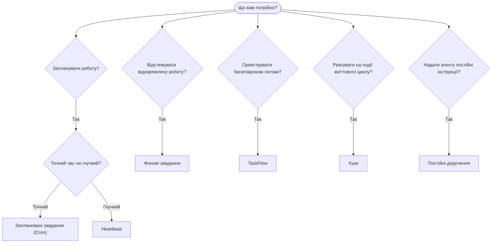

---
read_when:
    - Вирішення того, як автоматизувати роботу з OpenClaw
    - Вибір між Heartbeat, Cron, хуками та постійними дорученнями
    - Пошук правильної точки входу для автоматизації
summary: 'Огляд механізмів автоматизації: завдання, Cron, хуки, постійні доручення та TaskFlow'
title: Автоматизація та завдання
x-i18n:
    generated_at: "2026-04-26T01:42:38Z"
    model: gpt-5.4
    provider: openai
    source_hash: 6d2a2d3ef58830133e07b34f33c611664fc1032247e9dd81005adf7fc0c43cdb
    source_path: automation/index.md
    workflow: 15
---

OpenClaw виконує роботу у фоновому режимі через завдання, заплановані завдання, хуки та постійні інструкції. Ця сторінка допоможе вам вибрати правильний механізм і зрозуміти, як вони поєднуються.

## Короткий посібник із вибору

| Випадок використання                    | Рекомендовано          | Чому                                            |
| --------------------------------------- | ---------------------- | ------------------------------------------------ |
| Надсилати щоденний звіт рівно о 9:00    | Заплановані завдання (Cron) | Точний час, ізольоване виконання            |
| Нагадай мені через 20 хвилин            | Заплановані завдання (Cron) | Одноразове виконання з точним часом (`--at`) |
| Запускати щотижневий глибокий аналіз    | Заплановані завдання (Cron) | Окреме завдання, може використовувати іншу модель |
| Перевіряти вхідні кожні 30 хв           | Heartbeat              | Об’єднується з іншими перевірками, враховує контекст |
| Відстежувати календар для майбутніх подій | Heartbeat            | Природний варіант для періодичної обізнаності   |
| Перевірити стан субагента або запуску ACP | Фонові завдання      | Журнал завдань відстежує всю відокремлену роботу |
| Переглянути, що виконувалося і коли     | Фонові завдання       | `openclaw tasks list` і `openclaw tasks audit` |
| Багатокрокове дослідження, а потім підсумок | TaskFlow            | Стійка оркестрація з відстеженням ревізій       |
| Запустити скрипт під час скидання сесії | Хуки                  | Керується подіями, спрацьовує на подіях життєвого циклу |
| Виконувати код під час кожного виклику інструмента | Plugin hooks | Внутрішньопроцесні хуки можуть перехоплювати виклики інструментів |
| Завжди перевіряти відповідність перед відповіддю | Постійні доручення | Автоматично додаються до кожної сесії          |

### Заплановані завдання (Cron) vs Heartbeat

| Вимір           | Заплановані завдання (Cron)         | Heartbeat                            |
| --------------- | ----------------------------------- | ------------------------------------- |
| Час             | Точний (cron-вирази, одноразово)    | Приблизний (типово кожні 30 хвилин)   |
| Контекст сесії  | Нова (ізольована) або спільна       | Повний контекст основної сесії        |
| Записи завдань  | Завжди створюються                  | Ніколи не створюються                 |
| Доставка        | Канал, Webhook або без виводу       | Вбудовано в основну сесію             |
| Найкраще для    | Звітів, нагадувань, фонових завдань | Перевірки вхідних, календаря, сповіщень |

Використовуйте заплановані завдання (Cron), коли вам потрібен точний час або ізольоване виконання. Використовуйте Heartbeat, коли робота виграє від повного контексту сесії, а приблизний час є прийнятним.

## Основні поняття

### Заплановані завдання (cron)

Cron — це вбудований планувальник Gateway для точного часу. Він зберігає завдання, пробуджує агента в потрібний момент і може доставляти результат у канал чату або на endpoint Webhook. Підтримує одноразові нагадування, повторювані вирази та вхідні тригери Webhook.

Див. [Заплановані завдання](/uk/automation/cron-jobs).

### Завдання

Журнал фонових завдань відстежує всю відокремлену роботу: запуски ACP, породження субагентів, ізольовані виконання cron і CLI-операції. Завдання — це записи, а не планувальники. Використовуйте `openclaw tasks list` і `openclaw tasks audit` для їх перевірки.

Див. [Фонові завдання](/uk/automation/tasks).

### TaskFlow

TaskFlow — це підсистема оркестрації потоків над фоновими завданнями. Вона керує стійкими багатокроковими потоками з керованими та дзеркальними режимами синхронізації, відстеженням ревізій і `openclaw tasks flow list|show|cancel` для перевірки.

Див. [TaskFlow](/uk/automation/taskflow).

### Постійні доручення

Постійні доручення надають агенту постійні повноваження для визначених програм. Вони зберігаються у файлах робочого простору (зазвичай `AGENTS.md`) і додаються до кожної сесії. Поєднуйте з cron для правил, що залежать від часу.

Див. [Постійні доручення](/uk/automation/standing-orders).

### Хуки

Внутрішні хуки — це скрипти, керовані подіями, які спрацьовують на подіях життєвого циклу агента
(`/new`, `/reset`, `/stop`), Compaction сесії, запуску gateway та потоку
повідомлень. Вони автоматично виявляються з каталогів і ними можна керувати
за допомогою `openclaw hooks`. Для внутрішньопроцесного перехоплення викликів інструментів використовуйте
[Plugin hooks](/uk/plugins/hooks).

Див. [Хуки](/uk/automation/hooks).

### Heartbeat

Heartbeat — це періодичний хід основної сесії (типово кожні 30 хвилин). Він об’єднує кілька перевірок (вхідні, календар, сповіщення) в один хід агента з повним контекстом сесії. Ходи Heartbeat не створюють записи завдань і не подовжують свіжість щоденного/неактивного скидання сесії. Використовуйте `HEARTBEAT.md` для короткого контрольного списку або блок `tasks:`, якщо вам потрібні лише ті періодичні перевірки, строк яких настав, усередині самого heartbeat. Порожні файли heartbeat пропускаються як `empty-heartbeat-file`; режим завдань лише за строком пропускається як `no-tasks-due`.

Див. [Heartbeat](/uk/gateway/heartbeat).

## Як вони працюють разом

- **Cron** обробляє точні розклади (щоденні звіти, щотижневі огляди) та одноразові нагадування. Усі виконання cron створюють записи завдань.
- **Heartbeat** обробляє рутинний моніторинг (вхідні, календар, сповіщення) одним об’єднаним ходом кожні 30 хвилин.
- **Хуки** реагують на конкретні події (скидання сесій, Compaction, потік повідомлень) за допомогою власних скриптів. Plugin hooks охоплюють виклики інструментів.
- **Постійні доручення** надають агенту постійний контекст і межі повноважень.
- **TaskFlow** координує багатокрокові потоки поверх окремих завдань.
- **Завдання** автоматично відстежують усю відокремлену роботу, щоб ви могли її перевіряти й аудіювати.

## Пов’язані матеріали

- [Заплановані завдання](/uk/automation/cron-jobs) — точне планування та одноразові нагадування
- [Фонові завдання](/uk/automation/tasks) — журнал завдань для всієї відокремленої роботи
- [TaskFlow](/uk/automation/taskflow) — стійка оркестрація багатокрокових потоків
- [Хуки](/uk/automation/hooks) — скрипти життєвого циклу, керовані подіями
- [Plugin hooks](/uk/plugins/hooks) — внутрішньопроцесні хуки для інструментів, промптів, повідомлень і життєвого циклу
- [Постійні доручення](/uk/automation/standing-orders) — постійні інструкції агента
- [Heartbeat](/uk/gateway/heartbeat) — періодичні ходи основної сесії
- [Configuration Reference](/uk/gateway/configuration-reference) — усі ключі конфігурації
