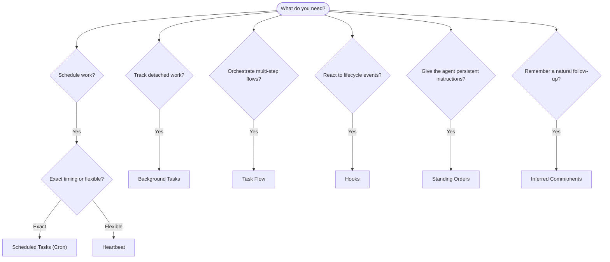

---
read_when:
    - Вибір способу автоматизації роботи з OpenClaw
    - Вибір між Heartbeat, Cron, зобов’язаннями, хуками та постійними вказівками
    - Шукаєте правильну точку входу для автоматизації
summary: 'Огляд механізмів автоматизації: завдання, Cron, хуки, постійні доручення та Task Flow'
title: Автоматизація та завдання
x-i18n:
    generated_at: "2026-04-29T21:45:42Z"
    model: gpt-5.5
    provider: openai
    source_hash: a2465c39f21db8bcb98f980a2c4b2c03018dddd5f43de59d8bf6ce0d6e97d9ef
    source_path: automation/index.md
    workflow: 16
---

OpenClaw виконує роботу у фоновому режимі через завдання, заплановані завдання, визначені
зобов’язання, хуки подій і постійні інструкції. Ця сторінка допомагає вибрати
правильний механізм і зрозуміти, як вони працюють разом.

## Короткий посібник із вибору

| Варіант використання                                | Рекомендовано            | Чому                                              |
| --------------------------------------- | ---------------------- | ------------------------------------------------ |
| Надіслати щоденний звіт рівно о 9:00         | Заплановані завдання (Cron) | Точний час, ізольоване виконання                 |
| Нагадати мені через 20 хвилин                 | Заплановані завдання (Cron) | Одноразове завдання з точним часом (`--at`)            |
| Запускати щотижневий глибокий аналіз                | Заплановані завдання (Cron) | Самостійне завдання, може використовувати іншу модель         |
| Перевіряти вхідні кожні 30 хвилин                | Heartbeat              | Об’єднується з іншими перевірками, враховує контекст         |
| Відстежувати календар на наявність майбутніх подій    | Heartbeat              | Природно підходить для періодичної обізнаності               |
| Перевірити стан після згаданої співбесіди    | Визначені зобов’язання   | Схоже на пам’ять подальше звернення, без точного запиту нагадування |
| М’яка перевірка турботи після контексту користувача | Визначені зобов’язання   | Обмежено тим самим агентом і каналом             |
| Перевірити стан підагента або запуску ACP | Фонові завдання       | Журнал завдань відстежує всю відокремлену роботу            |
| Перевірити, що запускалося і коли                 | Фонові завдання       | `openclaw tasks list` і `openclaw tasks audit` |
| Багатоетапне дослідження з подальшим підсумком      | TaskFlow              | Стійка оркестрація з відстеженням ревізій     |
| Запустити скрипт під час скидання сеансу           | Хуки                  | Керовані подіями, спрацьовують на події життєвого циклу          |
| Виконувати код під час кожного виклику інструмента         | Хуки Plugin           | Внутрішньопроцесні хуки можуть перехоплювати виклики інструментів        |
| Завжди перевіряти відповідність перед відповіддю | Постійні інструкції        | Автоматично додаються до кожного сеансу        |

### Заплановані завдання (Cron) і Heartbeat

| Вимір       | Заплановані завдання (Cron)              | Heartbeat                             |
| --------------- | ----------------------------------- | ------------------------------------- |
| Час          | Точний (вирази cron, одноразові завдання)  | Приблизний (типово кожні 30 хвилин)    |
| Контекст сеансу | Новий (ізольований) або спільний          | Повний контекст основного сеансу             |
| Записи завдань    | Завжди створюються                      | Ніколи не створюються                         |
| Доставка        | Канал, webhook або без повідомлення         | Вбудовано в основний сеанс                |
| Найкраще для        | Звітів, нагадувань, фонових завдань | Перевірок вхідних, календаря, сповіщень |

Використовуйте заплановані завдання (Cron), коли потрібен точний час або ізольоване виконання. Використовуйте Heartbeat, коли робота виграє від повного контексту сеансу, а приблизний час є прийнятним.

## Основні поняття

### Заплановані завдання (cron)

Cron — це вбудований планувальник Gateway для точного часу. Він зберігає завдання, пробуджує агента у потрібний момент і може доставляти результат у чат-канал або endpoint webhook. Підтримує одноразові нагадування, повторювані вирази й вхідні тригери webhook.

Див. [Заплановані завдання](/uk/automation/cron-jobs).

### Завдання

Журнал фонових завдань відстежує всю відокремлену роботу: запуски ACP, створення підагентів, ізольовані виконання cron і операції CLI. Завдання — це записи, а не планувальники. Використовуйте `openclaw tasks list` і `openclaw tasks audit`, щоб їх переглядати.

Див. [Фонові завдання](/uk/automation/tasks).

### Визначені зобов’язання

Зобов’язання — це добровільні, короткочасні спогади для подальших звернень. OpenClaw визначає їх
зі звичайних розмов, обмежує тим самим агентом і каналом та
доставляє належні перевірки через Heartbeat. Точні нагадування, які прямо просить користувач, усе ще
належать до cron.

Див. [Визначені зобов’язання](/uk/concepts/commitments).

### TaskFlow

TaskFlow — це основа оркестрації потоків поверх фонових завдань. Він керує стійкими багатоетапними потоками з керованими й дзеркальними режимами синхронізації, відстеженням ревізій і `openclaw tasks flow list|show|cancel` для перегляду.

Див. [TaskFlow](/uk/automation/taskflow).

### Постійні інструкції

Постійні інструкції надають агенту постійні операційні повноваження для визначених програм. Вони зберігаються у файлах робочого простору (зазвичай `AGENTS.md`) і додаються до кожного сеансу. Поєднуйте з cron для застосування на основі часу.

Див. [Постійні інструкції](/uk/automation/standing-orders).

### Хуки

Внутрішні хуки — це керовані подіями скрипти, що запускаються подіями життєвого циклу агента
(`/new`, `/reset`, `/stop`), Compaction сеансу, запуском Gateway і потоком
повідомлень. Вони автоматично виявляються в каталогах і можуть керуватися
через `openclaw hooks`. Для внутрішньопроцесного перехоплення викликів інструментів використовуйте
[хуки Plugin](/uk/plugins/hooks).

Див. [Хуки](/uk/automation/hooks).

### Heartbeat

Heartbeat — це періодичний хід основного сеансу (типово кожні 30 хвилин). Він об’єднує кілька перевірок (вхідні, календар, сповіщення) в один хід агента з повним контекстом сеансу. Ходи Heartbeat не створюють записів завдань і не подовжують свіжість щоденного/неактивного скидання сеансу. Використовуйте `HEARTBEAT.md` для невеликого контрольного списку або блок `tasks:`, коли потрібні лише належні періодичні перевірки всередині самого Heartbeat. Порожні файли Heartbeat пропускаються як `empty-heartbeat-file`; режим завдань лише за строком пропускається як `no-tasks-due`. Heartbeat відкладаються, поки робота cron активна або в черзі, а `heartbeat.skipWhenBusy` також може відкладати їх, коли зайняті підагенти або вкладені лінії.

Див. [Heartbeat](/uk/gateway/heartbeat).

## Як вони працюють разом

- **Cron** обробляє точні розклади (щоденні звіти, щотижневі огляди) та одноразові нагадування. Усі виконання cron створюють записи завдань.
- **Heartbeat** обробляє регулярний моніторинг (вхідні, календар, сповіщення) одним об’єднаним ходом кожні 30 хвилин.
- **Хуки** реагують на конкретні події (скидання сеансу, Compaction, потік повідомлень) за допомогою користувацьких скриптів. Хуки Plugin охоплюють виклики інструментів.
- **Постійні інструкції** дають агенту сталий контекст і межі повноважень.
- **TaskFlow** координує багатоетапні потоки поверх окремих завдань.
- **Завдання** автоматично відстежують всю відокремлену роботу, щоб ви могли її переглядати й аудіювати.

## Пов’язане

- [Заплановані завдання](/uk/automation/cron-jobs) — точне планування та одноразові нагадування
- [Визначені зобов’язання](/uk/concepts/commitments) — схожі на пам’ять подальші перевірки
- [Фонові завдання](/uk/automation/tasks) — журнал завдань для всієї відокремленої роботи
- [TaskFlow](/uk/automation/taskflow) — стійка оркестрація багатоетапних потоків
- [Хуки](/uk/automation/hooks) — керовані подіями скрипти життєвого циклу
- [Хуки Plugin](/uk/plugins/hooks) — внутрішньопроцесні хуки інструментів, запитів, повідомлень і життєвого циклу
- [Постійні інструкції](/uk/automation/standing-orders) — сталі інструкції агента
- [Heartbeat](/uk/gateway/heartbeat) — періодичні ходи основного сеансу
- [Довідник конфігурації](/uk/gateway/configuration-reference) — усі ключі конфігурації
