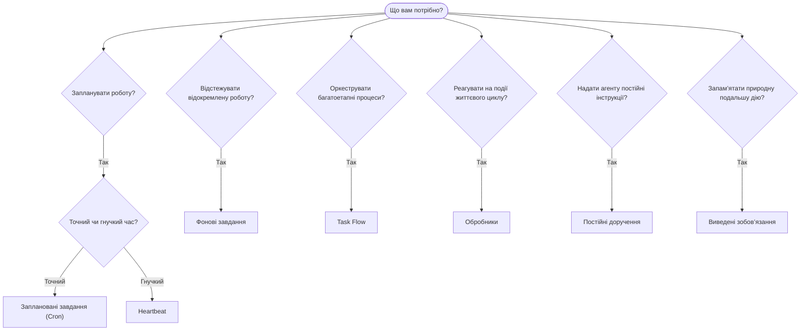

OpenClaw виконує роботу у фоновому режимі за допомогою завдань, запланованих робіт, виведених
зобов’язань, обробників подій і постійних інструкцій. Скористайтеся цією сторінкою, щоб вибрати
відповідний механізм.

## Короткий посібник із вибору

| Сценарій використання                                      | Рекомендовано             | Чому                                                        |
| ---------------------------------------------------------- | ------------------------- | ----------------------------------------------------------- |
| Надсилати щоденний звіт рівно о 9:00                       | Заплановані завдання (Cron) | Точний час, ізольоване виконання                            |
| Нагадати мені через 20 хвилин                              | Заплановані завдання (Cron) | Одноразове виконання в точний час (`--at`)                  |
| Щотижня виконувати поглиблений аналіз                      | Заплановані завдання (Cron) | Автономне завдання, можна використовувати іншу модель       |
| Перевіряти вхідні повідомлення кожні 30 хвилин             | Heartbeat                 | Об’єднується з іншими перевірками, враховує контекст         |
| Стежити за календарем щодо майбутніх подій                 | Heartbeat                 | Природно підходить для періодичного відстеження              |
| Зв’язатися після згаданої співбесіди                       | Виведені зобов’язання     | Подальша дія на кшталт пам’яті без точного запиту нагадування |
| Ненав’язливо поцікавитися станом користувача з огляду на контекст | Виведені зобов’язання | Обмежено тим самим агентом і каналом                         |
| Перевірити стан субагента або запуску ACP                  | Фонові завдання           | Реєстр завдань відстежує всю відокремлену роботу             |
| Перевірити, що й коли виконувалося                         | Фонові завдання           | `openclaw tasks list` і `openclaw tasks audit`              |
| Провести багатоетапне дослідження, а потім підсумувати     | Task Flow                 | Надійна оркестрація з відстеженням редакцій                   |
| Запустити сценарій під час скидання сеансу                 | Обробники                 | Керується подіями, спрацьовує на подіях життєвого циклу      |
| Виконувати код під час кожного виклику інструмента         | Обробники Plugin          | Внутрішньопроцесні обробники можуть перехоплювати виклики інструментів |
| Завжди перевіряти відповідність вимогам перед відповіддю   | Постійні доручення        | Автоматично додаються до кожного сеансу                      |

### Заплановані завдання (Cron) і Heartbeat

| Характеристика   | Заплановані завдання (Cron)         | Heartbeat                                  |
| ---------------- | ----------------------------------- | ------------------------------------------ |
| Час              | Точний (cron-вирази, одноразовий)   | Приблизний (типово кожні 30 хвилин)        |
| Контекст сеансу  | Новий (ізольований) або спільний    | Повний контекст основного сеансу           |
| Записи завдань   | Створюються завжди                  | Ніколи не створюються                      |
| Доставка         | Канал, webhook або без сповіщення   | Безпосередньо в основному сеансі           |
| Найкраще для     | Звітів, нагадувань, фонових робіт   | Перевірок пошти, календаря та сповіщень    |

Використовуйте заплановані завдання (Cron), коли потрібен точний час або ізольоване виконання. Використовуйте Heartbeat, коли для роботи корисний повний контекст сеансу й достатньо приблизного часу.

## Основні поняття

### Заплановані завдання (Cron)

Cron — вбудований планувальник Gateway для точного визначення часу. Він зберігає роботи, активує агента в потрібний момент і може доставляти результат у канал чату або кінцеву точку webhook. Підтримує одноразові нагадування, повторювані вирази та вхідні тригери webhook.

Див. [Заплановані завдання](/uk/automation/cron-jobs).

### Завдання

Реєстр фонових завдань відстежує всю відокремлену роботу: запуски ACP, створення субагентів, ізольовані виконання cron і операції CLI. Завдання — це записи, а не планувальники. Для їх перегляду використовуйте `openclaw tasks list` і `openclaw tasks audit`.

Див. [Фонові завдання](/uk/automation/tasks).

### Виведені зобов’язання

Зобов’язання — це добровільно ввімкнені короткочасні спогади про подальші дії. OpenClaw виводить їх
зі звичайних розмов, обмежує тим самим агентом і каналом та
доставляє своєчасні звернення через Heartbeat. Нагадування, для яких користувач указав точний час,
і надалі належать до cron.

Див. [Виведені зобов’язання](/uk/concepts/commitments).

### Task Flow

Task Flow — це рівень оркестрації процесів над фоновими завданнями. Він керує надійними багатоетапними процесами з керованими й дзеркальними режимами синхронізації, відстеженням редакцій і командами `openclaw tasks flow list|show|cancel` для перегляду.

Див. [Task Flow](/uk/automation/taskflow).

### Постійні доручення

Постійні доручення надають агенту безстрокові операційні повноваження для визначених програм. Вони зберігаються у файлах робочого простору (зазвичай `AGENTS.md`) і додаються до кожного сеансу. Поєднуйте їх із cron для виконання за розкладом.

Див. [Постійні доручення](/uk/automation/standing-orders).

### Обробники

Внутрішні обробники — це керовані подіями сценарії, які запускаються подіями життєвого циклу агента
(`/new`, `/reset`, `/stop`), ущільненням сеансу, запуском Gateway і потоком
повідомлень. Вони виявляються в каталогах обробників і керуються за допомогою
`openclaw hooks`. Для внутрішньопроцесного перехоплення викликів інструментів використовуйте
[обробники Plugin](/uk/plugins/hooks).

Див. [Обробники](/uk/automation/hooks).

### Heartbeat

Heartbeat — це періодичний хід основного сеансу (типово кожні 30 хвилин). Він об’єднує кілька перевірок (вхідні повідомлення, календар, сповіщення) в один хід агента з повним контекстом сеансу. Ходи Heartbeat не створюють записів завдань і не подовжують актуальність щоденного скидання сеансу або скидання через бездіяльність. Використовуйте `HEARTBEAT.md` для короткого контрольного списку або блок `tasks:`, якщо потрібно виконувати в самому Heartbeat лише періодичні перевірки, термін яких настав. Порожні файли Heartbeat пропускаються як `empty-heartbeat-file`; режим завдань лише за терміном пропускається як `no-tasks-due`. Heartbeat відкладається, поки робота cron активна або стоїть у черзі, а `heartbeat.skipWhenBusy` також може відкласти агента, поки зайняті прив’язані до ключа сеансу субагенти цього самого агента або вкладені канали виконання.

Див. [Heartbeat](/uk/gateway/heartbeat).

## Як вони працюють разом

- **Cron** обробляє точні розклади (щоденні звіти, щотижневі огляди) та одноразові нагадування. Усі виконання cron створюють записи завдань.
- **Heartbeat** виконує регулярний моніторинг (вхідні повідомлення, календар, сповіщення) одним об’єднаним ходом кожні 30 хвилин.
- **Обробники** реагують на певні події (скидання сеансу, ущільнення, потік повідомлень) за допомогою спеціальних сценаріїв. Обробники Plugin охоплюють виклики інструментів.
- **Постійні доручення** надають агенту постійний контекст і межі повноважень.
- **Task Flow** координує багатоетапні процеси над окремими завданнями.
- **Завдання** автоматично відстежують усю відокремлену роботу, щоб її можна було переглядати й перевіряти.

## Пов’язані матеріали

- [Заплановані завдання](/uk/automation/cron-jobs) — точне планування та одноразові нагадування
- [Виведені зобов’язання](/uk/concepts/commitments) — подальші звернення на кшталт пам’яті
- [Фонові завдання](/uk/automation/tasks) — реєстр усієї відокремленої роботи
- [Task Flow](/uk/automation/taskflow) — надійна оркестрація багатоетапних процесів
- [Обробники](/uk/automation/hooks) — керовані подіями сценарії життєвого циклу
- [Обробники Plugin](/uk/plugins/hooks) — внутрішньопроцесні обробники інструментів, запитів, повідомлень і життєвого циклу
- [Постійні доручення](/uk/automation/standing-orders) — постійні інструкції агента
- [Heartbeat](/uk/gateway/heartbeat) — періодичні ходи основного сеансу
- [Довідник із конфігурації](/uk/gateway/configuration-reference) — усі ключі конфігурації
