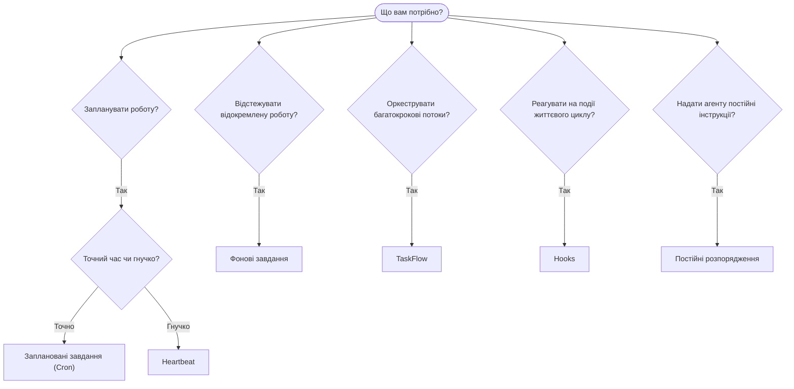

---
read_when:
    - Вибір способу автоматизації роботи з OpenClaw
    - Вибір між Heartbeat, Cron, hooks і постійними розпорядженнями
    - Пошук правильної точки входу для автоматизації
summary: 'Огляд механізмів автоматизації: завдання, cron, hooks, постійні розпорядження та TaskFlow'
title: Автоматизація та завдання
x-i18n:
    generated_at: "2026-04-24T17:33:03Z"
    model: gpt-5.4
    provider: openai
    source_hash: 54524eb5d1fcb2b2e3e51117339be1949d980afaef1f6ae71fcfd764049f3f47
    source_path: automation/index.md
    workflow: 15
---

OpenClaw виконує роботу у фоновому режимі через завдання, заплановані задачі, hooks і постійні інструкції. Ця сторінка допоможе вам вибрати правильний механізм і зрозуміти, як вони поєднуються між собою.

## Короткий посібник з вибору

| Випадок використання                    | Рекомендовано          | Чому                                            |
| --------------------------------------- | ---------------------- | ----------------------------------------------- |
| Надіслати щоденний звіт рівно о 9:00    | Заплановані завдання (Cron) | Точний час, ізольоване виконання           |
| Нагадати мені через 20 хвилин           | Заплановані завдання (Cron) | Одноразовий запуск із точним часом (`--at`) |
| Запускати щотижневий глибокий аналіз    | Заплановані завдання (Cron) | Окреме завдання, можна використовувати іншу модель |
| Перевіряти вхідні кожні 30 хв           | Heartbeat              | Об’єднує з іншими перевірками, враховує контекст |
| Стежити за календарем щодо майбутніх подій | Heartbeat           | Природний варіант для періодичного моніторингу |
| Перевірити статус субагента або запуску ACP | Фонові завдання     | Журнал завдань відстежує всю відокремлену роботу |
| Перевірити, що запускалося і коли       | Фонові завдання       | `openclaw tasks list` і `openclaw tasks audit` |
| Багатокрокове дослідження, а потім підсумок | TaskFlow           | Надійна оркестрація з відстеженням ревізій     |
| Запустити скрипт під час скидання сесії | Hooks                  | Керується подіями, спрацьовує на подіях життєвого циклу |
| Виконувати код під час кожного виклику інструмента | Plugin hooks  | Внутрішньопроцесні hooks можуть перехоплювати виклики інструментів |
| Завжди перевіряти відповідність перед відповіддю | Постійні розпорядження | Автоматично додаються до кожної сесії      |

### Заплановані завдання (Cron) vs Heartbeat

| Вимір          | Заплановані завдання (Cron)        | Heartbeat                            |
| -------------- | ---------------------------------- | ------------------------------------ |
| Час            | Точний (cron-вирази, одноразовий запуск) | Приблизний (типово кожні 30 хв) |
| Контекст сесії | Новий (ізольований) або спільний   | Повний контекст основної сесії       |
| Записи завдань | Створюються завжди                 | Ніколи не створюються                |
| Доставка       | Канал, Webhook або без виводу      | Вбудовано в основну сесію            |
| Найкраще для   | Звітів, нагадувань, фонових задач  | Перевірки вхідних, календаря, сповіщень |

Використовуйте Заплановані завдання (Cron), коли потрібен точний час або ізольоване виконання. Використовуйте Heartbeat, коли роботі корисний повний контекст сесії, а приблизного часу достатньо.

## Основні поняття

### Заплановані завдання (cron)

Cron — це вбудований планувальник Gateway для точного часу. Він зберігає задачі, пробуджує агента у потрібний момент і може доставляти результат до каналу чату або endpoint Webhook. Підтримує одноразові нагадування, повторювані вирази та вхідні тригери Webhook.

Див. [Заплановані завдання](/uk/automation/cron-jobs).

### Завдання

Журнал фонових завдань відстежує всю відокремлену роботу: запуски ACP, запуск субагентів, ізольовані cron-виконання та операції CLI. Завдання — це записи, а не планувальники. Використовуйте `openclaw tasks list` і `openclaw tasks audit` для їх перегляду.

Див. [Фонові завдання](/uk/automation/tasks).

### TaskFlow

TaskFlow — це підкладка оркестрації потоків над фоновими завданнями. Вона керує надійними багатокроковими потоками з керованими та дзеркальними режимами синхронізації, відстеженням ревізій і `openclaw tasks flow list|show|cancel` для перегляду.

Див. [TaskFlow](/uk/automation/taskflow).

### Постійні розпорядження

Постійні розпорядження надають агенту постійні повноваження для виконання визначених програм. Вони зберігаються у файлах робочого простору (зазвичай `AGENTS.md`) і додаються до кожної сесії. Поєднуйте з cron для контролю, прив’язаного до часу.

Див. [Постійні розпорядження](/uk/automation/standing-orders).

### Hooks

Внутрішні hooks — це керовані подіями скрипти, які спрацьовують на подіях життєвого циклу агента
(`/new`, `/reset`, `/stop`), Compaction сесії, запуску gateway та потоці
повідомлень. Вони автоматично виявляються з каталогів і можуть керуватися
через `openclaw hooks`. Для внутрішньопроцесного перехоплення викликів інструментів використовуйте
[Plugin hooks](/uk/plugins/hooks).

Див. [Hooks](/uk/automation/hooks).

### Heartbeat

Heartbeat — це періодичний хід основної сесії (типово кожні 30 хвилин). Він об’єднує кілька перевірок (вхідні, календар, сповіщення) в одному ході агента з повним контекстом сесії. Ходи Heartbeat не створюють записів завдань. Використовуйте `HEARTBEAT.md` для невеликого списку перевірок або блок `tasks:`, якщо ви хочете перевірки лише в належний час у межах самого heartbeat. Порожні файли heartbeat пропускаються як `empty-heartbeat-file`; режим завдань лише в належний час пропускається як `no-tasks-due`.

Див. [Heartbeat](/uk/gateway/heartbeat).

## Як вони працюють разом

- **Cron** обробляє точні розклади (щоденні звіти, щотижневі огляди) та одноразові нагадування. Усі виконання cron створюють записи завдань.
- **Heartbeat** обробляє рутинний моніторинг (вхідні, календар, сповіщення) в одному об’єднаному ході кожні 30 хвилин.
- **Hooks** реагують на конкретні події (скидання сесії, Compaction, потік повідомлень) за допомогою користувацьких скриптів. Plugin hooks охоплюють виклики інструментів.
- **Постійні розпорядження** надають агенту постійний контекст і межі повноважень.
- **TaskFlow** координує багатокрокові потоки поверх окремих завдань.
- **Завдання** автоматично відстежують усю відокремлену роботу, щоб ви могли її переглядати й аудіювати.

## Пов’язане

- [Заплановані завдання](/uk/automation/cron-jobs) — точне планування та одноразові нагадування
- [Фонові завдання](/uk/automation/tasks) — журнал завдань для всієї відокремленої роботи
- [TaskFlow](/uk/automation/taskflow) — надійна оркестрація багатокрокових потоків
- [Hooks](/uk/automation/hooks) — скрипти життєвого циклу, керовані подіями
- [Plugin hooks](/uk/plugins/hooks) — внутрішньопроцесні hooks для інструментів, промптів, повідомлень і життєвого циклу
- [Постійні розпорядження](/uk/automation/standing-orders) — постійні інструкції агента
- [Heartbeat](/uk/gateway/heartbeat) — періодичні ходи основної сесії
- [Configuration Reference](/uk/gateway/configuration-reference) — усі ключі конфігурації
