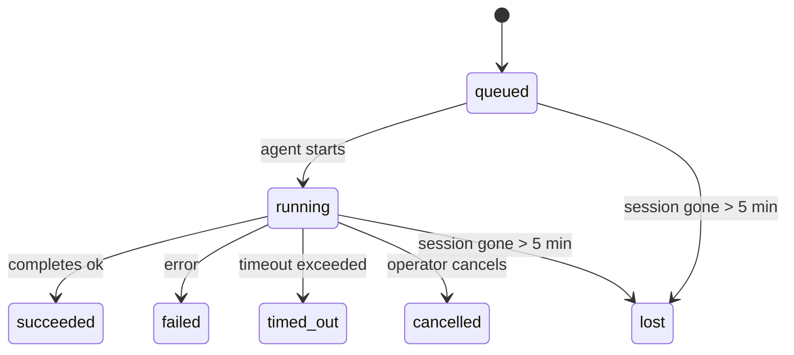

---
read_when:
    - Перегляд фонової роботи, що триває або нещодавно завершилася
    - Налагодження збоїв доставки для відокремлених запусків агентів
    - Розуміння того, як фонові запуски пов’язані із сеансами, Cron і Heartbeat
sidebarTitle: Background tasks
summary: Відстеження фонових завдань для запусків ACP, субагентів, ізольованих завдань Cron і операцій CLI
title: Фонові завдання
x-i18n:
    generated_at: "2026-04-28T11:04:13Z"
    model: gpt-5.5
    provider: openai
    source_hash: 54843ab3831dceb3df810a17dbe97e2824d99bae2233291a70f52aca168778b4
    source_path: automation/tasks.md
    workflow: 16
---

<Note>
Шукаєте планування? Див. [Автоматизація та завдання](/uk/automation), щоб вибрати правильний механізм. Ця сторінка є журналом активності для фонової роботи, а не планувальником.
</Note>

Фонові завдання відстежують роботу, що виконується **поза вашим основним сеансом розмови**: запуски ACP, створення субагентів, ізольовані виконання cron-завдань і операції, ініційовані з CLI.

Завдання **не** замінюють сеанси, cron-завдання чи Heartbeat — вони є **журналом активності**, який записує, яка відокремлена робота відбулася, коли саме та чи завершилася вона успішно.

<Note>
Не кожен запуск агента створює завдання. Ходи Heartbeat і звичайний інтерактивний чат не створюють. Усі виконання cron, створення ACP, створення субагентів і агентні команди CLI створюють.
</Note>

## TL;DR

- Завдання — це **записи**, а не планувальники — cron і Heartbeat вирішують, _коли_ виконується робота, а завдання відстежують, _що сталося_.
- ACP, субагенти, усі cron-завдання й операції CLI створюють завдання. Ходи Heartbeat не створюють.
- Кожне завдання проходить через `queued → running → terminal` (succeeded, failed, timed_out, cancelled або lost).
- Cron-завдання залишаються активними, доки середовище виконання cron усе ще володіє завданням; якщо
  стан середовища виконання в пам’яті зник, супровід завдань спершу перевіряє стійку історію запусків cron,
  перш ніж позначити завдання як lost.
- Завершення керується push-механізмом: відокремлена робота може сповістити напряму або пробудити
  сеанс запитувача/Heartbeat після завершення, тому цикли опитування статусу
  зазвичай мають неправильну форму.
- Ізольовані запуски cron і завершення субагентів докладають максимальних зусиль, щоб очистити відстежувані вкладки браузера/процеси для свого дочірнього сеансу перед фінальним службовим очищенням.
- Ізольована доставка cron пригнічує застарілі проміжні відповіді батьківського сеансу, доки робота нащадкових субагентів ще завершується, і віддає перевагу фінальному виводу нащадка, якщо він надходить до доставки.
- Сповіщення про завершення доставляються напряму в канал або ставляться в чергу для наступного Heartbeat.
- `openclaw tasks list` показує всі завдання; `openclaw tasks audit` виявляє проблеми.
- Термінальні записи зберігаються 7 днів, а потім автоматично видаляються.

## Швидкий старт

<Tabs>
  <Tab title="Список і фільтрування">
    ```bash
    # List all tasks (newest first)
    openclaw tasks list

    # Filter by runtime or status
    openclaw tasks list --runtime acp
    openclaw tasks list --status running
    ```

  </Tab>
  <Tab title="Перегляд">
    ```bash
    # Show details for a specific task (by ID, run ID, or session key)
    openclaw tasks show <lookup>
    ```
  </Tab>
  <Tab title="Скасування та сповіщення">
    ```bash
    # Cancel a running task (kills the child session)
    openclaw tasks cancel <lookup>

    # Change notification policy for a task
    openclaw tasks notify <lookup> state_changes
    ```

  </Tab>
  <Tab title="Аудит і супровід">
    ```bash
    # Run a health audit
    openclaw tasks audit

    # Preview or apply maintenance
    openclaw tasks maintenance
    openclaw tasks maintenance --apply
    ```

  </Tab>
  <Tab title="Потік завдань">
    ```bash
    # Inspect TaskFlow state
    openclaw tasks flow list
    openclaw tasks flow show <lookup>
    openclaw tasks flow cancel <lookup>
    ```
  </Tab>
</Tabs>

## Що створює завдання

| Джерело                | Тип середовища виконання | Коли створюється запис завдання                         | Типова політика сповіщень |
| ---------------------- | ------------ | ------------------------------------------------------ | --------------------- |
| Фонові запуски ACP     | `acp`        | Створення дочірнього сеансу ACP                        | `done_only`           |
| Оркестрація субагентів | `subagent`   | Створення субагента через `sessions_spawn`             | `done_only`           |
| Cron-завдання (усі типи) | `cron`     | Кожне виконання cron (основний сеанс та ізольоване)    | `silent`              |
| Операції CLI           | `cli`        | Команди `openclaw agent`, що виконуються через gateway | `silent`              |
| Медіазавдання агента   | `cli`        | Запуски `video_generate`, підтримані сеансом           | `silent`              |

<AccordionGroup>
  <Accordion title="Типові сповіщення для cron і медіа">
    Cron-завдання основного сеансу за замовчуванням використовують політику сповіщень `silent` — вони створюють записи для відстеження, але не генерують сповіщень. Ізольовані cron-завдання також за замовчуванням використовують `silent`, але вони помітніші, бо виконуються у власному сеансі.

    Запуски `video_generate`, підтримані сеансом, також використовують політику сповіщень `silent`. Вони все одно створюють записи завдань, але завершення повертається до початкового сеансу агента як внутрішнє пробудження, щоб агент міг сам написати подальше повідомлення й прикріпити готове відео. Якщо ви вмикаєте `tools.media.asyncCompletion.directSend`, асинхронні завершення `music_generate` і `video_generate` спершу намагаються виконати пряму доставку в канал, перш ніж повернутися до шляху пробудження сеансу запитувача.

  </Accordion>
  <Accordion title="Запобіжник для одночасних video_generate">
    Доки завдання `video_generate`, підтримане сеансом, усе ще активне, інструмент також працює як запобіжник: повторні виклики `video_generate` у тому самому сеансі повертають статус активного завдання замість запуску другої паралельної генерації. Використовуйте `action: "status"`, коли потрібен явний запит прогресу/статусу з боку агента.
  </Accordion>
  <Accordion title="Що не створює завдань">
    - Ходи Heartbeat — основний сеанс; див. [Heartbeat](/uk/gateway/heartbeat)
    - Звичайні інтерактивні ходи чату
    - Прямі відповіді `/command`

  </Accordion>
</AccordionGroup>

## Життєвий цикл завдання



| Статус      | Що це означає                                                             |
| ----------- | -------------------------------------------------------------------------- |
| `queued`    | Створено, очікує запуску агента                                           |
| `running`   | Хід агента активно виконується                                            |
| `succeeded` | Успішно завершено                                                         |
| `failed`    | Завершено з помилкою                                                      |
| `timed_out` | Перевищено налаштований тайм-аут                                          |
| `cancelled` | Зупинено оператором через `openclaw tasks cancel`                         |
| `lost`      | Середовище виконання втратило авторитетний базовий стан після 5-хвилинного пільгового періоду |

Переходи відбуваються автоматично — коли пов’язаний запуск агента завершується, статус завдання оновлюється відповідно.

Завершення запуску агента є авторитетним для активних записів завдань. Успішний відокремлений запуск фіналізується як `succeeded`, звичайні помилки запуску фіналізуються як `failed`, а результати тайм-ауту або переривання фіналізуються як `timed_out`. Якщо оператор уже скасував завдання або середовище виконання вже записало сильніший термінальний стан, як-от `failed`, `timed_out` чи `lost`, пізніший сигнал успіху не знижує цей термінальний статус.

`lost` залежить від середовища виконання:

- Завдання ACP: зникли метадані базового дочірнього сеансу ACP.
- Завдання субагентів: базовий дочірній сеанс зник зі сховища цільового агента.
- Cron-завдання: середовище виконання cron більше не відстежує завдання як активне, а стійка
  історія запусків cron не показує термінального результату для цього запуску. Офлайн-аудит CLI
  не вважає власний порожній внутрішньопроцесний стан середовища виконання cron авторитетним.
- Завдання CLI: ізольовані завдання дочірніх сеансів використовують дочірній сеанс; підтримані чатом
  завдання CLI натомість використовують живий контекст запуску, тому залишкові
  рядки сеансів каналу/групи/особистого чату не підтримують їх активними. Запуски
  `openclaw agent`, підтримані Gateway, також фіналізуються за результатом свого запуску, тому завершені запуски
  не залишаються активними, доки прибиральник не позначить їх як `lost`.

## Доставка та сповіщення

Коли завдання досягає термінального стану, OpenClaw сповіщає вас. Є два шляхи доставки:

**Пряма доставка** — якщо завдання має цільовий канал (`requesterOrigin`), повідомлення про завершення надсилається прямо в цей канал (Telegram, Discord, Slack тощо). Для завершень субагентів OpenClaw також зберігає прив’язану маршрутизацію гілки/теми, коли вона доступна, і може заповнити відсутні `to` / обліковий запис зі збереженого маршруту сеансу запитувача (`lastChannel` / `lastTo` / `lastAccountId`), перш ніж відмовитися від прямої доставки.

**Доставка через чергу сеансу** — якщо пряма доставка не вдається або джерело не задане, оновлення ставиться в чергу як системна подія в сеансі запитувача й з’являється під час наступного Heartbeat.

<Tip>
Завершення завдання запускає негайне пробудження Heartbeat, тож ви швидко бачите результат — вам не потрібно чекати наступного запланованого такту Heartbeat.
</Tip>

Це означає, що звичний робочий процес є push-орієнтованим: запустіть відокремлену роботу один раз, а потім дозвольте середовищу виконання пробудити вас або сповістити після завершення. Опитуйте стан завдання лише тоді, коли потрібні налагодження, втручання або явний аудит.

### Політики сповіщень

Керуйте тим, скільки повідомлень ви отримуєте про кожне завдання:

| Політика              | Що доставляється                                                       |
| --------------------- | ----------------------------------------------------------------------- |
| `done_only` (типово)  | Лише термінальний стан (succeeded, failed тощо) — **це типове значення** |
| `state_changes`       | Кожен перехід стану та оновлення прогресу                              |
| `silent`              | Нічого                                                                 |

Змініть політику, доки завдання виконується:

```bash
openclaw tasks notify <lookup> state_changes
```

## Довідник CLI

<AccordionGroup>
  <Accordion title="tasks list">
    ```bash
    openclaw tasks list [--runtime <acp|subagent|cron|cli>] [--status <status>] [--json]
    ```

    Стовпці виводу: ID завдання, вид, статус, доставка, ID запуску, дочірній сеанс, зведення.

  </Accordion>
  <Accordion title="tasks show">
    ```bash
    openclaw tasks show <lookup>
    ```

    Токен пошуку приймає ID завдання, ID запуску або ключ сеансу. Показує повний запис, зокрема час, стан доставки, помилку та термінальне зведення.

  </Accordion>
  <Accordion title="tasks cancel">
    ```bash
    openclaw tasks cancel <lookup>
    ```

    Для завдань ACP і субагентів це завершує дочірній сеанс. Для завдань, відстежуваних CLI, скасування записується в реєстрі завдань (окремого дескриптора дочірнього середовища виконання немає). Статус переходить у `cancelled`, а сповіщення про доставку надсилається, коли це застосовно.

  </Accordion>
  <Accordion title="tasks notify">
    ```bash
    openclaw tasks notify <lookup> <done_only|state_changes|silent>
    ```
  </Accordion>
  <Accordion title="tasks audit">
    ```bash
    openclaw tasks audit [--json]
    ```

    Виявляє операційні проблеми. Знахідки також з’являються в `openclaw status`, коли виявлено проблеми.

    | Знахідка                 | Серйозність | Тригер                                                                                                                 |
    | ------------------------- | ---------- | ---------------------------------------------------------------------------------------------------------------------- |
    | `stale_queued`            | warn       | У черзі понад 10 хвилин                                                                                                |
    | `stale_running`           | error      | Виконується понад 30 хвилин                                                                                            |
    | `lost`                    | warn/error | Власність над задачею, підтримана середовищем виконання, зникла; збережені втрачені задачі попереджають до `cleanupAfter`, потім стають помилками |
    | `delivery_failed`         | warn       | Доставка не вдалася, а політика сповіщень не `silent`                                                                  |
    | `missing_cleanup`         | warn       | Завершальна задача без позначки часу очищення                                                                          |
    | `inconsistent_timestamps` | warn       | Порушення часової шкали (наприклад, завершено до початку)                                                              |

  </Accordion>
  <Accordion title="обслуговування задач">
    ```bash
    openclaw tasks maintenance [--json]
    openclaw tasks maintenance --apply [--json]
    ```

    Використовуйте це, щоб попередньо переглянути або застосувати узгодження, проставлення позначок очищення та скорочення для задач і стану Task Flow.

    Узгодження враховує середовище виконання:

    - Задачі ACP/субагентів перевіряють свій базовий дочірній сеанс.
    - Задачі Cron перевіряють, чи середовище виконання cron досі володіє завданням, а потім відновлюють завершальний статус зі збережених журналів запусків cron/стану завдання, перш ніж повертатися до `lost`. Лише процес Gateway є авторитетним для набору активних завдань cron у пам’яті; офлайн-аудит CLI використовує довговічну історію, але не позначає задачу cron втраченою лише тому, що цей локальний Set порожній.
    - Задачі CLI, підтримані чатом, перевіряють живий контекст запуску власника, а не лише рядок сеансу чату.

    Очищення після завершення також враховує середовище виконання:

    - Завершення субагента найкращими зусиллями закриває відстежувані вкладки браузера/процеси для дочірнього сеансу перед продовженням оголошеного очищення.
    - Завершення ізольованого cron найкращими зусиллями закриває відстежувані вкладки браузера/процеси для сеансу cron перед повним згортанням запуску.
    - Доставка ізольованого cron за потреби очікує подальшу дію нащадкового субагента та пригнічує застарілий текст підтвердження батьківської задачі замість його оголошення.
    - Доставка завершення субагента віддає перевагу найновішому видимому тексту асистента; якщо він порожній, вона повертається до очищеного найновішого тексту tool/toolResult, а запуски викликів інструментів лише з тайм-аутом можуть згортатися до короткого підсумку часткового прогресу. Завершальні невдалі запуски оголошують статус помилки без повторного відтворення захопленого тексту відповіді.
    - Помилки очищення не маскують реальний результат задачі.

  </Accordion>
  <Accordion title="список | показ | скасування flow задач">
    ```bash
    openclaw tasks flow list [--status <status>] [--json]
    openclaw tasks flow show <lookup> [--json]
    openclaw tasks flow cancel <lookup>
    ```

    Використовуйте їх, коли вас цікавить оркеструвальний Task Flow, а не один окремий запис фонової задачі.

  </Accordion>
</AccordionGroup>

## Дошка задач чату (`/tasks`)

Використовуйте `/tasks` у будь-якому сеансі чату, щоб побачити фонові задачі, пов’язані з цим сеансом. Дошка показує активні та нещодавно завершені задачі із середовищем виконання, статусом, часом і прогресом або деталями помилки.

Коли поточний сеанс не має видимих пов’язаних задач, `/tasks` повертається до локальних для агента лічильників задач, тож ви все одно отримуєте огляд без розкриття деталей інших сеансів.

Для повного операторського журналу використовуйте CLI: `openclaw tasks list`.

## Інтеграція статусу (навантаження задач)

`openclaw status` містить короткий підсумок задач:

```
Tasks: 3 queued · 2 running · 1 issues
```

Підсумок повідомляє:

- **active** — кількість `queued` + `running`
- **failures** — кількість `failed` + `timed_out` + `lost`
- **byRuntime** — розподіл за `acp`, `subagent`, `cron`, `cli`

І `/status`, і інструмент `session_status` використовують знімок задач, що враховує очищення: активні задачі мають пріоритет, застарілі завершені рядки приховуються, а нещодавні помилки показуються лише тоді, коли не залишилося активної роботи. Це утримує картку статусу сфокусованою на тому, що важливо зараз.

## Зберігання та обслуговування

### Де зберігаються задачі

Записи задач зберігаються в SQLite за адресою:

```
$OPENCLAW_STATE_DIR/tasks/runs.sqlite
```

Реєстр завантажується в пам’ять під час запуску Gateway і синхронізує записи з SQLite для довговічності між перезапусками.
Gateway утримує журнал попереднього запису SQLite обмеженим, використовуючи стандартний поріг
autocheckpoint SQLite, а також періодичні контрольні точки `TRUNCATE` і контрольні точки під час завершення роботи.

### Автоматичне обслуговування

Очищувач запускається кожні **60 секунд** і виконує три речі:

<Steps>
  <Step title="Узгодження">
    Перевіряє, чи активні задачі досі мають авторитетну підтримку середовища виконання. Задачі ACP/субагентів використовують стан дочірнього сеансу, задачі cron використовують власність активного завдання, а задачі CLI, підтримані чатом, використовують контекст запуску власника. Якщо цей базовий стан відсутній понад 5 хвилин, задачу позначають як `lost`.
  </Step>
  <Step title="Проставлення позначок очищення">
    Встановлює позначку часу `cleanupAfter` для завершальних задач (endedAt + 7 днів). Під час утримання втрачені задачі все ще відображаються в аудиті як попередження; після завершення строку `cleanupAfter` або коли метадані очищення відсутні, вони є помилками.
  </Step>
  <Step title="Скорочення">
    Видаляє записи після їхньої дати `cleanupAfter`.
  </Step>
</Steps>

<Note>
**Утримання:** записи завершальних задач зберігаються **7 днів**, а потім автоматично скорочуються. Налаштування не потрібне.
</Note>

## Як задачі пов’язані з іншими системами

<AccordionGroup>
  <Accordion title="Задачі та Task Flow">
    [Task Flow](/uk/automation/taskflow) — це шар оркестрації потоків над фоновими задачами. Один потік може координувати кілька задач протягом свого життєвого циклу, використовуючи керовані або дзеркальні режими синхронізації. Використовуйте `openclaw tasks`, щоб перевіряти окремі записи задач, і `openclaw tasks flow`, щоб перевіряти оркеструвальний потік.

    Докладніше див. у [Task Flow](/uk/automation/taskflow).

  </Accordion>
  <Accordion title="Задачі та cron">
    **Визначення** завдання cron зберігається в `~/.openclaw/cron/jobs.json`; стан виконання середовища виконання зберігається поруч у `~/.openclaw/cron/jobs-state.json`. **Кожне** виконання cron створює запис задачі — і основного сеансу, і ізольований. Задачі cron основного сеансу за замовчуванням мають політику сповіщень `silent`, тож вони відстежуються без створення сповіщень.

    Див. [Завдання Cron](/uk/automation/cron-jobs).

  </Accordion>
  <Accordion title="Задачі та heartbeat">
    Запуски Heartbeat є ходами основного сеансу — вони не створюють записів задач. Коли задача завершується, вона може спричинити пробудження Heartbeat, щоб ви швидко побачили результат.

    Див. [Heartbeat](/uk/gateway/heartbeat).

  </Accordion>
  <Accordion title="Задачі та сеанси">
    Задача може посилатися на `childSessionKey` (де виконується робота) і `requesterSessionKey` (хто її запустив). Сеанси — це контекст розмови; задачі — це відстеження активності поверх нього.
  </Accordion>
  <Accordion title="Задачі та запуски агентів">
    `runId` задачі пов’язує її із запуском агента, який виконує роботу. Події життєвого циклу агента (початок, завершення, помилка) автоматично оновлюють статус задачі — вам не потрібно керувати життєвим циклом вручну.
  </Accordion>
</AccordionGroup>

## Пов’язане

- [Автоматизація та задачі](/uk/automation) — усі механізми автоматизації одним поглядом
- [CLI: Задачі](/uk/cli/tasks) — довідник команд CLI
- [Heartbeat](/uk/gateway/heartbeat) — періодичні ходи основного сеансу
- [Заплановані задачі](/uk/automation/cron-jobs) — планування фонової роботи
- [Task Flow](/uk/automation/taskflow) — оркестрація потоків над задачами
