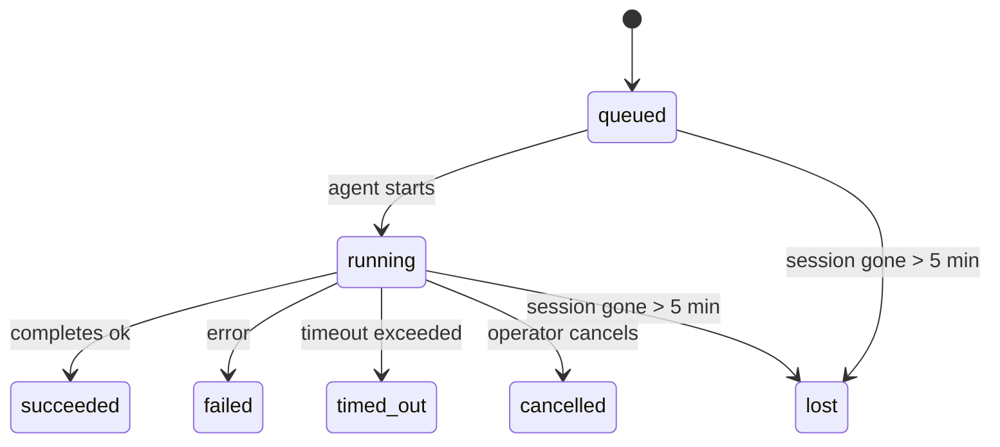

---
read_when:
    - Перегляд фонової роботи, що триває або нещодавно завершилася
    - Налагодження збоїв доставки для від’єднаних запусків агентів
    - Розуміння того, як фонові запуски пов’язані із сеансами, Cron і Heartbeat
sidebarTitle: Background tasks
summary: Відстеження фонових завдань для запусків ACP, субагентів, ізольованих завдань Cron і операцій CLI
title: Фонові завдання
x-i18n:
    generated_at: "2026-05-07T13:13:32Z"
    model: gpt-5.5
    provider: openai
    source_hash: a91a04ef6142e488d2fbc459d2c663afb93816a58fe9f52e0a51420703ea2d4d
    source_path: automation/tasks.md
    workflow: 16
---

<Note>
Шукаєте планування? Див. [Автоматизація та завдання](/uk/automation), щоб вибрати правильний механізм. Ця сторінка — журнал активності для фонової роботи, а не планувальник.
</Note>

Фонові завдання відстежують роботу, що виконується **поза основним сеансом розмови**: запуски ACP, породження субагентів, ізольовані виконання Cron-завдань і операції, ініційовані з CLI.

Завдання **не** замінюють сеанси, Cron-завдання чи Heartbeat — це **журнал активності**, який записує, яка відокремлена робота відбулася, коли саме та чи була вона успішною.

<Note>
Не кожен запуск агента створює завдання. Heartbeat-ходи та звичайний інтерактивний чат цього не роблять. Усі виконання Cron, породження ACP, породження субагентів і команди агента з CLI створюють завдання.
</Note>

## Коротко

- Завдання — це **записи**, а не планувальники: Cron і Heartbeat визначають, _коли_ виконується робота, а завдання відстежують, _що сталося_.
- ACP, субагенти, усі Cron-завдання та операції CLI створюють завдання. Heartbeat-ходи цього не роблять.
- Кожне завдання проходить через `queued → running → terminal` (succeeded, failed, timed_out, cancelled або lost).
- Cron-завдання залишаються активними, поки runtime Cron усе ще володіє цим завданням; якщо
  стан runtime у пам’яті зник, обслуговування завдань спершу перевіряє надійну історію
  запусків Cron, перш ніж позначити завдання як lost.
- Завершення працює через push: відокремлена робота може повідомити напряму або пробудити
  сеанс/Heartbeat запитувача після завершення, тому цикли опитування статусу
  зазвичай мають неправильну форму.
- Ізольовані Cron-запуски та завершення субагентів за принципом найкращого зусилля очищають відстежувані вкладки браузера/процеси для свого дочірнього сеансу перед фінальним службовим очищенням.
- Ізольована доставка Cron пригнічує застарілі проміжні відповіді батьківського сеансу, поки робота нащадків-субагентів ще завершується, і віддає перевагу фінальному виводу нащадка, якщо він надходить до доставки.
- Сповіщення про завершення доставляються безпосередньо в канал або ставляться в чергу для наступного Heartbeat.
- `openclaw tasks list` показує всі завдання; `openclaw tasks audit` виявляє проблеми.
- Термінальні записи зберігаються 7 днів, після чого автоматично видаляються.

## Швидкий старт

<Tabs>
  <Tab title="List and filter">
    ```bash
    # List all tasks (newest first)
    openclaw tasks list

    # Filter by runtime or status
    openclaw tasks list --runtime acp
    openclaw tasks list --status running
    ```

  </Tab>
  <Tab title="Inspect">
    ```bash
    # Show details for a specific task (by ID, run ID, or session key)
    openclaw tasks show <lookup>
    ```
  </Tab>
  <Tab title="Cancel and notify">
    ```bash
    # Cancel a running task (kills the child session)
    openclaw tasks cancel <lookup>

    # Change notification policy for a task
    openclaw tasks notify <lookup> state_changes
    ```

  </Tab>
  <Tab title="Audit and maintenance">
    ```bash
    # Run a health audit
    openclaw tasks audit

    # Preview or apply maintenance
    openclaw tasks maintenance
    openclaw tasks maintenance --apply
    ```

  </Tab>
  <Tab title="Task flow">
    ```bash
    # Inspect TaskFlow state
    openclaw tasks flow list
    openclaw tasks flow show <lookup>
    openclaw tasks flow cancel <lookup>
    ```
  </Tab>
</Tabs>

## Що створює завдання

| Джерело                | Тип runtime | Коли створюється запис завдання                         | Політика сповіщень за замовчуванням |
| ---------------------- | ------------ | ------------------------------------------------------ | --------------------- |
| Фонові запуски ACP     | `acp`        | Породження дочірнього сеансу ACP                        | `done_only`           |
| Оркестрація субагентів | `subagent`   | Породження субагента через `sessions_spawn`             | `done_only`           |
| Cron-завдання (усіх типів) | `cron`       | Кожне виконання Cron (основний сеанс та ізольоване)     | `silent`              |
| Операції CLI           | `cli`        | Команди `openclaw agent`, що виконуються через Gateway  | `silent`              |
| Медіазавдання агента   | `cli`        | Сеансові запуски `music_generate`/`video_generate`      | `silent`              |

<AccordionGroup>
  <Accordion title="Notify defaults for cron and media">
    Cron-завдання основного сеансу за замовчуванням використовують політику сповіщень `silent`: вони створюють записи для відстеження, але не генерують сповіщення. Ізольовані Cron-завдання також за замовчуванням мають `silent`, але вони помітніші, бо виконуються у власному сеансі.

    Сеансові запуски `music_generate` і `video_generate` також використовують політику сповіщень `silent`. Вони все одно створюють записи завдань, але завершення повертається до початкового сеансу агента як внутрішнє пробудження, щоб агент міг сам написати подальше повідомлення й прикріпити готові медіа. Завершення в групах/каналах дотримуються звичайної політики видимої відповіді, тому агент використовує інструмент повідомлень, коли цього вимагає доставка з джерела. Якщо агент завершення не надає доказ доставки через інструмент повідомлень у маршруті лише з інструментами, OpenClaw надсилає резервне повідомлення про завершення безпосередньо до початкового каналу замість того, щоб залишити медіа приватними.

  </Accordion>
  <Accordion title="Concurrent video_generate guardrail">
    Поки сеансове завдання `video_generate` усе ще активне, інструмент також діє як захисне обмеження: повторні виклики `video_generate` у тому самому сеансі повертають статус активного завдання замість запуску другої паралельної генерації. Використовуйте `action: "status"`, коли потрібен явний запит прогресу/статусу з боку агента.
  </Accordion>
  <Accordion title="What does not create tasks">
    - Heartbeat-ходи — основний сеанс; див. [Heartbeat](/uk/gateway/heartbeat)
    - Звичайні інтерактивні ходи чату
    - Прямі відповіді `/command`

  </Accordion>
</AccordionGroup>

## Життєвий цикл завдання



| Статус      | Що це означає                                                             |
| ----------- | -------------------------------------------------------------------------- |
| `queued`    | Створено, очікує запуску агента                                            |
| `running`   | Хід агента активно виконується                                             |
| `succeeded` | Успішно завершено                                                          |
| `failed`    | Завершено з помилкою                                                       |
| `timed_out` | Перевищено налаштований тайм-аут                                           |
| `cancelled` | Зупинено оператором через `openclaw tasks cancel`                          |
| `lost`      | Runtime втратив авторитетний опорний стан після 5-хвилинного пільгового періоду |

Переходи відбуваються автоматично: коли пов’язаний запуск агента завершується, статус завдання оновлюється відповідно.

Завершення запуску агента є авторитетним для активних записів завдань. Успішний відокремлений запуск фіналізується як `succeeded`, звичайні помилки запуску фіналізуються як `failed`, а результати тайм-ауту або переривання фіналізуються як `timed_out`. Якщо оператор уже скасував завдання або runtime уже записав сильніший термінальний стан, як-от `failed`, `timed_out` чи `lost`, пізніший сигнал успіху не знижує цей термінальний статус.

`lost` враховує runtime:

- Завдання ACP: опорні метадані дочірнього сеансу ACP зникли.
- Завдання субагентів: опорний дочірній сеанс зник зі сховища цільового агента.
- Cron-завдання: runtime Cron більше не відстежує завдання як активне, а надійна
  історія запусків Cron не показує термінального результату для цього запуску. Офлайн-аудит CLI
  не вважає власний порожній стан runtime Cron у процесі авторитетним.
- Завдання CLI: завдання з ідентифікатором запуску/ідентифікатором джерела використовують живий контекст запуску, тому
  залишкові рядки дочірнього сеансу або чат-сеансу не підтримують їх активними після того,
  як запуск, яким володіє Gateway, зникає. Застарілі завдання CLI без ідентичності запуску все ще
  повертаються до дочірнього сеансу. Запуски `openclaw agent` із підтримкою Gateway також фіналізуються
  за результатом свого запуску, тому завершені запуски не лишаються активними, доки прибиральник
  не позначить їх як `lost`.

## Доставка та сповіщення

Коли завдання досягає термінального стану, OpenClaw сповіщає вас. Є два шляхи доставки:

**Пряма доставка** — якщо завдання має цільовий канал (`requesterOrigin`), повідомлення про завершення йде прямо в цей канал (Telegram, Discord, Slack тощо). Для завершень субагентів OpenClaw також зберігає прив’язану маршрутизацію гілки/теми, коли вона доступна, і може заповнити відсутні `to` / обліковий запис зі збереженого маршруту сеансу запитувача (`lastChannel` / `lastTo` / `lastAccountId`), перш ніж відмовитися від прямої доставки.

**Доставка через чергу сеансу** — якщо пряма доставка завершується невдало або origin не задано, оновлення ставиться в чергу як системна подія в сеансі запитувача й з’являється під час наступного Heartbeat.

<Tip>
Завершення завдання запускає негайне пробудження Heartbeat, тож ви швидко бачите результат: не потрібно чекати наступного запланованого такту Heartbeat.
</Tip>

Це означає, що звичайний робочий процес базується на push: один раз запустіть відокремлену роботу, а потім дозвольте runtime пробудити вас або повідомити після завершення. Опитуйте стан завдання лише тоді, коли потрібне налагодження, втручання або явний аудит.

### Політики сповіщень

Керуйте тим, скільки повідомлень ви отримуєте про кожне завдання:

| Політика              | Що доставляється                                                       |
| --------------------- | ----------------------------------------------------------------------- |
| `done_only` (за замовчуванням) | Лише термінальний стан (succeeded, failed тощо) — **це значення за замовчуванням** |
| `state_changes`       | Кожен перехід стану та оновлення прогресу                               |
| `silent`              | Нічого                                                                  |

Змініть політику, поки завдання виконується:

```bash
openclaw tasks notify <lookup> state_changes
```

## Довідник CLI

<AccordionGroup>
  <Accordion title="tasks list">
    ```bash
    openclaw tasks list [--runtime <acp|subagent|cron|cli>] [--status <status>] [--json]
    ```

    Стовпці виводу: ідентифікатор завдання, тип, статус, доставка, ідентифікатор запуску, дочірній сеанс, підсумок.

  </Accordion>
  <Accordion title="tasks show">
    ```bash
    openclaw tasks show <lookup>
    ```

    Токен пошуку приймає ідентифікатор завдання, ідентифікатор запуску або ключ сеансу. Показує повний запис, зокрема час, стан доставки, помилку й термінальний підсумок.

  </Accordion>
  <Accordion title="tasks cancel">
    ```bash
    openclaw tasks cancel <lookup>
    ```

    Для завдань ACP і субагентів це вбиває дочірній сеанс. Для завдань, відстежуваних CLI, скасування записується в реєстр завдань (окремого дескриптора дочірнього runtime немає). Статус переходить у `cancelled`, а сповіщення про доставку надсилається, коли це застосовно.

  </Accordion>
  <Accordion title="tasks notify">
    ```bash
    openclaw tasks notify <lookup> <done_only|state_changes|silent>
    ```
  </Accordion>
  <Accordion title="tasks audit">
    ```bash
    openclaw tasks audit [--json]
    ```

    Виявляє операційні проблеми. Знахідки також з’являються в `openclaw status`, коли виявлено проблеми.

    | Знахідка                 | Серйозність | Тригер                                                                                                      |
    | ------------------------- | ---------- | ------------------------------------------------------------------------------------------------------------ |
    | `stale_queued`            | warn       | У черзі понад 10 хвилин                                                                                      |
    | `stale_running`           | error      | Виконується понад 30 хвилин                                                                                  |
    | `lost`                    | warn/error | Володіння завданням із runtime-підтримкою зникло; збережені втрачені завдання попереджають до `cleanupAfter`, потім стають помилками |
    | `delivery_failed`         | warn       | Доставку не вдалося виконати, а політика сповіщення не є `silent`                                            |
    | `missing_cleanup`         | warn       | Термінальне завдання без мітки часу очищення                                                                 |
    | `inconsistent_timestamps` | warn       | Порушення часової шкали (наприклад, завершено до початку)                                                    |

  </Accordion>
  <Accordion title="обслуговування tasks">
    ```bash
    openclaw tasks maintenance [--json]
    openclaw tasks maintenance --apply [--json]
    ```

    Використовуйте це, щоб попередньо переглянути або застосувати узгодження, проставлення міток очищення та обрізання для завдань і стану Task Flow.

    Узгодження враховує runtime:

    - Завдання ACP/subagent перевіряють свій базовий дочірній сеанс.
    - Завдання subagent, чий дочірній сеанс має tombstone відновлення після перезапуску, позначаються як втрачені, а не розглядаються як відновлювані базові сеанси.
    - Завдання Cron перевіряють, чи cron runtime досі володіє job, потім відновлюють термінальний статус зі збережених журналів виконання cron/job state, перш ніж повернутися до `lost`. Лише процес Gateway є авторитетним для in-memory набору активних cron jobs; офлайн-аудит CLI використовує durable history, але не позначає cron task як втрачений лише тому, що цей локальний Set порожній.
    - Завдання CLI з ідентичністю виконання перевіряють власний live run context, а не лише рядки child-session або chat-session.

    Очищення після завершення також враховує runtime:

    - Завершення subagent найкращими зусиллями закриває відстежувані вкладки браузера/процеси для дочірнього сеансу, перш ніж продовжується очищення оголошення.
    - Завершення ізольованого cron найкращими зусиллями закриває відстежувані вкладки браузера/процеси для cron session, перш ніж виконання повністю завершується.
    - Доставка ізольованого cron за потреби очікує на подальшу дію нащадка subagent і пригнічує застарілий текст підтвердження батьківського елемента замість оголошення його.
    - Доставка завершення subagent надає перевагу найновішому видимому тексту assistant; якщо він порожній, вона повертається до очищеного найновішого тексту tool/toolResult, а виконання tool-call лише з тайм-аутом можуть згортатися в короткий підсумок часткового прогресу. Термінальні невдалі виконання оголошують статус помилки без повторного відтворення захопленого тексту відповіді.
    - Помилки очищення не маскують справжній результат завдання.

  </Accordion>
  <Accordion title="tasks flow list | show | cancel">
    ```bash
    openclaw tasks flow list [--status <status>] [--json]
    openclaw tasks flow show <lookup> [--json]
    openclaw tasks flow cancel <lookup>
    ```

    Використовуйте ці команди, коли вас цікавить оркеструвальний Task Flow, а не один окремий запис фонового завдання.

  </Accordion>
</AccordionGroup>

## Дошка завдань чату (`/tasks`)

Використовуйте `/tasks` у будь-якому сеансі чату, щоб побачити фонові завдання, пов’язані з цим сеансом. Дошка показує активні та нещодавно завершені завдання з runtime, статусом, часом і деталями прогресу або помилки.

Коли поточний сеанс не має видимих пов’язаних завдань, `/tasks` повертається до локальних для агента лічильників завдань, щоб ви все одно отримали огляд без витоку деталей інших сеансів.

Для повного операторського реєстру використовуйте CLI: `openclaw tasks list`.

## Інтеграція статусу (навантаження завдань)

`openclaw status` містить короткий підсумок завдань:

```
Tasks: 3 queued · 2 running · 1 issues
```

Підсумок повідомляє:

- **active** - кількість `queued` + `running`
- **failures** - кількість `failed` + `timed_out` + `lost`
- **byRuntime** - розподіл за `acp`, `subagent`, `cron`, `cli`

І `/status`, і інструмент `session_status` використовують знімок завдань з урахуванням очищення: активні завдання мають пріоритет, застарілі завершені рядки приховуються, а нещодавні помилки показуються лише тоді, коли не залишилося активної роботи. Це утримує картку статусу сфокусованою на тому, що важливо зараз.

## Зберігання та обслуговування

### Де зберігаються завдання

Записи завдань зберігаються в SQLite за адресою:

```
$OPENCLAW_STATE_DIR/tasks/runs.sqlite
```

Реєстр завантажується в пам’ять під час запуску gateway і синхронізує записи з SQLite для надійності між перезапусками.
Gateway утримує журнал попереднього запису SQLite обмеженим за допомогою стандартного порога
autocheckpoint SQLite, а також періодичних і завершальних контрольних точок `TRUNCATE`.

### Автоматичне обслуговування

Sweeper запускається кожні **60 секунд** і виконує чотири дії:

<Steps>
  <Step title="Узгодження">
    Перевіряє, чи активні завдання все ще мають авторитетну runtime-підтримку. Завдання ACP/subagent використовують стан child-session, завдання cron використовують володіння active-job, а завдання CLI з ідентичністю виконання використовують власний run context. Якщо цей базовий стан відсутній понад 5 хвилин, завдання позначається як `lost`.
  </Step>
  <Step title="Відновлення сеансу ACP">
    Закриває термінальні або осиротілі parent-owned одноразові сеанси ACP, а також закриває застарілі термінальні або осиротілі persistent сеанси ACP лише тоді, коли не залишилося активної прив’язки розмови.
  </Step>
  <Step title="Проставлення міток очищення">
    Установлює мітку часу `cleanupAfter` для термінальних завдань (endedAt + 7 days). Під час утримання втрачені завдання все ще відображаються в аудиті як попередження; після завершення строку `cleanupAfter` або коли метадані очищення відсутні, вони стають помилками.
  </Step>
  <Step title="Обрізання">
    Видаляє записи після їхньої дати `cleanupAfter`.
  </Step>
</Steps>

<Note>
**Утримання:** записи термінальних завдань зберігаються **7 днів**, потім автоматично обрізаються. Налаштування не потрібне.
</Note>

## Як завдання пов’язані з іншими системами

<AccordionGroup>
  <Accordion title="Завдання і Task Flow">
    [Task Flow](/uk/automation/taskflow) — це шар оркестрації flow над фоновими завданнями. Один flow може координувати кілька завдань протягом свого життєвого циклу, використовуючи керовані або дзеркальні режими синхронізації. Використовуйте `openclaw tasks`, щоб перевіряти окремі записи завдань, і `openclaw tasks flow`, щоб перевіряти оркеструвальний flow.

    Докладніше див. у [Task Flow](/uk/automation/taskflow).

  </Accordion>
  <Accordion title="Завдання і cron">
    **Визначення** cron job зберігається в `~/.openclaw/cron/jobs.json`; runtime-стан виконання зберігається поруч у `~/.openclaw/cron/jobs-state.json`. **Кожне** виконання cron створює запис завдання - і main-session, і isolated. Завдання main-session cron за замовчуванням використовують політику сповіщення `silent`, щоб відстежуватися без створення сповіщень.

    Див. [Завдання Cron](/uk/automation/cron-jobs).

  </Accordion>
  <Accordion title="Завдання і heartbeat">
    Виконання Heartbeat є ходами main-session - вони не створюють записи завдань. Коли завдання завершується, воно може спричинити пробудження heartbeat, щоб ви швидко побачили результат.

    Див. [Heartbeat](/uk/gateway/heartbeat).

  </Accordion>
  <Accordion title="Завдання і сеанси">
    Завдання може посилатися на `childSessionKey` (де виконується робота) і `requesterSessionKey` (хто його запустив). Сеанси є контекстом розмови; завдання - це відстеження активності поверх нього.
  </Accordion>
  <Accordion title="Завдання і виконання агента">
    `runId` завдання пов’язує його з agent run, який виконує роботу. Події життєвого циклу агента (початок, завершення, помилка) автоматично оновлюють статус завдання - вам не потрібно керувати життєвим циклом вручну.
  </Accordion>
</AccordionGroup>

## Пов’язане

- [Автоматизація і завдання](/uk/automation) - усі механізми автоматизації одним поглядом
- [CLI: Завдання](/uk/cli/tasks) - довідник команд CLI
- [Heartbeat](/uk/gateway/heartbeat) - періодичні ходи main-session
- [Заплановані завдання](/uk/automation/cron-jobs) - планування фонової роботи
- [Task Flow](/uk/automation/taskflow) - оркестрація flow над завданнями
