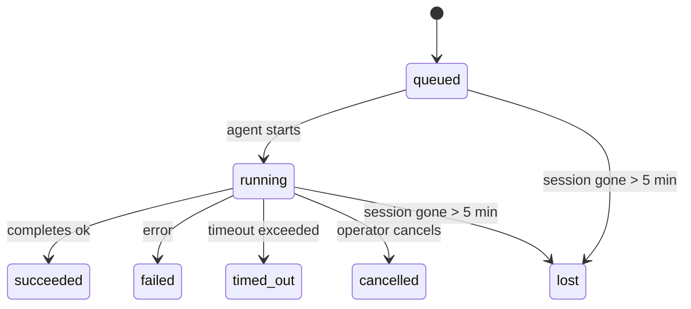

---
read_when:
    - Перегляд фонової роботи, що триває або нещодавно завершилася
    - Налагодження збоїв доставки для відокремлених запусків агента
    - Розуміння того, як фонові запуски пов’язані із сеансами, Cron і Heartbeat
sidebarTitle: Background tasks
summary: Відстеження фонових завдань для запусків ACP, субагентів, ізольованих завдань Cron і операцій CLI
title: Фонові завдання
x-i18n:
    generated_at: "2026-05-10T19:21:04Z"
    model: gpt-5.5
    provider: openai
    source_hash: 5764a89634f90181d826ff3990ec8dac9538239074934d30fd446c1eb4564869
    source_path: automation/tasks.md
    workflow: 16
---

<Note>
Шукаєте планування? Див. [Автоматизація та завдання](/uk/automation), щоб вибрати правильний механізм. Ця сторінка є журналом активності для фонової роботи, а не планувальником.
</Note>

Фонові завдання відстежують роботу, що виконується **поза вашим основним сеансом розмови**: запуски ACP, створення підagentів, ізольовані виконання завдань cron і операції, ініційовані CLI.

Завдання **не** замінюють сеанси, завдання cron або heartbeats - вони є **журналом активності**, який записує, яка від’єднана робота відбулася, коли саме та чи була вона успішною.

<Note>
Не кожен запуск агента створює завдання. Heartbeat-ходи й звичайний інтерактивний чат цього не роблять. Усі виконання cron, створення ACP, створення підagentів і команди агента CLI створюють завдання.
</Note>

## Коротко

- Завдання - це **записи**, а не планувальники: cron і heartbeat вирішують, _коли_ виконується робота, а завдання відстежують, _що сталося_.
- ACP, підagents, усі завдання cron і операції CLI створюють завдання. Heartbeat-ходи цього не роблять.
- Кожне завдання проходить через `queued → running → terminal` (succeeded, failed, timed_out, cancelled або lost).
- Завдання cron залишаються активними, доки середовище виконання cron усе ще володіє завданням; якщо
  стан середовища виконання в пам’яті зник, обслуговування завдань спершу перевіряє сталу історію
  запусків cron, перш ніж позначити завдання як lost.
- Завершення керується push-механізмом: від’єднана робота може сповіщати напряму або пробуджувати
  сеанс/heartbeat запитувача після завершення, тому цикли опитування статусу
  зазвичай мають неправильну форму.
- Ізольовані запуски cron і завершення підagentів у режимі best-effort очищають відстежувані вкладки браузера/процеси для свого дочірнього сеансу перед фінальним службовим очищенням.
- Доставка ізольованого cron приглушує застарілі проміжні відповіді батьківського сеансу, доки робота дочірніх підagentів ще завершується, і надає перевагу фінальному виводу нащадка, якщо він надходить до доставки.
- Сповіщення про завершення доставляються безпосередньо в канал або ставляться в чергу для наступного heartbeat.
- `openclaw tasks list` показує всі завдання; `openclaw tasks audit` виявляє проблеми.
- Термінальні записи зберігаються 7 днів, а потім автоматично видаляються.

## Швидкий старт

<Tabs>
  <Tab title="Список і фільтрація">
    ```bash
    # List all tasks (newest first)
    openclaw tasks list

    # Filter by runtime or status
    openclaw tasks list --runtime acp
    openclaw tasks list --status running
    ```

  </Tab>
  <Tab title="Перегляд">
    ```bash
    # Show details for a specific task (by ID, run ID, or session key)
    openclaw tasks show <lookup>
    ```
  </Tab>
  <Tab title="Скасування та сповіщення">
    ```bash
    # Cancel a running task (kills the child session)
    openclaw tasks cancel <lookup>

    # Change notification policy for a task
    openclaw tasks notify <lookup> state_changes
    ```

  </Tab>
  <Tab title="Аудит і обслуговування">
    ```bash
    # Run a health audit
    openclaw tasks audit

    # Preview or apply maintenance
    openclaw tasks maintenance
    openclaw tasks maintenance --apply
    ```

  </Tab>
  <Tab title="Потік завдань">
    ```bash
    # Inspect TaskFlow state
    openclaw tasks flow list
    openclaw tasks flow show <lookup>
    openclaw tasks flow cancel <lookup>
    ```
  </Tab>
</Tabs>

## Що створює завдання

| Джерело               | Тип середовища виконання | Коли створюється запис завдання                         | Типова політика сповіщень |
| --------------------- | ------------------------ | ------------------------------------------------------- | ------------------------- |
| Фонові запуски ACP    | `acp`                    | Створення дочірнього сеансу ACP                         | `done_only`               |
| Оркестрація підagentів | `subagent`              | Створення підagentа через `sessions_spawn`              | `done_only`               |
| Завдання cron (усі типи) | `cron`                | Кожне виконання cron (основний сеанс та ізольоване)     | `silent`                  |
| Операції CLI          | `cli`                    | Команди `openclaw agent`, що виконуються через gateway  | `silent`                  |
| Медіазавдання агента  | `cli`                    | Запуски `music_generate`/`video_generate` на базі сеансу | `silent`                  |

<AccordionGroup>
  <Accordion title="Типові сповіщення для cron і медіа">
    Завдання cron основного сеансу типово використовують політику сповіщень `silent`: вони створюють записи для відстеження, але не генерують сповіщень. Ізольовані завдання cron також типово мають `silent`, але вони помітніші, бо виконуються у власному сеансі.

    Запуски `music_generate` і `video_generate` на базі сеансу також використовують політику сповіщень `silent`. Вони все одно створюють записи завдань, але завершення повертається до початкового сеансу агента як внутрішнє пробудження, щоб агент міг написати подальше повідомлення й самостійно прикріпити готове медіа. Завершення в групах/каналах дотримуються звичайної політики видимих відповідей, тому агент використовує інструмент повідомлень, коли цього потребує доставка з джерела. Якщо агент завершення не надає доказ доставки через інструмент повідомлень у маршруті лише з інструментами, OpenClaw надсилає резервне повідомлення про завершення безпосередньо в початковий канал, замість того щоб залишити медіа приватним.

  </Accordion>
  <Accordion title="Захисне обмеження для одночасного video_generate">
    Поки завдання `video_generate` на базі сеансу ще активне, інструмент також працює як захисне обмеження: повторні виклики `video_generate` у тому самому сеансі повертають статус активного завдання замість запуску другої паралельної генерації. Використовуйте `action: "status"`, коли потрібен явний запит прогресу/статусу з боку агента.
  </Accordion>
  <Accordion title="Що не створює завдань">
    - Heartbeat-ходи - основний сеанс; див. [Heartbeat](/uk/gateway/heartbeat)
    - Звичайні інтерактивні ходи чату
    - Прямі відповіді `/command`

  </Accordion>
</AccordionGroup>

## Життєвий цикл завдання



| Статус      | Що це означає                                                            |
| ----------- | ------------------------------------------------------------------------ |
| `queued`    | Створено, очікує запуску агента                                          |
| `running`   | Хід агента активно виконується                                           |
| `succeeded` | Успішно завершено                                                        |
| `failed`    | Завершено з помилкою                                                     |
| `timed_out` | Перевищено налаштований тайм-аут                                         |
| `cancelled` | Зупинено оператором через `openclaw tasks cancel`                        |
| `lost`      | Середовище виконання втратило авторитетний опорний стан після 5-хвилинного пільгового періоду |

Переходи відбуваються автоматично: коли пов’язаний запуск агента завершується, статус завдання оновлюється відповідно.

Завершення запуску агента є авторитетним для активних записів завдань. Успішний від’єднаний запуск фіналізується як `succeeded`, звичайні помилки запуску фіналізуються як `failed`, а результати тайм-ауту або переривання фіналізуються як `timed_out`. Якщо оператор уже скасував завдання або середовище виконання вже записало сильніший термінальний стан, як-от `failed`, `timed_out` або `lost`, пізніший сигнал успіху не знижує цей термінальний статус.

`lost` враховує середовище виконання:

- Завдання ACP: метадані опорного дочірнього сеансу ACP зникли.
- Завдання підagentів: опорний дочірній сеанс зник зі сховища цільового агента.
- Завдання cron: середовище виконання cron більше не відстежує завдання як активне, а стала
  історія запусків cron не показує термінального результату для цього запуску. Офлайн-аудит CLI
  не вважає власний порожній внутрішньопроцесний стан середовища виконання cron авторитетним.
- Завдання CLI: завдання з ідентифікатором запуску/ідентифікатором джерела використовують живий контекст запуску, тому
  залишкові рядки дочірнього сеансу або чат-сеансу не підтримують їх активними після зникнення
  запуску, яким володів gateway. Застарілі завдання CLI без ідентичності запуску все ще повертаються
  до дочірнього сеансу. Запуски `openclaw agent` на базі Gateway також фіналізуються
  зі свого результату запуску, тому завершені запуски не залишаються активними, доки прибиральник
  позначить їх як `lost`.

## Доставка та сповіщення

Коли завдання досягає термінального стану, OpenClaw сповіщає вас. Є два шляхи доставки:

**Пряма доставка** - якщо завдання має цільовий канал (`requesterOrigin`), повідомлення про завершення надходить безпосередньо в цей канал (Telegram, Discord, Slack тощо). Завершення групових і канальних завдань натомість маршрутизуються через сеанс запитувача, щоб батьківський агент міг написати видиму відповідь. Для завершень підagentів OpenClaw також зберігає прив’язану маршрутизацію thread/topic, коли вона доступна, і може заповнити відсутні `to` / акаунт зі збереженого маршруту сеансу запитувача (`lastChannel` / `lastTo` / `lastAccountId`), перш ніж відмовитися від прямої доставки.

**Доставка через чергу сеансу** - якщо пряма доставка не вдається або origin не задано, оновлення ставиться в чергу як системна подія в сеансі запитувача й з’являється під час наступного heartbeat.

<Tip>
Завершення завдання запускає негайне пробудження heartbeat, тому ви швидко бачите результат - вам не потрібно чекати наступного запланованого такту heartbeat.
</Tip>

Це означає, що звичайний робочий процес є push-based: один раз запускаєте від’єднану роботу, а потім дозволяєте середовищу виконання пробудити або сповістити вас після завершення. Опитуйте стан завдання лише тоді, коли потрібне налагодження, втручання або явний аудит.

### Політики сповіщень

Керуйте тим, скільки повідомлень отримуєте про кожне завдання:

| Політика              | Що доставляється                                                       |
| --------------------- | --------------------------------------------------------------------- |
| `done_only` (типово)  | Лише термінальний стан (succeeded, failed тощо) - **це типово**        |
| `state_changes`       | Кожен перехід стану й оновлення прогресу                              |
| `silent`              | Узагалі нічого                                                        |

Змініть політику, поки завдання виконується:

```bash
openclaw tasks notify <lookup> state_changes
```

## Довідник CLI

<AccordionGroup>
  <Accordion title="tasks list">
    ```bash
    openclaw tasks list [--runtime <acp|subagent|cron|cli>] [--status <status>] [--json]
    ```

    Стовпці виводу: ID завдання, тип, статус, доставка, ID запуску, дочірній сеанс, підсумок.

  </Accordion>
  <Accordion title="tasks show">
    ```bash
    openclaw tasks show <lookup>
    ```

    Токен lookup приймає ID завдання, ID запуску або ключ сеансу. Показує повний запис, включно з часом, станом доставки, помилкою та термінальним підсумком.

  </Accordion>
  <Accordion title="tasks cancel">
    ```bash
    openclaw tasks cancel <lookup>
    ```

    Для завдань ACP і підagentів це завершує дочірній сеанс. Для завдань, що відстежуються CLI, скасування записується в реєстрі завдань (окремого дескриптора дочірнього середовища виконання немає). Статус переходить у `cancelled`, і, коли застосовно, надсилається сповіщення про доставку.

  </Accordion>
  <Accordion title="tasks notify">
    ```bash
    openclaw tasks notify <lookup> <done_only|state_changes|silent>
    ```
  </Accordion>
  <Accordion title="tasks audit">
    ```bash
    openclaw tasks audit [--json]
    ```

    Виявляє операційні проблеми. Знахідки також з’являються в `openclaw status`, коли виявлено проблеми.

    | Виявлення                | Серйозність | Тригер                                                                                                                        |
    | ------------------------- | ---------- | ----------------------------------------------------------------------------------------------------------------------------- |
    | `stale_queued`            | warn       | У черзі понад 10 хвилин                                                                                                       |
    | `stale_running`           | error      | Виконується понад 30 хвилин                                                                                                   |
    | `lost`                    | warn/error | Підтримуване середовищем виконання право власності на завдання зникло; збережені втрачені завдання попереджають до `cleanupAfter`, потім стають помилками |
    | `delivery_failed`         | warn       | Доставка не вдалася, а політика сповіщення не є `silent`                                                                       |
    | `missing_cleanup`         | warn       | Термінальне завдання без часової позначки очищення                                                                            |
    | `inconsistent_timestamps` | warn       | Порушення часової шкали (наприклад, завершено раніше, ніж розпочато)                                                          |

  </Accordion>
  <Accordion title="обслуговування завдань">
    ```bash
    openclaw tasks maintenance [--json]
    openclaw tasks maintenance --apply [--json]
    ```

    Використовуйте це для попереднього перегляду або застосування звірення, проставлення позначок очищення та обрізання для завдань, стану Task Flow і застарілих рядків реєстру сеансів запусків cron.

    Звірення враховує середовище виконання:

    - Завдання ACP/subagent перевіряють свій базовий дочірній сеанс.
    - Завдання subagent, дочірній сеанс яких має надгробок відновлення після перезапуску, позначаються як втрачені, а не обробляються як відновлювані базові сеанси.
    - Завдання Cron перевіряють, чи середовище виконання cron все ще володіє job, а потім відновлюють термінальний статус із збережених журналів запусків cron/стану job перед поверненням до `lost`. Лише процес Gateway є авторитетним для набору активних job cron у пам’яті; офлайн-аудит CLI використовує довготривалу історію, але не позначає завдання cron як втрачене лише тому, що цей локальний Set порожній.
    - Завдання CLI з ідентичністю запуску перевіряють живий контекст виконання власника, а не лише рядки дочірнього сеансу або chat-session.

    Очищення після завершення також враховує середовище виконання:

    - Завершення subagent за найкращих зусиль закриває відстежувані вкладки браузера/процеси для дочірнього сеансу перед продовженням очищення оголошення.
    - Завершення ізольованого cron за найкращих зусиль закриває відстежувані вкладки браузера/процеси для сеансу cron перед повним демонтажем запуску.
    - Доставка ізольованого cron за потреби очікує подальшу роботу нащадкового subagent і пригнічує застарілий текст підтвердження батьківського завдання замість його оголошення.
    - Доставка завершення subagent віддає перевагу найновішому видимому тексту assistant; якщо він порожній, повертається до санітизованого найновішого тексту tool/toolResult, а запуски викликів інструментів лише з тайм-аутом можуть згортатися до короткого підсумку часткового прогресу. Термінальні невдалі запуски оголошують статус failure без повторного відтворення захопленого тексту відповіді.
    - Збої очищення не приховують реальний результат завдання.

    Під час застосування обслуговування OpenClaw також видаляє застарілі рядки реєстру сеансів `cron:<jobId>:run:<uuid>` старші за 7 днів, зберігаючи рядки для cron jobs, що виконуються зараз, і не зачіпаючи не-cron рядки сеансів.

  </Accordion>
  <Accordion title="tasks flow list | show | cancel">
    ```bash
    openclaw tasks flow list [--status <status>] [--json]
    openclaw tasks flow show <lookup> [--json]
    openclaw tasks flow cancel <lookup>
    ```

    Використовуйте ці команди, коли вас цікавить оркеструвальний Task Flow, а не один окремий запис фонового завдання.

  </Accordion>
</AccordionGroup>

## Дошка завдань чату (`/tasks`)

Використовуйте `/tasks` у будь-якому сеансі чату, щоб побачити фонові завдання, пов’язані з цим сеансом. Дошка показує активні й нещодавно завершені завдання із середовищем виконання, статусом, часом, а також прогресом або деталями помилки.

Коли поточний сеанс не має видимих пов’язаних завдань, `/tasks` переходить до локальних для агента лічильників завдань, щоб ви все одно отримали огляд без розкриття деталей інших сеансів.

Для повного операторського реєстру використовуйте CLI: `openclaw tasks list`.

## Інтеграція статусу (навантаження завдань)

`openclaw status` містить короткий підсумок завдань:

```
Tasks: 3 queued · 2 running · 1 issues
```

Підсумок повідомляє:

- **active** - кількість `queued` + `running`
- **failures** - кількість `failed` + `timed_out` + `lost`
- **byRuntime** - розподіл за `acp`, `subagent`, `cron`, `cli`

І `/status`, і інструмент `session_status` використовують знімок завдань з урахуванням очищення: активним завданням надається перевага, застарілі завершені рядки приховуються, а нещодавні збої показуються лише тоді, коли не залишилося активної роботи. Це зберігає картку статусу зосередженою на тому, що важливо саме зараз.

## Зберігання та обслуговування

### Де зберігаються завдання

Записи завдань зберігаються в SQLite за адресою:

```
$OPENCLAW_STATE_DIR/tasks/runs.sqlite
```

Реєстр завантажується в пам’ять під час запуску Gateway і синхронізує записи в SQLite для довговічності між перезапусками.
Gateway утримує журнал попереднього запису SQLite обмеженим, використовуючи стандартний поріг autocheckpoint SQLite, а також періодичні й завершальні контрольні точки `TRUNCATE`.

### Автоматичне обслуговування

Sweeper запускається кожні **60 секунд** і обробляє чотири речі:

<Steps>
  <Step title="Звірення">
    Перевіряє, чи активні завдання все ще мають авторитетну підтримку середовища виконання. Завдання ACP/subagent використовують стан дочірнього сеансу, завдання cron використовують право власності active-job, а завдання CLI з ідентичністю запуску використовують контекст виконання власника. Якщо цього базового стану немає понад 5 хвилин, завдання позначається як `lost`.
  </Step>
  <Step title="Виправлення сеансу ACP">
    Закриває термінальні або осиротілі одноразові сеанси ACP, що належать батьківському елементу, і закриває застарілі термінальні або осиротілі постійні сеанси ACP лише тоді, коли не залишається активного прив’язування розмови.
  </Step>
  <Step title="Проставлення позначки очищення">
    Встановлює часову позначку `cleanupAfter` для термінальних завдань (endedAt + 7 днів). Протягом періоду зберігання втрачені завдання все ще з’являються в аудиті як попередження; після завершення строку `cleanupAfter` або коли метадані очищення відсутні, вони є помилками.
  </Step>
  <Step title="Обрізання">
    Видаляє записи після їхньої дати `cleanupAfter`.
  </Step>
</Steps>

<Note>
**Зберігання:** записи термінальних завдань зберігаються **7 днів**, а потім автоматично обрізаються. Налаштування не потрібне.
</Note>

## Як завдання пов’язані з іншими системами

<AccordionGroup>
  <Accordion title="Завдання і Task Flow">
    [Task Flow](/uk/automation/taskflow) — це шар оркестрації потоків над фоновими завданнями. Один flow може координувати кілька завдань протягом свого життєвого циклу, використовуючи керовані або дзеркальні режими синхронізації. Використовуйте `openclaw tasks` для перевірки окремих записів завдань і `openclaw tasks flow` для перевірки оркеструвального flow.

    Докладніше див. у [Task Flow](/uk/automation/taskflow).

  </Accordion>
  <Accordion title="Завдання і cron">
    **Визначення** cron job зберігається в `~/.openclaw/cron/jobs.json`; стан виконання під час роботи зберігається поруч у `~/.openclaw/cron/jobs-state.json`. **Кожне** виконання cron створює запис завдання - як main-session, так і ізольоване. Завдання main-session cron за замовчуванням використовують політику сповіщення `silent`, тому вони відстежуються без створення сповіщень.

    Див. [Cron Jobs](/uk/automation/cron-jobs).

  </Accordion>
  <Accordion title="Завдання і Heartbeat">
    Запуски Heartbeat — це ходи main-session - вони не створюють записів завдань. Коли завдання завершується, воно може запустити пробудження Heartbeat, щоб ви швидко побачили результат.

    Див. [Heartbeat](/uk/gateway/heartbeat).

  </Accordion>
  <Accordion title="Завдання і сеанси">
    Завдання може посилатися на `childSessionKey` (де виконується робота) і `requesterSessionKey` (хто його запустив). Сеанси є контекстом розмови; завдання - це відстеження активності поверх цього.
  </Accordion>
  <Accordion title="Завдання і запуски агента">
    `runId` завдання посилається на запуск агента, який виконує роботу. Події життєвого циклу агента (початок, завершення, помилка) автоматично оновлюють статус завдання - вам не потрібно керувати життєвим циклом вручну.
  </Accordion>
</AccordionGroup>

## Пов’язане

- [Автоматизація та завдання](/uk/automation) - усі механізми автоматизації одним поглядом
- [CLI: Завдання](/uk/cli/tasks) - довідник команд CLI
- [Heartbeat](/uk/gateway/heartbeat) - періодичні ходи main-session
- [Заплановані завдання](/uk/automation/cron-jobs) - планування фонової роботи
- [Task Flow](/uk/automation/taskflow) - оркестрація flow над завданнями
