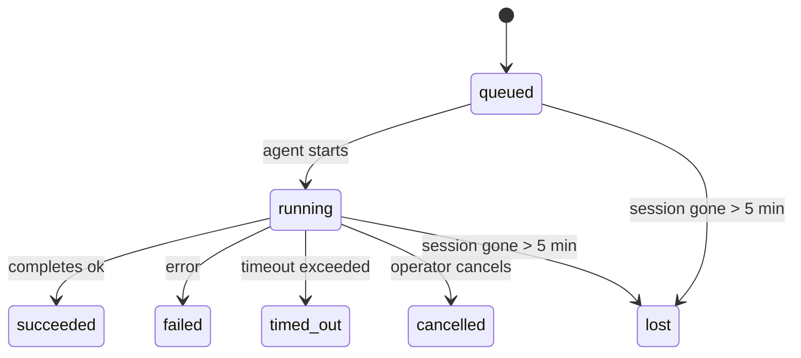

---
read_when:
    - Перегляд фонової роботи, що триває або нещодавно завершилася
    - Налагодження збоїв доставки для відокремлених запусків агента
    - Розуміння того, як фонові запуски пов’язані із сеансами, Cron і Heartbeat
sidebarTitle: Background tasks
summary: Відстеження фонових завдань для запусків ACP, субагентів, ізольованих завдань Cron і операцій CLI
title: Фонові завдання
x-i18n:
    generated_at: "2026-05-01T02:52:47Z"
    model: gpt-5.5
    provider: openai
    source_hash: 8782987a79989264ae3bd1ca4b16755bdfb7e295e4f77933bf3a38c136d837f4
    source_path: automation/tasks.md
    workflow: 16
---

<Note>
Шукаєте планування? Див. [Автоматизація та завдання](/uk/automation), щоб вибрати правильний механізм. Ця сторінка є журналом активності для фонової роботи, а не планувальником.
</Note>

Фонові завдання відстежують роботу, що виконується **поза основним сеансом розмови**: запуски ACP, створення підagentів, ізольовані виконання cron-завдань і операції, ініційовані з CLI.

Завдання **не** замінюють сеанси, cron-завдання чи heartbeats — це **журнал активності**, який записує, яка відокремлена робота відбулася, коли саме та чи завершилася вона успішно.

<Note>
Не кожен запуск агента створює завдання. Heartbeat-ходи та звичайний інтерактивний чат не створюють. Усі виконання cron, створення ACP, створення підagentів і команди агента з CLI створюють.
</Note>

## Коротко

- Завдання — це **записи**, а не планувальники — cron і Heartbeat вирішують, _коли_ виконується робота, а завдання відстежують, _що сталося_.
- ACP, підagенти, усі cron-завдання та операції CLI створюють завдання. Heartbeat-ходи — ні.
- Кожне завдання проходить через `queued → running → terminal` (succeeded, failed, timed_out, cancelled або lost).
- Cron-завдання залишаються активними, доки cron-середовище виконання все ще володіє завданням; якщо
  стан середовища виконання в пам’яті зник, обслуговування завдань спершу перевіряє довговічну історію
  запусків cron, перш ніж позначити завдання як lost.
- Завершення керується push-механізмом: відокремлена робота може сповістити напряму або пробудити
  сеанс/Heartbeat запитувача після завершення, тому цикли опитування статусу
  зазвичай мають неправильну форму.
- Ізольовані cron-запуски та завершення підagentів у режимі best-effort очищають відстежувані вкладки браузера/процеси для свого дочірнього сеансу перед фінальним службовим очищенням.
- Доставка ізольованого cron пригнічує застарілі проміжні відповіді батьківського сеансу, доки робота підagentів-нащадків ще завершується, і віддає перевагу фінальному виводу нащадка, якщо він надходить до доставки.
- Сповіщення про завершення доставляються напряму в канал або ставляться в чергу до наступного Heartbeat.
- `openclaw tasks list` показує всі завдання; `openclaw tasks audit` виявляє проблеми.
- Термінальні записи зберігаються 7 днів, а потім автоматично видаляються.

## Швидкий старт

<Tabs>
  <Tab title="Список і фільтрація">
    ```bash
    # List all tasks (newest first)
    openclaw tasks list

    # Filter by runtime or status
    openclaw tasks list --runtime acp
    openclaw tasks list --status running
    ```

  </Tab>
  <Tab title="Перегляд">
    ```bash
    # Show details for a specific task (by ID, run ID, or session key)
    openclaw tasks show <lookup>
    ```
  </Tab>
  <Tab title="Скасування та сповіщення">
    ```bash
    # Cancel a running task (kills the child session)
    openclaw tasks cancel <lookup>

    # Change notification policy for a task
    openclaw tasks notify <lookup> state_changes
    ```

  </Tab>
  <Tab title="Аудит і обслуговування">
    ```bash
    # Run a health audit
    openclaw tasks audit

    # Preview or apply maintenance
    openclaw tasks maintenance
    openclaw tasks maintenance --apply
    ```

  </Tab>
  <Tab title="Потік завдань">
    ```bash
    # Inspect TaskFlow state
    openclaw tasks flow list
    openclaw tasks flow show <lookup>
    openclaw tasks flow cancel <lookup>
    ```
  </Tab>
</Tabs>

## Що створює завдання

| Джерело               | Тип середовища виконання | Коли створюється запис завдання                       | Типова політика сповіщень |
| --------------------- | ------------------------ | ----------------------------------------------------- | ------------------------- |
| Фонові запуски ACP    | `acp`                    | Створення дочірнього сеансу ACP                       | `done_only`               |
| Оркестрація підagentів | `subagent`              | Створення підagента через `sessions_spawn`            | `done_only`               |
| Cron-завдання (усі типи) | `cron`                 | Кожне виконання cron (основний сеанс та ізольоване)   | `silent`                  |
| Операції CLI          | `cli`                    | Команди `openclaw agent`, що виконуються через Gateway | `silent`                  |
| Медіазавдання агента  | `cli`                    | Запуски `music_generate`/`video_generate` із підтримкою сеансу | `silent`          |

<AccordionGroup>
  <Accordion title="Типові сповіщення для cron і медіа">
    Cron-завдання основного сеансу за замовчуванням використовують політику сповіщень `silent` — вони створюють записи для відстеження, але не генерують сповіщень. Ізольовані cron-завдання також за замовчуванням мають `silent`, але помітніші, бо виконуються у власному сеансі.

    Запуски `music_generate` і `video_generate` із підтримкою сеансу також використовують політику сповіщень `silent`. Вони все одно створюють записи завдань, але завершення повертається до початкового сеансу агента як внутрішнє пробудження, щоб агент міг сам написати подальше повідомлення та прикріпити готовий медіафайл. Якщо ви вмикаєте `tools.media.asyncCompletion.directSend`, асинхронні завершення `video_generate` можуть спершу спробувати пряму доставку в канал; асинхронні завершення `music_generate` залишаються на шляху пробудження сеансу запитувача.

  </Accordion>
  <Accordion title="Запобіжник для одночасного video_generate">
    Поки завдання `video_generate` із підтримкою сеансу ще активне, інструмент також працює як запобіжник: повторні виклики `video_generate` у тому самому сеансі повертають статус активного завдання замість запуску другої паралельної генерації. Використовуйте `action: "status"`, коли потрібен явний перегляд прогресу/статусу з боку агента.
  </Accordion>
  <Accordion title="Що не створює завдань">
    - Heartbeat-ходи — основний сеанс; див. [Heartbeat](/uk/gateway/heartbeat)
    - Звичайні інтерактивні ходи чату
    - Прямі відповіді `/command`

  </Accordion>
</AccordionGroup>

## Життєвий цикл завдання



| Статус      | Що це означає                                                              |
| ----------- | -------------------------------------------------------------------------- |
| `queued`    | Створено, очікує запуску агента                                            |
| `running`   | Хід агента активно виконується                                             |
| `succeeded` | Успішно завершено                                                          |
| `failed`    | Завершено з помилкою                                                       |
| `timed_out` | Перевищено налаштований час очікування                                     |
| `cancelled` | Зупинено оператором через `openclaw tasks cancel`                          |
| `lost`      | Середовище виконання втратило авторитетний базовий стан після 5-хвилинного пільгового періоду |

Переходи відбуваються автоматично — коли пов’язаний запуск агента завершується, статус завдання оновлюється відповідно.

Завершення запуску агента є авторитетним для активних записів завдань. Успішний відокремлений запуск фіналізується як `succeeded`, звичайні помилки запуску — як `failed`, а результати тайм-ауту або переривання — як `timed_out`. Якщо оператор уже скасував завдання або середовище виконання вже записало сильніший термінальний стан, наприклад `failed`, `timed_out` чи `lost`, пізніший сигнал успіху не понижує цей термінальний статус.

`lost` враховує середовище виконання:

- ACP-завдання: зникли метадані базового дочірнього сеансу ACP.
- Завдання підagentів: базовий дочірній сеанс зник із цільового сховища агента.
- Cron-завдання: cron-середовище виконання більше не відстежує завдання як активне, а довговічна
  історія запусків cron не показує термінального результату для цього запуску. Офлайн-аудит CLI
  не вважає власний порожній внутрішньопроцесний стан cron-середовища виконання авторитетним.
- CLI-завдання: ізольовані завдання дочірнього сеансу використовують дочірній сеанс; CLI-завдання
  з підтримкою чату натомість використовують живий контекст запуску, тож завислі
  рядки сеансів каналу/групи/приватного чату не підтримують їх активними. Запуски
  `openclaw agent` із підтримкою Gateway також фіналізуються за результатом свого запуску, тому завершені запуски
  не залишаються активними, доки прибиральник позначить їх як `lost`.

## Доставка та сповіщення

Коли завдання досягає термінального стану, OpenClaw сповіщає вас. Є два шляхи доставки:

**Пряма доставка** — якщо завдання має цільовий канал (`requesterOrigin`), повідомлення про завершення надсилається прямо в цей канал (Telegram, Discord, Slack тощо). Для завершень підagentів OpenClaw також зберігає прив’язану маршрутизацію гілки/теми, коли вона доступна, і може заповнити відсутні `to` / обліковий запис із збереженого маршруту сеансу запитувача (`lastChannel` / `lastTo` / `lastAccountId`), перш ніж відмовитися від прямої доставки.

**Доставка через чергу сеансу** — якщо пряма доставка не вдається або origin не задано, оновлення ставиться в чергу як системна подія в сеансі запитувача й з’являється під час наступного Heartbeat.

<Tip>
Завершення завдання запускає негайне пробудження Heartbeat, щоб ви швидко побачили результат — вам не потрібно чекати наступного запланованого Heartbeat-тику.
</Tip>

Це означає, що звичайний робочий процес базується на push-механізмі: один раз запустіть відокремлену роботу, а потім дозвольте середовищу виконання пробудити або сповістити вас після завершення. Опитуйте стан завдання лише тоді, коли потрібні налагодження, втручання або явний аудит.

### Політики сповіщень

Керуйте тим, скільки повідомлень отримувати про кожне завдання:

| Політика             | Що доставляється                                                       |
| -------------------- | ---------------------------------------------------------------------- |
| `done_only` (типова) | Лише термінальний стан (succeeded, failed тощо) — **це типове значення** |
| `state_changes`      | Кожен перехід стану та оновлення прогресу                              |
| `silent`             | Нічого                                                                 |

Змініть політику, поки завдання виконується:

```bash
openclaw tasks notify <lookup> state_changes
```

## Довідник CLI

<AccordionGroup>
  <Accordion title="tasks list">
    ```bash
    openclaw tasks list [--runtime <acp|subagent|cron|cli>] [--status <status>] [--json]
    ```

    Стовпці виводу: ID завдання, тип, статус, доставка, ID запуску, дочірній сеанс, підсумок.

  </Accordion>
  <Accordion title="tasks show">
    ```bash
    openclaw tasks show <lookup>
    ```

    Токен пошуку приймає ID завдання, ID запуску або ключ сеансу. Показує повний запис, зокрема таймінг, стан доставки, помилку та термінальний підсумок.

  </Accordion>
  <Accordion title="tasks cancel">
    ```bash
    openclaw tasks cancel <lookup>
    ```

    Для ACP-завдань і завдань підagentів це завершує дочірній сеанс. Для завдань, відстежуваних CLI, скасування записується в реєстрі завдань (окремого дескриптора дочірнього середовища виконання немає). Статус переходить у `cancelled`, а сповіщення про доставку надсилається, коли це застосовно.

  </Accordion>
  <Accordion title="tasks notify">
    ```bash
    openclaw tasks notify <lookup> <done_only|state_changes|silent>
    ```
  </Accordion>
  <Accordion title="tasks audit">
    ```bash
    openclaw tasks audit [--json]
    ```

    Виявляє операційні проблеми. Знахідки також з’являються в `openclaw status`, коли виявлено проблеми.

    | Виявлення                | Серйозність | Тригер                                                                                                      |
    | ------------------------- | ---------- | ------------------------------------------------------------------------------------------------------------ |
    | `stale_queued`            | warn       | У черзі понад 10 хвилин                                                                              |
    | `stale_running`           | error      | Виконується понад 30 хвилин                                                                             |
    | `lost`                    | warn/error | Власність завдання, підтримувана runtime, зникла; збережені втрачені завдання попереджають до `cleanupAfter`, потім стають помилками |
    | `delivery_failed`         | warn       | Доставлення не вдалося, а політика сповіщення не є `silent`                                                            |
    | `missing_cleanup`         | warn       | Термінальне завдання без часової позначки очищення                                                                      |
    | `inconsistent_timestamps` | warn       | Порушення часової шкали (наприклад, завершено до початку)                                                        |

  </Accordion>
  <Accordion title="обслуговування завдань">
    ```bash
    openclaw tasks maintenance [--json]
    openclaw tasks maintenance --apply [--json]
    ```

    Використовуйте це, щоб попередньо переглянути або застосувати узгодження, проставлення міток очищення та обрізання для завдань і стану Task Flow.

    Узгодження враховує runtime:

    - Завдання ACP/subagent перевіряють свій базовий дочірній сеанс.
    - Завдання subagent, дочірній сеанс яких має tombstone відновлення після перезапуску, позначаються як втрачені, а не обробляються як відновлювані базові сеанси.
    - Завдання Cron перевіряють, чи runtime cron досі володіє job, потім відновлюють термінальний статус зі збережених журналів запусків cron/стану job, перш ніж fallback до `lost`. Лише процес Gateway є авторитетним для in-memory набору активних job cron; офлайн-аудит CLI використовує довготривалу історію, але не позначає завдання cron як втрачене лише через те, що цей локальний Set порожній.
    - Завдання CLI на основі чату перевіряють власний live run контекст, а не лише рядок сеансу чату.

    Очищення після завершення також враховує runtime:

    - Завершення subagent best-effort закриває відстежувані вкладки браузера/процеси для дочірнього сеансу, перш ніж триває очищення оголошення.
    - Завершення ізольованого cron best-effort закриває відстежувані вкладки браузера/процеси для сеансу cron, перш ніж запуск повністю завершується.
    - Доставлення ізольованого cron за потреби очікує подальші дії нащадкового subagent і пригнічує застарілий текст підтвердження батьківського процесу замість його оголошення.
    - Доставлення завершення subagent віддає перевагу найновішому видимому тексту assistant; якщо він порожній, воно fallback до sanitized найновішого тексту tool/toolResult, а запуски викликів інструментів лише з timeout можуть згортатися до короткого підсумку часткового прогресу. Термінальні невдалі запуски оголошують статус помилки без повторного відтворення захопленого тексту відповіді.
    - Помилки очищення не маскують реальний результат завдання.

  </Accordion>
  <Accordion title="tasks flow list | show | cancel">
    ```bash
    openclaw tasks flow list [--status <status>] [--json]
    openclaw tasks flow show <lookup> [--json]
    openclaw tasks flow cancel <lookup>
    ```

    Використовуйте ці команди, коли вас цікавить оркеструвальний Task Flow, а не один окремий запис фонового завдання.

  </Accordion>
</AccordionGroup>

## Дошка завдань чату (`/tasks`)

Використовуйте `/tasks` у будь-якому сеансі чату, щоб побачити фонові завдання, пов’язані з цим сеансом. Дошка показує активні та нещодавно завершені завдання з runtime, статусом, часом, а також прогресом або деталями помилки.

Коли поточний сеанс не має видимих пов’язаних завдань, `/tasks` fallback до локальних для агента лічильників завдань, тож ви все одно отримуєте огляд без витоку деталей інших сеансів.

Для повного операторського журналу використовуйте CLI: `openclaw tasks list`.

## Інтеграція статусу (навантаження завдань)

`openclaw status` містить короткий підсумок завдань:

```
Tasks: 3 queued · 2 running · 1 issues
```

Підсумок повідомляє:

- **active** — кількість `queued` + `running`
- **failures** — кількість `failed` + `timed_out` + `lost`
- **byRuntime** — розподіл за `acp`, `subagent`, `cron`, `cli`

І `/status`, і інструмент `session_status` використовують task snapshot з урахуванням очищення: активні завдання мають пріоритет, застарілі завершені рядки приховуються, а нещодавні помилки показуються лише тоді, коли не залишилося активної роботи. Це зберігає картку статусу зосередженою на тому, що важливо зараз.

## Зберігання та обслуговування

### Де зберігаються завдання

Записи завдань зберігаються в SQLite за адресою:

```
$OPENCLAW_STATE_DIR/tasks/runs.sqlite
```

Registry завантажується в пам’ять під час запуску gateway і синхронізує записи в SQLite для довговічності між перезапусками.
Gateway тримає write-ahead log SQLite обмеженим, використовуючи стандартний поріг
autocheckpoint SQLite, а також періодичні та shutdown `TRUNCATE` checkpoints.

### Автоматичне обслуговування

Sweeper запускається кожні **60 секунд** і виконує чотири дії:

<Steps>
  <Step title="Узгодження">
    Перевіряє, чи активні завдання досі мають авторитетну runtime-підтримку. Завдання ACP/subagent використовують стан дочірнього сеансу, завдання cron використовують володіння active-job, а завдання CLI на основі чату використовують власний run context. Якщо цей базовий стан відсутній понад 5 хвилин, завдання позначається як `lost`.
  </Step>
  <Step title="Відновлення сеансу ACP">
    Закриває термінальні або осиротілі parent-owned одноразові сеанси ACP, а також закриває застарілі термінальні або осиротілі persistent сеанси ACP лише тоді, коли не залишається активної прив’язки розмови.
  </Step>
  <Step title="Проставлення міток очищення">
    Установлює часову позначку `cleanupAfter` для термінальних завдань (endedAt + 7 днів). Під час retention втрачені завдання все ще з’являються в аудиті як попередження; після завершення строку `cleanupAfter` або коли метадані очищення відсутні, вони є помилками.
  </Step>
  <Step title="Обрізання">
    Видаляє записи після їхньої дати `cleanupAfter`.
  </Step>
</Steps>

<Note>
**Retention:** записи термінальних завдань зберігаються **7 днів**, потім автоматично обрізаються. Налаштування не потрібне.
</Note>

## Як завдання пов’язані з іншими системами

<AccordionGroup>
  <Accordion title="Завдання і Task Flow">
    [Task Flow](/uk/automation/taskflow) — це шар оркестрації потоків над фоновими завданнями. Один flow може координувати кілька завдань протягом свого життєвого циклу, використовуючи керовані або mirrored режими sync. Використовуйте `openclaw tasks`, щоб перевіряти окремі записи завдань, і `openclaw tasks flow`, щоб перевіряти оркеструвальний flow.

    Див. [Task Flow](/uk/automation/taskflow) для деталей.

  </Accordion>
  <Accordion title="Завдання і cron">
    **Визначення** cron job зберігається в `~/.openclaw/cron/jobs.json`; runtime-стан виконання зберігається поруч у `~/.openclaw/cron/jobs-state.json`. **Кожне** виконання cron створює запис завдання — і main-session, і isolated. Завдання cron main-session типово мають політику сповіщення `silent`, щоб їх можна було відстежувати без створення сповіщень.

    Див. [Cron Jobs](/uk/automation/cron-jobs).

  </Accordion>
  <Accordion title="Завдання і Heartbeat">
    Запуски Heartbeat — це ходи main-session, вони не створюють записів завдань. Коли завдання завершується, воно може ініціювати heartbeat wake, щоб ви швидко побачили результат.

    Див. [Heartbeat](/uk/gateway/heartbeat).

  </Accordion>
  <Accordion title="Завдання і сеанси">
    Завдання може посилатися на `childSessionKey` (де виконується робота) і `requesterSessionKey` (хто його запустив). Сеанси — це контекст розмови; завдання — це відстеження активності поверх нього.
  </Accordion>
  <Accordion title="Завдання і запуски агента">
    `runId` завдання пов’язує його із запуском агента, який виконує роботу. Події життєвого циклу агента (початок, завершення, помилка) автоматично оновлюють статус завдання — вам не потрібно керувати життєвим циклом вручну.
  </Accordion>
</AccordionGroup>

## Пов’язане

- [Автоматизація і завдання](/uk/automation) — усі механізми автоматизації з першого погляду
- [CLI: Завдання](/uk/cli/tasks) — довідник команд CLI
- [Heartbeat](/uk/gateway/heartbeat) — періодичні ходи main-session
- [Заплановані завдання](/uk/automation/cron-jobs) — планування фонової роботи
- [Task Flow](/uk/automation/taskflow) — оркестрація flow над завданнями
