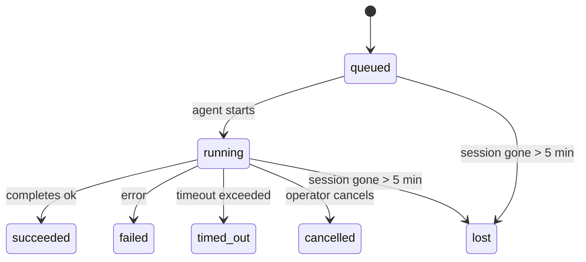

---
read_when:
    - Перегляд фонової роботи, що триває або нещодавно завершилася
    - Налагодження збоїв доставки для від’єднаних запусків агентів
    - Розуміння того, як фонові запуски пов’язані із сеансами, Cron і Heartbeat
sidebarTitle: Background tasks
summary: Відстеження фонових завдань для запусків ACP, субагентів, ізольованих завдань Cron та операцій CLI
title: Фонові завдання
x-i18n:
    generated_at: "2026-04-29T03:41:52Z"
    model: gpt-5.5
    provider: openai
    source_hash: 4bbf74f3aeea532738b56b83cd2e1a0a3734bfd453da6636b8be985a28ccc027
    source_path: automation/tasks.md
    workflow: 16
---

<Note>
Шукаєте планування? Див. [Автоматизація та завдання](/uk/automation), щоб вибрати правильний механізм. Ця сторінка є журналом активності для фонової роботи, а не планувальником.
</Note>

Фонові завдання відстежують роботу, що виконується **поза вашим основним сеансом розмови**: запуски ACP, створення субагентів, ізольовані виконання завдань Cron та операції, ініційовані CLI.

Завдання **не** замінюють сеанси, завдання Cron або Heartbeat — це **журнал активності**, який записує, яка відокремлена робота відбулася, коли саме і чи завершилася вона успішно.

<Note>
Не кожен запуск агента створює завдання. Кроки Heartbeat і звичайний інтерактивний чат цього не роблять. Усі виконання Cron, створення ACP, створення субагентів і команди агента CLI створюють завдання.
</Note>

## Коротко

- Завдання — це **записи**, а не планувальники — Cron і Heartbeat вирішують, _коли_ виконується робота, а завдання відстежують, _що сталося_.
- ACP, субагенти, усі завдання Cron і операції CLI створюють завдання. Кроки Heartbeat цього не роблять.
- Кожне завдання проходить через `queued → running → terminal` (succeeded, failed, timed_out, cancelled або lost).
- Завдання Cron залишаються активними, доки середовище виконання Cron усе ще володіє завданням; якщо стан середовища виконання в пам’яті втрачено, обслуговування завдань спочатку перевіряє довговічну історію запусків Cron, перш ніж позначити завдання як lost.
- Завершення працює через push: відокремлена робота може сповістити напряму або розбудити сеанс/Heartbeat запитувача, коли завершиться, тому цикли опитування статусу зазвичай є неправильною формою.
- Ізольовані запуски Cron і завершення субагентів у режимі найкращого зусилля очищають відстежувані вкладки браузера/процеси для свого дочірнього сеансу перед фінальним обліком очищення.
- Доставка ізольованого Cron пригнічує застарілі проміжні відповіді батьківського сеансу, поки робота нащадкового субагента ще завершується, і віддає перевагу фінальному виводу нащадка, якщо він надходить до доставки.
- Сповіщення про завершення доставляються напряму в канал або ставляться в чергу для наступного Heartbeat.
- `openclaw tasks list` показує всі завдання; `openclaw tasks audit` виявляє проблеми.
- Термінальні записи зберігаються 7 днів, а потім автоматично очищаються.

## Швидкий старт

<Tabs>
  <Tab title="List and filter">
    ```bash
    # List all tasks (newest first)
    openclaw tasks list

    # Filter by runtime or status
    openclaw tasks list --runtime acp
    openclaw tasks list --status running
    ```

  </Tab>
  <Tab title="Inspect">
    ```bash
    # Show details for a specific task (by ID, run ID, or session key)
    openclaw tasks show <lookup>
    ```
  </Tab>
  <Tab title="Cancel and notify">
    ```bash
    # Cancel a running task (kills the child session)
    openclaw tasks cancel <lookup>

    # Change notification policy for a task
    openclaw tasks notify <lookup> state_changes
    ```

  </Tab>
  <Tab title="Audit and maintenance">
    ```bash
    # Run a health audit
    openclaw tasks audit

    # Preview or apply maintenance
    openclaw tasks maintenance
    openclaw tasks maintenance --apply
    ```

  </Tab>
  <Tab title="Task flow">
    ```bash
    # Inspect TaskFlow state
    openclaw tasks flow list
    openclaw tasks flow show <lookup>
    openclaw tasks flow cancel <lookup>
    ```
  </Tab>
</Tabs>

## Що створює завдання

| Джерело               | Тип середовища виконання | Коли створюється запис завдання                         | Типова політика сповіщень |
| --------------------- | ------------------------ | ------------------------------------------------------- | ------------------------- |
| Фонові запуски ACP    | `acp`                    | Створення дочірнього сеансу ACP                         | `done_only`               |
| Оркестрація субагентів | `subagent`               | Створення субагента через `sessions_spawn`              | `done_only`               |
| Завдання Cron (усіх типів) | `cron`              | Кожне виконання Cron (основний сеанс та ізольоване)     | `silent`                  |
| Операції CLI          | `cli`                    | Команди `openclaw agent`, що виконуються через Gateway  | `silent`                  |
| Медіазавдання агента  | `cli`                    | Запуски `video_generate` на основі сеансу               | `silent`                  |

<AccordionGroup>
  <Accordion title="Notify defaults for cron and media">
    Завдання Cron в основному сеансі типово використовують політику сповіщень `silent` — вони створюють записи для відстеження, але не генерують сповіщень. Ізольовані завдання Cron також типово мають `silent`, але вони помітніші, бо виконуються у власному сеансі.

    Запуски `video_generate` на основі сеансу також використовують політику сповіщень `silent`. Вони все одно створюють записи завдань, але завершення повертається до початкового сеансу агента як внутрішнє пробудження, щоб агент міг сам написати наступне повідомлення і прикріпити готове відео. Якщо ви вмикаєте `tools.media.asyncCompletion.directSend`, асинхронні завершення `music_generate` і `video_generate` спершу пробують пряму доставку в канал, перш ніж повернутися до шляху пробудження сеансу запитувача.

  </Accordion>
  <Accordion title="Concurrent video_generate guardrail">
    Поки завдання `video_generate` на основі сеансу все ще активне, інструмент також працює як захисне обмеження: повторні виклики `video_generate` у тому самому сеансі повертають статус активного завдання замість запуску другої паралельної генерації. Використовуйте `action: "status"`, коли хочете отримати явний пошук прогресу/статусу з боку агента.
  </Accordion>
  <Accordion title="What does not create tasks">
    - Кроки Heartbeat — основний сеанс; див. [Heartbeat](/uk/gateway/heartbeat)
    - Звичайні інтерактивні кроки чату
    - Прямі відповіді `/command`

  </Accordion>
</AccordionGroup>

## Життєвий цикл завдання



| Статус      | Що це означає                                                             |
| ----------- | -------------------------------------------------------------------------- |
| `queued`    | Створено, очікує запуску агента                                            |
| `running`   | Крок агента активно виконується                                            |
| `succeeded` | Завершено успішно                                                          |
| `failed`    | Завершено з помилкою                                                       |
| `timed_out` | Перевищено налаштований тайм-аут                                           |
| `cancelled` | Зупинено оператором через `openclaw tasks cancel`                          |
| `lost`      | Середовище виконання втратило авторитетний допоміжний стан після 5-хвилинного пільгового періоду |

Переходи відбуваються автоматично — коли пов’язаний запуск агента завершується, статус завдання оновлюється відповідно.

Завершення запуску агента є авторитетним для активних записів завдань. Успішний відокремлений запуск фіналізується як `succeeded`, звичайні помилки запуску фіналізуються як `failed`, а результати тайм-ауту або переривання фіналізуються як `timed_out`. Якщо оператор уже скасував завдання або середовище виконання вже записало сильніший термінальний стан, як-от `failed`, `timed_out` або `lost`, пізніший сигнал успіху не знижує цей термінальний статус.

`lost` враховує середовище виконання:

- Завдання ACP: допоміжні метадані дочірнього сеансу ACP зникли.
- Завдання субагентів: допоміжний дочірній сеанс зник зі сховища цільового агента.
- Завдання Cron: середовище виконання Cron більше не відстежує завдання як активне, а довговічна історія запусків Cron не показує термінального результату для цього запуску. Офлайн-аудит CLI не вважає власний порожній стан середовища виконання Cron у процесі авторитетним.
- Завдання CLI: завдання ізольованого дочірнього сеансу використовують дочірній сеанс; завдання CLI на основі чату натомість використовують живий контекст запуску, тому залишкові рядки сеансів каналу/групи/прямих повідомлень не підтримують їх активними. Запуски `openclaw agent` на основі Gateway також фіналізуються з результату свого запуску, тому завершені запуски не залишаються активними, доки прибиральник не позначить їх як `lost`.

## Доставка і сповіщення

Коли завдання досягає термінального стану, OpenClaw сповіщає вас. Є два шляхи доставки:

**Пряма доставка** — якщо завдання має цільовий канал (`requesterOrigin`), повідомлення про завершення надсилається просто в цей канал (Telegram, Discord, Slack тощо). Для завершень субагентів OpenClaw також зберігає прив’язану маршрутизацію гілки/теми, коли вона доступна, і може заповнити відсутній `to` / обліковий запис зі збереженого маршруту сеансу запитувача (`lastChannel` / `lastTo` / `lastAccountId`), перш ніж відмовитися від прямої доставки.

**Доставка через чергу сеансу** — якщо пряма доставка не вдається або джерело не встановлено, оновлення ставиться в чергу як системна подія в сеансі запитувача і з’являється під час наступного Heartbeat.

<Tip>
Завершення завдання запускає негайне пробудження Heartbeat, тож ви швидко бачите результат — не потрібно чекати наступного запланованого такту Heartbeat.
</Tip>

Це означає, що типовий робочий процес базується на push: запустіть відокремлену роботу один раз, а потім дозвольте середовищу виконання розбудити вас або сповістити про завершення. Опитуйте стан завдання лише тоді, коли вам потрібні налагодження, втручання або явний аудит.

### Політики сповіщень

Керуйте тим, скільки ви чуєте про кожне завдання:

| Політика             | Що доставляється                                                        |
| -------------------- | ----------------------------------------------------------------------- |
| `done_only` (типова) | Лише термінальний стан (succeeded, failed тощо) — **це типове значення** |
| `state_changes`      | Кожен перехід стану й оновлення прогресу                                |
| `silent`             | Нічого                                                                  |

Змініть політику, поки завдання виконується:

```bash
openclaw tasks notify <lookup> state_changes
```

## Довідник CLI

<AccordionGroup>
  <Accordion title="tasks list">
    ```bash
    openclaw tasks list [--runtime <acp|subagent|cron|cli>] [--status <status>] [--json]
    ```

    Стовпці виводу: ID завдання, тип, статус, доставка, ID запуску, дочірній сеанс, зведення.

  </Accordion>
  <Accordion title="tasks show">
    ```bash
    openclaw tasks show <lookup>
    ```

    Токен пошуку приймає ID завдання, ID запуску або ключ сеансу. Показує повний запис, включно з часом, станом доставки, помилкою і термінальним зведенням.

  </Accordion>
  <Accordion title="tasks cancel">
    ```bash
    openclaw tasks cancel <lookup>
    ```

    Для завдань ACP і субагентів це завершує дочірній сеанс. Для завдань, що відстежуються CLI, скасування записується в реєстрі завдань (окремого дескриптора дочірнього середовища виконання немає). Статус переходить у `cancelled`, і за потреби надсилається сповіщення про доставку.

  </Accordion>
  <Accordion title="tasks notify">
    ```bash
    openclaw tasks notify <lookup> <done_only|state_changes|silent>
    ```
  </Accordion>
  <Accordion title="tasks audit">
    ```bash
    openclaw tasks audit [--json]
    ```

    Виявляє операційні проблеми. Виявлені результати також з’являються в `openclaw status`, коли знайдено проблеми.

    | Знахідка                  | Серйозність | Тригер                                                                                                                       |
    | ------------------------- | ---------- | ---------------------------------------------------------------------------------------------------------------------------- |
    | `stale_queued`            | warn       | У черзі понад 10 хвилин                                                                                                      |
    | `stale_running`           | error      | Виконується понад 30 хвилин                                                                                                  |
    | `lost`                    | warn/error | Власність завдання, підтримана runtime, зникла; збережені втрачені завдання попереджають до `cleanupAfter`, потім стають помилками |
    | `delivery_failed`         | warn       | Доставлення не вдалося, а політика сповіщення не `silent`                                                                     |
    | `missing_cleanup`         | warn       | Термінальне завдання без часової позначки очищення                                                                            |
    | `inconsistent_timestamps` | warn       | Порушення часової шкали (наприклад, завершено до початку)                                                                     |

  </Accordion>
  <Accordion title="tasks maintenance">
    ```bash
    openclaw tasks maintenance [--json]
    openclaw tasks maintenance --apply [--json]
    ```

    Використовуйте це, щоб попередньо переглянути або застосувати узгодження, проставлення очищення та обрізання для завдань і стану Task Flow.

    Узгодження враховує runtime:

    - Завдання ACP/субагентів перевіряють свою базову дочірню сесію.
    - Завдання Cron перевіряють, чи cron runtime досі володіє job, потім відновлюють термінальний статус із збережених журналів запусків cron/стану job, перш ніж відступити до `lost`. Лише процес Gateway є авторитетним для набору активних job cron у пам’яті; offline-аудит CLI використовує стійку історію, але не позначає завдання cron як втрачене лише тому, що цей локальний Set порожній.
    - Завдання CLI, підтримані чатом, перевіряють власний контекст живого запуску, а не лише рядок сесії чату.

    Очищення після завершення також враховує runtime:

    - Завершення субагента best-effort закриває відстежувані вкладки браузера/процеси для дочірньої сесії, перш ніж продовжиться очищення оголошення.
    - Завершення ізольованого cron best-effort закриває відстежувані вкладки браузера/процеси для сесії cron, перш ніж запуск повністю демонтується.
    - Доставлення ізольованого cron за потреби очікує подальших дій нащадкового субагента й приглушує застарілий текст підтвердження батьківського завдання замість того, щоб оголошувати його.
    - Доставлення завершення субагента віддає перевагу найновішому видимому тексту assistant; якщо він порожній, воно відступає до очищеного найновішого тексту tool/toolResult, а запуски викликів інструментів лише з тайм-аутом можуть згортатися до короткого підсумку часткового прогресу. Термінальні невдалі запуски оголошують статус помилки без повторного відтворення захопленого тексту відповіді.
    - Помилки очищення не маскують справжній результат завдання.

  </Accordion>
  <Accordion title="tasks flow list | show | cancel">
    ```bash
    openclaw tasks flow list [--status <status>] [--json]
    openclaw tasks flow show <lookup> [--json]
    openclaw tasks flow cancel <lookup>
    ```

    Використовуйте це, коли вас цікавить саме оркеструвальний Task Flow, а не один окремий запис фонового завдання.

  </Accordion>
</AccordionGroup>

## Дошка завдань чату (`/tasks`)

Використовуйте `/tasks` у будь-якій сесії чату, щоб побачити фонові завдання, пов’язані з цією сесією. Дошка показує активні та нещодавно завершені завдання з runtime, статусом, часом і деталями прогресу або помилки.

Коли поточна сесія не має видимих пов’язаних завдань, `/tasks` відступає до локальних для агента лічильників завдань, щоб ви все одно отримали огляд без витоку деталей інших сесій.

Для повного операторського реєстру використовуйте CLI: `openclaw tasks list`.

## Інтеграція статусу (навантаження завдань)

`openclaw status` містить короткий підсумок завдань:

```
Tasks: 3 queued · 2 running · 1 issues
```

Підсумок повідомляє:

- **активні** — кількість `queued` + `running`
- **помилки** — кількість `failed` + `timed_out` + `lost`
- **byRuntime** — розподіл за `acp`, `subagent`, `cron`, `cli`

І `/status`, і інструмент `session_status` використовують знімок завдань з урахуванням очищення: активні завдання мають пріоритет, застарілі завершені рядки приховані, а нещодавні помилки показуються лише тоді, коли не залишилося активної роботи. Це тримає картку статусу зосередженою на тому, що важливо зараз.

## Зберігання та обслуговування

### Де зберігаються завдання

Записи завдань зберігаються в SQLite за адресою:

```
$OPENCLAW_STATE_DIR/tasks/runs.sqlite
```

Реєстр завантажується в пам’ять під час запуску Gateway і синхронізує записи в SQLite для надійності між перезапусками.
Gateway утримує журнал випереджального запису SQLite обмеженим, використовуючи стандартний поріг autocheckpoint SQLite, а також періодичні й завершальні контрольні точки `TRUNCATE`.

### Автоматичне обслуговування

Очищувач запускається кожні **60 секунд** і виконує чотири дії:

<Steps>
  <Step title="Reconciliation">
    Перевіряє, чи активні завдання досі мають авторитетну підтримку runtime. Завдання ACP/субагентів використовують стан дочірньої сесії, завдання cron використовують власність active-job, а завдання CLI, підтримані чатом, використовують власний контекст запуску. Якщо цей базовий стан відсутній понад 5 хвилин, завдання позначається як `lost`.
  </Step>
  <Step title="ACP session repair">
    Закриває термінальні або осиротілі одноразові сесії ACP, якими володіє батьківський процес, і закриває застарілі термінальні або осиротілі постійні сесії ACP лише тоді, коли не залишається активної прив’язки розмови.
  </Step>
  <Step title="Cleanup stamping">
    Встановлює часову позначку `cleanupAfter` для термінальних завдань (endedAt + 7 днів). Під час зберігання втрачені завдання все ще з’являються в аудиті як попередження; після завершення `cleanupAfter` або коли метадані очищення відсутні, вони є помилками.
  </Step>
  <Step title="Pruning">
    Видаляє записи після їхньої дати `cleanupAfter`.
  </Step>
</Steps>

<Note>
**Зберігання:** записи термінальних завдань зберігаються **7 днів**, а потім автоматично обрізаються. Налаштування не потрібне.
</Note>

## Як завдання пов’язані з іншими системами

<AccordionGroup>
  <Accordion title="Tasks and Task Flow">
    [Task Flow](/uk/automation/taskflow) — це шар оркестрації потоків над фоновими завданнями. Один flow може координувати кілька завдань протягом свого життєвого циклу, використовуючи керовані або дзеркальні режими синхронізації. Використовуйте `openclaw tasks`, щоб перевіряти окремі записи завдань, і `openclaw tasks flow`, щоб перевіряти оркеструвальний flow.

    Див. [Task Flow](/uk/automation/taskflow) для подробиць.

  </Accordion>
  <Accordion title="Tasks and cron">
    **Визначення** cron job зберігається в `~/.openclaw/cron/jobs.json`; стан виконання runtime зберігається поруч у `~/.openclaw/cron/jobs-state.json`. **Кожне** виконання cron створює запис завдання — і main-session, і isolated. Завдання cron main-session за замовчуванням використовують політику сповіщення `silent`, тому вони відстежуються без створення сповіщень.

    Див. [Cron Jobs](/uk/automation/cron-jobs).

  </Accordion>
  <Accordion title="Tasks and heartbeat">
    Запуски Heartbeat — це ходи main-session, вони не створюють записів завдань. Коли завдання завершується, воно може запустити пробудження Heartbeat, щоб ви швидко побачили результат.

    Див. [Heartbeat](/uk/gateway/heartbeat).

  </Accordion>
  <Accordion title="Tasks and sessions">
    Завдання може посилатися на `childSessionKey` (де виконується робота) і `requesterSessionKey` (хто його запустив). Сесії — це контекст розмови; завдання — це відстеження активності поверх нього.
  </Accordion>
  <Accordion title="Tasks and agent runs">
    `runId` завдання посилається на запуск агента, який виконує роботу. Події життєвого циклу агента (початок, завершення, помилка) автоматично оновлюють статус завдання — вам не потрібно керувати життєвим циклом вручну.
  </Accordion>
</AccordionGroup>

## Пов’язане

- [Автоматизація та завдання](/uk/automation) — усі механізми автоматизації на одному екрані
- [CLI: Завдання](/uk/cli/tasks) — довідник команд CLI
- [Heartbeat](/uk/gateway/heartbeat) — періодичні ходи main-session
- [Заплановані завдання](/uk/automation/cron-jobs) — планування фонової роботи
- [Task Flow](/uk/automation/taskflow) — оркестрація flow над завданнями
