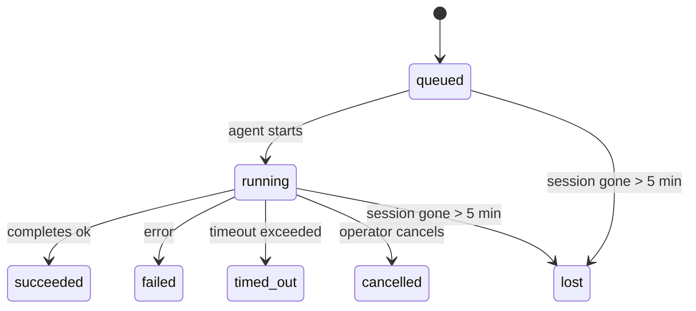

---
read_when:
    - Перегляд фонової роботи, що виконується або нещодавно завершилася
    - Налагодження збоїв доставки для від'єднаних запусків агентів
    - Розуміння того, як фонові запуски пов’язані із сесіями, Cron і Heartbeat
sidebarTitle: Background tasks
summary: Відстеження фонових завдань для запусків ACP, субагентів, ізольованих завдань Cron та операцій CLI
title: Фонові завдання
x-i18n:
    generated_at: "2026-04-27T12:48:24Z"
    model: gpt-5.4
    provider: openai
    source_hash: 49e52482083aa0e1eac40dcea0246ef73a396f22eef4f26649ff2e6ccbd6965d
    source_path: automation/tasks.md
    workflow: 15
---

<Note>
Шукаєте планування? Дивіться [Автоматизація та завдання](/uk/automation), щоб вибрати правильний механізм. Ця сторінка — журнал активності для фонової роботи, а не планувальник.
</Note>

Фонові завдання відстежують роботу, що виконується **поза межами вашої основної сесії розмови**: запуски ACP, створення субагентів, ізольовані виконання завдань Cron та операції, ініційовані через CLI.

Завдання **не** замінюють сесії, завдання Cron або Heartbeat — це **журнал активності**, який фіксує, яка від'єднана робота відбулася, коли саме і чи була вона успішною.

<Note>
Не кожен запуск агента створює завдання. Ходи Heartbeat і звичайний інтерактивний чат — ні. Усі виконання Cron, створення ACP, створення субагентів і команди агента CLI — так.
</Note>

## Коротко

- Завдання — це **записи**, а не планувальники: Cron і Heartbeat визначають, _коли_ виконується робота, а завдання відстежують, _що сталося_.
- ACP, субагенти, усі завдання Cron та операції CLI створюють завдання. Ходи Heartbeat — ні.
- Кожне завдання проходить шлях `queued → running → terminal` (succeeded, failed, timed_out, cancelled або lost).
- Завдання Cron залишаються активними, доки середовище виконання Cron іще володіє завданням; якщо
  стан середовища виконання в пам’яті зник, обслуговування завдань спочатку перевіряє стійку
  історію виконань Cron, перш ніж позначити завдання як lost.
- Завершення керується подіями: від'єднана робота може сповістити безпосередньо або пробудити
  сесію/Heartbeat запитувача після завершення, тож цикли опитування статусу зазвичай не є правильним підходом.
- Ізольовані виконання Cron і завершення субагентів у міру можливості очищують відстежувані вкладки браузера/процеси для своєї дочірньої сесії перед остаточним обліком очищення.
- Доставка ізольованого Cron пригнічує застарілі проміжні відповіді батьківського процесу, поки робота субагентів-нащадків іще завершується, і надає перевагу фінальному виводу нащадка, якщо він надходить до доставки.
- Сповіщення про завершення доставляються безпосередньо в канал або ставляться в чергу до наступного Heartbeat.
- `openclaw tasks list` показує всі завдання; `openclaw tasks audit` виявляє проблеми.
- Термінальні записи зберігаються 7 днів, а потім автоматично видаляються.

## Швидкий початок

<Tabs>
  <Tab title="Список і фільтрація">
    ```bash
    # List all tasks (newest first)
    openclaw tasks list

    # Filter by runtime or status
    openclaw tasks list --runtime acp
    openclaw tasks list --status running
    ```

  </Tab>
  <Tab title="Перегляд">
    ```bash
    # Show details for a specific task (by ID, run ID, or session key)
    openclaw tasks show <lookup>
    ```
  </Tab>
  <Tab title="Скасування та сповіщення">
    ```bash
    # Cancel a running task (kills the child session)
    openclaw tasks cancel <lookup>

    # Change notification policy for a task
    openclaw tasks notify <lookup> state_changes
    ```

  </Tab>
  <Tab title="Аудит і обслуговування">
    ```bash
    # Run a health audit
    openclaw tasks audit

    # Preview or apply maintenance
    openclaw tasks maintenance
    openclaw tasks maintenance --apply
    ```

  </Tab>
  <Tab title="Потік завдань">
    ```bash
    # Inspect TaskFlow state
    openclaw tasks flow list
    openclaw tasks flow show <lookup>
    openclaw tasks flow cancel <lookup>
    ```
  </Tab>
</Tabs>

## Що створює завдання

| Джерело                | Тип середовища виконання | Коли створюється запис завдання                        | Типова політика сповіщень |
| ---------------------- | ------------------------ | ------------------------------------------------------ | ------------------------- |
| Фонові запуски ACP     | `acp`                    | Створення дочірньої сесії ACP                          | `done_only`               |
| Оркестрація субагентів | `subagent`               | Створення субагента через `sessions_spawn`             | `done_only`               |
| Завдання Cron (усі типи) | `cron`                 | Кожне виконання Cron (основна сесія та ізольоване)     | `silent`                  |
| Операції CLI           | `cli`                    | Команди `openclaw agent`, що виконуються через Gateway | `silent`                  |
| Медіазавдання агента   | `cli`                    | Виконання `video_generate` із прив’язкою до сесії      | `silent`                  |

<AccordionGroup>
  <Accordion title="Типові сповіщення для Cron і медіа">
    Завдання Cron в основній сесії типово використовують політику сповіщень `silent` — вони створюють записи для відстеження, але не генерують сповіщень. Ізольовані завдання Cron також типово використовують `silent`, але вони помітніші, бо виконуються у власній сесії.

    Виконання `video_generate` із прив’язкою до сесії також використовують типову політику сповіщень `silent`. Вони все одно створюють записи завдань, але завершення повертається до вихідної сесії агента як внутрішнє пробудження, щоб агент міг сам написати наступне повідомлення та прикріпити готове відео. Якщо ви вмикаєте `tools.media.asyncCompletion.directSend`, асинхронні завершення `music_generate` і `video_generate` спочатку намагаються доставити результат безпосередньо в канал, а вже потім переходять до шляху пробудження сесії запитувача.

  </Accordion>
  <Accordion title="Захист від одночасних викликів video_generate">
    Поки завдання `video_generate` із прив’язкою до сесії все ще активне, інструмент також працює як захист: повторні виклики `video_generate` у тій самій сесії повертають статус активного завдання замість запуску другого одночасного генерування. Використовуйте `action: "status"`, якщо вам потрібен явний перегляд перебігу/статусу з боку агента.
  </Accordion>
  <Accordion title="Що не створює завдання">
    - Ходи Heartbeat — основна сесія; див. [Heartbeat](/uk/gateway/heartbeat)
    - Звичайні ходи інтерактивного чату
    - Прямі відповіді `/command`

  </Accordion>
</AccordionGroup>

## Життєвий цикл завдання



| Статус      | Що це означає                                                            |
| ----------- | ------------------------------------------------------------------------ |
| `queued`    | Створено, очікує запуску агента                                          |
| `running`   | Хід агента зараз активно виконується                                     |
| `succeeded` | Успішно завершено                                                        |
| `failed`    | Завершено з помилкою                                                     |
| `timed_out` | Перевищено налаштований час очікування                                   |
| `cancelled` | Зупинено оператором через `openclaw tasks cancel`                       |
| `lost`      | Середовище виконання втратило авторитетний стан-підґрунтя після 5-хвилинного пільгового періоду |

Переходи відбуваються автоматично — коли пов’язаний запуск агента завершується, статус завдання оновлюється відповідно.

Завершення запуску агента є авторитетним для активних записів завдань. Успішний від'єднаний запуск завершується як `succeeded`, звичайні помилки запуску — як `failed`, а результати тайм-ауту або переривання — як `timed_out`. Якщо оператор уже скасував завдання або середовище виконання вже зафіксувало сильніший термінальний стан, як-от `failed`, `timed_out` чи `lost`, пізніший сигнал про успіх не знижує цей термінальний статус.

`lost` залежить від типу середовища виконання:

- Завдання ACP: зникли метадані дочірньої сесії ACP.
- Завдання субагентів: дочірня сесія зникла зі сховища цільового агента.
- Завдання Cron: середовище виконання Cron більше не відстежує завдання як активне, а стійка
  історія виконань Cron не показує термінального результату для цього запуску. Офлайновий аудит CLI
  не вважає власний порожній внутрішньопроцесний стан середовища виконання Cron авторитетним.
- Завдання CLI: завдання ізольованої дочірньої сесії використовують дочірню сесію; завдання CLI
  із прив’язкою до чату натомість використовують контекст активного запуску, тож затримані
  рядки сесії каналу/групи/прямих повідомлень не підтримують їхню активність. Запуски `openclaw agent`
  через Gateway також завершуються за результатом свого запуску, тож завершені запуски
  не залишаються активними, доки sweeper не позначить їх як `lost`.

## Доставка та сповіщення

Коли завдання досягає термінального стану, OpenClaw сповіщає вас. Є два шляхи доставки:

**Пряма доставка** — якщо завдання має ціль каналу (`requesterOrigin`), повідомлення про завершення надсилається безпосередньо в цей канал (Telegram, Discord, Slack тощо). Для завершень субагентів OpenClaw також зберігає прив’язану маршрутизацію thread/topic, коли це можливо, і може підставити відсутній `to` / обліковий запис зі збереженого маршруту сесії запитувача (`lastChannel` / `lastTo` / `lastAccountId`), перш ніж відмовитися від прямої доставки.

**Доставка через чергу сесії** — якщо пряма доставка не вдається або не задано origin, оновлення ставиться в чергу як системна подія в сесії запитувача й з’являється під час наступного Heartbeat.

<Tip>
Завершення завдання викликає негайне пробудження Heartbeat, щоб ви швидко побачили результат — вам не потрібно чекати наступного запланованого тіку Heartbeat.
</Tip>

Це означає, що типовий робочий процес базується на подіях: запустіть від'єднану роботу один раз, а далі дозвольте середовищу виконання пробудити або сповістити вас після завершення. Опитуйте стан завдання лише тоді, коли потрібні налагодження, втручання або явний аудит.

### Політики сповіщень

Керуйте тим, скільки інформації ви отримуєте про кожне завдання:

| Політика              | Що доставляється                                                         |
| --------------------- | ------------------------------------------------------------------------ |
| `done_only` (типово)  | Лише термінальний стан (succeeded, failed тощо) — **це типове значення** |
| `state_changes`       | Кожен перехід стану та оновлення перебігу                                |
| `silent`              | Узагалі нічого                                                           |

Змініть політику під час виконання завдання:

```bash
openclaw tasks notify <lookup> state_changes
```

## Довідка CLI

<AccordionGroup>
  <Accordion title="tasks list">
    ```bash
    openclaw tasks list [--runtime <acp|subagent|cron|cli>] [--status <status>] [--json]
    ```

    Стовпці виводу: ID завдання, тип, статус, доставка, ID запуску, дочірня сесія, підсумок.

  </Accordion>
  <Accordion title="tasks show">
    ```bash
    openclaw tasks show <lookup>
    ```

    Токен lookup приймає ID завдання, ID запуску або ключ сесії. Показує повний запис, включно з часом, станом доставки, помилкою та термінальним підсумком.

  </Accordion>
  <Accordion title="tasks cancel">
    ```bash
    openclaw tasks cancel <lookup>
    ```

    Для завдань ACP і субагентів це завершує дочірню сесію. Для завдань, що відстежуються CLI, скасування фіксується в реєстрі завдань (окремого дескриптора дочірнього середовища виконання немає). Статус переходить у `cancelled`, і, якщо застосовно, надсилається сповіщення про доставку.

  </Accordion>
  <Accordion title="tasks notify">
    ```bash
    openclaw tasks notify <lookup> <done_only|state_changes|silent>
    ```
  </Accordion>
  <Accordion title="tasks audit">
    ```bash
    openclaw tasks audit [--json]
    ```

    Виявляє операційні проблеми. Висновки також з’являються в `openclaw status`, коли виявлено проблеми.

    | Знахідка                  | Рівень     | Тригер                                                                                                       |
    | ------------------------ | ---------- | ------------------------------------------------------------------------------------------------------------ |
    | `stale_queued`           | warn       | У стані queued понад 10 хвилин                                                                               |
    | `stale_running`          | error      | У стані running понад 30 хвилин                                                                              |
    | `lost`                   | warn/error | Зникло володіння завданням, прив’язане до середовища виконання; збережені втрачені завдання мають рівень warn до `cleanupAfter`, а потім стають error |
    | `delivery_failed`        | warn       | Доставка не вдалася, і політика сповіщень не `silent`                                                        |
    | `missing_cleanup`        | warn       | Термінальне завдання без часової позначки очищення                                                           |
    | `inconsistent_timestamps`| warn       | Порушення часової послідовності (наприклад, завершилося раніше, ніж почалося)                               |

  </Accordion>
  <Accordion title="tasks maintenance">
    ```bash
    openclaw tasks maintenance [--json]
    openclaw tasks maintenance --apply [--json]
    ```

    Використовуйте це, щоб переглянути або застосувати узгодження, проставлення позначок очищення та видалення для завдань і стану TaskFlow.

    Узгодження залежить від типу середовища виконання:

    - Завдання ACP/субагентів перевіряють свою дочірню сесію-джерело.
    - Завдання Cron перевіряють, чи середовище виконання Cron іще володіє завданням, потім відновлюють термінальний статус зі збережених журналів виконання Cron/стану завдання, і лише після цього переходять до `lost`. Лише процес Gateway є авторитетним для внутрішньопам’яткового набору активних завдань Cron; офлайновий аудит CLI використовує стійку історію, але не позначає завдання Cron як lost лише тому, що цей локальний Set порожній.
    - Завдання CLI із прив’язкою до чату перевіряють контекст активного запуску-власника, а не лише рядок сесії чату.

    Очищення після завершення також залежить від типу середовища виконання:

    - Під час завершення субагента в міру можливості закриваються відстежувані вкладки браузера/процеси для дочірньої сесії, перш ніж продовжиться очищення з оголошенням.
    - Під час завершення ізольованого Cron у міру можливості закриваються відстежувані вкладки браузера/процеси для сесії Cron, перш ніж виконання буде повністю згорнуте.
    - Доставка ізольованого Cron за потреби очікує завершення подальшої роботи субагентів-нащадків і пригнічує застарілий текст підтвердження батьківського процесу замість його оголошення.
    - Доставка завершення субагента надає перевагу останньому видимому тексту помічника; якщо його немає, вона переходить до очищеного останнього тексту tool/toolResult, а запуски лише з викликом інструмента, що завершилися тайм-аутом, можуть стискатися до короткого підсумку часткового прогресу. Термінальні невдалі запуски оголошують статус помилки без повторення захопленого тексту відповіді.
    - Помилки очищення не маскують реальний результат завдання.

  </Accordion>
  <Accordion title="tasks flow list | show | cancel">
    ```bash
    openclaw tasks flow list [--status <status>] [--json]
    openclaw tasks flow show <lookup> [--json]
    openclaw tasks flow cancel <lookup>
    ```

    Використовуйте це, коли вас цікавить саме оркеструвальний TaskFlow, а не окремий запис фонового завдання.

  </Accordion>
</AccordionGroup>

## Дошка завдань чату (`/tasks`)

Використовуйте `/tasks` у будь-якій сесії чату, щоб побачити фонові завдання, пов’язані з цією сесією. Дошка показує активні та нещодавно завершені завдання з даними про середовище виконання, статус, час і подробиці перебігу або помилки.

Коли поточна сесія не має видимих пов’язаних завдань, `/tasks` переходить до локальних для агента підрахунків завдань, щоб ви все одно отримували огляд без розкриття деталей інших сесій.

Для повного операторського журналу використовуйте CLI: `openclaw tasks list`.

## Інтеграція зі статусом (навантаження завдань)

`openclaw status` містить зведення завдань з першого погляду:

```
Tasks: 3 queued · 2 running · 1 issues
```

Зведення показує:

- **active** — кількість `queued` + `running`
- **failures** — кількість `failed` + `timed_out` + `lost`
- **byRuntime** — розбивка за `acp`, `subagent`, `cron`, `cli`

І `/status`, і інструмент `session_status` використовують знімок завдань з урахуванням очищення: активним завданням надається перевага, застарілі завершені рядки приховуються, а недавні збої показуються лише тоді, коли не залишилося активної роботи. Це дозволяє картці статусу зосереджуватися на тому, що важливо саме зараз.

## Зберігання та обслуговування

### Де зберігаються завдання

Записи завдань зберігаються в SQLite за адресою:

```
$OPENCLAW_STATE_DIR/tasks/runs.sqlite
```

Реєстр завантажується в пам’ять під час запуску gateway і синхронізує записи до SQLite для стійкості між перезапусками.
Gateway утримує журнал випереджального запису SQLite в обмежених межах, використовуючи типовий
поріг autocheckpoint SQLite, а також періодичні та завершальні контрольні точки `TRUNCATE`.

### Автоматичне обслуговування

Очищувач запускається кожні **60 секунд** і виконує три дії:

<Steps>
  <Step title="Узгодження">
    Перевіряє, чи активні завдання все ще мають авторитетне підґрунтя в середовищі виконання. Завдання ACP/субагентів використовують стан дочірньої сесії, завдання Cron — володіння активним завданням, а завдання CLI із прив’язкою до чату — контекст запуску-власника. Якщо цей стан-підґрунтя відсутній понад 5 хвилин, завдання позначається як `lost`.
  </Step>
  <Step title="Проставлення позначок очищення">
    Встановлює часову позначку `cleanupAfter` для термінальних завдань (`endedAt + 7 days`). Протягом періоду зберігання втрачені завдання все ще відображаються в аудиті як попередження; після завершення `cleanupAfter` або за відсутності метаданих очищення вони стають помилками.
  </Step>
  <Step title="Видалення">
    Видаляє записи, дата `cleanupAfter` яких уже минула.
  </Step>
</Steps>

<Note>
**Зберігання:** записи термінальних завдань зберігаються **7 днів**, а потім автоматично видаляються. Ніякого налаштування не потрібно.
</Note>

## Як завдання пов’язані з іншими системами

<AccordionGroup>
  <Accordion title="Завдання і Task Flow">
    [Task Flow](/uk/automation/taskflow) — це рівень оркестрації потоків над фоновими завданнями. Один потік може координувати кілька завдань протягом свого життєвого циклу, використовуючи керовані або дзеркальні режими синхронізації. Використовуйте `openclaw tasks` для перегляду окремих записів завдань і `openclaw tasks flow` для перегляду оркеструвального потоку.

    Дивіться [Task Flow](/uk/automation/taskflow) для подробиць.

  </Accordion>
  <Accordion title="Завдання і cron">
    **Опис** завдання cron зберігається в `~/.openclaw/cron/jobs.json`; стан виконання середовища зберігається поруч у `~/.openclaw/cron/jobs-state.json`. **Кожне** виконання Cron створює запис завдання — як у межах основної сесії, так і ізольоване. Завдання Cron в основній сесії типово використовують політику сповіщень `silent`, тож вони відстежуються без створення сповіщень.

    Дивіться [Завдання Cron](/uk/automation/cron-jobs).

  </Accordion>
  <Accordion title="Завдання і heartbeat">
    Запуски Heartbeat — це ходи основної сесії, вони не створюють записів завдань. Коли завдання завершується, воно може ініціювати пробудження heartbeat, щоб ви швидше побачили результат.

    Дивіться [Heartbeat](/uk/gateway/heartbeat).

  </Accordion>
  <Accordion title="Завдання і сесії">
    Завдання може посилатися на `childSessionKey` (де виконується робота) і `requesterSessionKey` (хто її запустив). Сесії — це контекст розмови; завдання — це відстеження активності поверх нього.
  </Accordion>
  <Accordion title="Завдання і запуски агентів">
    `runId` завдання пов’язує його із запуском агента, що виконує роботу. Події життєвого циклу агента (початок, завершення, помилка) автоматично оновлюють статус завдання — вам не потрібно керувати життєвим циклом вручну.
  </Accordion>
</AccordionGroup>

## Пов’язане

- [Автоматизація й завдання](/uk/automation) — усі механізми автоматизації з першого погляду
- [CLI: Завдання](/uk/cli/tasks) — довідка з команд CLI
- [Heartbeat](/uk/gateway/heartbeat) — періодичні ходи основної сесії
- [Заплановані завдання](/uk/automation/cron-jobs) — планування фонової роботи
- [Task Flow](/uk/automation/taskflow) — оркестрація потоків над завданнями
