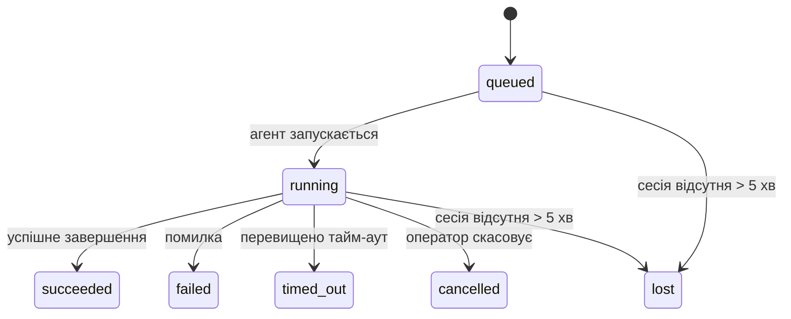

---
read_when:
    - Перевірка фонового виконання, яке триває або нещодавно завершилося
    - Налагодження збоїв доставки для відокремлених запусків агента
    - Розуміння того, як фонові запуски пов’язані із сесіями, cron і heartbeat
summary: Відстеження фонових завдань для запусків ACP, субагентів, ізольованих cron-завдань і операцій CLI
title: Фонові завдання
x-i18n:
    generated_at: "2026-04-05T23:52:58Z"
    model: gpt-5.4
    provider: openai
    source_hash: 68ba60b352c8d8fc57fed081856581107c6c0eb09ef4047264c3052abc30520d
    source_path: automation/tasks.md
    workflow: 15
---

# Фонові завдання

> **Шукаєте планування?** Див. [Automation & Tasks](/uk/automation), щоб вибрати правильний механізм. Ця сторінка описує **відстеження** фонового виконання, а не його планування.

Фонові завдання відстежують роботу, яка виконується **поза межами вашої основної сесії розмови**:
запуски ACP, запуск субагентів, виконання ізольованих cron-завдань і операції, ініційовані через CLI.

Завдання **не** замінюють сесії, cron-завдання або heartbeat — це **журнал активності**, який фіксує, яка відокремлена робота виконувалася, коли саме та чи була вона успішною.

<Note>
Не кожен запуск агента створює завдання. Ходи heartbeat і звичайний інтерактивний чат — ні. Усі виконання cron, запуски ACP, запуски субагентів і команди агента CLI — так.
</Note>

## Коротко

- Завдання — це **записи**, а не планувальники: cron і heartbeat вирішують, _коли_ виконується робота, а завдання відстежують, _що сталося_.
- ACP, субагенти, усі cron-завдання та операції CLI створюють завдання. Ходи heartbeat — ні.
- Кожне завдання проходить стани `queued → running → terminal` (succeeded, failed, timed_out, cancelled або lost).
- Завдання cron залишаються активними, доки середовище виконання cron усе ще володіє завданням; завдання CLI, прив’язані до чату, залишаються активними лише доки їхній контекст виконання-власник іще активний.
- Завершення керується подіями push: відокремлена робота може напряму сповіщати або пробуджувати
  сесію/heartbeat запитувача після завершення, тому цикли опитування стану
  зазвичай не є правильним підходом.
- Ізольовані запуски cron і завершення субагентів у межах best-effort очищають відстежувані вкладки браузера/процеси для своєї дочірньої сесії перед фінальним обліком очищення.
- Ізольована доставка cron пригнічує застарілі проміжні відповіді батьківського процесу, поки
  ще триває завершення дочірньої роботи субагента, і надає перевагу фінальному виводу нащадка,
  якщо він надходить до моменту доставки.
- Сповіщення про завершення доставляються безпосередньо в канал або ставляться в чергу до наступного heartbeat.
- `openclaw tasks list` показує всі завдання; `openclaw tasks audit` виявляє проблеми.
- Термінальні записи зберігаються 7 днів, після чого автоматично видаляються.

## Швидкий старт

```bash
# Показати всі завдання (найновіші спочатку)
openclaw tasks list

# Фільтрувати за середовищем виконання або статусом
openclaw tasks list --runtime acp
openclaw tasks list --status running

# Показати подробиці конкретного завдання (за ID, ID запуску або ключем сесії)
openclaw tasks show <lookup>

# Скасувати завдання, що виконується (завершує дочірню сесію)
openclaw tasks cancel <lookup>

# Змінити політику сповіщень для завдання
openclaw tasks notify <lookup> state_changes

# Запустити перевірку стану
openclaw tasks audit

# Переглянути або застосувати обслуговування
openclaw tasks maintenance
openclaw tasks maintenance --apply

# Перевірити стан Task Flow
openclaw tasks flow list
openclaw tasks flow show <lookup>
openclaw tasks flow cancel <lookup>
```

## Що створює завдання

| Джерело                | Тип середовища виконання | Коли створюється запис завдання                         | Політика сповіщень за замовчуванням |
| ---------------------- | ------------------------ | ------------------------------------------------------ | ----------------------------------- |
| Фонові запуски ACP     | `acp`                    | Під час запуску дочірньої сесії ACP                    | `done_only`                         |
| Оркестрація субагентів | `subagent`               | Під час запуску субагента через `sessions_spawn`       | `done_only`                         |
| Cron-завдання (усі типи) | `cron`                 | Під час кожного виконання cron (основна сесія та ізольоване) | `silent`                      |
| Операції CLI           | `cli`                    | Команди `openclaw agent`, які виконуються через gateway | `silent`                            |
| Медіазавдання агента   | `cli`                    | Запуски `video_generate`, прив’язані до сесії          | `silent`                            |

Завдання cron в основній сесії за замовчуванням використовують політику сповіщень `silent` — вони створюють записи для відстеження, але не генерують сповіщення. Ізольовані завдання cron також за замовчуванням використовують `silent`, але вони помітніші, оскільки виконуються у власній сесії.

Запуски `video_generate`, прив’язані до сесії, також використовують політику сповіщень `silent`. Вони все одно створюють записи завдань, але завершення повертається до початкової сесії агента як внутрішнє пробудження, щоб агент міг сам написати подальше повідомлення та прикріпити готове відео.

**Що не створює завдань:**

- Ходи heartbeat — основна сесія; див. [Heartbeat](/uk/gateway/heartbeat)
- Звичайні інтерактивні ходи чату
- Прямі відповіді `/command`

## Життєвий цикл завдання



| Статус      | Що це означає                                                            |
| ----------- | ------------------------------------------------------------------------ |
| `queued`    | Створено, очікує запуску агента                                          |
| `running`   | Хід агента зараз активно виконується                                     |
| `succeeded` | Успішно завершено                                                        |
| `failed`    | Завершено з помилкою                                                     |
| `timed_out` | Перевищено налаштований тайм-аут                                         |
| `cancelled` | Зупинено оператором через `openclaw tasks cancel`                       |
| `lost`      | Середовище виконання втратило авторитетний базовий стан після 5-хвилинного пільгового періоду |

Переходи відбуваються автоматично — коли завершується пов’язаний запуск агента, статус завдання оновлюється відповідно.

`lost` залежить від середовища виконання:

- Завдання ACP: зникли метадані дочірньої сесії ACP.
- Завдання субагентів: дочірня сесія зникла зі сховища цільового агента.
- Завдання cron: середовище виконання cron більше не відстежує завдання як активне.
- Завдання CLI: ізольовані завдання дочірньої сесії використовують дочірню сесію; завдання CLI, прив’язані до чату, натомість використовують живий контекст виконання, тому наявність рядків сесії каналу/групи/прямих повідомлень не підтримує їх активність.

## Доставка і сповіщення

Коли завдання переходить у термінальний стан, OpenClaw сповіщає вас. Є два шляхи доставки:

**Пряма доставка** — якщо завдання має ціль каналу (`requesterOrigin`), повідомлення про завершення надсилається безпосередньо в цей канал (Telegram, Discord, Slack тощо). Для завершень субагентів OpenClaw також зберігає прив’язану маршрутизацію thread/topic, коли вона доступна, і може підставити відсутній `to` / обліковий запис із збереженого маршруту сесії запитувача (`lastChannel` / `lastTo` / `lastAccountId`) перед тим, як відмовитися від прямої доставки.

**Доставка через чергу сесії** — якщо пряма доставка не вдається або origin не задано, оновлення ставиться в чергу як системна подія в сесії запитувача й з’являється під час наступного heartbeat.

<Tip>
Завершення завдання негайно запускає пробудження heartbeat, щоб ви швидко побачили результат — вам не потрібно чекати наступного запланованого тіку heartbeat.
</Tip>

Це означає, що типовий робочий процес базується на push-подіях: один раз запустіть відокремлену роботу, а потім
дозвольте середовищу виконання пробудити вас або сповістити після завершення. Опитуйте стан завдання лише тоді, коли
потрібні налагодження, втручання або явний аудит.

### Політики сповіщень

Керуйте тим, скільки ви отримуєте повідомлень про кожне завдання:

| Політика              | Що доставляється                                                         |
| --------------------- | ------------------------------------------------------------------------ |
| `done_only` (типово)  | Лише термінальний стан (succeeded, failed тощо) — **це значення за замовчуванням** |
| `state_changes`       | Кожен перехід стану та оновлення прогресу                                |
| `silent`              | Узагалі нічого                                                           |

Змініть політику під час виконання завдання:

```bash
openclaw tasks notify <lookup> state_changes
```

## Довідка CLI

### `tasks list`

```bash
openclaw tasks list [--runtime <acp|subagent|cron|cli>] [--status <status>] [--json]
```

Стовпці виводу: ID завдання, тип, статус, доставка, ID запуску, дочірня сесія, підсумок.

### `tasks show`

```bash
openclaw tasks show <lookup>
```

Токен lookup приймає ID завдання, ID запуску або ключ сесії. Показує повний запис, включно з часом, станом доставки, помилкою та термінальним підсумком.

### `tasks cancel`

```bash
openclaw tasks cancel <lookup>
```

Для завдань ACP і субагентів це завершує дочірню сесію. Статус переходить у `cancelled`, і надсилається сповіщення про доставку.

### `tasks notify`

```bash
openclaw tasks notify <lookup> <done_only|state_changes|silent>
```

### `tasks audit`

```bash
openclaw tasks audit [--json]
```

Виявляє операційні проблеми. Висновки також з’являються в `openclaw status`, коли виявлено проблеми.

| Висновок                  | Рівень | Умова                                                |
| ------------------------- | ------ | ---------------------------------------------------- |
| `stale_queued`            | warn   | Перебуває в черзі більше 10 хвилин                   |
| `stale_running`           | error  | Виконується більше 30 хвилин                         |
| `lost`                    | error  | Зникло володіння завданням, прив’язане до середовища виконання |
| `delivery_failed`         | warn   | Доставка не вдалася, а політика сповіщень не `silent` |
| `missing_cleanup`         | warn   | Термінальне завдання без позначки часу очищення      |
| `inconsistent_timestamps` | warn   | Порушення часової послідовності (наприклад, завершено раніше, ніж почато) |

### `tasks maintenance`

```bash
openclaw tasks maintenance [--json]
openclaw tasks maintenance --apply [--json]
```

Використовуйте це, щоб переглянути або застосувати звірку, позначення очищення та видалення
для завдань і стану Task Flow.

Звірка залежить від середовища виконання:

- Завдання ACP/субагентів перевіряють свою дочірню сесію.
- Завдання cron перевіряють, чи середовище виконання cron усе ще володіє завданням.
- Завдання CLI, прив’язані до чату, перевіряють контекст активного запуску-власника, а не лише рядок сесії чату.

Очищення після завершення також залежить від середовища виконання:

- Завершення субагента в межах best-effort закриває відстежувані вкладки браузера/процеси для дочірньої сесії перед подальшим оголошенням очищення.
- Завершення ізольованого cron у межах best-effort закриває відстежувані вкладки браузера/процеси для сесії cron до повного завершення виконання.
- Доставка для ізольованого cron за потреби чекає завершення подальших дій дочірнього субагента і
  пригнічує застарілий текст підтвердження від батьківського процесу замість його оголошення.
- Доставка завершення субагента надає перевагу найновішому видимому тексту асистента; якщо він порожній, вона переходить до санітизованого найновішого тексту tool/toolResult, а запуски tool-call, що завершилися лише тайм-аутом, можуть згортатися до короткого підсумку часткового прогресу.
- Збої очищення не маскують реальний результат завдання.

### `tasks flow list|show|cancel`

```bash
openclaw tasks flow list [--status <status>] [--json]
openclaw tasks flow show <lookup> [--json]
openclaw tasks flow cancel <lookup>
```

Використовуйте ці команди, коли вас цікавить саме оркеструвальний Task Flow,
а не окремий запис фонового завдання.

## Дошка завдань у чаті (`/tasks`)

Використовуйте `/tasks` у будь-якій чат-сесії, щоб побачити фонові завдання, пов’язані з цією сесією. Дошка показує
активні та нещодавно завершені завдання з даними про середовище виконання, статус, час і подробиці прогресу або помилки.

Коли поточна сесія не має видимих пов’язаних завдань, `/tasks` повертається до локальних для агента підрахунків завдань,
щоб ви все одно бачили загальний огляд без розкриття подробиць інших сесій.

Для повного операторського журналу використовуйте CLI: `openclaw tasks list`.

## Інтеграція зі статусом (навантаження завдань)

`openclaw status` містить стислий підсумок завдань:

```
Tasks: 3 queued · 2 running · 1 issues
```

Підсумок повідомляє:

- **active** — кількість `queued` + `running`
- **failures** — кількість `failed` + `timed_out` + `lost`
- **byRuntime** — розбивка за `acp`, `subagent`, `cron`, `cli`

І `/status`, і інструмент `session_status` використовують знімок завдань з урахуванням очищення: активним завданням
надається перевага, застарілі завершені рядки приховуються, а нещодавні збої показуються лише тоді, коли немає активної роботи.
Це допомагає картці статусу зосереджуватися на тому, що важливо саме зараз.

## Зберігання і обслуговування

### Де зберігаються завдання

Записи завдань зберігаються в SQLite за адресою:

```
$OPENCLAW_STATE_DIR/tasks/runs.sqlite
```

Реєстр завантажується в пам’ять під час запуску gateway і синхронізує записи в SQLite для збереження між перезапусками.

### Автоматичне обслуговування

Очищувач запускається кожні **60 секунд** і виконує три дії:

1. **Звірка** — перевіряє, чи активні завдання все ще мають авторитетний базовий стан у середовищі виконання. Завдання ACP/субагентів використовують стан дочірньої сесії, завдання cron — володіння активним завданням, а завдання CLI, прив’язані до чату, — контекст активного запуску-власника. Якщо цей базовий стан відсутній понад 5 хвилин, завдання позначається як `lost`.
2. **Позначення очищення** — встановлює часову позначку `cleanupAfter` для термінальних завдань (endedAt + 7 днів).
3. **Видалення** — видаляє записи після дати `cleanupAfter`.

**Термін зберігання**: записи термінальних завдань зберігаються **7 днів**, після чого автоматично видаляються. Налаштування не потрібне.

## Як завдання пов’язані з іншими системами

### Завдання і Task Flow

[Task Flow](/uk/automation/taskflow) — це рівень оркестрації потоків над фоновими завданнями. Один потік може координувати кілька завдань протягом свого життєвого циклу, використовуючи керовані або дзеркальні режими синхронізації. Використовуйте `openclaw tasks`, щоб перевіряти окремі записи завдань, і `openclaw tasks flow`, щоб перевіряти оркеструвальний потік.

Докладніше див. у [Task Flow](/uk/automation/taskflow).

### Завдання і cron

**Визначення** cron-завдання зберігається в `~/.openclaw/cron/jobs.json`. **Кожне** виконання cron створює запис завдання — як в основній сесії, так і в ізольованій. Завдання cron в основній сесії за замовчуванням використовують політику сповіщень `silent`, тому вони відстежуються без створення сповіщень.

Див. [Cron Jobs](/uk/automation/cron-jobs).

### Завдання і heartbeat

Запуски heartbeat — це ходи основної сесії, вони не створюють записів завдань. Коли завдання завершується, воно може ініціювати пробудження heartbeat, щоб ви швидко побачили результат.

Див. [Heartbeat](/uk/gateway/heartbeat).

### Завдання і сесії

Завдання може посилатися на `childSessionKey` (де виконується робота) і `requesterSessionKey` (хто її запустив). Сесії — це контекст розмови; завдання — це шар відстеження активності поверх нього.

### Завдання і запуски агента

`runId` завдання пов’язує його із запуском агента, який виконує роботу. Події життєвого циклу агента (start, end, error) автоматично оновлюють статус завдання — вам не потрібно керувати життєвим циклом вручну.

## Пов’язане

- [Automation & Tasks](/uk/automation) — усі механізми автоматизації з першого погляду
- [Task Flow](/uk/automation/taskflow) — оркестрація потоків поверх завдань
- [Scheduled Tasks](/uk/automation/cron-jobs) — планування фонової роботи
- [Heartbeat](/uk/gateway/heartbeat) — періодичні ходи основної сесії
- [CLI: Tasks](/cli/index#tasks) — довідка щодо команд CLI
