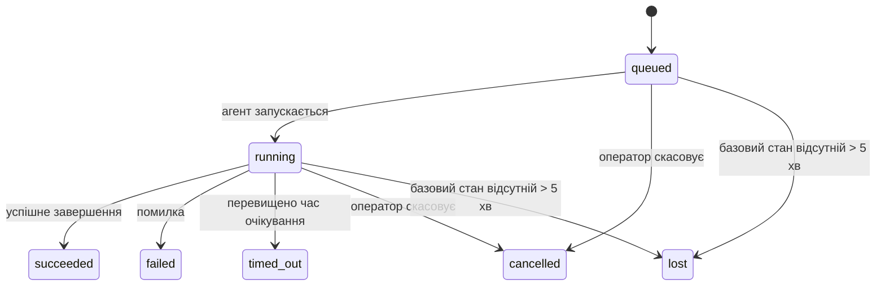

---
read_when:
    - Перегляд фонових завдань, що виконуються або нещодавно завершилися
    - Налагодження збоїв доставки для відокремлених запусків агента
    - Розуміння зв’язку фонових запусків із сеансами, Cron і Heartbeat
sidebarTitle: Background tasks
summary: Відстеження фонових завдань для запусків ACP, субагентів, виконань Cron і операцій CLI
title: Фонові завдання
x-i18n:
    generated_at: "2026-07-12T12:57:49Z"
    model: gpt-5.6
    postprocess_version: locale-links-v1
    provider: openai
    source_hash: 0a945e8103c5df5a64785f326a9d0b08784ac32a2ca6fa3d4c399d75fc54be2b
    source_path: automation/tasks.md
    workflow: 16
---

<Note>
Шукаєте планування? Див. [Автоматизація](/uk/automation), щоб вибрати відповідний механізм. Ця сторінка — журнал активності фонової роботи, а не планувальник.
</Note>

Фонові завдання відстежують роботу, що виконується **поза основним сеансом розмови**: запуски ACP, створення субагентів, виконання завдань cron та операції, ініційовані через CLI.

Завдання **не** замінюють сеанси, завдання cron або Heartbeat — це **журнал активності**, який фіксує, яка відокремлена робота виконувалася, коли саме та чи була вона успішною.

<Note>
Не кожен запуск агента створює завдання. Цього не роблять цикли Heartbeat і звичайний інтерактивний чат. Усі виконання cron, створення ACP, створення субагентів і команди агента CLI, надіслані через Gateway, створюють завдання.
</Note>

## Коротко

- Завдання — це **записи**, а не планувальники: cron і Heartbeat визначають, _коли_ виконується робота, а завдання відстежують, _що сталося_.
- ACP, субагенти, усі завдання cron та операції CLI створюють завдання. Цикли Heartbeat цього не роблять.
- Кожне завдання проходить стани `queued → running → terminal` (succeeded, failed, timed_out, cancelled або lost).
- Завдання cron залишаються активними, доки середовище виконання cron володіє завданням; якщо стан середовища виконання в пам’яті втрачено, обслуговування завдань спочатку перевіряє збережену історію запусків cron і лише потім позначає завдання як втрачене.
- Завершення працює на основі надсилання подій: відокремлена робота після завершення може надіслати сповіщення безпосередньо або активувати сеанс запитувача чи Heartbeat, тому цикли опитування стану зазвичай є неправильним підходом.
- Ізольовані запуски cron і завершення субагентів у міру можливості закривають відстежувані вкладки браузера та процеси дочірнього сеансу перед остаточним службовим очищенням.
- Доставлення ізольованого cron пригнічує застарілі проміжні відповіді батьківського агента, доки робота дочірніх субагентів ще завершується, і надає перевагу остаточному виводу дочірнього агента, якщо він надходить до доставлення.
- Сповіщення про завершення доставляються безпосередньо в канал або ставляться в чергу до наступного Heartbeat.
- `openclaw tasks list` показує всі завдання; `openclaw tasks audit` виявляє проблеми.
- Термінальні записи зберігаються 7 днів (записи `lost` — 24 години), після чого автоматично видаляються.

## Швидкий початок

<Tabs>
  <Tab title="Перегляд і фільтрування">
    ```bash
    # Перелік усіх завдань (спочатку найновіші)
    openclaw tasks list

    # Фільтрування за середовищем виконання або станом
    openclaw tasks list --runtime acp
    openclaw tasks list --status running
    ```

  </Tab>
  <Tab title="Перевірка">
    ```bash
    # Показати відомості про конкретне завдання (за ID завдання, ID запуску або ключем сеансу)
    openclaw tasks show <lookup>
    ```
  </Tab>
  <Tab title="Скасування та сповіщення">
    ```bash
    # Скасувати активне завдання (завершує дочірній сеанс)
    openclaw tasks cancel <lookup>

    # Змінити політику сповіщень для завдання
    openclaw tasks notify <lookup> state_changes
    ```

  </Tab>
  <Tab title="Аудит і обслуговування">
    ```bash
    # Запустити аудит справності
    openclaw tasks audit

    # Попередньо переглянути або застосувати обслуговування
    openclaw tasks maintenance
    openclaw tasks maintenance --apply
    ```

  </Tab>
  <Tab title="Потік завдання">
    ```bash
    # Перевірити стан TaskFlow
    openclaw tasks flow list
    openclaw tasks flow show <lookup>
    openclaw tasks flow cancel <lookup>
    ```
  </Tab>
</Tabs>

## Що створює завдання

| Джерело                    | Тип середовища виконання | Коли створюється запис завдання                                        | Стандартна політика сповіщень |
| -------------------------- | ------------------------ | ---------------------------------------------------------------------- | ----------------------------- |
| Фонові запуски ACP         | `acp`                    | Створення дочірнього сеансу ACP                                        | `done_only`                   |
| Оркестрація субагентів     | `subagent`               | Створення субагента через `sessions_spawn`                             | `done_only`                   |
| Завдання cron (усі типи)   | `cron`                   | Кожне виконання cron (в основному сеансі та ізольоване)                | `silent`                      |
| Операції CLI               | `cli`                    | Команди `openclaw agent`, що виконуються через Gateway                 | `silent`                      |
| Завдання агента з медіа    | `cli`                    | Запуски `image_generate`/`music_generate`/`video_generate` із сеансом  | `silent`                      |

<AccordionGroup>
  <Accordion title="Стандартні сповіщення для cron і медіа">
    Завдання cron (в основному сеансі та ізольовані) використовують політику сповіщень `silent`: вони створюють записи для відстеження, але не генерують власних сповіщень про завдання; шлях доставлення контролює cron.

    Запуски `image_generate`, `music_generate` і `video_generate`, пов’язані із сеансом, також використовують політику сповіщень `silent`. Вони все одно створюють записи завдань, але завершення повертається початковому сеансу агента як внутрішня активація, щоб агент міг написати подальше повідомлення та самостійно прикріпити готові медіафайли. Агент-запитувач дотримується свого звичайного контракту видимих відповідей: автоматична остаточна відповідь, якщо це налаштовано, або `message(action="send")` разом із `NO_REPLY`, якщо сеанс вимагає відповідей через інструмент повідомлень. Якщо сеанс запитувача вже неактивний або його активна активація завершується помилкою, а агент завершення не отримує частину або всі згенеровані медіафайли, OpenClaw надсилає ідемпотентне пряме резервне повідомлення лише з відсутніми медіафайлами до початкової цілі каналу.

  </Accordion>
  <Accordion title="Захист від одночасного створення медіа">
    Поки завдання створення медіа, пов’язане із сеансом, залишається активним, `image_generate`, `music_generate` і `video_generate` захищають від випадкових повторних спроб: повторення виклику для того самого запиту повертає стан відповідного активного завдання замість запуску дубліката, тоді як інший запит може запустити власне завдання. Використовуйте `action: "status"`, якщо потрібен явний запит перебігу виконання або стану з боку агента.
  </Accordion>
  <Accordion title="Що не створює завдань">
    - Цикли Heartbeat в основному сеансі; див. [Heartbeat](/uk/gateway/heartbeat)
    - Звичайні цикли інтерактивного чату
    - Прямі відповіді `/command`

  </Accordion>
</AccordionGroup>

## Життєвий цикл завдання



| Стан        | Що він означає                                                                  |
| ----------- | ------------------------------------------------------------------------------- |
| `queued`    | Створено, очікує запуску агента                                                 |
| `running`   | Цикл агента активно виконується                                                 |
| `succeeded` | Успішно завершено                                                               |
| `failed`    | Завершено з помилкою                                                            |
| `timed_out` | Перевищено налаштований час очікування                                          |
| `cancelled` | Зупинено оператором через `openclaw tasks cancel` або запуск було перервано     |
| `lost`      | Середовище виконання втратило авторитетний базовий стан після 5 хвилин очікування |

Переходи відбуваються автоматично: події життєвого циклу запуску агента (початок, завершення, помилка) оновлюють стан завдання; керувати ним вручну не потрібно.

Завершення запуску агента є авторитетним для активних записів завдань. Успішний відокремлений запуск завершується зі станом `succeeded`, звичайні помилки запуску — зі станом `failed`, перевищення часу очікування — зі станом `timed_out`, а скасування чи переривання — зі станом `cancelled`. Коли завдання переходить у термінальний стан, пізніші сигнали життєвого циклу не можуть знизити його стан: скасоване оператором або вже позначене як `failed`/`timed_out`/`lost` завдання зберігає цей стан, навіть якщо згодом надходить сигнал про успішне завершення.

Стан `lost` залежить від середовища виконання:

- Завдання ACP: лише активний внутрішньопроцесний цикл ACP у Gateway підтверджує, що запуск досі виконується; самих лише збережених метаданих сеансу недостатньо. Автономний аудит CLI діє консервативно й ніколи не відновлює завдання ACP.
- Завдання субагентів: базовий дочірній сеанс зник зі сховища цільового агента або містить позначку відновлення після перезапуску.
- Завдання cron: середовище виконання cron більше не відстежує завдання як активне, а збережена історія запусків cron не містить термінального результату цього запуску. Автономний аудит CLI не вважає власний порожній внутрішньопроцесний стан середовища виконання cron авторитетним.
- Завдання CLI: завдання з ID запуску або ID джерела використовують активний контекст запуску, тому залишкові записи дочірнього сеансу чи сеансу чату не зберігають їх активними після зникнення запуску, яким володів Gateway. Застарілі завдання CLI без ідентифікатора запуску й надалі використовують дочірній сеанс як резервний варіант. Запуски `openclaw agent`, що працюють через Gateway, також завершуються на основі результату свого запуску, тому завершені запуски не залишаються активними, доки засіб очищення не позначить їх як `lost`.

## Доставлення та сповіщення

Коли завдання переходить у термінальний стан, OpenClaw сповіщає вас. Існує два шляхи доставлення:

**Пряме доставлення** — якщо завдання має цільовий канал (`requesterOrigin`), повідомлення про завершення надсилається безпосередньо до цього каналу (Discord, Slack, Telegram тощо). Натомість завершення групових і канальних завдань спрямовуються через сеанс запитувача, щоб батьківський агент міг написати видиму відповідь. Для завершень субагентів OpenClaw також зберігає прив’язану маршрутизацію гілки або теми, якщо вона доступна, і може заповнити відсутній `to` або обліковий запис зі збереженого маршруту сеансу запитувача (`lastChannel` / `lastTo` / `lastAccountId`), перш ніж відмовитися від прямого доставлення.

**Доставлення через чергу сеансу** — якщо пряме доставлення завершується помилкою або джерело не задано, оновлення додається до черги як системна подія в сеансі запитувача та відображається під час наступного Heartbeat.

<Tip>
Завершення завдань у черзі сеансу негайно активують Heartbeat, тому результат з’являється швидко — чекати наступного запланованого циклу Heartbeat не потрібно.
</Tip>

Отже, звичайний робочий процес ґрунтується на надсиланні подій: один раз запустіть відокремлену роботу, а потім дозвольте середовищу виконання активувати вас або сповістити про завершення. Опитуйте стан завдання лише тоді, коли потрібні налагодження, втручання або явний аудит.

### Політики сповіщень

Керуйте обсягом сповіщень про кожне завдання:

| Політика              | Що доставляється                                                    |
| --------------------- | ------------------------------------------------------------------- |
| `done_only` (типово)  | Лише термінальний стан (succeeded, failed тощо)                     |
| `state_changes`       | Кожен перехід стану й кожне оновлення перебігу виконання            |
| `silent`              | Нічого (типово для завдань cron, CLI та створення медіа)            |

Змініть політику під час виконання завдання:

```bash
openclaw tasks notify <lookup> state_changes
```

## Довідник CLI

<AccordionGroup>
  <Accordion title="tasks list">
    ```bash
    openclaw tasks list [--runtime <acp|subagent|cron|cli>] [--status <status>] [--json]
    ```

    Стовпці виводу: завдання, тип, стан, доставлення, запуск, дочірній сеанс, зведення. Команда `openclaw tasks` без аргументів працює так само, як `openclaw tasks list`.

  </Accordion>
  <Accordion title="tasks show">
    ```bash
    openclaw tasks show <lookup> [--json]
    ```

    Токен пошуку приймає ID завдання, ID запуску або ключ сеансу. Показує повний запис, зокрема час, стан доставлення, помилку та термінальне зведення.

  </Accordion>
  <Accordion title="tasks cancel">
    ```bash
    openclaw tasks cancel <lookup>
    ```

    Для завдань ACP і субагентів ця команда завершує дочірній сеанс; скасування ACP і cron спрямовуються через активний Gateway (`tasks.cancel`). Для завдань, відстежуваних через CLI, скасування записується в реєстрі завдань (окремого дескриптора дочірнього середовища виконання немає). Стан переходить у `cancelled`, і за потреби надсилається сповіщення.

  </Accordion>
  <Accordion title="tasks notify">
    ```bash
    openclaw tasks notify <lookup> <done_only|state_changes|silent>
    ```
  </Accordion>
  <Accordion title="tasks audit">
    ```bash
    openclaw tasks audit [--severity <warn|error>] [--code <name>] [--limit <n>] [--json]
    ```

    Виявляє експлуатаційні проблеми завдань **і** TaskFlow в одному звіті. Виявлені проблеми також відображаються в `openclaw status`.

    Результати перевірки завдань:

    | Виявлена проблема          | Серйозність | Умова виникнення                                                                                                  |
    | ------------------------- | ----------- | ----------------------------------------------------------------------------------------------------------------- |
    | `stale_queued`            | попередження | Перебуває в черзі понад 10 хвилин                                                                                 |
    | `stale_running`           | помилка     | Виконується понад 30 хвилин                                                                                       |
    | `lost`                    | попередження/помилка | Зник власник завдання в середовищі виконання; збережені втрачені завдання спричиняють попередження до `cleanupAfter`, а потім стають помилками |
    | `delivery_failed`         | попередження | Доставлення не вдалося, а політика сповіщень не має значення `silent`                                             |
    | `missing_cleanup`         | попередження | Завершальне завдання без часової позначки очищення                                                                |
    | `inconsistent_timestamps` | попередження | Порушення хронології (наприклад, завершення перед початком)                                                       |

    Виявлені проблеми TaskFlow:

    | Виявлена проблема      | Серйозність | Умова виникнення                                                              |
    | ---------------------- | ----------- | ----------------------------------------------------------------------------- |
    | `restore_failed`       | помилка     | Не вдалося відновити реєстр потоків зі SQLite                                 |
    | `stale_running`        | помилка     | Виконуваний потік не просувався понад 30 хвилин                               |
    | `stale_waiting`        | попередження | Потік, що очікує, не просувався понад 30 хвилин                               |
    | `stale_blocked`        | попередження | Заблокований потік не просувався понад 30 хвилин                              |
    | `cancel_stuck`         | попередження | Скасування запитано понад 5 хвилин тому, активних дочірніх завдань немає, але стан усе ще не завершальний |
    | `missing_linked_tasks` | попередження/помилка | Застарілий керований потік без пов’язаних завдань або стану очікування        |
    | `blocked_task_missing` | попередження | Заблокований потік посилається на ідентифікатор завдання, якого більше не існує |

  </Accordion>
  <Accordion title="обслуговування завдань">
    ```bash
    openclaw tasks maintenance [--json]
    openclaw tasks maintenance --apply [--json]
    ```

    Використовуйте цю команду для попереднього перегляду або застосування узгодження, установлення часових позначок очищення та видалення застарілих записів для завдань, стану TaskFlow і рядків реєстру сеансів застарілих запусків cron.

    Узгодження враховує середовище виконання:

    - Завдання ACP потребують активного внутрішньопроцесного ходу в Gateway; завдання підагентів перевіряють свій дочірній сеанс, що забезпечує їх виконання.
    - Завдання підагентів, дочірній сеанс яких має мітку відновлення після перезапуску, позначаються як втрачені, а не вважаються сеансами виконання, які можна відновити.
    - Завдання Cron перевіряють, чи середовище виконання cron досі володіє завданням, а потім відновлюють завершальний стан зі збережених журналів запусків cron або стану завдання, перш ніж установити `lost`. Лише процес Gateway є авторитетним джерелом для набору активних завдань cron у пам’яті; автономний аудит CLI використовує довготривалу історію, але не позначає завдання cron як втрачене лише через те, що цей локальний набір порожній.
    - Завдання CLI з ідентифікатором запуску перевіряють активний контекст запуску-власника, а не лише рядки дочірнього сеансу чи сеансу чату.

    Очищення після завершення також враховує середовище виконання:

    - Після завершення підагента система за можливості закриває відстежувані вкладки браузера та процеси дочірнього сеансу, перш ніж продовжити очищення після оголошення.
    - Після завершення ізольованого запуску cron система за можливості закриває відстежувані вкладки браузера та процеси сеансу cron до повного завершення запуску.
    - Доставлення ізольованого запуску cron за потреби очікує завершення подальшої роботи дочірніх підагентів і не оголошує застарілий текст підтвердження батьківського завдання.
    - Доставлення результату завершення підагента використовує лише останній видимий текст асистента з дочірнього сеансу. Виведення `tool`/`toolResult` не переноситься до тексту результату дочірнього завдання. Завершальні невдалі запуски повідомляють про стан помилки без повторного відтворення збереженого тексту відповіді.
    - Помилки очищення не приховують фактичний результат завдання.

    Під час застосування обслуговування OpenClaw також видаляє рядки реєстру сеансів `cron:<jobId>:run:<runId>`, старші за 7 днів, зберігаючи рядки для завдань cron, які виконуються зараз, і не змінюючи рядки сеансів, не пов’язаних із cron.

  </Accordion>
  <Accordion title="перелік | перегляд | скасування потоків завдань">
    ```bash
    openclaw tasks flow list [--status <status>] [--json]
    openclaw tasks flow show <lookup> [--json]
    openclaw tasks flow cancel <lookup>
    ```

    Токен пошуку потоку приймає ідентифікатор потоку або ключ власника. Використовуйте ці команди, коли вас цікавить оркеструвальний [TaskFlow](/uk/automation/taskflow), а не окремий запис фонового завдання.

  </Accordion>
</AccordionGroup>

## Дошка завдань чату (`/tasks`)

Використовуйте `/tasks` у будь-якому сеансі чату, щоб переглядати фонові завдання, пов’язані з цим сеансом. Дошка показує до п’яти активних і нещодавно завершених завдань із середовищем виконання, станом, часовими даними та відомостями про перебіг або помилку.

Якщо поточний сеанс не має видимих пов’язаних завдань, `/tasks` натомість показує локальні для агента лічильники завдань, щоб надати загальний огляд без розкриття відомостей про інші сеанси.

Для повного операторського реєстру використовуйте CLI: `openclaw tasks list`.

### Інтерфейс керування

Вебінтерфейс керування має сторінку **Tasks** на бічній панелі з активними та нещодавніми фоновими завданнями, що оновлюються в реальному часі. Використовуйте її, щоб перевіряти перебіг, відкривати пов’язані сеанси, оновлювати реєстр або скасовувати завдання в черзі та завдання, що виконуються.

Панелі чату також мають згортану бічну панель **Background tasks**, обмежену агентом відповідної панелі: завдання та підагенти, що виконуються, з елементом керування зупинкою, розділ завершених завдань і посилання View transcript на дочірній сеанс кожного завдання. Відкрийте її за допомогою перемикача активності в заголовку панелі або плавучої кнопки активності в однопанельному чаті.

## Інтеграція зі станом (навантаження завданнями)

`openclaw status` містить короткий рядок стану завдань:

```
Завдання    2 активні · 1 у черзі · 1 виконується · 1 проблема · аудит чистий · 6 відстежуються
```

Зведення підраховує активну роботу (`queued` + `running`), невдачі (`failed` + `timed_out` + `lost`), виявлені аудитом проблеми та загальну кількість відстежуваних записів; корисне навантаження JSON також розбиває кількість за середовищем виконання (`acp`, `subagent`, `cron`, `cli`).

І `/status`, і інструмент `session_status` використовують знімок завдань, що враховує очищення: активні завдання мають пріоритет, прострочені рядки приховуються, а завершальні завдання відображаються лише протягом короткого періоду після завершення (5 хвилин), із фокусом на помилках, коли активної роботи не залишилося. Завдяки цьому картка стану показує те, що важливо саме зараз.

## Зберігання та обслуговування

### Де зберігаються завдання

Записи завдань і стан доставлення зберігаються у спільній базі даних стану OpenClaw SQLite:

```
~/.openclaw/state/openclaw.sqlite   (таблиці: task_runs, task_delivery_state, flow_runs)
```

Установіть `OPENCLAW_STATE_DIR`, щоб перемістити весь кореневий каталог стану з типового розташування `~/.openclaw`; шлях до спільної бази даних переміститься разом із ним.

Реєстр завантажується в пам’ять під час першого використання та зберігає кожну зміну назад у SQLite, тому записи переживають перезапуски Gateway. Зростання WAL обмежується типовим порогом автоматичних контрольних точок SQLite і періодичними контрольними точками `PASSIVE`; під час завершення роботи та явного обслуговування контрольні точки використовують `TRUNCATE`, щоб звичайне закриття звільняло простір WAL, не змушуючи фоновий засіб очищення очікувати на активних читачів.

Застарілі супровідні сховища зі старіших установок (`tasks/runs.sqlite`, `flows/registry.sqlite`) імпортуються до спільної бази даних командою `openclaw doctor`.

### Автоматичне обслуговування

Засіб очищення запускається кожні **60 секунд** (перший прохід — приблизно через 5 секунд після запуску Gateway) і виконує чотири дії:

<Steps>
  <Step title="Узгодження">
    Перевіряє, чи активні завдання досі мають авторитетне забезпечення середовища виконання. Завдання ACP потребують активного внутрішньопроцесного ходу, завдання підагентів використовують стан дочірнього сеансу, завдання cron — володіння активним завданням разом із довготривалою історією запусків, а завдання CLI з ідентифікатором запуску — контекст запуску-власника. Якщо стан забезпечення відсутній понад 5 хвилин (30 хвилин для нативних завдань підагентів без дочірнього сеансу), завдання позначається як `lost`.
  </Step>
  <Step title="Відновлення сеансів ACP">
    Закриває завершальні або осиротілі одноразові сеанси ACP, що належать батьківському процесу, а також закриває застарілі завершальні або осиротілі постійні сеанси ACP лише тоді, коли активної прив’язки до розмови більше немає.
  </Step>
  <Step title="Установлення часових позначок очищення">
    Установлює часову позначку `cleanupAfter` для завершальних завдань (час завершення + період зберігання). Протягом періоду зберігання втрачені завдання все ще відображаються в аудиті як попередження; після завершення строку `cleanupAfter` або за відсутності метаданих очищення вони стають помилками.
  </Step>
  <Step title="Видалення">
    Видаляє записи після дати `cleanupAfter`.
  </Step>
</Steps>

<Note>
**Зберігання:** записи завершальних завдань зберігаються протягом **7 днів** (записи `lost` — протягом **24 годин**), після чого автоматично видаляються. Налаштування не потрібне.
</Note>

## Зв’язок завдань з іншими системами

<AccordionGroup>
  <Accordion title="Завдання та TaskFlow">
    [TaskFlow](/uk/automation/taskflow) — це рівень оркестрації потоків над фоновими завданнями. Один потік може координувати кілька завдань протягом свого життєвого циклу за допомогою керованого або дзеркального режиму синхронізації. Використовуйте `openclaw tasks` для перевірки окремих записів завдань і `openclaw tasks flow` для перевірки оркеструвального потоку.

  </Accordion>
  <Accordion title="Завдання та cron">
    Визначення завдань Cron, стан виконання та історія запусків зберігаються у спільній базі даних стану OpenClaw SQLite. **Кожне** виконання cron створює запис завдання — і в основному сеансі, і в ізольованому — з політикою сповіщень `silent`, тому запуски cron відстежуються, але не створюють власних сповіщень про завдання.

    Див. [Завдання Cron](/uk/automation/cron-jobs).

  </Accordion>
  <Accordion title="Завдання та Heartbeat">
    Запуски Heartbeat є ходами основного сеансу — вони не створюють записів завдань. Після завершення завдання воно може спричинити пробудження Heartbeat, щоб ви швидко побачили результат.

    Див. [Heartbeat](/uk/gateway/heartbeat).

  </Accordion>
  <Accordion title="Завдання та сеанси">
    Завдання може посилатися на `childSessionKey` (де виконується робота) і `requesterSessionKey` (хто її запустив). Його `agentId` визначає агента, який виконує роботу, а поля запитувача та власника зберігають контекст запуску й керування. Сеанси є контекстом розмови, а завдання — рівнем відстеження активності поверх нього.
  </Accordion>
  <Accordion title="Завдання та запуски агента">
    `runId` завдання посилається на запуск агента, який виконує роботу. Події життєвого циклу агента (початок, завершення, помилка) автоматично оновлюють стан завдання — вам не потрібно керувати життєвим циклом вручну.
  </Accordion>
</AccordionGroup>

## Пов’язані матеріали

- [Автоматизація](/uk/automation) — короткий огляд усіх механізмів автоматизації
- [CLI: завдання](/uk/cli/tasks) — довідник команд CLI
- [Heartbeat](/uk/gateway/heartbeat) — періодичні ходи основного сеансу
- [Заплановані завдання](/uk/automation/cron-jobs) — планування фонової роботи
- [TaskFlow](/uk/automation/taskflow) — оркестрація потоків над завданнями
