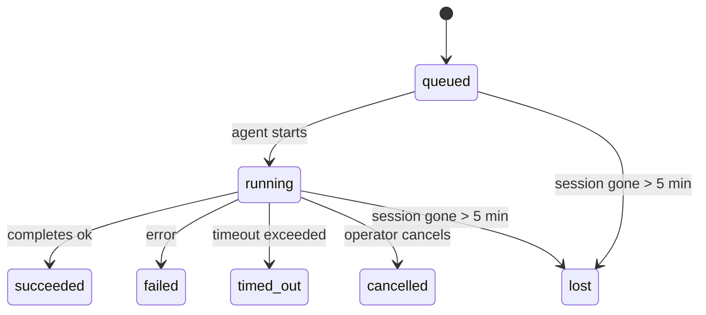

---
read_when:
    - Перегляд фонової роботи, що виконується або нещодавно завершилася
    - Налагодження збоїв доставки для відокремлених запусків агентів
    - Розуміння того, як фонові запуски пов’язані із сесіями, Cron і Heartbeat
summary: Відстеження фонових завдань для запусків ACP, субагентів, ізольованих завдань Cron і операцій CLI
title: Фонові завдання
x-i18n:
    generated_at: "2026-04-23T20:43:14Z"
    model: gpt-5.4
    provider: openai
    source_hash: 10f16268ab5cce8c3dfd26c54d8d913c0ac0f9bfb4856ed1bb28b085ddb78528
    source_path: automation/tasks.md
    workflow: 15
---

> **Шукаєте планування?** Перегляньте [Automation & Tasks](/uk/automation), щоб вибрати правильний механізм. На цій сторінці йдеться про **відстеження** фонової роботи, а не про її планування.

Фонові завдання відстежують роботу, що виконується **поза межами вашої основної сесії розмови**:
запуски ACP, породження субагентів, ізольовані виконання завдань Cron і операції, ініційовані через CLI.

Завдання **не** замінюють сесії, завдання Cron або Heartbeat — це **журнал активності**, який фіксує, яка відокремлена робота відбулася, коли саме і чи завершилася вона успішно.

<Note>
Не кожен запуск агента створює завдання. Ходи Heartbeat і звичайний інтерактивний чат — ні. Усі виконання Cron, породження ACP, породження субагентів і команди агента CLI — так.
</Note>

## Коротко

- Завдання — це **записи**, а не планувальники: Cron і Heartbeat визначають, _коли_ виконується робота, а завдання відстежують, _що сталося_.
- ACP, субагенти, усі завдання Cron та операції CLI створюють завдання. Ходи Heartbeat — ні.
- Кожне завдання проходить через `queued → running → terminal` (`succeeded`, `failed`, `timed_out`, `cancelled` або `lost`).
- Завдання Cron залишаються активними, поки середовище виконання Cron усе ще володіє завданням; чат-орієнтовані завдання CLI залишаються активними лише поки їхній контекст запуску-власник іще активний.
- Завершення керується надсиланням: відокремлена робота може сповістити безпосередньо або пробудити сесію/heartbeat запитувача після завершення, тож цикли опитування стану зазвичай є неправильною моделлю.
- Ізольовані запуски Cron і завершення субагентів у межах best-effort очищають відстежувані вкладки/процеси браузера для своєї дочірньої сесії перед фінальним обліком очищення.
- Доставка ізольованих запусків Cron пригнічує застарілі проміжні відповіді батьківського процесу, поки ще триває дочірня робота субагента, і надає перевагу фінальному дочірньому виводу, якщо він надходить до доставки.
- Сповіщення про завершення доставляються безпосередньо в канал або ставляться в чергу до наступного Heartbeat.
- `openclaw tasks list` показує всі завдання; `openclaw tasks audit` виявляє проблеми.
- Термінальні записи зберігаються 7 днів, після чого автоматично видаляються.

## Швидкий старт

```bash
# Показати всі завдання (найновіші спочатку)
openclaw tasks list

# Відфільтрувати за середовищем виконання або статусом
openclaw tasks list --runtime acp
openclaw tasks list --status running

# Показати відомості про конкретне завдання (за ID, ID запуску або ключем сесії)
openclaw tasks show <lookup>

# Скасувати завдання, що виконується (завершує дочірню сесію)
openclaw tasks cancel <lookup>

# Змінити політику сповіщень для завдання
openclaw tasks notify <lookup> state_changes

# Запустити аудит стану
openclaw tasks audit

# Попередньо переглянути або застосувати обслуговування
openclaw tasks maintenance
openclaw tasks maintenance --apply

# Переглянути стан TaskFlow
openclaw tasks flow list
openclaw tasks flow show <lookup>
openclaw tasks flow cancel <lookup>
```

## Що створює завдання

| Джерело                | Тип середовища виконання | Коли створюється запис завдання                        | Типова політика сповіщень |
| ---------------------- | ------------------------ | ------------------------------------------------------ | ------------------------- |
| Фонові запуски ACP     | `acp`                    | Під час породження дочірньої сесії ACP                 | `done_only`               |
| Оркестрація субагентів | `subagent`               | Під час породження субагента через `sessions_spawn`    | `done_only`               |
| Завдання Cron (усі типи) | `cron`                 | Кожне виконання Cron (основна сесія та ізольоване)     | `silent`                  |
| Операції CLI           | `cli`                    | Команди `openclaw agent`, що виконуються через Gateway | `silent`                  |
| Медіазавдання агента   | `cli`                    | Запуски `video_generate`, прив’язані до сесії          | `silent`                  |

Завдання Cron в основній сесії типово використовують політику сповіщень `silent` — вони створюють записи для відстеження, але не генерують сповіщення. Ізольовані завдання Cron також типово використовують `silent`, але помітніші, оскільки виконуються у власній сесії.

Запуски `video_generate`, прив’язані до сесії, також використовують політику сповіщень `silent`. Вони все одно створюють записи завдань, але завершення повертається до початкової сесії агента як внутрішнє пробудження, щоб агент міг сам написати наступне повідомлення й додати готове відео. Якщо ви вмикаєте `tools.media.asyncCompletion.directSend`, асинхронні завершення `music_generate` і `video_generate` спочатку намагаються доставити результат безпосередньо в канал, а вже потім повертаються до шляху пробудження сесії-запитувача.

Поки завдання `video_generate`, прив’язане до сесії, усе ще активне, інструмент також працює як захисний механізм: повторні виклики `video_generate` у тій самій сесії повертають статус активного завдання замість запуску другого одночасного генерування. Використовуйте `action: "status"`, якщо хочете явний запит прогресу/статусу з боку агента.

**Що не створює завдань:**

- Ходи Heartbeat — основна сесія; див. [Heartbeat](/uk/gateway/heartbeat)
- Звичайні інтерактивні ходи чату
- Прямі відповіді `/command`

## Життєвий цикл завдання



| Статус      | Що це означає                                                            |
| ----------- | ------------------------------------------------------------------------ |
| `queued`    | Створено, очікує запуску агентом                                         |
| `running`   | Хід агента активно виконується                                           |
| `succeeded` | Успішно завершено                                                        |
| `failed`    | Завершено з помилкою                                                     |
| `timed_out` | Перевищено налаштований тайм-аут                                         |
| `cancelled` | Зупинено оператором через `openclaw tasks cancel`                        |
| `lost`      | Середовище виконання втратило авторитетний базовий стан після 5-хвилинного пільгового періоду |

Переходи відбуваються автоматично — коли пов’язаний запуск агента завершується, статус завдання оновлюється відповідно.

`lost` залежить від середовища виконання:

- Завдання ACP: зникли метадані дочірньої сесії ACP.
- Завдання субагента: дочірня сесія зникла зі сховища цільового агента.
- Завдання Cron: середовище виконання Cron більше не відстежує завдання як активне.
- Завдання CLI: ізольовані завдання дочірньої сесії використовують дочірню сесію; завдання CLI, прив’язані до чату, натомість використовують живий контекст запуску, тому завислі рядки сесій каналу/групи/прямих повідомлень не підтримують їхню активність.

## Доставка і сповіщення

Коли завдання досягає термінального стану, OpenClaw сповіщає вас. Є два шляхи доставки:

**Пряма доставка** — якщо завдання має ціль каналу (`requesterOrigin`), повідомлення про завершення надсилається безпосередньо в цей канал (Telegram, Discord, Slack тощо). Для завершень субагентів OpenClaw також зберігає прив’язану маршрутизацію треду/теми, коли вона доступна, і може підставити відсутній `to` / акаунт зі збереженого маршруту сесії-запитувача (`lastChannel` / `lastTo` / `lastAccountId`) перед тим, як відмовитися від прямої доставки.

**Доставка через чергу сесії** — якщо пряма доставка не вдалася або походження не задане, оновлення ставиться в чергу як системна подія в сесії запитувача і з’являється під час наступного Heartbeat.

<Tip>
Завершення завдання запускає негайне пробудження Heartbeat, щоб ви швидко побачили результат — не потрібно чекати наступного запланованого тіку Heartbeat.
</Tip>

Це означає, що звичний робочий процес побудований на надсиланні подій: достатньо один раз запустити відокремлену роботу, а потім дати середовищу виконання пробудити або сповістити вас після завершення. Опитуйте стан завдання лише тоді, коли потрібні налагодження, втручання або явний аудит.

### Політики сповіщень

Керуйте тим, скільки інформації ви отримуєте про кожне завдання:

| Політика              | Що доставляється                                                        |
| --------------------- | ----------------------------------------------------------------------- |
| `done_only` (типово)  | Лише термінальний стан (`succeeded`, `failed` тощо) — **це типове значення** |
| `state_changes`       | Кожен перехід стану та оновлення прогресу                               |
| `silent`              | Узагалі нічого                                                          |

Змінити політику під час виконання завдання:

```bash
openclaw tasks notify <lookup> state_changes
```

## Довідка CLI

### `tasks list`

```bash
openclaw tasks list [--runtime <acp|subagent|cron|cli>] [--status <status>] [--json]
```

Стовпці виводу: ID завдання, тип, статус, доставка, ID запуску, дочірня сесія, зведення.

### `tasks show`

```bash
openclaw tasks show <lookup>
```

Токен пошуку приймає ID завдання, ID запуску або ключ сесії. Показує повний запис, включно з часом, станом доставки, помилкою та термінальним зведенням.

### `tasks cancel`

```bash
openclaw tasks cancel <lookup>
```

Для завдань ACP і субагентів це завершує дочірню сесію. Для завдань, які відстежуються через CLI, скасування фіксується в реєстрі завдань (окремого дескриптора дочірнього середовища виконання немає). Статус переходить у `cancelled`, а якщо доречно, надсилається сповіщення про доставку.

### `tasks notify`

```bash
openclaw tasks notify <lookup> <done_only|state_changes|silent>
```

### `tasks audit`

```bash
openclaw tasks audit [--json]
```

Виявляє операційні проблеми. Якщо знайдено проблеми, вони також з’являються в `openclaw status`.

| Виявлена проблема         | Серйозність | Умова спрацювання                                      |
| ------------------------- | ----------- | ------------------------------------------------------ |
| `stale_queued`            | warn        | У стані queued понад 10 хвилин                         |
| `stale_running`           | error       | У стані running понад 30 хвилин                        |
| `lost`                    | error       | Зникло володіння завданням на рівні середовища виконання |
| `delivery_failed`         | warn        | Доставка не вдалася, а політика сповіщень не `silent`  |
| `missing_cleanup`         | warn        | Термінальне завдання без часової позначки очищення     |
| `inconsistent_timestamps` | warn        | Порушення часової послідовності (наприклад, завершилось раніше, ніж почалось) |

### `tasks maintenance`

```bash
openclaw tasks maintenance [--json]
openclaw tasks maintenance --apply [--json]
```

Використовуйте це, щоб попередньо переглянути або застосувати узгодження, проставлення очищення та видалення для завдань і стану Task Flow.

Узгодження залежить від середовища виконання:

- Завдання ACP/subagent перевіряють свою базову дочірню сесію.
- Завдання Cron перевіряють, чи середовище виконання Cron іще володіє завданням.
- Завдання CLI, прив’язані до чату, перевіряють контекст свого живого запуску-власника, а не лише рядок сесії чату.

Очищення після завершення також залежить від середовища виконання:

- Під час завершення субагента в режимі best-effort закриваються відстежувані вкладки/процеси браузера для дочірньої сесії до продовження оголошеного очищення.
- Під час завершення ізольованого Cron у режимі best-effort закриваються відстежувані вкладки/процеси браузера для сесії Cron до повного завершення запуску.
- Доставка ізольованого Cron за потреби очікує завершення подальших дій дочірнього субагента і пригнічує застарілий текст підтвердження батьківського процесу замість його оголошення.
- Доставка завершення субагента надає перевагу найновішому видимому тексту асистента; якщо його немає, використовується очищений найновіший текст tool/toolResult, а запуски лише з викликом інструмента, що завершилися тайм-аутом, можуть згортатися до короткого підсумку часткового прогресу. Термінальні невдалі запуски повідомляють про статус невдачі без повторного відтворення захопленого тексту відповіді.
- Помилки очищення не маскують реальний результат завдання.

### `tasks flow list|show|cancel`

```bash
openclaw tasks flow list [--status <status>] [--json]
openclaw tasks flow show <lookup> [--json]
openclaw tasks flow cancel <lookup>
```

Використовуйте ці команди, коли вас цікавить саме оркеструвальний TaskFlow, а не окремий запис фонового завдання.

## Дошка завдань чату (`/tasks`)

Використовуйте `/tasks` у будь-якій сесії чату, щоб побачити фонові завдання, пов’язані з цією сесією. Дошка показує
активні та нещодавно завершені завдання з указанням середовища виконання, статусу, часу, а також подробиць прогресу або помилки.

Коли поточна сесія не має видимих пов’язаних завдань, `/tasks` повертається до локальних для агента підрахунків завдань,
щоб ви все одно отримали огляд без розкриття подробиць інших сесій.

Для повного операторського журналу використовуйте CLI: `openclaw tasks list`.

## Інтеграція зі статусом (навантаження завдань)

`openclaw status` містить коротке зведення завдань:

```
Tasks: 3 queued · 2 running · 1 issues
```

Зведення показує:

- **active** — кількість `queued` + `running`
- **failures** — кількість `failed` + `timed_out` + `lost`
- **byRuntime** — розбивку за `acp`, `subagent`, `cron`, `cli`

І `/status`, і інструмент `session_status` використовують знімок завдань з урахуванням очищення: активні завдання мають
пріоритет, застарілі завершені рядки приховуються, а недавні збої показуються лише тоді, коли не залишилося активної роботи.
Це дозволяє картці статусу зосереджуватися на тому, що важливо саме зараз.

## Зберігання та обслуговування

### Де зберігаються завдання

Записи завдань зберігаються в SQLite за адресою:

```
$OPENCLAW_STATE_DIR/tasks/runs.sqlite
```

Реєстр завантажується в пам’ять під час запуску Gateway і синхронізує записи в SQLite для надійного збереження між перезапусками.

### Автоматичне обслуговування

Очищувач запускається кожні **60 секунд** і виконує три дії:

1. **Узгодження** — перевіряє, чи активні завдання все ще мають авторитетний базовий стан середовища виконання. Завдання ACP/subagent використовують стан дочірньої сесії, завдання cron використовують володіння активним завданням, а завдання CLI, прив’язані до чату, використовують контекст запуску-власника. Якщо цей базовий стан відсутній понад 5 хвилин, завдання позначається як `lost`.
2. **Проставлення очищення** — задає часову позначку `cleanupAfter` для термінальних завдань (`endedAt + 7 days`).
3. **Видалення** — видаляє записи, дата `cleanupAfter` яких уже минула.

**Зберігання**: записи термінальних завдань зберігаються **7 днів**, а потім автоматично видаляються. Додаткове налаштування не потрібне.

## Як завдання пов’язані з іншими системами

### Завдання і TaskFlow

[TaskFlow](/uk/automation/taskflow) — це рівень оркестрації потоків над фоновими завданнями. Протягом свого життєвого циклу один потік може координувати кілька завдань, використовуючи керовані або дзеркальні режими синхронізації. Використовуйте `openclaw tasks` для перегляду окремих записів завдань і `openclaw tasks flow` для перегляду оркеструвального потоку.

Докладніше див. у [TaskFlow](/uk/automation/taskflow).

### Завдання і Cron

**Визначення** завдання Cron зберігається в `~/.openclaw/cron/jobs.json`; стан виконання під час роботи зберігається поруч у `~/.openclaw/cron/jobs-state.json`. **Кожне** виконання Cron створює запис завдання — як в основній сесії, так і в ізольованій. Завдання Cron в основній сесії типово використовують політику сповіщень `silent`, тому вони відстежуються без генерації сповіщень.

Див. [Завдання Cron](/uk/automation/cron-jobs).

### Завдання і Heartbeat

Запуски Heartbeat — це ходи основної сесії; вони не створюють записи завдань. Коли завдання завершується, воно може ініціювати пробудження heartbeat, щоб ви швидше побачили результат.

Див. [Heartbeat](/uk/gateway/heartbeat).

### Завдання і сесії

Завдання може посилатися на `childSessionKey` (де виконується робота) і `requesterSessionKey` (хто її запустив). Сесії — це контекст розмови; завдання — це надбудоване над ним відстеження активності.

### Завдання і запуски агентів

`runId` завдання пов’язує його із запуском агента, який виконує роботу. Події життєвого циклу агента (запуск, завершення, помилка) автоматично оновлюють статус завдання — керувати життєвим циклом вручну не потрібно.

## Пов’язане

- [Automation & Tasks](/uk/automation) — усі механізми автоматизації з першого погляду
- [TaskFlow](/uk/automation/taskflow) — оркестрація потоків над завданнями
- [Scheduled Tasks](/uk/automation/cron-jobs) — планування фонової роботи
- [Heartbeat](/uk/gateway/heartbeat) — періодичні ходи основної сесії
- [CLI: Tasks](/uk/cli/tasks) — довідка щодо команд CLI
