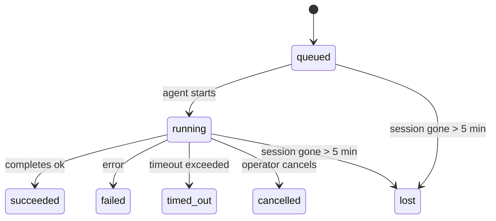

---
read_when:
    - Перегляд фонової роботи, що триває або нещодавно завершилася
    - Налагодження збоїв доставки для відокремлених запусків агента
    - Розуміння того, як фонові запуски пов’язані із сесіями, Cron і Heartbeat
sidebarTitle: Background tasks
summary: Відстеження фонових завдань для запусків ACP, субагентів, ізольованих завдань Cron і операцій CLI
title: Фонові завдання
x-i18n:
    generated_at: "2026-04-30T13:47:36Z"
    model: gpt-5.5
    provider: openai
    source_hash: 999653c9360323d5135e33193c76458cba8c288227de46a6217f1ccbed2a6d34
    source_path: automation/tasks.md
    workflow: 16
---

<Note>
Шукаєте планування? Див. [Автоматизація та завдання](/uk/automation), щоб вибрати правильний механізм. Ця сторінка є журналом активності для фонової роботи, а не планувальником.
</Note>

Фонові завдання відстежують роботу, яка виконується **поза вашою основною сесією розмови**: запуски ACP, породження субагентів, ізольовані виконання завдань Cron і операції, ініційовані з CLI.

Завдання **не** замінюють сесії, завдання Cron чи Heartbeat — це **журнал активності**, який записує, яка відокремлена робота відбулася, коли саме та чи була вона успішною.

<Note>
Не кожен запуск агента створює завдання. Кроки Heartbeat і звичайний інтерактивний чат не створюють. Усі виконання Cron, породження ACP, породження субагентів і CLI-команди агента створюють.
</Note>

## TL;DR

- Завдання — це **записи**, а не планувальники — Cron і Heartbeat вирішують, _коли_ виконується робота, а завдання відстежують, _що сталося_.
- ACP, субагенти, усі завдання Cron і CLI-операції створюють завдання. Кроки Heartbeat — ні.
- Кожне завдання проходить через `queued → running → terminal` (succeeded, failed, timed_out, cancelled або lost).
- Завдання Cron залишаються активними, доки середовище виконання Cron усе ще володіє завданням; якщо
  стан середовища виконання в пам’яті зник, обслуговування завдань спершу перевіряє сталу історію
  запусків Cron, перш ніж позначити завдання як втрачене.
- Завершення керується push-механізмом: відокремлена робота може сповістити напряму або пробудити
  сесію запитувача/Heartbeat після завершення, тому цикли опитування статусу
  зазвичай мають неправильну форму.
- Ізольовані запуски Cron і завершення субагентів найкращим можливим способом очищають відстежувані вкладки браузера/процеси для своєї дочірньої сесії перед фінальним обліком очищення.
- Ізольована доставка Cron пригнічує застарілі проміжні відповіді батьківської сесії, доки робота нащадків-субагентів ще завершується, і надає перевагу фінальному виводу нащадка, якщо він надходить до доставки.
- Сповіщення про завершення доставляються напряму в канал або ставляться в чергу до наступного Heartbeat.
- `openclaw tasks list` показує всі завдання; `openclaw tasks audit` виявляє проблеми.
- Термінальні записи зберігаються 7 днів, а потім автоматично видаляються.

## Швидкий старт

<Tabs>
  <Tab title="Список і фільтрація">
    ```bash
    # List all tasks (newest first)
    openclaw tasks list

    # Filter by runtime or status
    openclaw tasks list --runtime acp
    openclaw tasks list --status running
    ```

  </Tab>
  <Tab title="Перевірка">
    ```bash
    # Show details for a specific task (by ID, run ID, or session key)
    openclaw tasks show <lookup>
    ```
  </Tab>
  <Tab title="Скасування та сповіщення">
    ```bash
    # Cancel a running task (kills the child session)
    openclaw tasks cancel <lookup>

    # Change notification policy for a task
    openclaw tasks notify <lookup> state_changes
    ```

  </Tab>
  <Tab title="Аудит і обслуговування">
    ```bash
    # Run a health audit
    openclaw tasks audit

    # Preview or apply maintenance
    openclaw tasks maintenance
    openclaw tasks maintenance --apply
    ```

  </Tab>
  <Tab title="Потік завдань">
    ```bash
    # Inspect TaskFlow state
    openclaw tasks flow list
    openclaw tasks flow show <lookup>
    openclaw tasks flow cancel <lookup>
    ```
  </Tab>
</Tabs>

## Що створює завдання

| Джерело               | Тип середовища виконання | Коли створюється запис завдання                         | Типова політика сповіщень |
| --------------------- | ------------------------ | ------------------------------------------------------- | ------------------------- |
| Фонові запуски ACP    | `acp`                    | Породження дочірньої сесії ACP                          | `done_only`               |
| Оркестрація субагента | `subagent`               | Породження субагента через `sessions_spawn`             | `done_only`               |
| Завдання Cron (усі типи) | `cron`                 | Кожне виконання Cron (основна сесія та ізольоване)      | `silent`                  |
| CLI-операції          | `cli`                    | Команди `openclaw agent`, що виконуються через Gateway  | `silent`                  |
| Медіазавдання агента  | `cli`                    | Запуски `video_generate` на основі сесії                | `silent`                  |

<AccordionGroup>
  <Accordion title="Типові сповіщення для Cron і медіа">
    Завдання Cron основної сесії типово використовують політику сповіщень `silent` — вони створюють записи для відстеження, але не генерують сповіщення. Ізольовані завдання Cron також типово мають `silent`, але вони помітніші, бо виконуються у власній сесії.

    Запуски `video_generate` на основі сесії також використовують політику сповіщень `silent`. Вони все одно створюють записи завдань, але завершення передається назад до початкової сесії агента як внутрішнє пробудження, щоб агент міг сам написати подальше повідомлення й прикріпити готове відео. Якщо ви вмикаєте `tools.media.asyncCompletion.directSend`, асинхронні завершення `music_generate` і `video_generate` спершу пробують пряму доставку в канал, перш ніж повернутися до шляху пробудження сесії запитувача.

  </Accordion>
  <Accordion title="Обмежувач паралельних video_generate">
    Поки завдання `video_generate` на основі сесії ще активне, інструмент також діє як обмежувач: повторні виклики `video_generate` у тій самій сесії повертають статус активного завдання замість запуску другої паралельної генерації. Використовуйте `action: "status"`, коли потрібен явний запит прогресу/статусу з боку агента.
  </Accordion>
  <Accordion title="Що не створює завдання">
    - Кроки Heartbeat — основна сесія; див. [Heartbeat](/uk/gateway/heartbeat)
    - Звичайні інтерактивні кроки чату
    - Прямі відповіді `/command`

  </Accordion>
</AccordionGroup>

## Життєвий цикл завдання



| Статус      | Що він означає                                                            |
| ----------- | -------------------------------------------------------------------------- |
| `queued`    | Створено, очікує запуску агента                                            |
| `running`   | Крок агента активно виконується                                            |
| `succeeded` | Успішно завершено                                                          |
| `failed`    | Завершено з помилкою                                                       |
| `timed_out` | Перевищено налаштований тайм-аут                                           |
| `cancelled` | Зупинено оператором через `openclaw tasks cancel`                         |
| `lost`      | Середовище виконання втратило авторитетний опорний стан після 5-хвилинного пільгового періоду |

Переходи відбуваються автоматично — коли пов’язаний запуск агента завершується, статус завдання оновлюється відповідно.

Завершення запуску агента є авторитетним для активних записів завдань. Успішний відокремлений запуск фіналізується як `succeeded`, звичайні помилки запуску фіналізуються як `failed`, а результати тайм-ауту або переривання фіналізуються як `timed_out`. Якщо оператор уже скасував завдання або середовище виконання вже записало сильніший термінальний стан, як-от `failed`, `timed_out` чи `lost`, пізніший сигнал успіху не знижує цей термінальний статус.

`lost` враховує середовище виконання:

- Завдання ACP: зникли опорні метадані дочірньої сесії ACP.
- Завдання субагентів: опорна дочірня сесія зникла зі сховища цільового агента.
- Завдання Cron: середовище виконання Cron більше не відстежує завдання як активне, а стала
  історія запусків Cron не показує термінального результату для цього запуску. Офлайновий аудит CLI
  не вважає власний порожній внутрішньопроцесний стан середовища виконання Cron авторитетним.
- CLI-завдання: ізольовані завдання дочірніх сесій використовують дочірню сесію; CLI-завдання на основі чату
  натомість використовують живий контекст запуску, тому залишкові рядки
  сесій каналу/групи/прямого чату не підтримують їхню активність. Запуски
  `openclaw agent` на основі Gateway також фіналізуються за результатом запуску, тому завершені запуски
  не залишаються активними, доки прибиральник не позначить їх як `lost`.

## Доставка та сповіщення

Коли завдання досягає термінального стану, OpenClaw сповіщає вас. Є два шляхи доставки:

**Пряма доставка** — якщо завдання має цільовий канал (`requesterOrigin`), повідомлення про завершення надсилається безпосередньо в цей канал (Telegram, Discord, Slack тощо). Для завершень субагентів OpenClaw також зберігає прив’язану маршрутизацію потоку/теми, коли вона доступна, і може заповнити відсутні `to` / обліковий запис зі збереженого маршруту сесії запитувача (`lastChannel` / `lastTo` / `lastAccountId`), перш ніж відмовитися від прямої доставки.

**Доставка через чергу сесії** — якщо пряма доставка не вдається або origin не задано, оновлення ставиться в чергу як системна подія в сесії запитувача й з’являється під час наступного Heartbeat.

<Tip>
Завершення завдання запускає негайне пробудження Heartbeat, тож ви швидко бачите результат — не потрібно чекати наступного запланованого кроку Heartbeat.
</Tip>

Це означає, що звичайний робочий процес базується на push-механізмі: один раз запустіть відокремлену роботу, а потім дозвольте середовищу виконання пробудити вас або надіслати сповіщення після завершення. Опитуйте стан завдання лише тоді, коли потрібні налагодження, втручання або явний аудит.

### Політики сповіщень

Керуйте тим, скільки повідомлень отримуєте про кожне завдання:

| Політика              | Що доставляється                                                        |
| --------------------- | ----------------------------------------------------------------------- |
| `done_only` (типово)  | Лише термінальний стан (succeeded, failed тощо) — **це типове значення** |
| `state_changes`       | Кожен перехід стану та оновлення прогресу                               |
| `silent`              | Нічого                                                                  |

Змініть політику, поки завдання виконується:

```bash
openclaw tasks notify <lookup> state_changes
```

## Довідник CLI

<AccordionGroup>
  <Accordion title="tasks list">
    ```bash
    openclaw tasks list [--runtime <acp|subagent|cron|cli>] [--status <status>] [--json]
    ```

    Колонки виводу: ID завдання, тип, статус, доставка, ID запуску, дочірня сесія, підсумок.

  </Accordion>
  <Accordion title="tasks show">
    ```bash
    openclaw tasks show <lookup>
    ```

    Токен пошуку приймає ID завдання, ID запуску або ключ сесії. Показує повний запис, включно з часом, станом доставки, помилкою та термінальним підсумком.

  </Accordion>
  <Accordion title="tasks cancel">
    ```bash
    openclaw tasks cancel <lookup>
    ```

    Для завдань ACP і субагентів це завершує дочірню сесію. Для завдань, що відстежуються CLI, скасування записується в реєстрі завдань (окремого дескриптора дочірнього середовища виконання немає). Статус переходить у `cancelled`, а сповіщення про доставку надсилається, коли застосовно.

  </Accordion>
  <Accordion title="tasks notify">
    ```bash
    openclaw tasks notify <lookup> <done_only|state_changes|silent>
    ```
  </Accordion>
  <Accordion title="tasks audit">
    ```bash
    openclaw tasks audit [--json]
    ```

    Виявляє операційні проблеми. Знахідки також з’являються в `openclaw status`, коли виявлено проблеми.

    | Виявлення                 | Серйозність | Умова спрацювання                                                                                                      |
    | ------------------------- | ---------- | ------------------------------------------------------------------------------------------------------------ |
    | `stale_queued`            | warn       | У черзі понад 10 хвилин                                                                              |
    | `stale_running`           | error      | Виконується понад 30 хвилин                                                                             |
    | `lost`                    | warn/error | Власність над завданням із runtime-підтримкою зникла; збережені втрачені завдання попереджають до `cleanupAfter`, потім стають помилками |
    | `delivery_failed`         | warn       | Доставку не виконано, а політика сповіщень не є `silent`                                                            |
    | `missing_cleanup`         | warn       | Термінальне завдання без часової позначки очищення                                                                      |
    | `inconsistent_timestamps` | warn       | Порушення часової шкали (наприклад, завершено до початку)                                                        |

  </Accordion>
  <Accordion title="tasks maintenance">
    ```bash
    openclaw tasks maintenance [--json]
    openclaw tasks maintenance --apply [--json]
    ```

    Використовуйте це, щоб попередньо переглянути або застосувати узгодження, проставлення позначок очищення та обрізання для завдань і стану Task Flow.

    Узгодження враховує runtime:

    - Завдання ACP/subagent перевіряють свій базовий дочірній сеанс.
    - Завдання subagent, дочірній сеанс яких має tombstone відновлення після перезапуску, позначаються як втрачені, а не обробляються як відновлювані базові сеанси.
    - Завдання Cron перевіряють, чи cron runtime досі володіє завданням, потім відновлюють термінальний стан із збережених журналів запусків cron/стану завдання, перш ніж повернутися до `lost`. Лише процес Gateway є авторитетним для in-memory набору активних завдань cron; офлайн-аудит CLI використовує стійку історію, але не позначає завдання cron втраченим лише тому, що цей локальний Set порожній.
    - CLI-завдання, підкріплені чатом, перевіряють власний live-контекст виконання, а не лише рядок сеансу чату.

    Очищення після завершення також враховує runtime:

    - Завершення subagent за принципом best-effort закриває відстежувані вкладки браузера/процеси для дочірнього сеансу, перш ніж продовжиться очищення оголошення.
    - Завершення ізольованого cron за принципом best-effort закриває відстежувані вкладки браузера/процеси для сеансу cron, перш ніж запуск повністю розірветься.
    - Доставка ізольованого cron за потреби очікує на подальші дії descendant subagent і приглушує застарілий текст підтвердження батьківського завдання замість його оголошення.
    - Доставка завершення subagent віддає перевагу найновішому видимому тексту assistant; якщо він порожній, повертається до очищеного найновішого тексту tool/toolResult, а запуски викликів інструментів лише з timeout можуть згортатися до короткого підсумку часткового прогресу. Термінальні невдалі запуски оголошують стан помилки без повторного відтворення захопленого тексту відповіді.
    - Помилки очищення не маскують реальний результат завдання.

  </Accordion>
  <Accordion title="tasks flow list | show | cancel">
    ```bash
    openclaw tasks flow list [--status <status>] [--json]
    openclaw tasks flow show <lookup> [--json]
    openclaw tasks flow cancel <lookup>
    ```

    Використовуйте ці команди, коли вас цікавить оркеструвальний Task Flow, а не один окремий запис фонового завдання.

  </Accordion>
</AccordionGroup>

## Дошка завдань чату (`/tasks`)

Використовуйте `/tasks` у будь-якому сеансі чату, щоб побачити фонові завдання, пов'язані з цим сеансом. Дошка показує активні та нещодавно завершені завдання з runtime, станом, часом і подробицями прогресу або помилки.

Коли поточний сеанс не має видимих пов'язаних завдань, `/tasks` повертається до локальних для агента лічильників завдань, щоб ви все одно отримали огляд без розкриття подробиць інших сеансів.

Для повного операторського журналу використовуйте CLI: `openclaw tasks list`.

## Інтеграція стану (навантаження завданнями)

`openclaw status` містить короткий підсумок завдань:

```
Tasks: 3 queued · 2 running · 1 issues
```

Підсумок повідомляє:

- **active** — кількість `queued` + `running`
- **failures** — кількість `failed` + `timed_out` + `lost`
- **byRuntime** — розбивка за `acp`, `subagent`, `cron`, `cli`

І `/status`, і інструмент `session_status` використовують знімок завдань з урахуванням очищення: активні завдання мають пріоритет, застарілі завершені рядки приховуються, а нещодавні помилки показуються лише тоді, коли не лишилося активної роботи. Це зосереджує картку стану на тому, що важливо саме зараз.

## Зберігання й обслуговування

### Де зберігаються завдання

Записи завдань зберігаються в SQLite за адресою:

```
$OPENCLAW_STATE_DIR/tasks/runs.sqlite
```

Реєстр завантажується в пам'ять під час запуску gateway і синхронізує записи в SQLite для довговічності між перезапусками.
Gateway утримує журнал випереджувального запису SQLite в обмежених межах, використовуючи стандартний поріг
autocheckpoint SQLite, а також періодичні й завершальні контрольні точки `TRUNCATE`.

### Автоматичне обслуговування

Sweeper запускається кожні **60 секунд** і виконує чотири дії:

<Steps>
  <Step title="Reconciliation">
    Перевіряє, чи активні завдання досі мають авторитетну runtime-підтримку. Завдання ACP/subagent використовують стан дочірнього сеансу, завдання cron використовують власність активного завдання, а CLI-завдання, підкріплені чатом, використовують власний контекст виконання. Якщо цей базовий стан зник більш ніж на 5 хвилин, завдання позначається як `lost`.
  </Step>
  <Step title="ACP session repair">
    Закриває термінальні або осиротілі одноразові ACP-сеанси, що належать батьківському сеансу, і закриває застарілі термінальні або осиротілі persistent ACP-сеанси лише тоді, коли не лишається активної прив'язки розмови.
  </Step>
  <Step title="Cleanup stamping">
    Встановлює часову позначку `cleanupAfter` для термінальних завдань (endedAt + 7 днів). Під час утримання втрачені завдання все ще відображаються в аудиті як попередження; після завершення строку `cleanupAfter` або коли метадані очищення відсутні, вони стають помилками.
  </Step>
  <Step title="Pruning">
    Видаляє записи після їхньої дати `cleanupAfter`.
  </Step>
</Steps>

<Note>
**Утримання:** записи термінальних завдань зберігаються **7 днів**, а потім автоматично обрізаються. Конфігурація не потрібна.
</Note>

## Як завдання пов'язані з іншими системами

<AccordionGroup>
  <Accordion title="Tasks and Task Flow">
    [Task Flow](/uk/automation/taskflow) — це шар оркестрації потоків над фоновими завданнями. Один потік може координувати кілька завдань протягом свого життєвого циклу, використовуючи керовані або дзеркальні режими синхронізації. Використовуйте `openclaw tasks`, щоб інспектувати окремі записи завдань, і `openclaw tasks flow`, щоб інспектувати оркеструвальний потік.

    Докладніше див. [Task Flow](/uk/automation/taskflow).

  </Accordion>
  <Accordion title="Tasks and cron">
    **Визначення** cron-завдання зберігається в `~/.openclaw/cron/jobs.json`; runtime-стан виконання зберігається поруч у `~/.openclaw/cron/jobs-state.json`. **Кожне** виконання cron створює запис завдання — як main-session, так і ізольоване. Main-session cron-завдання за замовчуванням мають політику сповіщень `silent`, тож вони відстежуються без створення сповіщень.

    Див. [Cron Jobs](/uk/automation/cron-jobs).

  </Accordion>
  <Accordion title="Tasks and heartbeat">
    Запуски Heartbeat є ходами main-session — вони не створюють записи завдань. Коли завдання завершується, воно може запустити пробудження Heartbeat, щоб ви швидко побачили результат.

    Див. [Heartbeat](/uk/gateway/heartbeat).

  </Accordion>
  <Accordion title="Tasks and sessions">
    Завдання може посилатися на `childSessionKey` (де виконується робота) і `requesterSessionKey` (хто його запустив). Сеанси — це контекст розмови; завдання — це відстеження активності поверх нього.
  </Accordion>
  <Accordion title="Tasks and agent runs">
    `runId` завдання пов'язує його з виконанням агента, який виконує роботу. Події життєвого циклу агента (початок, завершення, помилка) автоматично оновлюють стан завдання — вам не потрібно керувати життєвим циклом вручну.
  </Accordion>
</AccordionGroup>

## Пов'язане

- [Automation & Tasks](/uk/automation) — усі механізми автоматизації наочно
- [CLI: Tasks](/uk/cli/tasks) — довідник команд CLI
- [Heartbeat](/uk/gateway/heartbeat) — періодичні ходи main-session
- [Scheduled Tasks](/uk/automation/cron-jobs) — планування фонової роботи
- [Task Flow](/uk/automation/taskflow) — оркестрація потоків над завданнями
