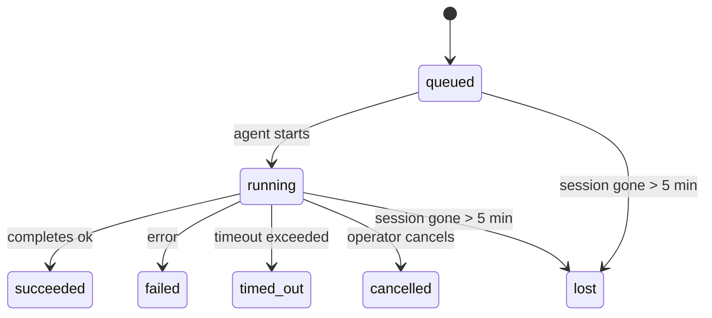

---
read_when:
    - Перевірка фонової роботи, що триває або нещодавно завершилася
    - Налагодження збоїв доставки для від’єднаних запусків агента
    - Розуміння того, як фонові запуски пов’язані із сеансами, Cron і Heartbeat
sidebarTitle: Background tasks
summary: Відстеження фонових завдань для запусків ACP, підагентів, ізольованих завдань cron і операцій CLI
title: Фонові завдання
x-i18n:
    generated_at: "2026-06-27T17:08:55Z"
    model: gpt-5.5
    postprocess_version: locale-links-v1
    provider: openai
    source_hash: 4a630a52d0d6bfd387a37415dd63fc4bfbce23f99eaa8cb780c3d6f8913675fd
    source_path: automation/tasks.md
    workflow: 16
---

<Note>
Шукаєте планування? Див. [Автоматизація](/uk/automation), щоб вибрати правильний механізм. Ця сторінка є журналом активності для фонової роботи, а не планувальником.
</Note>

Фонові завдання відстежують роботу, що виконується **поза вашим основним сеансом розмови**: запуски ACP, створення підagentів, ізольовані виконання Cron-завдань і операції, ініційовані з CLI.

Завдання **не** замінюють сеанси, Cron-завдання або Heartbeat - вони є **журналом активності**, який записує, яка відокремлена робота відбулася, коли саме та чи була вона успішною.

<Note>
Не кожен запуск агента створює завдання. Heartbeat-кроки та звичайний інтерактивний чат не створюють. Усі виконання Cron, створення ACP, створення підagentів і команди агента з CLI створюють.
</Note>

## Коротко

- Завдання - це **записи**, а не планувальники: Cron і Heartbeat вирішують, _коли_ виконується робота, а завдання відстежують, _що сталося_.
- ACP, підagentи, усі Cron-завдання та операції CLI створюють завдання. Heartbeat-кроки не створюють.
- Кожне завдання проходить через `queued → running → terminal` (succeeded, failed, timed_out, cancelled або lost).
- Cron-завдання залишаються активними, доки Cron-середовище виконання все ще володіє завданням; якщо
  стан середовища виконання в пам'яті зник, обслуговування завдань спершу перевіряє довговічну історію
  запусків Cron, перш ніж позначити завдання як втрачене.
- Завершення керується push-механізмом: відокремлена робота може сповіщати напряму або пробуджувати
  сеанс запитувача/Heartbeat після завершення, тому цикли опитування статусу
  зазвичай є неправильним підходом.
- Ізольовані Cron-запуски та завершення підagentів у режимі best-effort очищують відстежувані вкладки браузера/процеси для свого дочірнього сеансу перед фінальним обліком очищення.
- Ізольована доставка Cron пригнічує застарілі проміжні відповіді батьківського агента, доки робота нащадків-підagentів ще завершується, і віддає перевагу фінальному виводу нащадка, якщо він надходить до доставки.
- Сповіщення про завершення доставляються безпосередньо в канал або ставляться в чергу для наступного Heartbeat.
- `openclaw tasks list` показує всі завдання; `openclaw tasks audit` виявляє проблеми.
- Термінальні записи зберігаються 7 днів, а потім автоматично очищуються.

## Швидкий старт

<Tabs>
  <Tab title="Список і фільтрація">
    ```bash
    # List all tasks (newest first)
    openclaw tasks list

    # Filter by runtime or status
    openclaw tasks list --runtime acp
    openclaw tasks list --status running
    ```

  </Tab>
  <Tab title="Перегляд">
    ```bash
    # Show details for a specific task (by ID, run ID, or session key)
    openclaw tasks show <lookup>
    ```
  </Tab>
  <Tab title="Скасування та сповіщення">
    ```bash
    # Cancel a running task (kills the child session)
    openclaw tasks cancel <lookup>

    # Change notification policy for a task
    openclaw tasks notify <lookup> state_changes
    ```

  </Tab>
  <Tab title="Аудит і обслуговування">
    ```bash
    # Run a health audit
    openclaw tasks audit

    # Preview or apply maintenance
    openclaw tasks maintenance
    openclaw tasks maintenance --apply
    ```

  </Tab>
  <Tab title="Потік завдань">
    ```bash
    # Inspect TaskFlow state
    openclaw tasks flow list
    openclaw tasks flow show <lookup>
    openclaw tasks flow cancel <lookup>
    ```
  </Tab>
</Tabs>

## Що створює завдання

| Джерело               | Тип середовища виконання | Коли створюється запис завдання                                     | Типова політика сповіщень |
| --------------------- | ------------------------ | ------------------------------------------------------------------- | ------------------------- |
| Фонові запуски ACP    | `acp`                    | Створення дочірнього сеансу ACP                                     | `done_only`               |
| Оркестрація підagentів | `subagent`               | Створення підagentа через `sessions_spawn`                          | `done_only`               |
| Cron-завдання (усі типи) | `cron`                 | Кожне виконання Cron (в основному сеансі та ізольоване)             | `silent`                  |
| Операції CLI          | `cli`                    | Команди `openclaw agent`, що виконуються через Gateway              | `silent`                  |
| Медіазавдання агента  | `cli`                    | Сеансові запуски `image_generate`/`music_generate`/`video_generate` | `silent`                  |

<AccordionGroup>
  <Accordion title="Типові сповіщення для Cron і медіа">
    Cron-завдання основного сеансу типово використовують політику сповіщень `silent` - вони створюють записи для відстеження, але не генерують сповіщень. Ізольовані Cron-завдання також типово мають `silent`, але помітніші, бо виконуються у власному сеансі.

    Сеансові запуски `image_generate`, `music_generate` і `video_generate` також використовують політику сповіщень `silent`. Вони все одно створюють записи завдань, але завершення передається назад до початкового сеансу агента як внутрішнє пробудження, щоб агент міг сам написати наступне повідомлення та прикріпити готовий медіафайл. Агент-запитувач дотримується свого звичайного контракту видимої відповіді: автоматична фінальна відповідь, якщо налаштовано, або `message(action="send")` плюс `NO_REPLY`, коли сеанс вимагає відповідей через інструмент повідомлень. Якщо сеанс запитувача більше не активний або його активне пробудження не вдається, а агент завершення пропускає частину або всі згенеровані медіафайли, OpenClaw надсилає ідемпотентний прямий fallback лише з відсутніми медіафайлами до початкової цілі каналу.

  </Accordion>
  <Accordion title="Запобіжник для одночасної генерації медіа">
    Поки сеансове завдання генерації медіа все ще активне, медіаінструменти також діють як запобіжники від випадкових повторів. Повторні виклики `image_generate` для того самого prompt повертають статус відповідного активного завдання, тоді як інший prompt зображення може запустити власне завдання. Виклики `music_generate` і `video_generate` все одно повертають статус активного завдання для цього сеансу замість запуску другої одночасної генерації. Використовуйте `action: "status"`, коли потрібен явний пошук прогресу/статусу з боку агента.
  </Accordion>
  <Accordion title="Що не створює завдань">
    - Heartbeat-кроки - основний сеанс; див. [Heartbeat](/uk/gateway/heartbeat)
    - Звичайні інтерактивні кроки чату
    - Прямі відповіді `/command`

  </Accordion>
</AccordionGroup>

## Життєвий цикл завдання



| Статус      | Що це означає                                                              |
| ----------- | -------------------------------------------------------------------------- |
| `queued`    | Створено, очікує запуску агента                                            |
| `running`   | Крок агента активно виконується                                            |
| `succeeded` | Успішно завершено                                                          |
| `failed`    | Завершено з помилкою                                                       |
| `timed_out` | Перевищено налаштований тайм-аут                                           |
| `cancelled` | Зупинено оператором через `openclaw tasks cancel`                         |
| `lost`      | Середовище виконання втратило авторитетний базовий стан після 5-хвилинного пільгового періоду |

Переходи відбуваються автоматично: коли пов'язаний запуск агента завершується, статус завдання оновлюється відповідно.

Завершення запуску агента є авторитетним для активних записів завдань. Успішний відокремлений запуск фіналізується як `succeeded`, звичайні помилки запуску фіналізуються як `failed`, а тайм-аут або переривання фіналізуються як `timed_out`. Якщо оператор уже скасував завдання або середовище виконання вже записало сильніший термінальний стан, як-от `failed`, `timed_out` чи `lost`, пізніший сигнал успіху не знижує цей термінальний статус.

`lost` враховує середовище виконання:

- ACP-завдання: зникли базові метадані дочірнього сеансу ACP.
- Завдання підagentів: базовий дочірній сеанс зник зі сховища цільового агента.
- Cron-завдання: Cron-середовище виконання більше не відстежує завдання як активне, а довговічна
  історія запусків Cron не показує термінального результату для цього запуску. Офлайн-аудит CLI
  не вважає власний порожній внутрішньопроцесний стан Cron-середовища виконання авторитетним.
- CLI-завдання: завдання з run id/source id використовують живий контекст запуску, тому
  залишкові рядки дочірніх сеансів або чат-сеансів не підтримують їх активними після зникнення
  запуску, яким володіє Gateway. Застарілі CLI-завдання без ідентичності запуску все ще
  fallback-ять до дочірнього сеансу. Запуски `openclaw agent`, підтримані Gateway, також фіналізуються
  з результату свого запуску, тому завершені запуски не залишаються активними, доки sweeper
  позначить їх як `lost`.

## Доставка та сповіщення

Коли завдання досягає термінального стану, OpenClaw сповіщає вас. Є два шляхи доставки:

**Пряма доставка** - якщо завдання має ціль каналу (`requesterOrigin`), повідомлення про завершення надсилається безпосередньо в цей канал (Telegram, Discord, Slack тощо). Завершення групових і канальних завдань натомість маршрутизуються через сеанс запитувача, щоб батьківський агент міг написати видиму відповідь. Для завершень підagentів OpenClaw також зберігає прив'язану маршрутизацію thread/topic, коли вона доступна, і може заповнити відсутні `to` / account із збереженого маршруту сеансу запитувача (`lastChannel` / `lastTo` / `lastAccountId`), перш ніж відмовитися від прямої доставки.

**Доставка через чергу сеансу** - якщо пряма доставка не вдається або origin не задано, оновлення ставиться в чергу як системна подія в сеансі запитувача та з'являється під час наступного Heartbeat.

<Tip>
Завершення завдання запускає негайне пробудження Heartbeat, тому ви швидко бачите результат - вам не потрібно чекати наступного запланованого Heartbeat-тика.
</Tip>

Це означає, що звичайний робочий процес базується на push-підході: один раз запустіть відокремлену роботу, а потім дозвольте середовищу виконання пробудити або сповістити вас після завершення. Опитуйте стан завдання лише тоді, коли потрібні налагодження, втручання або явний аудит.

### Політики сповіщень

Керуйте тим, скільки повідомлень ви отримуєте про кожне завдання:

| Політика             | Що доставляється                                                       |
| -------------------- | ---------------------------------------------------------------------- |
| `done_only` (типово) | Лише термінальний стан (succeeded, failed тощо) - **це типово**        |
| `state_changes`      | Кожен перехід стану та оновлення прогресу                              |
| `silent`             | Взагалі нічого                                                         |

Змініть політику, поки завдання виконується:

```bash
openclaw tasks notify <lookup> state_changes
```

## Довідник CLI

<AccordionGroup>
  <Accordion title="tasks list">
    ```bash
    openclaw tasks list [--runtime <acp|subagent|cron|cli>] [--status <status>] [--json]
    ```

    Стовпці виводу: ID завдання, тип, статус, доставка, ID запуску, дочірній сеанс, підсумок.

  </Accordion>
  <Accordion title="tasks show">
    ```bash
    openclaw tasks show <lookup>
    ```

    Токен lookup приймає ID завдання, ID запуску або ключ сеансу. Показує повний запис, включно з часом, станом доставки, помилкою та термінальним підсумком.

  </Accordion>
  <Accordion title="tasks cancel">
    ```bash
    openclaw tasks cancel <lookup>
    ```

    Для ACP і завдань підagentів це завершує дочірній сеанс. Для завдань, відстежуваних CLI, скасування записується в реєстрі завдань (окремого дескриптора дочірнього середовища виконання немає). Статус переходить у `cancelled`, і сповіщення про доставку надсилається, коли це застосовно.

  </Accordion>
  <Accordion title="tasks notify">
    ```bash
    openclaw tasks notify <lookup> <done_only|state_changes|silent>
    ```
  </Accordion>
  <Accordion title="tasks audit">
    ```bash
    openclaw tasks audit [--json]
    ```

    Виявляє операційні проблеми. Знахідки також з'являються в `openclaw status`, коли проблеми виявлено.

    | Виявлення                | Серйозність | Тригер                                                                                                                         |
    | ------------------------- | ----------- | ------------------------------------------------------------------------------------------------------------------------------ |
    | `stale_queued`            | warn        | У черзі понад 10 хвилин                                                                                                        |
    | `stale_running`           | error       | Виконується понад 30 хвилин                                                                                                    |
    | `lost`                    | warn/error  | Підтримуване середовищем виконання володіння завданням зникло; збережені втрачені завдання попереджають до `cleanupAfter`, потім стають помилками |
    | `delivery_failed`         | warn        | Доставку не виконано, а політика сповіщень не є `silent`                                                                       |
    | `missing_cleanup`         | warn        | Термінальне завдання без позначки часу очищення                                                                                |
    | `inconsistent_timestamps` | warn        | Порушення часової шкали (наприклад, завершено до початку)                                                                      |

  </Accordion>
  <Accordion title="обслуговування tasks">
    ```bash
    openclaw tasks maintenance [--json]
    openclaw tasks maintenance --apply [--json]
    ```

    Використовуйте це, щоб попередньо переглянути або застосувати узгодження, проставлення позначок очищення та обрізання для завдань, стану Task Flow і застарілих рядків реєстру сеансів запуску Cron.

    Узгодження враховує середовище виконання:

    - Завдання ACP/субагента перевіряють свій базовий дочірній сеанс.
    - Завдання субагента, чий дочірній сеанс має tombstone відновлення після перезапуску, позначаються як втрачені, а не обробляються як відновлювані базові сеанси.
    - Завдання Cron перевіряють, чи середовище виконання Cron досі володіє завданням, потім відновлюють термінальний статус із збережених журналів запуску Cron/стану завдання, перш ніж перейти до `lost`. Лише процес Gateway є авторитетним для набору активних завдань Cron у пам’яті; офлайн-аудит CLI використовує довговічну історію, але не позначає завдання Cron як втрачене лише через те, що цей локальний Set порожній.
    - Завдання CLI з ідентичністю запуску перевіряють власний живий контекст запуску, а не лише рядки дочірнього сеансу або сеансу чату.

    Очищення після завершення також враховує середовище виконання:

    - Завершення субагента за принципом найкращого зусилля закриває відстежувані вкладки браузера/процеси для дочірнього сеансу, перш ніж очищення оголошення продовжиться.
    - Завершення ізольованого Cron за принципом найкращого зусилля закриває відстежувані вкладки браузера/процеси для сеансу Cron, перш ніж запуск повністю завершиться.
    - Доставка ізольованого Cron за потреби очікує на подальші дії нащадка-субагента та пригнічує застарілий текст підтвердження батьківського завдання, замість того щоб його оголошувати.
    - Доставка завершення субагента використовує лише останній видимий текст асистента з дочірнього сеансу. Вивід tool/toolResult не підвищується до тексту результату дочірнього сеансу. Термінальні невдалі запуски оголошують статус помилки без повторного відтворення захопленого тексту відповіді.
    - Помилки очищення не маскують реальний результат завдання.

    Під час застосування обслуговування OpenClaw також видаляє застарілі рядки реєстру сеансів `cron:<jobId>:run:<uuid>`, старші за 7 днів, зберігаючи рядки для завдань Cron, що виконуються зараз, і не торкаючись рядків сеансів, не пов’язаних із Cron.

  </Accordion>
  <Accordion title="tasks flow list | show | cancel">
    ```bash
    openclaw tasks flow list [--status <status>] [--json]
    openclaw tasks flow show <lookup> [--json]
    openclaw tasks flow cancel <lookup>
    ```

    Використовуйте їх, коли вас цікавить оркеструвальний Task Flow, а не один окремий запис фонового завдання.

  </Accordion>
</AccordionGroup>

## Дошка завдань чату (`/tasks`)

Використовуйте `/tasks` у будь-якому сеансі чату, щоб побачити фонові завдання, пов’язані з цим сеансом. Дошка показує активні та нещодавно завершені завдання із середовищем виконання, статусом, часом, а також деталями прогресу або помилки.

Коли поточний сеанс не має видимих пов’язаних завдань, `/tasks` переходить до локальних для агента лічильників завдань, тож ви все одно отримуєте огляд без витоку деталей інших сеансів.

Для повного журналу оператора використовуйте CLI: `openclaw tasks list`.

## Інтеграція статусу (навантаження завдань)

`openclaw status` містить короткий підсумок завдань:

```
Tasks: 3 queued · 2 running · 1 issues
```

Підсумок повідомляє:

- **active** - кількість `queued` + `running`
- **failures** - кількість `failed` + `timed_out` + `lost`
- **byRuntime** - розподіл за `acp`, `subagent`, `cron`, `cli`

І `/status`, і інструмент `session_status` використовують знімок завдань з урахуванням очищення: активні завдання мають пріоритет, застарілі завершені рядки приховуються, а нещодавні помилки показуються лише тоді, коли активної роботи не залишилося. Це утримує картку статусу зосередженою на тому, що важливо зараз.

## Зберігання та обслуговування

### Де зберігаються завдання

Записи завдань зберігаються в SQLite за адресою:

```
$OPENCLAW_STATE_DIR/tasks/runs.sqlite
```

Реєстр завантажується в пам’ять під час запуску Gateway і синхронізує записи в SQLite для довговічності між перезапусками.
Gateway утримує журнал попереднього запису SQLite в обмежених межах, використовуючи типовий поріг
автоматичного checkpoint у SQLite плюс періодичні `PASSIVE` checkpoints. Завершення роботи та
явні checkpoints обслуговування досі використовують `TRUNCATE`, щоб звичайні закриття могли
звільняти простір WAL, не змушуючи фоновий sweeper чекати на активних читачів.

### Автоматичне обслуговування

Sweeper запускається кожні **60 секунд** і обробляє чотири речі:

<Steps>
  <Step title="Узгодження">
    Перевіряє, чи активні завдання досі мають авторитетну підтримку середовища виконання. Завдання ACP/субагента використовують стан дочірнього сеансу, завдання Cron використовують володіння активним завданням, а завдання CLI з ідентичністю запуску використовують власний контекст запуску. Якщо цей базовий стан зник більш ніж на 5 хвилин, завдання позначається як `lost`.
  </Step>
  <Step title="Відновлення сеансів ACP">
    Закриває термінальні або осиротілі одноразові сеанси ACP, що належать батьківському сеансу, і закриває застарілі термінальні або осиротілі постійні сеанси ACP лише тоді, коли не залишилося активного прив’язування розмови.
  </Step>
  <Step title="Проставлення позначок очищення">
    Встановлює позначку часу `cleanupAfter` для термінальних завдань (endedAt + 7 днів). Під час утримання втрачені завдання все ще з’являються в аудиті як попередження; після завершення строку `cleanupAfter` або коли метадані очищення відсутні, вони стають помилками.
  </Step>
  <Step title="Обрізання">
    Видаляє записи після їхньої дати `cleanupAfter`.
  </Step>
</Steps>

<Note>
**Утримання:** записи термінальних завдань зберігаються **7 днів**, а потім автоматично обрізаються. Налаштування не потрібне.
</Note>

## Як завдання пов’язані з іншими системами

<AccordionGroup>
  <Accordion title="Завдання і Task Flow">
    [Task Flow](/uk/automation/taskflow) — це шар оркестрації потоків над фоновими завданнями. Один потік може координувати кілька завдань протягом свого життєвого циклу, використовуючи керовані або дзеркальні режими синхронізації. Використовуйте `openclaw tasks`, щоб перевіряти окремі записи завдань, і `openclaw tasks flow`, щоб перевіряти оркеструвальний потік.

    Докладніше див. [Task Flow](/uk/automation/taskflow).

  </Accordion>
  <Accordion title="Завдання і cron">
    Визначення завдань Cron, стан виконання середовища виконання та історія запусків зберігаються у спільній базі даних стану SQLite OpenClaw. **Кожне** виконання Cron створює запис завдання — як у головному сеансі, так і в ізольованому. Завдання Cron головного сеансу за замовчуванням використовують політику сповіщень `silent`, щоб вони відстежувалися без створення сповіщень.

    Див. [Завдання Cron](/uk/automation/cron-jobs).

  </Accordion>
  <Accordion title="Завдання і heartbeat">
    Запуски Heartbeat є ходами головного сеансу — вони не створюють записи завдань. Коли завдання завершується, воно може запустити пробудження Heartbeat, щоб ви швидко побачили результат.

    Див. [Heartbeat](/uk/gateway/heartbeat).

  </Accordion>
  <Accordion title="Завдання і сеанси">
    Завдання може посилатися на `childSessionKey` (де виконується робота) і `requesterSessionKey` (хто його запустив). Його `agentId` ідентифікує агента, який виконує роботу, тоді як поля запитувача й власника зберігають контекст запуску та керування. Сеанси — це контекст розмови; завдання — відстеження активності поверх нього.
  </Accordion>
  <Accordion title="Завдання і запуски агента">
    `runId` завдання пов’язує його із запуском агента, який виконує роботу. Події життєвого циклу агента (початок, завершення, помилка) автоматично оновлюють статус завдання — вам не потрібно керувати життєвим циклом вручну.
  </Accordion>
</AccordionGroup>

## Пов’язане

- [Автоматизація](/uk/automation) - усі механізми автоматизації стисло
- [CLI: Завдання](/uk/cli/tasks) - довідник команд CLI
- [Heartbeat](/uk/gateway/heartbeat) - періодичні ходи головного сеансу
- [Заплановані завдання](/uk/automation/cron-jobs) - планування фонової роботи
- [Task Flow](/uk/automation/taskflow) - оркестрація потоків над завданнями
