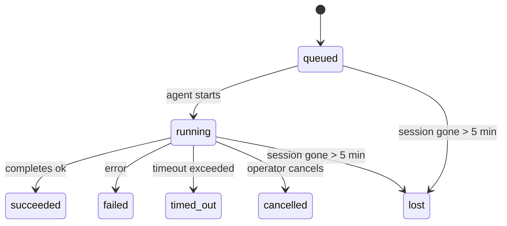

---
read_when:
    - Перегляд фонової роботи, що виконується або нещодавно завершилася
    - Налагодження збоїв доставки для від’єднаних запусків агентів
    - Розуміння того, як фонові запуски пов’язані із сеансами, Cron і Heartbeat
sidebarTitle: Background tasks
summary: Відстеження фонових завдань для запусків ACP, субагентів, ізольованих завдань Cron та операцій CLI
title: Фонові завдання
x-i18n:
    generated_at: "2026-04-28T20:11:28Z"
    model: gpt-5.5
    provider: openai
    source_hash: ff4f22f98148b01c1b044a5213a5946eac8c5d763f0d22c992e6a4a2297bc308
    source_path: automation/tasks.md
    workflow: 16
---

<Note>
Шукаєте планування? Див. [Автоматизація та завдання](/uk/automation), щоб вибрати правильний механізм. Ця сторінка є журналом активності для фонової роботи, а не планувальником.
</Note>

Фонові завдання відстежують роботу, яка виконується **поза основним сеансом розмови**: запуски ACP, створення субагентів, ізольовані виконання завдань cron і операції, ініційовані CLI.

Завдання **не** замінюють сеанси, завдання cron чи heartbeats — вони є **журналом активності**, який записує, яка відокремлена робота відбулася, коли саме та чи була вона успішною.

<Note>
Не кожен запуск агента створює завдання. Heartbeat-ходи та звичайний інтерактивний чат цього не роблять. Усі виконання cron, створення ACP, створення субагентів і команди агента CLI створюють завдання.
</Note>

## Коротко

- Завдання — це **записи**, а не планувальники: cron і heartbeat вирішують, _коли_ виконується робота, а завдання відстежують, _що сталося_.
- ACP, субагенти, усі завдання cron і операції CLI створюють завдання. Heartbeat-ходи цього не роблять.
- Кожне завдання проходить через `queued → running → terminal` (succeeded, failed, timed_out, cancelled або lost).
- Завдання Cron залишаються активними, доки середовище виконання cron усе ще володіє завданням; якщо
  стан середовища виконання в пам’яті зник, обслуговування завдань спершу перевіряє збережену історію запусків cron,
  перш ніж позначити завдання як втрачене.
- Завершення працює через push: відокремлена робота може сповіщати напряму або пробуджувати
  сеанс/heartbeat запитувача після завершення, тому цикли опитування статусу
  зазвичай мають неправильну форму.
- Ізольовані запуски cron і завершення субагентів за можливості очищають відстежувані вкладки браузера/процеси для свого дочірнього сеансу перед фінальним службовим очищенням.
- Ізольована доставка cron пригнічує застарілі проміжні відповіді батьківського сеансу, поки робота нащадків-субагентів ще завершується, і надає перевагу фінальному виводу нащадка, якщо він надходить до доставки.
- Сповіщення про завершення доставляються напряму в канал або ставляться в чергу до наступного heartbeat.
- `openclaw tasks list` показує всі завдання; `openclaw tasks audit` виявляє проблеми.
- Термінальні записи зберігаються 7 днів, а потім автоматично очищаються.

## Швидкий старт

<Tabs>
  <Tab title="List and filter">
    ```bash
    # List all tasks (newest first)
    openclaw tasks list

    # Filter by runtime or status
    openclaw tasks list --runtime acp
    openclaw tasks list --status running
    ```

  </Tab>
  <Tab title="Inspect">
    ```bash
    # Show details for a specific task (by ID, run ID, or session key)
    openclaw tasks show <lookup>
    ```
  </Tab>
  <Tab title="Cancel and notify">
    ```bash
    # Cancel a running task (kills the child session)
    openclaw tasks cancel <lookup>

    # Change notification policy for a task
    openclaw tasks notify <lookup> state_changes
    ```

  </Tab>
  <Tab title="Audit and maintenance">
    ```bash
    # Run a health audit
    openclaw tasks audit

    # Preview or apply maintenance
    openclaw tasks maintenance
    openclaw tasks maintenance --apply
    ```

  </Tab>
  <Tab title="Task flow">
    ```bash
    # Inspect TaskFlow state
    openclaw tasks flow list
    openclaw tasks flow show <lookup>
    openclaw tasks flow cancel <lookup>
    ```
  </Tab>
</Tabs>

## Що створює завдання

| Джерело               | Тип середовища виконання | Коли створюється запис завдання                         | Типова політика сповіщень |
| ---------------------- | ------------ | ------------------------------------------------------ | --------------------- |
| Фонові запуски ACP    | `acp`        | Створення дочірнього сеансу ACP                        | `done_only`           |
| Оркестрація субагентів | `subagent`   | Створення субагента через `sessions_spawn`             | `done_only`           |
| Завдання Cron (усі типи) | `cron`       | Кожне виконання cron (у головному сеансі та ізольоване) | `silent`              |
| Операції CLI          | `cli`        | Команди `openclaw agent`, що виконуються через Gateway | `silent`              |
| Медіазавдання агента  | `cli`        | Запуски `video_generate`, прив’язані до сеансу         | `silent`              |

<AccordionGroup>
  <Accordion title="Notify defaults for cron and media">
    Завдання cron у головному сеансі типово використовують політику сповіщень `silent` — вони створюють записи для відстеження, але не генерують сповіщень. Ізольовані завдання cron також типово мають `silent`, але є помітнішими, оскільки виконуються у власному сеансі.

    Запуски `video_generate`, прив’язані до сеансу, також використовують політику сповіщень `silent`. Вони все одно створюють записи завдань, але завершення повертається до початкового сеансу агента як внутрішнє пробудження, щоб агент міг сам написати наступне повідомлення й прикріпити готове відео. Якщо ввімкнути `tools.media.asyncCompletion.directSend`, асинхронні завершення `music_generate` і `video_generate` спершу намагаються доставити результат напряму в канал, перш ніж перейти до шляху пробудження сеансу запитувача.

  </Accordion>
  <Accordion title="Concurrent video_generate guardrail">
    Поки завдання `video_generate`, прив’язане до сеансу, ще активне, інструмент також діє як запобіжник: повторні виклики `video_generate` у тому самому сеансі повертають статус активного завдання замість запуску другої паралельної генерації. Використовуйте `action: "status"`, коли потрібен явний запит прогресу/статусу з боку агента.
  </Accordion>
  <Accordion title="What does not create tasks">
    - Heartbeat-ходи — у головному сеансі; див. [Heartbeat](/uk/gateway/heartbeat)
    - Звичайні інтерактивні ходи чату
    - Прямі відповіді `/command`

  </Accordion>
</AccordionGroup>

## Життєвий цикл завдання



| Статус      | Що це означає                                                            |
| ----------- | -------------------------------------------------------------------------- |
| `queued`    | Створено, очікує запуску агента                                           |
| `running`   | Хід агента активно виконується                                            |
| `succeeded` | Успішно завершено                                                         |
| `failed`    | Завершено з помилкою                                                      |
| `timed_out` | Перевищено налаштований час очікування                                    |
| `cancelled` | Зупинено оператором через `openclaw tasks cancel`                         |
| `lost`      | Середовище виконання втратило авторитетний базовий стан після 5-хвилинного пільгового періоду |

Переходи відбуваються автоматично — коли пов’язаний запуск агента завершується, статус завдання оновлюється відповідно.

Завершення запуску агента є авторитетним для активних записів завдань. Успішний відокремлений запуск фіналізується як `succeeded`, звичайні помилки запуску фіналізуються як `failed`, а результати тайм-ауту або переривання фіналізуються як `timed_out`. Якщо оператор уже скасував завдання або середовище виконання вже записало сильніший термінальний стан, як-от `failed`, `timed_out` чи `lost`, пізніший сигнал успіху не знижує цей термінальний статус.

`lost` враховує середовище виконання:

- Завдання ACP: зникли метадані базового дочірнього сеансу ACP.
- Завдання субагентів: базовий дочірній сеанс зник зі сховища цільового агента.
- Завдання Cron: середовище виконання cron більше не відстежує завдання як активне, а збережена
  історія запусків cron не показує термінального результату для цього запуску. Офлайн-аудит CLI
  не вважає власний порожній стан cron у процесі авторитетним.
- Завдання CLI: ізольовані завдання дочірнього сеансу використовують дочірній сеанс; завдання CLI,
  прив’язані до чату, натомість використовують живий контекст запуску, тому тривалі рядки
  сеансів каналу/групи/приватного чату не підтримують їх активними. Запуски
  `openclaw agent`, прив’язані до Gateway, також фіналізуються за результатом запуску, тому завершені запуски
  не залишаються активними, доки прибиральник не позначить їх як `lost`.

## Доставка та сповіщення

Коли завдання досягає термінального стану, OpenClaw сповіщає вас. Є два шляхи доставки:

**Пряма доставка** — якщо завдання має цільовий канал (`requesterOrigin`), повідомлення про завершення надсилається прямо в цей канал (Telegram, Discord, Slack тощо). Для завершень субагентів OpenClaw також зберігає прив’язану маршрутизацію thread/topic, коли вона доступна, і може заповнити відсутнє `to` / обліковий запис зі збереженого маршруту сеансу запитувача (`lastChannel` / `lastTo` / `lastAccountId`), перш ніж відмовитися від прямої доставки.

**Доставка через чергу сеансу** — якщо пряма доставка не вдається або origin не задано, оновлення ставиться в чергу як системна подія в сеансі запитувача й з’являється під час наступного heartbeat.

<Tip>
Завершення завдання запускає негайне пробудження heartbeat, тож ви швидко бачите результат — не потрібно чекати наступного запланованого heartbeat-тику.
</Tip>

Це означає, що звичний робочий процес є push-орієнтованим: один раз запустіть відокремлену роботу, а потім дозвольте середовищу виконання пробудити вас або сповістити про завершення. Опитуйте стан завдання лише тоді, коли потрібні налагодження, втручання або явний аудит.

### Політики сповіщень

Керуйте тим, скільки повідомлень ви отримуєте про кожне завдання:

| Політика              | Що доставляється                                                       |
| --------------------- | ----------------------------------------------------------------------- |
| `done_only` (типово) | Лише термінальний стан (succeeded, failed тощо) — **це типове значення** |
| `state_changes`       | Кожен перехід стану й оновлення прогресу                                |
| `silent`              | Узагалі нічого                                                          |

Змініть політику, поки завдання виконується:

```bash
openclaw tasks notify <lookup> state_changes
```

## Довідник CLI

<AccordionGroup>
  <Accordion title="tasks list">
    ```bash
    openclaw tasks list [--runtime <acp|subagent|cron|cli>] [--status <status>] [--json]
    ```

    Стовпці виводу: ID завдання, тип, статус, доставка, ID запуску, дочірній сеанс, підсумок.

  </Accordion>
  <Accordion title="tasks show">
    ```bash
    openclaw tasks show <lookup>
    ```

    Токен lookup приймає ID завдання, ID запуску або ключ сеансу. Показує повний запис, зокрема час, стан доставки, помилку й термінальний підсумок.

  </Accordion>
  <Accordion title="tasks cancel">
    ```bash
    openclaw tasks cancel <lookup>
    ```

    Для завдань ACP і субагентів це завершує дочірній сеанс. Для завдань, відстежуваних CLI, скасування записується в реєстрі завдань (окремого дескриптора дочірнього середовища виконання немає). Статус переходить у `cancelled`, і за потреби надсилається сповіщення про доставку.

  </Accordion>
  <Accordion title="tasks notify">
    ```bash
    openclaw tasks notify <lookup> <done_only|state_changes|silent>
    ```
  </Accordion>
  <Accordion title="tasks audit">
    ```bash
    openclaw tasks audit [--json]
    ```

    Виявляє операційні проблеми. Знахідки також з’являються в `openclaw status`, коли проблеми виявлено.

    | Виявлення                | Серйозність | Тригер                                                                                                                |
    | ------------------------- | ---------- | --------------------------------------------------------------------------------------------------------------------- |
    | `stale_queued`            | warn       | У черзі понад 10 хвилин                                                                                               |
    | `stale_running`           | error      | Виконується понад 30 хвилин                                                                                           |
    | `lost`                    | warn/error | Власність над завданням із підтримкою runtime зникла; збережені втрачені завдання попереджають до `cleanupAfter`, потім стають помилками |
    | `delivery_failed`         | warn       | Доставка не вдалася, а політика сповіщень не є `silent`                                                               |
    | `missing_cleanup`         | warn       | Термінальне завдання без часової позначки очищення                                                                    |
    | `inconsistent_timestamps` | warn       | Порушення часової шкали (наприклад, завершилося до початку)                                                           |

  </Accordion>
  <Accordion title="обслуговування завдань">
    ```bash
    openclaw tasks maintenance [--json]
    openclaw tasks maintenance --apply [--json]
    ```

    Використовуйте це, щоб переглянути або застосувати звірення, проставлення очищення та обрізання для завдань і стану Task Flow.

    Звірення враховує runtime:

    - Завдання ACP/subagent перевіряють свою дочірню сесію, що їх підтримує.
    - Завдання Cron перевіряють, чи cron runtime досі володіє завданням, потім відновлюють термінальний статус зі збережених журналів запусків cron/стану завдання, перш ніж перейти до `lost`. Лише процес Gateway є авторитетним для набору активних завдань cron у пам’яті; офлайн-аудит CLI використовує довговічну історію, але не позначає завдання cron як втрачене лише тому, що цей локальний Set порожній.
    - CLI-завдання з підтримкою чату перевіряють власний контекст живого запуску, а не лише рядок сесії чату.

    Очищення після завершення також враховує runtime:

    - Завершення subagent за принципом найкращого зусилля закриває відстежувані вкладки браузера/процеси для дочірньої сесії перед тим, як продовжиться очищення оголошення.
    - Завершення ізольованого cron за принципом найкращого зусилля закриває відстежувані вкладки браузера/процеси для сесії cron перед повним завершенням запуску.
    - Доставка ізольованого cron за потреби очікує подальшу дію нащадка subagent і пригнічує застарілий текст підтвердження батьківського елемента замість його оголошення.
    - Доставка завершення subagent віддає перевагу найновішому видимому тексту асистента; якщо він порожній, вона повертається до очищеного найновішого тексту tool/toolResult, а запуски викликів інструментів лише з тайм-аутом можуть згортатися до короткого підсумку часткового прогресу. Термінальні невдалі запуски оголошують статус помилки без повторного відтворення захопленого тексту відповіді.
    - Помилки очищення не приховують справжній результат завдання.

  </Accordion>
  <Accordion title="список | показ | скасування потоку завдань">
    ```bash
    openclaw tasks flow list [--status <status>] [--json]
    openclaw tasks flow show <lookup> [--json]
    openclaw tasks flow cancel <lookup>
    ```

    Використовуйте ці команди, коли вас цікавить оркеструвальний Task Flow, а не один окремий запис фонового завдання.

  </Accordion>
</AccordionGroup>

## Дошка завдань у чаті (`/tasks`)

Використовуйте `/tasks` у будь-якій чат-сесії, щоб побачити фонові завдання, пов’язані з цією сесією. Дошка показує активні й нещодавно завершені завдання з runtime, статусом, часом, а також деталями прогресу або помилки.

Коли поточна сесія не має видимих пов’язаних завдань, `/tasks` повертається до локальних для агента лічильників завдань, щоб ви все одно отримали огляд без витоку деталей інших сесій.

Для повного операторського журналу використовуйте CLI: `openclaw tasks list`.

## Інтеграція статусу (навантаження завдань)

`openclaw status` містить стислий підсумок завдань:

```
Tasks: 3 queued · 2 running · 1 issues
```

Підсумок повідомляє:

- **активні** — кількість `queued` + `running`
- **помилки** — кількість `failed` + `timed_out` + `lost`
- **заRuntime** — розбивка за `acp`, `subagent`, `cron`, `cli`

І `/status`, і інструмент `session_status` використовують знімок завдань із урахуванням очищення: активні завдання мають пріоритет, застарілі завершені рядки приховуються, а нещодавні помилки показуються лише тоді, коли не залишилося активної роботи. Це утримує картку статусу зосередженою на тому, що важливо зараз.

## Сховище та обслуговування

### Де зберігаються завдання

Записи завдань зберігаються в SQLite за адресою:

```
$OPENCLAW_STATE_DIR/tasks/runs.sqlite
```

Реєстр завантажується в пам’ять під час запуску gateway і синхронізує записи в SQLite для довговічності між перезапусками.
Gateway утримує журнал попереднього запису SQLite в обмежених межах за допомогою стандартного порога autocheckpoint SQLite, а також періодичних і завершальних контрольних точок `TRUNCATE`.

### Автоматичне обслуговування

Очищувач запускається кожні **60 секунд** і виконує чотири дії:

<Steps>
  <Step title="Звірення">
    Перевіряє, чи активні завдання досі мають авторитетну підтримку runtime. Завдання ACP/subagent використовують стан дочірньої сесії, завдання cron використовують власність активного завдання, а CLI-завдання з підтримкою чату використовують власний контекст запуску. Якщо цей стан підтримки відсутній понад 5 хвилин, завдання позначається як `lost`.
  </Step>
  <Step title="Відновлення сесії ACP">
    Закриває термінальні одноразові сесії ACP, якими володіє батьківський елемент, і закриває застарілі термінальні постійні сесії ACP лише тоді, коли не залишається активної прив’язки розмови.
  </Step>
  <Step title="Проставлення очищення">
    Встановлює часову позначку `cleanupAfter` для термінальних завдань (endedAt + 7 днів). Протягом утримання втрачені завдання все ще з’являються в аудиті як попередження; після завершення строку `cleanupAfter` або коли метадані очищення відсутні, вони є помилками.
  </Step>
  <Step title="Обрізання">
    Видаляє записи після їхньої дати `cleanupAfter`.
  </Step>
</Steps>

<Note>
**Утримання:** записи термінальних завдань зберігаються **7 днів**, а потім автоматично обрізаються. Налаштування не потрібне.
</Note>

## Як завдання пов’язані з іншими системами

<AccordionGroup>
  <Accordion title="Завдання і Task Flow">
    [Task Flow](/uk/automation/taskflow) — це шар оркестрації потоків над фоновими завданнями. Один потік може координувати кілька завдань протягом свого життєвого циклу, використовуючи керовані або дзеркальні режими синхронізації. Використовуйте `openclaw tasks`, щоб перевіряти окремі записи завдань, і `openclaw tasks flow`, щоб перевіряти оркеструвальний потік.

    Докладніше див. у [Task Flow](/uk/automation/taskflow).

  </Accordion>
  <Accordion title="Завдання і cron">
    **Визначення** завдання cron зберігається в `~/.openclaw/cron/jobs.json`; стан виконання runtime зберігається поруч у `~/.openclaw/cron/jobs-state.json`. **Кожне** виконання cron створює запис завдання — як основної сесії, так і ізольованої. Завдання cron основної сесії за замовчуванням використовують політику сповіщень `silent`, тому вони відстежуються без створення сповіщень.

    Див. [Завдання Cron](/uk/automation/cron-jobs).

  </Accordion>
  <Accordion title="Завдання і heartbeat">
    Запуски Heartbeat є ходами основної сесії — вони не створюють записів завдань. Коли завдання завершується, воно може запустити пробудження Heartbeat, щоб ви швидко побачили результат.

    Див. [Heartbeat](/uk/gateway/heartbeat).

  </Accordion>
  <Accordion title="Завдання і сесії">
    Завдання може посилатися на `childSessionKey` (де виконується робота) і `requesterSessionKey` (хто його запустив). Сесії є контекстом розмови; завдання — це відстеження активності поверх нього.
  </Accordion>
  <Accordion title="Завдання і запуски агента">
    `runId` завдання пов’язує його із запуском агента, який виконує роботу. Події життєвого циклу агента (початок, завершення, помилка) автоматично оновлюють статус завдання — вам не потрібно керувати життєвим циклом вручну.
  </Accordion>
</AccordionGroup>

## Пов’язане

- [Автоматизація й завдання](/uk/automation) — усі механізми автоматизації стисло
- [CLI: Завдання](/uk/cli/tasks) — довідник команд CLI
- [Heartbeat](/uk/gateway/heartbeat) — періодичні ходи основної сесії
- [Заплановані завдання](/uk/automation/cron-jobs) — планування фонової роботи
- [Task Flow](/uk/automation/taskflow) — оркестрація потоків над завданнями
