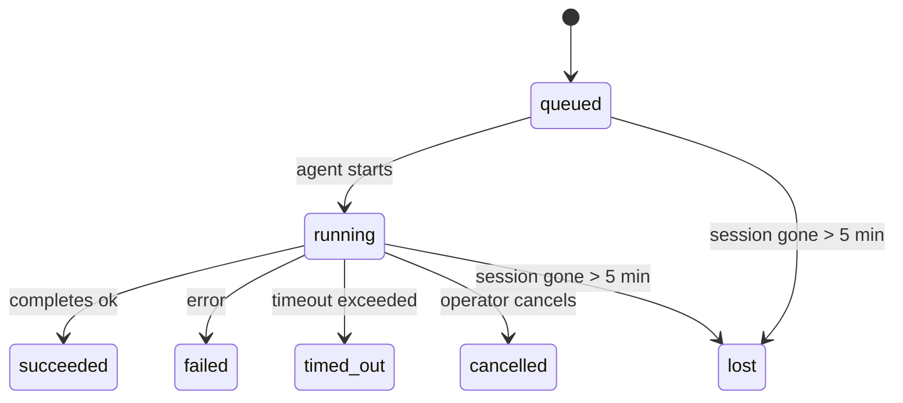

---
read_when:
    - Перевірка фонової роботи, що виконується або нещодавно завершилася
    - Налагодження збоїв доставки для відокремлених запусків агента
    - Розуміння того, як фонові запуски пов’язані із сеансами, Cron і Heartbeat
sidebarTitle: Background tasks
summary: Відстеження фонових завдань для запусків ACP, субагентів, ізольованих завдань Cron і операцій CLI
title: Фонові завдання
x-i18n:
    generated_at: "2026-04-27T06:22:17Z"
    model: gpt-5.4
    provider: openai
    source_hash: 9e61ffc97800888cafa2c86a14d11fa4d93de8f977b2212f8ad9aa2150eb9126
    source_path: automation/tasks.md
    workflow: 15
---

<Note>
Шукаєте планування? Див. [Автоматизація і завдання](/uk/automation), щоб вибрати правильний механізм. Ця сторінка — журнал активності для фонової роботи, а не планувальник.
</Note>

Фонові завдання відстежують роботу, яка виконується **поза межами вашого основного сеансу розмови**: запуски ACP, запуск субагентів, виконання ізольованих завдань Cron і операції, ініційовані через CLI.

Завдання **не** замінюють сеанси, завдання Cron або Heartbeat — це **журнал активності**, який фіксує, яка відокремлена робота відбулася, коли саме і чи була вона успішною.

<Note>
Не кожен запуск агента створює завдання. Ходи Heartbeat і звичайний інтерактивний чат — ні. Усі виконання Cron, запуск ACP, запуск субагентів і команди агента CLI — так.
</Note>

## Коротко

- Завдання — це **записи**, а не планувальники: Cron і Heartbeat вирішують, _коли_ робота запускається, а завдання відстежують, _що сталося_.
- ACP, субагенти, усі завдання Cron і операції CLI створюють завдання. Ходи Heartbeat — ні.
- Кожне завдання проходить стани `queued → running → terminal` (`succeeded`, `failed`, `timed_out`, `cancelled` або `lost`).
- Завдання Cron залишаються активними, поки середовище виконання Cron усе ще володіє цим завданням; якщо
  стан середовища виконання в пам’яті втрачено, обслуговування завдання спочатку перевіряє стійку
  історію виконань Cron, перш ніж позначити завдання як `lost`.
- Завершення ініціюється через push: відокремлена робота може повідомити напряму або пробудити
  сеанс/Heartbeat запитувача після завершення, тому цикли опитування стану зазвичай є неправильною моделлю.
- Ізольовані виконання Cron і завершення субагентів у межах best-effort очищають відстежувані вкладки браузера/процеси для свого дочірнього сеансу перед фінальним обліком очищення.
- Доставка ізольованого Cron приглушує застарілі проміжні відповіді батьківського сеансу, поки все ще завершується робота субагентів-нащадків, і надає перевагу фінальному виводу нащадка, якщо він надходить до доставки.
- Сповіщення про завершення доставляються безпосередньо в канал або ставляться в чергу до наступного Heartbeat.
- `openclaw tasks list` показує всі завдання; `openclaw tasks audit` виявляє проблеми.
- Термінальні записи зберігаються 7 днів, після чого автоматично видаляються.

## Швидкий старт

<Tabs>
  <Tab title="Список і фільтрація">
    ```bash
    # List all tasks (newest first)
    openclaw tasks list

    # Filter by runtime or status
    openclaw tasks list --runtime acp
    openclaw tasks list --status running
    ```

  </Tab>
  <Tab title="Перегляд">
    ```bash
    # Show details for a specific task (by ID, run ID, or session key)
    openclaw tasks show <lookup>
    ```
  </Tab>
  <Tab title="Скасування і сповіщення">
    ```bash
    # Cancel a running task (kills the child session)
    openclaw tasks cancel <lookup>

    # Change notification policy for a task
    openclaw tasks notify <lookup> state_changes
    ```

  </Tab>
  <Tab title="Аудит і обслуговування">
    ```bash
    # Run a health audit
    openclaw tasks audit

    # Preview or apply maintenance
    openclaw tasks maintenance
    openclaw tasks maintenance --apply
    ```

  </Tab>
  <Tab title="Потік завдань">
    ```bash
    # Inspect TaskFlow state
    openclaw tasks flow list
    openclaw tasks flow show <lookup>
    openclaw tasks flow cancel <lookup>
    ```
  </Tab>
</Tabs>

## Що створює завдання

| Джерело                | Тип середовища виконання | Коли створюється запис завдання                        | Типова політика сповіщень |
| ---------------------- | ------------------------ | ------------------------------------------------------ | ------------------------- |
| Фонові запуски ACP     | `acp`                    | Під час запуску дочірнього сеансу ACP                  | `done_only`               |
| Оркестрація субагентів | `subagent`               | Під час запуску субагента через `sessions_spawn`       | `done_only`               |
| Завдання Cron (усі типи) | `cron`                 | Для кожного виконання Cron (основний сеанс та ізольований) | `silent`              |
| Операції CLI           | `cli`                    | Команди `openclaw agent`, які виконуються через Gateway | `silent`                |
| Медіазавдання агента   | `cli`                    | Запуски `video_generate`, прив’язані до сеансу         | `silent`                  |

<AccordionGroup>
  <Accordion title="Типові сповіщення для Cron і медіа">
    Завдання Cron основного сеансу типово використовують політику сповіщень `silent` — вони створюють записи для відстеження, але не генерують сповіщень. Ізольовані завдання Cron також типово використовують `silent`, але є помітнішими, оскільки виконуються у власному сеансі.

    Запуски `video_generate`, прив’язані до сеансу, також використовують політику сповіщень `silent`. Вони все одно створюють записи завдань, але завершення повертається до початкового сеансу агента як внутрішнє пробудження, щоб агент міг сам написати подальше повідомлення й додати готове відео. Якщо ви ввімкнете `tools.media.asyncCompletion.directSend`, асинхронні завершення `music_generate` і `video_generate` спочатку намагатимуться доставити результат безпосередньо в канал, а вже потім повертатимуться до шляху пробудження сеансу запитувача.

  </Accordion>
  <Accordion title="Запобіжник для одночасних video_generate">
    Поки прив’язане до сеансу завдання `video_generate` усе ще активне, інструмент також працює як запобіжник: повторні виклики `video_generate` у цьому самому сеансі повертають стан активного завдання замість запуску другого одночасного генерування. Використовуйте `action: "status"`, коли вам потрібен явний запит прогресу/стану з боку агента.
  </Accordion>
  <Accordion title="Що не створює завдання">
    - Ходи Heartbeat — основний сеанс; див. [Heartbeat](/uk/gateway/heartbeat)
    - Звичайні інтерактивні ходи чату
    - Прямі відповіді `/command`
  </Accordion>
</AccordionGroup>

## Життєвий цикл завдання



| Статус      | Що це означає                                                             |
| ----------- | ------------------------------------------------------------------------- |
| `queued`    | Створено, очікує запуску агента                                           |
| `running`   | Хід агента активно виконується                                            |
| `succeeded` | Успішно завершено                                                         |
| `failed`    | Завершено з помилкою                                                      |
| `timed_out` | Перевищено налаштований тайм-аут                                          |
| `cancelled` | Зупинено оператором через `openclaw tasks cancel`                         |
| `lost`      | Середовище виконання втратило авторитетний базовий стан після 5-хвилинного пільгового періоду |

Переходи відбуваються автоматично — коли пов’язаний запуск агента завершується, статус завдання оновлюється відповідно.

Завершення запуску агента є авторитетним джерелом для активних записів завдань. Успішний відокремлений запуск фіналізується як `succeeded`, звичайні помилки запуску — як `failed`, а завершення через тайм-аут або переривання — як `timed_out`. Якщо оператор уже скасував завдання або середовище виконання вже зафіксувало сильніший термінальний стан, як-от `failed`, `timed_out` чи `lost`, пізніший сигнал успіху не знижує цей термінальний статус.

`lost` залежить від типу середовища виконання:

- Завдання ACP: зникли метадані дочірнього сеансу ACP.
- Завдання субагентів: дочірній сеанс зник зі сховища цільового агента.
- Завдання Cron: середовище виконання Cron більше не відстежує це завдання як активне, і стійка
  історія виконань Cron не показує термінальний результат для цього запуску. Офлайновий аудит CLI
  не вважає власний порожній внутрішньопроцесний стан середовища Cron авторитетним.
- Завдання CLI: завдання ізольованих дочірніх сеансів використовують дочірній сеанс;
  завдання CLI, прив’язані до чату, натомість використовують контекст активного запуску, тому завислі
  рядки сеансу каналу/групи/прямих повідомлень не підтримують їхню активність. Запуски
  `openclaw agent`, що працюють через Gateway, також фіналізуються за результатом свого запуску, тож завершені запуски
  не залишаються активними, доки sweeper не позначить їх як `lost`.

## Доставка і сповіщення

Коли завдання досягає термінального стану, OpenClaw сповіщає вас. Є два шляхи доставки:

**Пряма доставка** — якщо завдання має ціль каналу (`requesterOrigin`), повідомлення про завершення надсилається безпосередньо в цей канал (Telegram, Discord, Slack тощо). Для завершень субагентів OpenClaw також зберігає прив’язану маршрутизацію thread/topic, якщо вона доступна, і може підставити відсутні `to` / обліковий запис зі збереженого маршруту сеансу запитувача (`lastChannel` / `lastTo` / `lastAccountId`), перш ніж відмовитися від прямої доставки.

**Доставка через чергу сеансу** — якщо пряма доставка не вдається або джерело не задано, оновлення ставиться в чергу як системна подія в сеансі запитувача і з’являється під час наступного Heartbeat.

<Tip>
Завершення завдання запускає негайне пробудження Heartbeat, щоб ви швидко побачили результат — вам не потрібно чекати наступного запланованого такту Heartbeat.
</Tip>

Це означає, що типовий робочий процес базується на push-моделі: один раз запустіть відокремлену роботу, а далі дозвольте середовищу виконання пробудити або сповістити вас про завершення. Опитуйте стан завдання лише тоді, коли вам потрібні налагодження, втручання або явний аудит.

### Політики сповіщень

Керуйте тим, скільки інформації ви отримуєте про кожне завдання:

| Політика              | Що доставляється                                                          |
| --------------------- | ------------------------------------------------------------------------- |
| `done_only` (типово)  | Лише термінальний стан (`succeeded`, `failed` тощо) — **це типове значення** |
| `state_changes`       | Кожен перехід стану й кожне оновлення прогресу                            |
| `silent`              | Узагалі нічого                                                            |

Змініть політику, поки завдання ще виконується:

```bash
openclaw tasks notify <lookup> state_changes
```

## Довідка CLI

<AccordionGroup>
  <Accordion title="tasks list">
    ```bash
    openclaw tasks list [--runtime <acp|subagent|cron|cli>] [--status <status>] [--json]
    ```

    Стовпці виводу: ID завдання, тип, статус, доставка, ID запуску, дочірній сеанс, зведення.

  </Accordion>
  <Accordion title="tasks show">
    ```bash
    openclaw tasks show <lookup>
    ```

    Токен пошуку приймає ID завдання, ID запуску або ключ сеансу. Показує повний запис, включно з часом, станом доставки, помилкою та підсумком термінального стану.

  </Accordion>
  <Accordion title="tasks cancel">
    ```bash
    openclaw tasks cancel <lookup>
    ```

    Для завдань ACP і субагентів це завершує дочірній сеанс. Для завдань, що відстежуються через CLI, скасування фіксується в реєстрі завдань (окремого дескриптора дочірнього середовища виконання немає). Статус переходить у `cancelled`, і, якщо це застосовно, надсилається сповіщення про доставку.

  </Accordion>
  <Accordion title="tasks notify">
    ```bash
    openclaw tasks notify <lookup> <done_only|state_changes|silent>
    ```
  </Accordion>
  <Accordion title="tasks audit">
    ```bash
    openclaw tasks audit [--json]
    ```

    Виявляє операційні проблеми. Висновки також з’являються в `openclaw status`, коли виявлено проблеми.

    | Знахідка                  | Серйозність | Тригер                                                                                                        |
| ------------------------- | ----------- | ------------------------------------------------------------------------------------------------------------- |
| `stale_queued`            | warn        | Перебуває в черзі понад 10 хвилин                                                                             |
| `stale_running`           | error       | Виконується понад 30 хвилин                                                                                   |
| `lost`                    | warn/error  | Зникло володіння завданням, підтверджене середовищем виконання; збережені втрачені завдання мають рівень warn до `cleanupAfter`, після чого стають errors |
| `delivery_failed`         | warn        | Доставка не вдалася, і політика сповіщень не `silent`                                                         |
| `missing_cleanup`         | warn        | Термінальне завдання без часової мітки очищення                                                               |
| `inconsistent_timestamps` | warn        | Порушення часової послідовності (наприклад, завершилося раніше, ніж почалося)                                |

  </Accordion>
  <Accordion title="tasks maintenance">
    ```bash
    openclaw tasks maintenance [--json]
    openclaw tasks maintenance --apply [--json]
    ```

    Використовуйте це, щоб переглянути або застосувати узгодження, проставлення міток очищення та видалення для завдань і стану TaskFlow.

    Узгодження залежить від типу середовища виконання:

    - Завдання ACP/subagent перевіряють свій дочірній сеанс-джерело.
    - Завдання Cron перевіряють, чи середовище виконання Cron все ще володіє цим завданням, а потім відновлюють термінальний статус зі збережених журналів виконань Cron/стану завдання, перш ніж перейти до `lost`. Лише процес Gateway є авторитетним для внутрішньопам’ятного набору активних завдань Cron; офлайновий аудит CLI використовує стійку історію, але не позначає завдання Cron як втрачене лише через те, що цей локальний Set порожній.
    - Завдання CLI, прив’язані до чату, перевіряють контекст активного запуску-власника, а не лише рядок сеансу чату.

    Очищення після завершення також залежить від типу середовища виконання:

    - Під час завершення субагента в межах best-effort закриваються відстежувані вкладки браузера/процеси для дочірнього сеансу, перш ніж триватиме очищення після оголошення.
    - Під час завершення ізольованого Cron у межах best-effort закриваються відстежувані вкладки браузера/процеси для сеансу Cron, перш ніж виконання буде повністю завершено.
    - Доставка ізольованого Cron за потреби чекає на подальшу роботу субагентів-нащадків і приглушує застарілий текст підтвердження від батьківського сеансу замість його оголошення.
    - Доставка завершення субагента надає перевагу найновішому видимому тексту помічника; якщо він порожній, використовується очищений найновіший текст tool/toolResult, а запуски лише з викликами інструментів, що завершилися тайм-аутом, можуть згортатися до короткого зведення часткового прогресу. Термінальні невдалі запуски оголошують статус помилки без повторного відтворення захопленого тексту відповіді.
    - Помилки очищення не маскують реальний результат завдання.

  </Accordion>
  <Accordion title="tasks flow list | show | cancel">
    ```bash
    openclaw tasks flow list [--status <status>] [--json]
    openclaw tasks flow show <lookup> [--json]
    openclaw tasks flow cancel <lookup>
    ```

    Використовуйте це, коли вас цікавить саме оркеструвальний TaskFlow, а не окремий запис фонового завдання.

  </Accordion>
</AccordionGroup>

## Дошка завдань чату (`/tasks`)

Використовуйте `/tasks` у будь-якому сеансі чату, щоб переглянути фонові завдання, пов’язані з цим сеансом. Дошка показує активні та нещодавно завершені завдання з типом середовища виконання, статусом, часом і деталями прогресу або помилки.

Коли поточний сеанс не має видимих пов’язаних завдань, `/tasks` повертається до локальних для агента підрахунків завдань, щоб ви все одно мали огляд без розкриття деталей інших сеансів.

Для повного операторського журналу використовуйте CLI: `openclaw tasks list`.

## Інтеграція зі статусом (навантаження завдань)

`openclaw status` включає коротке зведення щодо завдань:

```
Tasks: 3 queued · 2 running · 1 issues
```

Зведення повідомляє:

- **active** — кількість `queued` + `running`
- **failures** — кількість `failed` + `timed_out` + `lost`
- **byRuntime** — розбивка за `acp`, `subagent`, `cron`, `cli`

І `/status`, і інструмент `session_status` використовують знімок завдань з урахуванням очищення: активним завданням надається перевага, застарілі завершені рядки приховуються, а нещодавні збої показуються лише тоді, коли більше не залишилося активної роботи. Це дозволяє картці статусу зосереджуватися на тому, що важливо зараз.

## Зберігання і обслуговування

### Де зберігаються завдання

Записи завдань зберігаються в SQLite за адресою:

```
$OPENCLAW_STATE_DIR/tasks/runs.sqlite
```

Реєстр завантажується в пам’ять під час запуску gateway і синхронізує записи до SQLite для надійного збереження між перезапусками.

### Автоматичне обслуговування

Очищувач запускається кожні **60 секунд** і виконує три дії:

<Steps>
  <Step title="Узгодження">
    Перевіряє, чи активні завдання все ще мають авторитетне підтвердження від середовища виконання. Завдання ACP/subagent використовують стан дочірнього сеансу, завдання Cron — володіння активним завданням, а завдання CLI, прив’язані до чату, — контекст запуску-власника. Якщо цей базовий стан відсутній понад 5 хвилин, завдання позначається як `lost`.
  </Step>
  <Step title="Проставлення міток очищення">
    Встановлює часову мітку `cleanupAfter` для термінальних завдань (`endedAt + 7 днів`). Упродовж періоду зберігання втрачені завдання все ще відображаються в аудиті як попередження; після завершення `cleanupAfter` або за відсутності метаданих очищення вони стають помилками.
  </Step>
  <Step title="Видалення">
    Видаляє записи після настання їхньої дати `cleanupAfter`.
  </Step>
</Steps>

<Note>
**Термін зберігання:** записи термінальних завдань зберігаються **7 днів**, після чого автоматично видаляються. Додаткове налаштування не потрібне.
</Note>

## Як завдання пов’язані з іншими системами

<AccordionGroup>
  <Accordion title="Завдання і TaskFlow">
    [TaskFlow](/uk/automation/taskflow) — це рівень оркестрації потоків над фоновими завданнями. Один потік протягом свого життєвого циклу може координувати кілька завдань, використовуючи керовані або дзеркальні режими синхронізації. Використовуйте `openclaw tasks` для перевірки окремих записів завдань і `openclaw tasks flow` для перевірки оркеструвального потоку.

    Докладніше див. [TaskFlow](/uk/automation/taskflow).

  </Accordion>
  <Accordion title="Завдання і cron">
    **Визначення** завдання cron зберігається в `~/.openclaw/cron/jobs.json`; стан виконання під час роботи зберігається поруч у `~/.openclaw/cron/jobs-state.json`. **Кожне** виконання Cron створює запис завдання — як для основного сеансу, так і для ізольованого. Завдання Cron основного сеансу типово використовують політику сповіщень `silent`, щоб відстежуватися без створення сповіщень.

    Див. [Завдання Cron](/uk/automation/cron-jobs).

  </Accordion>
  <Accordion title="Завдання і heartbeat">
    Запуски Heartbeat — це ходи основного сеансу, вони не створюють записів завдань. Коли завдання завершується, воно може ініціювати пробудження heartbeat, щоб ви швидко побачили результат.

    Див. [Heartbeat](/uk/gateway/heartbeat).

  </Accordion>
  <Accordion title="Завдання і сеанси">
    Завдання може посилатися на `childSessionKey` (де виконується робота) і `requesterSessionKey` (хто її запустив). Сеанси — це контекст розмови; завдання — це відстеження активності поверх нього.
  </Accordion>
  <Accordion title="Завдання і запуски агента">
    `runId` завдання посилається на запуск агента, який виконує роботу. Події життєвого циклу агента (початок, завершення, помилка) автоматично оновлюють статус завдання — вам не потрібно керувати життєвим циклом вручну.
  </Accordion>
</AccordionGroup>

## Пов’язане

- [Автоматизація і завдання](/uk/automation) — усі механізми автоматизації з першого погляду
- [CLI: Завдання](/uk/cli/tasks) — довідка з команд CLI
- [Heartbeat](/uk/gateway/heartbeat) — періодичні ходи основного сеансу
- [Заплановані завдання](/uk/automation/cron-jobs) — планування фонової роботи
- [TaskFlow](/uk/automation/taskflow) — оркестрація потоків над завданнями
