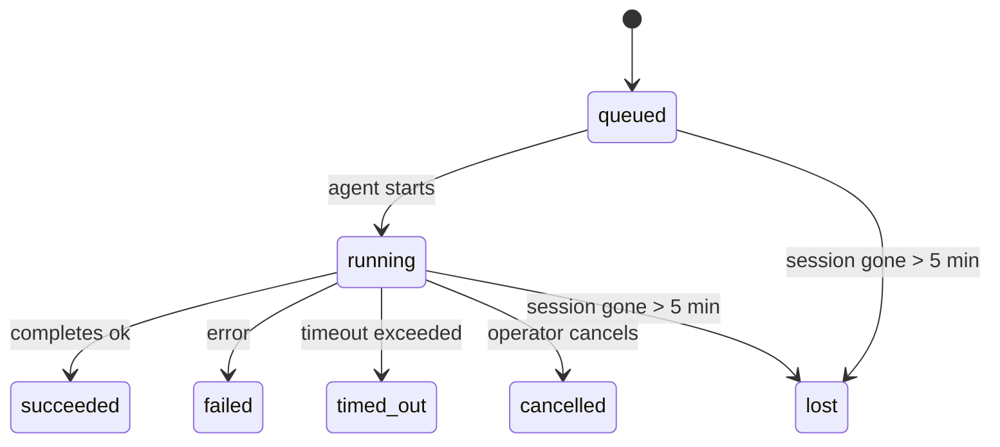

---
read_when:
    - Перевірка фонової роботи, що триває або нещодавно завершилася
    - Налагодження збоїв доставки для від’єднаних запусків агента
    - Розуміння того, як фонові запуски пов’язані із сесіями, Cron і Heartbeat
sidebarTitle: Background tasks
summary: Відстеження фонових завдань для запусків ACP, субагентів, ізольованих завдань Cron і операцій CLI
title: Фонові завдання
x-i18n:
    generated_at: "2026-05-06T02:51:20Z"
    model: gpt-5.5
    provider: openai
    source_hash: 055e16b4f53dbd089cc72eea7fe80bdaee5451dc56fa6e88a742f98e566bb57a
    source_path: automation/tasks.md
    workflow: 16
---

<Note>
Шукаєте планування? Див. [Автоматизація та завдання](/uk/automation), щоб вибрати правильний механізм. Ця сторінка є журналом активності для фонової роботи, а не планувальником.
</Note>

Фонові завдання відстежують роботу, яка виконується **поза вашим основним сеансом розмови**: запуски ACP, створення субагентів, ізольовані виконання завдань cron і операції, ініційовані CLI.

Завдання **не** замінюють сеанси, завдання cron або heartbeats - це **журнал активності**, який записує, яка відокремлена робота відбулася, коли саме та чи була вона успішною.

<Note>
Не кожен запуск агента створює завдання. Heartbeat-ходи та звичайний інтерактивний чат не створюють. Усі виконання cron, створення ACP, створення субагентів і команди агента CLI створюють.
</Note>

## Коротко

- Завдання - це **записи**, а не планувальники: cron і heartbeat вирішують, _коли_ виконується робота, а завдання відстежують, _що сталося_.
- ACP, субагенти, усі завдання cron і операції CLI створюють завдання. Heartbeat-ходи не створюють.
- Кожне завдання проходить шлях `queued → running → terminal` (succeeded, failed, timed_out, cancelled або lost).
- Завдання cron залишаються активними, поки runtime cron усе ще володіє завданням; якщо
  стан runtime у пам'яті зник, обслуговування завдань спочатку перевіряє довговічну історію
  запусків cron, перш ніж позначати завдання як lost.
- Завершення керується push-механізмом: відокремлена робота може сповістити напряму або розбудити
  сеанс/Heartbeat запитувача після завершення, тому цикли опитування статусу
  зазвичай є неправильною формою.
- Ізольовані запуски cron і завершення субагентів за найкращою спробою очищають відстежувані вкладки браузера/процеси для свого дочірнього сеансу перед фінальним обліком очищення.
- Ізольована доставка cron приглушує застарілі проміжні відповіді батьківського сеансу, поки робота нащадкового субагента ще завершується, і надає перевагу фінальному виводу нащадка, якщо він надходить до доставки.
- Сповіщення про завершення доставляються безпосередньо в канал або ставляться в чергу для наступного Heartbeat.
- `openclaw tasks list` показує всі завдання; `openclaw tasks audit` виявляє проблеми.
- Термінальні записи зберігаються 7 днів, а потім автоматично видаляються.

## Швидкий старт

<Tabs>
  <Tab title="Список і фільтрування">
    ```bash
    # List all tasks (newest first)
    openclaw tasks list

    # Filter by runtime or status
    openclaw tasks list --runtime acp
    openclaw tasks list --status running
    ```

  </Tab>
  <Tab title="Перегляд">
    ```bash
    # Show details for a specific task (by ID, run ID, or session key)
    openclaw tasks show <lookup>
    ```
  </Tab>
  <Tab title="Скасування та сповіщення">
    ```bash
    # Cancel a running task (kills the child session)
    openclaw tasks cancel <lookup>

    # Change notification policy for a task
    openclaw tasks notify <lookup> state_changes
    ```

  </Tab>
  <Tab title="Аудит і обслуговування">
    ```bash
    # Run a health audit
    openclaw tasks audit

    # Preview or apply maintenance
    openclaw tasks maintenance
    openclaw tasks maintenance --apply
    ```

  </Tab>
  <Tab title="Потік завдань">
    ```bash
    # Inspect TaskFlow state
    openclaw tasks flow list
    openclaw tasks flow show <lookup>
    openclaw tasks flow cancel <lookup>
    ```
  </Tab>
</Tabs>

## Що створює завдання

| Джерело               | Тип runtime | Коли створюється запис завдання                         | Типова політика сповіщень |
| ---------------------- | ------------ | ------------------------------------------------------ | --------------------- |
| Фонові запуски ACP     | `acp`        | Створення дочірнього сеансу ACP                         | `done_only`           |
| Оркестрація субагентів | `subagent`   | Створення субагента через `sessions_spawn`              | `done_only`           |
| Завдання cron (усі типи) | `cron`       | Кожне виконання cron (основний сеанс та ізольоване)     | `silent`              |
| Операції CLI           | `cli`        | Команди `openclaw agent`, які виконуються через Gateway | `silent`              |
| Медіазавдання агента   | `cli`        | Запуски `music_generate`/`video_generate` на основі сеансу | `silent`              |

<AccordionGroup>
  <Accordion title="Типові сповіщення для cron і медіа">
    Завдання cron основного сеансу за замовчуванням використовують політику сповіщень `silent`: вони створюють записи для відстеження, але не генерують сповіщення. Ізольовані завдання cron також за замовчуванням мають `silent`, але вони помітніші, бо виконуються у власному сеансі.

    Запуски `music_generate` і `video_generate` на основі сеансу також використовують політику сповіщень `silent`. Вони все одно створюють записи завдань, але завершення повертається до початкового сеансу агента як внутрішнє пробудження, щоб агент міг сам написати подальше повідомлення й прикріпити готові медіа. Завершення в групах/каналах дотримуються звичайної політики видимої відповіді, тому агент використовує інструмент повідомлень, коли цього потребує доставка з джерела. Якщо агент завершення не створює доказ доставки через інструмент повідомлень у маршруті лише з інструментами, OpenClaw надсилає резервне повідомлення про завершення безпосередньо в початковий канал, а не залишає медіа приватними.

  </Accordion>
  <Accordion title="Обмеження для паралельного video_generate">
    Поки завдання `video_generate` на основі сеансу ще активне, інструмент також діє як обмеження: повторні виклики `video_generate` у тому самому сеансі повертають статус активного завдання замість запуску другої паралельної генерації. Використовуйте `action: "status"`, коли хочете явно отримати прогрес/статус із боку агента.
  </Accordion>
  <Accordion title="Що не створює завдань">
    - Heartbeat-ходи - основний сеанс; див. [Heartbeat](/uk/gateway/heartbeat)
    - Звичайні інтерактивні ходи чату
    - Прямі відповіді `/command`

  </Accordion>
</AccordionGroup>

## Життєвий цикл завдання



| Статус      | Що це означає                                                              |
| ----------- | -------------------------------------------------------------------------- |
| `queued`    | Створено, очікує запуску агента                                            |
| `running`   | Хід агента активно виконується                                             |
| `succeeded` | Успішно завершено                                                          |
| `failed`    | Завершено з помилкою                                                       |
| `timed_out` | Перевищено налаштований тайм-аут                                           |
| `cancelled` | Зупинено оператором через `openclaw tasks cancel`                          |
| `lost`      | Runtime втратив авторитетний базовий стан після 5-хвилинного пільгового періоду |

Переходи відбуваються автоматично: коли пов'язаний запуск агента завершується, статус завдання оновлюється відповідно.

Завершення запуску агента є авторитетним для активних записів завдань. Успішний відокремлений запуск фіналізується як `succeeded`, звичайні помилки запуску фіналізуються як `failed`, а результати тайм-ауту або переривання фіналізуються як `timed_out`. Якщо оператор уже скасував завдання або runtime уже записав сильніший термінальний стан, як-от `failed`, `timed_out` або `lost`, пізніший сигнал успіху не знижує цей термінальний статус.

`lost` враховує runtime:

- Завдання ACP: зникли метадані базового дочірнього сеансу ACP.
- Завдання субагентів: базовий дочірній сеанс зник зі сховища цільового агента.
- Завдання cron: runtime cron більше не відстежує завдання як активне, а довговічна
  історія запусків cron не показує термінального результату для цього запуску. Офлайн-аудит CLI
  не вважає власний порожній стан runtime cron у процесі авторитетним.
- Завдання CLI: ізольовані завдання дочірнього сеансу використовують дочірній сеанс; завдання CLI
  на основі чату натомість використовують живий контекст запуску, тому завислі
  рядки сеансів каналу/групи/прямих повідомлень не підтримують їх активними. Запуски
  `openclaw agent` на основі Gateway також фіналізуються за результатом свого запуску, тому завершені запуски
  не залишаються активними, доки прибиральник не позначить їх як `lost`.

## Доставка та сповіщення

Коли завдання досягає термінального стану, OpenClaw сповіщає вас. Є два шляхи доставки:

**Пряма доставка** - якщо завдання має цільовий канал (`requesterOrigin`), повідомлення про завершення надходить прямо в цей канал (Telegram, Discord, Slack тощо). Для завершень субагентів OpenClaw також зберігає прив'язану маршрутизацію потоку/теми, коли вона доступна, і може заповнити відсутній `to` / обліковий запис зі збереженого маршруту сеансу запитувача (`lastChannel` / `lastTo` / `lastAccountId`), перш ніж відмовитися від прямої доставки.

**Доставка через чергу сеансу** - якщо пряма доставка не вдається або origin не задано, оновлення ставиться в чергу як системна подія в сеансі запитувача й з'являється під час наступного Heartbeat.

<Tip>
Завершення завдання запускає негайне пробудження Heartbeat, щоб ви швидко побачили результат: вам не потрібно чекати наступного запланованого такту Heartbeat.
</Tip>

Це означає, що звичний робочий процес є push-орієнтованим: запустіть відокремлену роботу один раз, а потім дозвольте runtime розбудити вас або сповістити про завершення. Опитуйте стан завдання лише тоді, коли потрібне налагодження, втручання або явний аудит.

### Політики сповіщень

Керуйте тим, скільки повідомлень ви отримуєте про кожне завдання:

| Політика              | Що доставляється                                                       |
| --------------------- | ----------------------------------------------------------------------- |
| `done_only` (типово)  | Лише термінальний стан (succeeded, failed тощо) - **це типово**         |
| `state_changes`       | Кожен перехід стану та оновлення прогресу                               |
| `silent`              | Нічого взагалі                                                          |

Змініть політику, поки завдання виконується:

```bash
openclaw tasks notify <lookup> state_changes
```

## Довідник CLI

<AccordionGroup>
  <Accordion title="tasks list">
    ```bash
    openclaw tasks list [--runtime <acp|subagent|cron|cli>] [--status <status>] [--json]
    ```

    Стовпці виводу: ID завдання, тип, статус, доставка, ID запуску, дочірній сеанс, підсумок.

  </Accordion>
  <Accordion title="tasks show">
    ```bash
    openclaw tasks show <lookup>
    ```

    Токен пошуку приймає ID завдання, ID запуску або ключ сеансу. Показує повний запис, включно з часом, станом доставки, помилкою та термінальним підсумком.

  </Accordion>
  <Accordion title="tasks cancel">
    ```bash
    openclaw tasks cancel <lookup>
    ```

    Для завдань ACP і субагентів це завершує дочірній сеанс. Для завдань, відстежуваних CLI, скасування записується в реєстрі завдань (окремого дескриптора дочірнього runtime немає). Статус переходить у `cancelled`, і, коли застосовно, надсилається сповіщення про доставку.

  </Accordion>
  <Accordion title="tasks notify">
    ```bash
    openclaw tasks notify <lookup> <done_only|state_changes|silent>
    ```
  </Accordion>
  <Accordion title="tasks audit">
    ```bash
    openclaw tasks audit [--json]
    ```

    Виявляє операційні проблеми. Знахідки також з'являються в `openclaw status`, коли виявлено проблеми.

    | Виявлення                | Серйозність | Тригер                                                                                                                     |
    | ------------------------- | ----------- | -------------------------------------------------------------------------------------------------------------------------- |
    | `stale_queued`            | попередження | У черзі понад 10 хвилин                                                                                                    |
    | `stale_running`           | помилка     | Виконується понад 30 хвилин                                                                                                |
    | `lost`                    | попередження/помилка | Власність завдання, підкріплена середовищем виконання, зникла; збережені втрачені завдання попереджають до `cleanupAfter`, а потім стають помилками |
    | `delivery_failed`         | попередження | Доставка не вдалася, а політика сповіщень не є `silent`                                                                    |
    | `missing_cleanup`         | попередження | Термінальне завдання без часової мітки очищення                                                                            |
    | `inconsistent_timestamps` | попередження | Порушення часової шкали (наприклад, завершено до початку)                                                                  |

  </Accordion>
  <Accordion title="обслуговування завдань">
    ```bash
    openclaw tasks maintenance [--json]
    openclaw tasks maintenance --apply [--json]
    ```

    Використовуйте це, щоб попередньо переглянути або застосувати узгодження, проставлення міток очищення та обрізання для завдань і стану Task Flow.

    Узгодження враховує середовище виконання:

    - Завдання ACP/субагента перевіряють свій базовий дочірній сеанс.
    - Завдання субагента, дочірній сеанс яких має tombstone відновлення після перезапуску, позначаються як втрачені, а не розглядаються як відновлювані базові сеанси.
    - Завдання Cron перевіряють, чи середовище виконання cron досі володіє job, а потім відновлюють термінальний статус із збережених журналів запусків cron/стану job, перш ніж перейти до `lost`. Лише процес Gateway є авторитетним для набору активних job cron у пам’яті; офлайн-аудит CLI використовує довговічну історію, але не позначає завдання cron як втрачене лише тому, що цей локальний Set порожній.
    - Завдання CLI, підкріплені чатом, перевіряють власний активний контекст запуску, а не лише рядок сеансу чату.

    Очищення після завершення також враховує середовище виконання:

    - Завершення субагента за можливості закриває відстежувані вкладки браузера/процеси для дочірнього сеансу, перш ніж продовжиться очищення оголошення.
    - Завершення ізольованого cron за можливості закриває відстежувані вкладки браузера/процеси для сеансу cron, перш ніж запуск повністю згорнеться.
    - Доставка ізольованого cron за потреби очікує подальше виконання нащадкового субагента й пригнічує застарілий текст підтвердження батьківського завдання замість його оголошення.
    - Доставка завершення субагента надає перевагу найновішому видимому тексту асистента; якщо він порожній, вона повертається до очищеного найновішого тексту tool/toolResult, а запуски викликів інструментів лише з тайм-аутом можуть згортатися до короткого підсумку часткового прогресу. Термінальні невдалі запуски оголошують статус помилки без повторного відтворення захопленого тексту відповіді.
    - Помилки очищення не маскують справжній результат завдання.

  </Accordion>
  <Accordion title="tasks flow list | show | cancel">
    ```bash
    openclaw tasks flow list [--status <status>] [--json]
    openclaw tasks flow show <lookup> [--json]
    openclaw tasks flow cancel <lookup>
    ```

    Використовуйте їх, коли вас цікавить оркеструвальний Task Flow, а не один окремий запис фонового завдання.

  </Accordion>
</AccordionGroup>

## Дошка завдань чату (`/tasks`)

Використовуйте `/tasks` у будь-якому сеансі чату, щоб бачити фонові завдання, пов’язані з цим сеансом. Дошка показує активні та нещодавно завершені завдання з середовищем виконання, статусом, часом, а також деталями прогресу або помилки.

Коли поточний сеанс не має видимих пов’язаних завдань, `/tasks` переходить до локальних для агента лічильників завдань, тож ви все одно отримуєте огляд без розкриття деталей інших сеансів.

Для повного операторського реєстру використовуйте CLI: `openclaw tasks list`.

## Інтеграція статусу (навантаження завдань)

`openclaw status` містить короткий підсумок завдань:

```
Tasks: 3 queued · 2 running · 1 issues
```

Підсумок повідомляє:

- **active** - кількість `queued` + `running`
- **failures** - кількість `failed` + `timed_out` + `lost`
- **byRuntime** - розподіл за `acp`, `subagent`, `cron`, `cli`

І `/status`, і інструмент `session_status` використовують знімок завдань, що враховує очищення: активним завданням надається перевага, застарілі завершені рядки приховуються, а нещодавні помилки показуються лише тоді, коли не лишається активної роботи. Це зосереджує картку статусу на тому, що важливо саме зараз.

## Сховище й обслуговування

### Де зберігаються завдання

Записи завдань зберігаються в SQLite за адресою:

```
$OPENCLAW_STATE_DIR/tasks/runs.sqlite
```

Реєстр завантажується в пам’ять під час запуску Gateway і синхронізує записи в SQLite для довговічності між перезапусками.
Gateway утримує журнал попереднього запису SQLite в обмежених межах, використовуючи стандартний поріг autocheckpoint SQLite, а також періодичні та завершальні контрольні точки `TRUNCATE`.

### Автоматичне обслуговування

Очищувач запускається кожні **60 секунд** і виконує чотири речі:

<Steps>
  <Step title="Узгодження">
    Перевіряє, чи активні завдання досі мають авторитетну підтримку середовища виконання. Завдання ACP/субагента використовують стан дочірнього сеансу, завдання cron використовують власність активної job, а завдання CLI, підкріплені чатом, використовують власний контекст запуску. Якщо цей базовий стан відсутній понад 5 хвилин, завдання позначається як `lost`.
  </Step>
  <Step title="Виправлення сеансу ACP">
    Закриває термінальні або осиротілі одноразові сеанси ACP, що належать батьківському сеансу, і закриває застарілі термінальні або осиротілі постійні сеанси ACP лише тоді, коли не лишається активної прив’язки розмови.
  </Step>
  <Step title="Проставлення міток очищення">
    Встановлює часову мітку `cleanupAfter` для термінальних завдань (endedAt + 7 днів). Під час утримання втрачені завдання все ще з’являються в аудиті як попередження; після завершення строку `cleanupAfter` або коли метадані очищення відсутні, вони стають помилками.
  </Step>
  <Step title="Обрізання">
    Видаляє записи після їхньої дати `cleanupAfter`.
  </Step>
</Steps>

<Note>
**Утримання:** записи термінальних завдань зберігаються **7 днів**, а потім автоматично обрізаються. Налаштування не потрібне.
</Note>

## Як завдання пов’язані з іншими системами

<AccordionGroup>
  <Accordion title="Завдання й Task Flow">
    [Task Flow](/uk/automation/taskflow) — це шар оркестрації потоків над фоновими завданнями. Один flow може координувати кілька завдань протягом свого життєвого циклу, використовуючи керовані або дзеркальні режими синхронізації. Використовуйте `openclaw tasks`, щоб переглядати окремі записи завдань, і `openclaw tasks flow`, щоб переглядати оркеструвальний flow.

    Докладніше див. у [Task Flow](/uk/automation/taskflow).

  </Accordion>
  <Accordion title="Завдання й cron">
    **Визначення** job cron зберігається в `~/.openclaw/cron/jobs.json`; стан виконання середовища виконання зберігається поруч у `~/.openclaw/cron/jobs-state.json`. **Кожне** виконання cron створює запис завдання — і для основного сеансу, і для ізольованого. Завдання cron основного сеансу типово використовують політику сповіщень `silent`, щоб відстежуватися без створення сповіщень.

    Див. [Cron Jobs](/uk/automation/cron-jobs).

  </Accordion>
  <Accordion title="Завдання й heartbeat">
    Запуски Heartbeat є ходами основного сеансу — вони не створюють записи завдань. Коли завдання завершується, воно може запустити пробудження Heartbeat, щоб ви швидко побачили результат.

    Див. [Heartbeat](/uk/gateway/heartbeat).

  </Accordion>
  <Accordion title="Завдання й сеанси">
    Завдання може посилатися на `childSessionKey` (де виконується робота) і `requesterSessionKey` (хто його запустив). Сеанси — це контекст розмови; завдання — це відстеження активності поверх нього.
  </Accordion>
  <Accordion title="Завдання й запуски агента">
    `runId` завдання пов’язується із запуском агента, який виконує роботу. Події життєвого циклу агента (початок, завершення, помилка) автоматично оновлюють статус завдання — вам не потрібно керувати життєвим циклом вручну.
  </Accordion>
</AccordionGroup>

## Пов’язане

- [Автоматизація та завдання](/uk/automation) - усі механізми автоматизації стисло
- [CLI: Завдання](/uk/cli/tasks) - довідник команд CLI
- [Heartbeat](/uk/gateway/heartbeat) - періодичні ходи основного сеансу
- [Заплановані завдання](/uk/automation/cron-jobs) - планування фонової роботи
- [Task Flow](/uk/automation/taskflow) - оркестрація flow над завданнями
